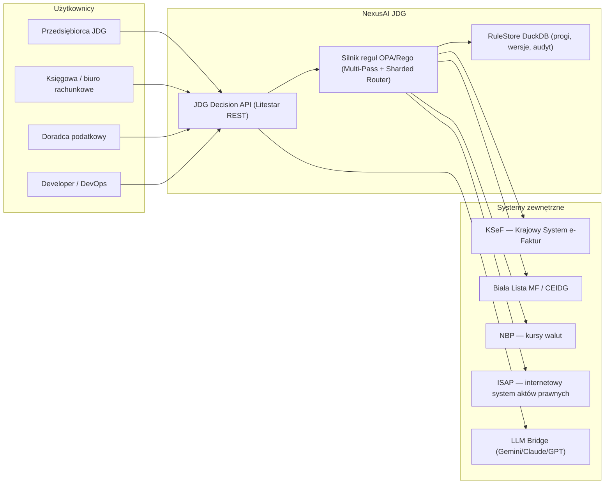
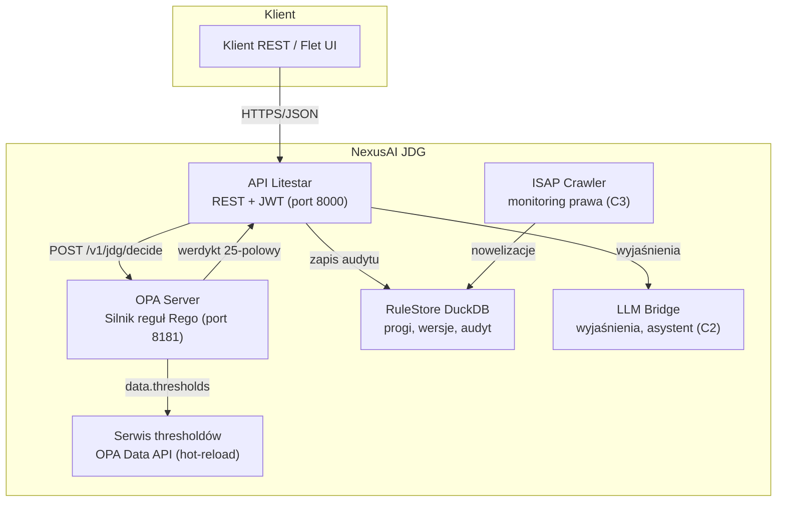
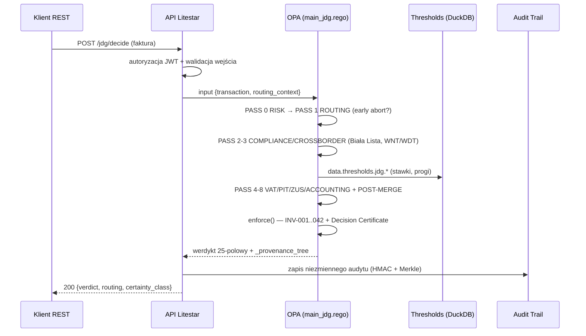
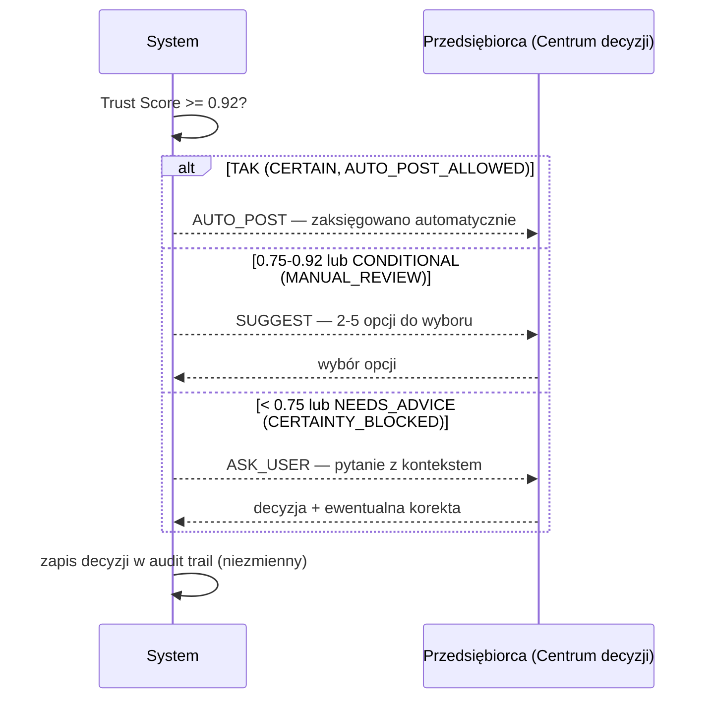

# 🏛️ NexusAI JDG — Silnik Reguł Podatkowych dla Jednoosobowej Działalności Gospodarczej

> **Status:** 🟢 PRODUCTION — ENTERPRISE v8.0 | 🏁 **Kampania V3: 69/69 WDROŻONY_100 (2026-09-19) — certyfikat fortecy WYDANY (P68)**
> **Reguły:** 12 111 unikalnych `rule_id` (12 155 bloków `matched:true`, 44 duplikaty) — [MANIFEST.md](MANIFEST.md) regenerowany 2026-09-19 | **Pliki Rego:** 543 w drzewie `rules/` (284 w katalogu głównym) | **Akty prawne:** 13 | **Inicjatywy strategiczne:** 24 (A1–C3, S1–S24)
> **Data wydania:** 2026-08-02 (aktualizacja: 2026-09-19) | **Licencja:** MIT

```
╔══════════════════════════════════════════════════════════════════╗
║   NEXUSAI JDG — Policy-as-Code dla polskich jednoosobowych firm   ║
║   OPA/Rego · Multi-Pass · Sharded Router · Immutable Audit Trail  ║
╚══════════════════════════════════════════════════════════════════╝
```

---

## 🎯 Misja

> **Automatyzować rozliczenia podatkowe polskich przedsiębiorców (JDG) do poziomu, w którym ~85% transakcji księguje się samodzielnie, z zerowym ryzykiem błędu i pełną audytowalnością każdej decyzji.**

NexusAI JDG zamienia skomplikowane, wielokrotnie nowelizowane prawo podatkowe (VAT, PIT, ZUS, KKS, Ordynacja Podatkowa, UoR, RODO, AML, KSeF, JPK) w **deterministyczny, testowalny i audytowalny zestaw reguł decyzyjnych**, które system może wykonać w czasie poniżej 12 ms na transakcję.

---

## 📋 Status produktu

| Obszar | Status | Uwagi |
|---|---|---|
| **Silnik reguł Rego (JDG/rules)** | 🟢 **PRODUCTION** | 543 plików, 12 111 unikalnych rule_id (Completeness 83/100), First-Match-Wins |
| **API (JDG/api/openapi.yaml)** | 🟢 **PRODUCTION (spec 1.0.0)** | 18 endpointów, 13 schematów, JWT Bearer; implementacja: `nexus_ai/api` (root repo) |
| **RuleStore (JDG/migrations)** | 🟡 **BETA** | 58 tabel (CREATE TABLE w 13 migracjach 001–013), seed progów w 001 |
| **Bundle OPA (JDG/bundles)** | 🟢 **PRODUCTION** | bundle.sh v8.0, manifesty, 22 audit-state, 1043 plików (w tym 862 `v3_*`) |
| **Narzędzia (JDG/tools)** | 🟢 **PRODUCTION** | 1033 narzędzi Python (w tym 689 `v3_*` z kampanii V3) |
| **Testy (JDG/tests)** | 🟢 **PRODUCTION** | 288 pytest (`tests/auto/` 204 + `tests/` 84) + 278 natywnych testów Rego (`tests/rego/` 276 + `tests/` 2) |
| **policies/ (mirror reguł)** | 🟢 **SYNCHRONIZED (ETAP 26 + konwencja P48)** | mirror z hash-parity sha256 (0% drift), bundle z overlays v2026/v2027 |
| **Kampania V3 (P00–P68)** | 🟢 **WDROŻONY_100 (69/69)** | 70 promptów, 79 raportów, 862 bundli V3, 689 narzędzi V3 — [docs/KAMPANIA_V3_PROMPTY_P00_P68.md](docs/KAMPANIA_V3_PROMPTY_P00_P68.md) |

> 🔎 **Wyszukiwarka:** wpisz `Ctrl+F` → `status`, `produkcja`, `production`, `alpha`, `beta`, `enterprise v8`, `v3`, `ledger`, `forteca`, `certyfikat`, `hard gate`, `LCI` — każda sekcja opisuje swój stan wdrożenia.

---

## ✨ Kluczowe funkcje

- **🧠 Silnik decyzyjny Multi-Pass** — 9 przebiegów (PASS 0–8) + detekcja konfliktów międzydomenowych POST-MERGE (ADR-007).
- **⚡ Sharded Router (B1)** — routing O(1) po kontekście transakcji; p95 < 5 ms na shard (ADR-009).
- **📜 Pokrycie 13 aktów prawnych** — VAT, PIT, ZUS/SUS, Ordynacja Podatkowa, KKS, UoR, Prawo Przedsiębiorców, PCC, podatki lokalne + akcyza, ryczałt, sukcesja, RODO, AML/BDO.
- **🕰️ Temporalność reguł** — `valid_from`/`valid_to`; time-travel: werdykt liczony wg stanu prawnego z dnia transakcji (A2, ADR-003).
- **🔒 Immutable Audit Trail** — werdykty ZUS/zdrowotne podpisywane HMAC-SHA256 + Merkle Tree (A1, ADR-006).
- **📉 Zero Hardcoded Values** — stawki/progi/limity ładowane z DuckDB przez OPA Data API (`data.thresholds.jdg.*`) (B2, ADR-002).
- **🤖 Tryby automatyzacji** — `AUTO_POST` (≥0.92), `SUGGEST` (0.75–0.92), `ASK_USER` (<0.75).
- **🧩 Warstwa mikro-atomowa** — 91 plików `rules/micro/` z regułami per artykuł ustawy (ADR-010).
- **📡 Integracje zewnętrzne** — KSeF, JPK, Biała Lista MF, CEIDG, NBP, ISAP (crawler aktów prawnych), e-Doręczenia, ePUAP, WIS.
- **🗂️ Enterprise S1–S24** — optymalizacja podatkowa, cross-domain intelligence, predykcja wyroków, KSeF resilience, automatyzacja bankowości (PSD2/PolishAPI), auto-deklaracje PIT-36/36L/28, JPK_V7M, monitor legislacyjny.
- **🛡️ Kampania V3 (69/69 WDROŻONY_100)** — kontrakty rdzenia (P01–P11), domknięcia domen (P12–P44), 23 rejestry naprawcze z pomiaru (P45–P67), pętla samouczenia (P67), recertyfikacja z dowodem stanu (P68: hard gates 5/5, certyfikat fortecy WYDANY).
- **🧪 Narzędzia deweloperskie** — **1033 narzędzi Python** (`JDG/tools/`, w tym 689 kampanii V3): linter Rego, walidator, generator manifestu, detektor martwych reguł, chaos engineering, self-healing engine, audyty ETAP 10–28, kampania V3 (P00–P68), pętla samouczenia (P67), recertyfikacja (P68).

---

## 💡 Cel aplikacji — problem, który rozwiązuje (zasada PWE)

| Element | Opis |
|---|---|
| **P — Problem** | Przedsiębiorca JDG musi obsługiwać ~200+ obowiązków rocznie (VAT, PIT, ZUS, JPK, KSeF, PCC, BDO, RODO…). Prawo zmienia się kilkanaście razy w roku. Błąd = kara KKS do 25 lat pozbawienia wolności w skrajnych przypadkach, grzywny do 500 000 zł (KSeF) i odsetki. Księgowy ręcznie weryfikuje każdą fakturę. |
| **W — Wartość** | NexusAI JDG koduje prawo jako reguły OPA/Rego. Każda faktura jest automatycznie ewaluowana wg **prawa obowiązującego w dniu transakcji** (temporalność), z pełną podstawą prawną (`_legal_basis`) każdej decyzji i drzewem proweniencji. |
| **E — Efekt** | ~85% transakcji księguje się **zero kliknięć** (AUTO_POST), ~10–12% wymaga 1 kliknięcia (SUGGEST), ~3–5% trafia do człowieka (ASK_USER). Każdą decyzję można odtworzyć i udowodnić przed KAS. Latencja p95 < 5 ms na shard. |

---

## 👥 Główni użytkownicy i scenariusze użycia

| Użytkownik | Scenariusz | Korzyść |
|---|---|---|
| **Przedsiębiorca JDG** | Codzienne księgowanie faktur, deklaracje, terminy ZUS | Zero pracy ręcznej, zero ryzyka kary |
| **Księgowa / biuro rachunkowe** | Weryfikacja decyzji systemu, obsługa ASK_USER, korekty | 85% mniej rutynowej pracy, pełna dokumentacja |
| **Doradca podatkowy** | Analiza ryzyka (simulate), optymalizacja, obrona przed KAS | Symulacja kar, strategia 4-ścieżkowa KKS |
| **Developer / DevOps** | Integracja API, budowa bundle, rozwój reguł | OpenAPI 3.0, 1033 narzędzi, CI/CD |
| **Audytor / KAS** | Weryfikacja historycznych decyzji | Merkle-proof, time-travel, niezmienny log |

---

## 📚 Słownik kluczowych pojęć (glosariusz)

> **Zasada spójności:** poniższe terminy są używane **jednolicie w całej dokumentacji** — nie zamieniaj „werdyktu" na „decyzję JSON", „bundle" na „paczkę OPA".

| Termin (synonimy) | Definicja |
|---|---|
| **Werdykt** (verdict, decyzja) | Standardowy obiekt JSON z 25 polami zwracany przez każdą regułę: `matched`, `rule_id`, `vat_rate`, `_legal_basis`, `_routing` itd. |
| **Reguła** (rule, decyzja regułowa) | Pojedyncza klauzula Rego `decide :=` z unikalnym `rule_id` w formacie `jdg.<domena>.<kategoria>`. |
| **Pakiet** (package, moduł reguł) | Przestrzeń nazw Rego `package jdg.<domena>` (np. `jdg.vat.substantive`). |
| **Orkiestrator** (main_jdg.rego) | Główny plik decyzyjny scala werdykty wszystkich pakietów w `final_verdict`. |
| **Przejście / PASS** (faza, pass) | Kolejny etap ewaluacji Multi-Pass (PASS 0: RISK … PASS 8: ZUS/KSeF). |
| **Shard** (ścieżka ewaluacji, shard routingu) | Wyspecjalizowany zestaw pakietów wybrany przez Sharded Router wg kontekstu transakcji. |
| **Próg** (threshold, stawka, limit) | Wartość podatkowa (stawka, limit, termin) przechowywana w DuckDB i dostarczana przez OPA Data API. |
| **Bundle** (paczkowanie OPA, rules bundle) | Archiwum `.tar.gz` z regułami + manifestem, wdrażane na serwer OPA. |
| **Kontekst routingu** (routing context) | Obiekt z flagami: `tax_form`, `transaction_type`, `entity_status`, `evaluation_quarter`, `is_cross_border`, `has_employees`, `is_vat_payer`, `requires_ksef`. |
| **Kod routingu** (action) | Decyzja kontrolna: `ALLOW` / `TRIAGE_QUEUE` / `BLOCK_AND_ALERT`. |
| **Tryb automatyzacji** | `AUTO_POST` (≥0.92), `SUGGEST` (0.75–0.92), `ASK_USER` (<0.75) — na podstawie Trust Score. |
| **Trust Score** | Wynik ufności (0.0–1.0) ekstrakcji AI (field confidence), decyduje o trybie automatyzacji. |
| **Provenance** (drzewo proweniencji, A1) | Pełna ścieżka decyzyjna: które pakiety, warunki i podstawy prawne złożyły się na werdykt. |
| **Temporalność** (time-travel, A2) | Mechanizm wyboru wersji reguły wg daty transakcji (`valid_from`/`valid_to`). |
| **RuleStore** (DuckDB RuleStore) | Baza DuckDB z progami, wersjami reguł i niezmiennym logiem werdyktów. |
| **Inicjatywa strategiczna** | Projekt S1–S24 / A1–C3 rozszerzający silnik (np. S21 VAT Complete, S22 auto-korespondencja z US). |
| **Forteca** (fortress, forteca reguł) | Repozytorium reguł JDG jako ufortyfikowany system: kanon `rule_id`, progi ADR-002, bramki, testy natywne, mirrory hash-parity. Certyfikat P68 dotyczy fortecy (repo), nie produkcji. |
| **Ledger kampanii** (rejestr kampanii, `v3_campaign_ledger`) | Źródło prawdy statusów kampanii V3: `bundles/v3_campaign_ledger.json` (69 części P00–P68). Odczyt: `python tools/v3_campaign_ledger.py`; oznaczanie: `--mark PNN --status WDROŻONY_100 --write`. |
| **Hard gate** (bramka twarda) | Bramka, której naruszenie blokuje certyfikację (BLOCK). W P68 rozliczana **z pomiaru** (np. `silent_auto_post_max=0` z rejestru P49), nie z deklaracji. |
| **LCI** (Legal Coverage Index) | Indeks pokrycia prawnego 0–100. Stan: 71.43; cel SLO 99 — fala V4-F1. |
| **TCL / RV / UVR** | Metryki jakości: TCL (traceability legal twin), RV (wartość regułowa), UVR (niezgodności golden replay — wymagane 0). |
| **Epoka prawna** (legal epoch, P53) | Wersjonowany stan prawa w czasie; zmiana epoki = wyzwalacz odnowienia certyfikatu fortecy. |
| **Truth-first** | Zasada raportowania z pomiaru, nawet gdy wynik jest niekorzystny (np. jawny status produkcji `NOT_CERTIFIED`). |
| **4-eyes** (zasada czterech oczu) | Akceptacja draftu reguły przez 4 role w ≤60 dni przed awansem z SHADOW. |
| **Golden replay** (odtwarzanie złotych werdyktów) | Ewaluacja różnicowa na `golden_verdicts`: zmiana nie może zmienić złotych werdyktów (UVR = 0). |
| **Pętla samouczenia** (self-learning, P67) | Decyzje → klaster → draft jako DANE → guardrails (SMT/Z3 → golden replay → 4-eyes → epoka) → SHADOW → telemetria → awans. AI proponuje, forteca decyduje. |
| **Recertyfikacja** (P68) | Cykliczny dowód stanu fortecy: rozliczenie 23 rejestrów P45–P67 + hard gates + scoreboard 9 filarów. Odnowienie: ≤90 dni / zmiana epoki (P53) / deploy krytyczny (P38). |
| **Mapa V4** | Plan fal naprawczych rezyduum: F0 (2×P0 + SLA) → F1 (LCI 99 + ISAP) → F2 (akty 2027) → F3 (CI) → F4 (telemetria produkcyjna). |
| **Mirrory hash-parity** | `policies/` jako płaski mirror `JDG/` z równymi hashami SHA-256 (0% drift); bramka `policies_sync_gate.py`. |
| **WORM** | Write Once Read Many — niezmienny zapis dowodów (fala P65). |
| **JDG** | Jednoosobowa Działalność Gospodarcza — polska forma działalności jednoosobowej. |
| **KAS / US** | Krajowa Administracja Skarbowa / Urząd Skarbowy. |

---

## 🏗️ Architektura w skrócie — C4 Level 1 (Context)

Pełne diagramy C4 (Context, Container, Component) znajdziesz w **[docs/ARCHITEKTURA.md](docs/ARCHITEKTURA.md)**.



### C4 Level 2 — Container (Containers)



### C4 Level 3 — Component (struktura wewnętrzna OPA)

```mermaid
flowchart LR
    subgraph OPA — Silnik Rego
        M[main_jdg.rego<br/>Orkiestrator Multi-Pass]
        R[risk.rego / routing.rego<br/>PASS 0-1]
        C[compliance.rego / crossborder.rego<br/>PASS 2-3]
        V[vat/ pit/ zus/ accounting/<br/>PASS 4-8]
        E[enterprise S1-S24 + ETAP 10-28]
        G[core_guards_temporal_thresholds.rego<br/>INV-001..042]
        P[provenance.rego<br/>_provenance_tree + decision_hash]
    end

    M --> R
    M --> C
    M --> V
    M --> E
    M --> G
    M --> P

    subgraph Systemy zewnętrzne
        KSEF["KSeF / Biała Lista / NBP / CEIDG / GUS"]
        TH["data.thresholds.jdg.* (DuckDB)"]
    end

    C --> KSEF
    V --> TH
    G --> TH
```

### Warstwy architektoniczne

| Warstwa | Odpowiedzialność | Artefakty |
|---|---|---|
| **Domain** | Reguły prawne i decyzyjne JDG | 543 plików Rego (`JDG/rules/`), 514 unikalnych pakietów |
| **Application** | Orkiestracja, kontrakt werdyktu, use-case'y | `main_jdg.rego`, Decision API, Control Plane |
| **Infrastructure** | RuleStore, OPA Data API, integracje zewnętrzne | DuckDB (001–013), threshold service, NATS |
| **Presentation** | REST API + Flet UI | Litestar, `api/openapi.yaml` |

### Wzorce projektowe

| Wzorzec | Opis | ADR |
|---|---|---|
| **First-Match-Wins (else-chain)** | Deterministyczna kolejność reguł | ADR-001 |
| **Multi-Pass Evaluation** | PASS 0–8 + POST-MERGE z early abort | ADR-007 |
| **Sharded Router (O(1))** | Routing po kontekście transakcji, p95 < 5 ms | ADR-009 |
| **Safe Merge** | Werdykty niemutowalne, allowlist, priority conflicts | INV-018/042 |
| **Temporalność reguł** | `valid_from`/`valid_to`, time-travel | ADR-003 |
| **Zero Hardcoded Values** | Progi/stawki przez OPA Data API | ADR-002 |
| **Immutable Audit Trail** | HMAC-SHA256 + Merkle Tree | ADR-006 |
| **Werdykt 25-polowy** | Standardowy kontrakt JSON | ADR-004 |
| **Decision Certificate F4** | Klasy pewności, pieczęć SHA-256→Merkle | ADR-019 |

Pełne diagramy i szczegóły: **[docs/ARCHITEKTURA.md](docs/ARCHITEKTURA.md)** (C4 L1–L3, wzorce, ADR 001–022).

### Diagramy sekwencji — procesy krytyczne

**Przetwarzanie faktury — od wpływu do decyzji:**



**Proces decyzyjny (tryby automatyzacji):**



---

## 🚀 Szybki start
Cztery samowystarczalne przepływy: walidacja reguł, manifest, bundle i test API — uruchamiaj po kolei lub wybierz potrzebny.


### Walidacja reguł OPA

```bash
# Składnia wszystkich reguł
opa check JDG/rules/ -b

# Testy natywne Rego
opa test JDG/tests/rego/ -v

# Walidacja jakości reguł (9 walidacji)
python JDG/tools/validate_rules.py --strict

# Linter 6-check
python JDG/tools/lint_rego_rules.py --check --strict
```

### Generacja manifestu i raportu pokrycia

```bash
python JDG/tools/generate_manifest.py          # odświeża MANIFEST.md
python JDG/tools/generate_coverage_report.py   # odświeża COVERAGE_REPORT.md
```

### Budowa i wdrożenie bundle OPA

```bash
cd JDG/bundles && bash bundle.sh v8.0.0
curl -X PUT --data-binary @jdg-bundle-v8.0.0.tar.gz \
     http://opa-server:8181/v1/bundles/jdg
```

### Test API (lokalnie)

```bash
curl -X POST http://localhost:8000/v1/jdg/decide \
  -H "Authorization: Bearer <JWT>" \
  -H "Content-Type: application/json" \
  -d @example_request.json
```

---

## 📈 Metryki (auto-generowane — patrz [MANIFEST.md](MANIFEST.md))

| Metryka | Wartość |
|---|---|
| Pliki Rego | **543** (drzewo `rules/`; 284 w katalogu głównym) |
| Pliki z `matched: true` | **497** |
| Bloki `matched: true` | **12 155** |
| Unikalne `rule_id` | **12 111** |
| Duplikaty `rule_id` | 44 (listowane w MANIFEST.md) |
| Akty prawne pokryte | **13** |
| Inicjatywy strategiczne | 24 (A1–A3, B1–B3, C1–C3, S1–S24) |
| Pakiety w orkiestratorze | ~60+ |
| Completeness Score (MANIFEST) | 🟡 83/100 (aktualność 66/100 — bloki bez matched po falach V3; routing 64%) |
| Narzędzia Python (JDG/tools) | **1033** (historycznie: 298 na 2026-08-22) |
| Testy pytest / natywne Rego | **288** / **278** (historycznie: 198/207 na 2026-08-30) |
| Migracje DuckDB | **13** (001–013) |
| Audit-state (ETAP 06–28) | **22** — wszystkie `WDROZONY_100` / `PASS` |
| Domeny po certyfikacji końcowej | **18** — 13 CERTIFIED, 5 CONDITIONAL, 0 BLOCKED |
| Raporty kampanii GLM 5.2 | **29/29** — `WDROZONY_100` |
| **Kampania V3 (P00–P68)** | **69/69** — `WDROŻONY_100` (ledger `bundles/v3_campaign_ledger.json`, 2026-09-19); artefakty: 70 promptów, 79 raportów, 862 bundli `v3_*`, 689 narzędzi `v3_*`, 52 natywnych testów Rego `test_v3_*` |
| Testy pytest / natywne Rego (podział) | **288** = 204 `tests/auto/` + 84 `tests/` · **278** = 276 `tests/rego/` + 2 `tests/` |
| Narzędzia Python (podział) | **1033** = 344 rdzeń + 689 `v3_*` w `JDG/tools/` |
| Certyfikat fortecy (P68) | 🟢 **WYDANY** (repo) — produkcja: `NOT_CERTIFIED` (pętla kwartalna V4-F4) |

### Warstwy architektury reguł

| Warstwa | Plików | Reguł | Opis |
|---|---:|---:|---|
| **Macro (Core)** | ~231 (root) | ~6 300 | Reguły decyzyjne: VAT, PIT, ZUS, KKS, PKPiR, cross-border |
| **Micro (atomowe)** | 91 | ~3 500 | Atomowe reguły per artykuł ustawy |
| **Enterprise S1–S24 + ETAP 10–28** | 40+ | ~1 000 | Optymalizacja, cross-domain, KSeF, deklaracje, monitoring, audyty |
| **Hyper Plan45** | 14 | ~450 | Reguły hiper-szczegółowe (terminy, limity, sankcje, e-Doręczenia) |

---

## 📖 Dokumentacja — spis treści

| Dokument | Zakres | Dla kogo |
|---|---|---|
| **[docs/ARCHITEKTURA.md](docs/ARCHITEKTURA.md)** | C4 (Context/Container/Component), warstwy, wzorce projektowe, diagramy sekwencji, ADR 001–022 | Architekci, developerzy |
| **[docs/STRUKTURA_PROJEKTU.md](docs/STRUKTURA_PROJEKTU.md)** | Drzewo katalogów, konwencje nazewnicze, ERD, tabele RuleStore, migracje (001–013) i seed | Developerzy, DevOps |
| **[docs/API_REFERENCJA.md](docs/API_REFERENCJA.md)** | 18 endpointów REST, request/response, curl, rate limiting, kody błędów | Integratorzy, frontend |
| **[docs/LOGIKA_BIZNESOWA.md](docs/LOGIKA_BIZNESOWA.md)** | Moduły i algorytmy, diagramy sekwencji procesów krytycznych, błędy i debugowanie | Developerzy, testerzy |
| **[docs/ZGODNOSC_PRAWNA.md](docs/ZGODNOSC_PRAWNA.md)** | UoR/IFRS/GAAP, KSeF, JPK, deklaracje VAT-7/CIT-8/PIT-36, ścieżka audytu, retencja | Compliance, księgowość |
| **[docs/PODRECZNIK_UZYTKOWNIKA.md](docs/PODRECZNIK_UZYTKOWNIKA.md)** | Pierwsze uruchomienie, role RBAC, workflow AUTO_POST/ASK_USER, centrum decyzji, integracje | Użytkownicy końcowi |
| **[docs/FAQ.md](docs/FAQ.md)** | Najczęściej zadawane pytania | Wszyscy |
| **[docs/KATALOG_REGUL.md](docs/KATALOG_REGUL.md)** | Katalog **plików Rego** (JDG/rules — obecnie 543) + pakiety policies — pakiety, reguły, rule_id | Developerzy, QA |
| **[docs/INWENTARYZACJA_PLIKOW.md](docs/INWENTARYZACJA_PLIKOW.md)** | Inwentaryzacja **wszystkich plików** JDG (1407) i policies (558) — statystyki per katalog | Wszyscy |
| **[docs/INDEX.md](docs/INDEX.md)** | **Master spis dokumentacji** — start wg roli, „gdzie jest…?”, katalog 85 dokumentów, źródła prawdy | Wszyscy |
| **[docs/KATALOG_NARZEDZI.md](docs/KATALOG_NARZEDZI.md)** | Katalog narzędzi Python z opisami | Developerzy, DevOps |
| **[docs/KAMPANIA_V3_PROMPTY_P00_P68.md](docs/KAMPANIA_V3_PROMPTY_P00_P68.md)** | Kampania V3: 69 części (P00–P68), zasady, dowody, luki rezydualne, mapa V4 | Wszyscy |
| **[MANIFEST.md](MANIFEST.md)** | Tracker pokrycia reguł (auto-generowany) | QA, DevOps |
| **[COVERAGE_REPORT.md](COVERAGE_REPORT.md)** | Raport pokrycia prawnego (auto-generowany) | QA, compliance |
| **[api/openapi.yaml](api/openapi.yaml)** | Specyfikacja OpenAPI 3.0.3 | Integratorzy |

> **Dokumenty tematyczne P02–P24** (np. `docs/VAT_MACRO_P03.md`, `docs/ZUS_MICRO_P08.md`, `docs/AUDYT_KOMPLETNY_P24.md`) opisują poszczególne inicjatywy — pełna lista w `docs/`.
> **Kampania GLM 5.2 (ETAP 10–28):** [`docs/KAMPANIA_GLM52_ETAPY_10_28.md`](docs/KAMPANIA_GLM52_ETAPY_10_28.md) — audyty, certyfikacja końcowa, bramki.
> **Kampania V3 (P00–P68, 69/69 WDROŻONY_100, certyfikat fortecy):** [`docs/KAMPANIA_V3_PROMPTY_P00_P68.md`](docs/KAMPANIA_V3_PROMPTY_P00_P68.md) — 69 części, rejestry naprawcze, recertyfikacja, mapa V4.

---

## 🧩 Struktura katalogów (skrócona)

```
JDG/
├── README.md                          ← ten dokument (strona główna)
├── MANIFEST.md                        # Tracker pokrycia reguł (auto)
├── COVERAGE_REPORT.md                 # Raport pokrycia prawnego (auto)
├── unified_plan_v8.yaml               # Plan strategiczny v8
├── rules/                             # 543 plików Rego w drzewie (12 111 unikalnych rule_id)
│   ├── main_jdg.rego                  # 🧠 orkiestrator Multi-Pass + Sharded Router (anchor p132)
│   ├── thresholds_jdg.rego            # progi ADR-002 (bloki v3_pNN, valid_from)
│   ├── risk.rego / routing.rego / compliance.rego / kks.rego
│   ├── vat/ pit/ zus/ kks/ accounting/ crossborder/ pcc/
│   ├── micro/                         # atomowe per artykuł
│   ├── v3_*.rego                      # 53 pakietów kampanii V3 (P00–P68)
│   └── *_enterprise.rego              # inicjatywy S1–S24
├── tests/                             # 288 pytest (204 auto + 84 root) + 278 natywnych testów Rego
├── tools/                             # 1033 narzędzi (w tym 689 z kampanii V3)
├── bundles/                           # bundle.sh + manifesty + 22 audit-state + 862 bundli v3_* + v3_campaign_ledger.json
├── prompty_v3/                        # 70 promptów kampanii V3 (P00–P68)
├── raporty_glm52_v3/                  # 79 raportów + handoffów kampanii V3
├── docs/                              # dokumentacja techniczna
├── api/openapi.yaml                   # specyfikacja REST API 1.0.0
├── migrations/                        # DuckDB RuleStore (001–013)
└── policies/ (mirror w repo głównym)  # lżejsza wersja reguł + overlays (hash-parity)
```

Pełne drzewo i konwencje: **[docs/STRUKTURA_PROJEKTU.md](docs/STRUKTURA_PROJEKTU.md)**.

---

## 🔗 Powiązane dokumenty

| Dokument | Opis |
|---|---|
| `Plan OPA/38c_JDG_CANONICAL_MAP.md` | Mapa kanoniczna ~779 reguł (plan bazowy — przekroczony do 12 111) |
| `Plan OPA/41_JDG_MEGA_MATRIX_7000_RULES.md` | Dual-Layer Architecture (horyzont ~7000) |
| `Plan OPA/52_AUDYT_JAKOSCI_REGUL.md` | Audyt jakości reguł |
| `NexusAI_JDG_7000_MASTER_IMPLEMENTATION_PLAN.txt` | Master plan strategiczny |

---

*Wygenerowano przez NexusAI JDG Module Engine v8.0 — liczby z MANIFEST.md + kampanii V3 (2026-09-19)*
*Regeneracja: `python JDG/tools/generate_manifest.py` · Status kampanii V3: `python JDG/tools/v3_campaign_ledger.py`*
*Certyfikacja: ETAP 28/29 `final_certification_etap28_audit.py` — 14/14 bramek (2026-08-22); kampania V3 P68 — certyfikat fortecy WYDANY (2026-09-19)*
