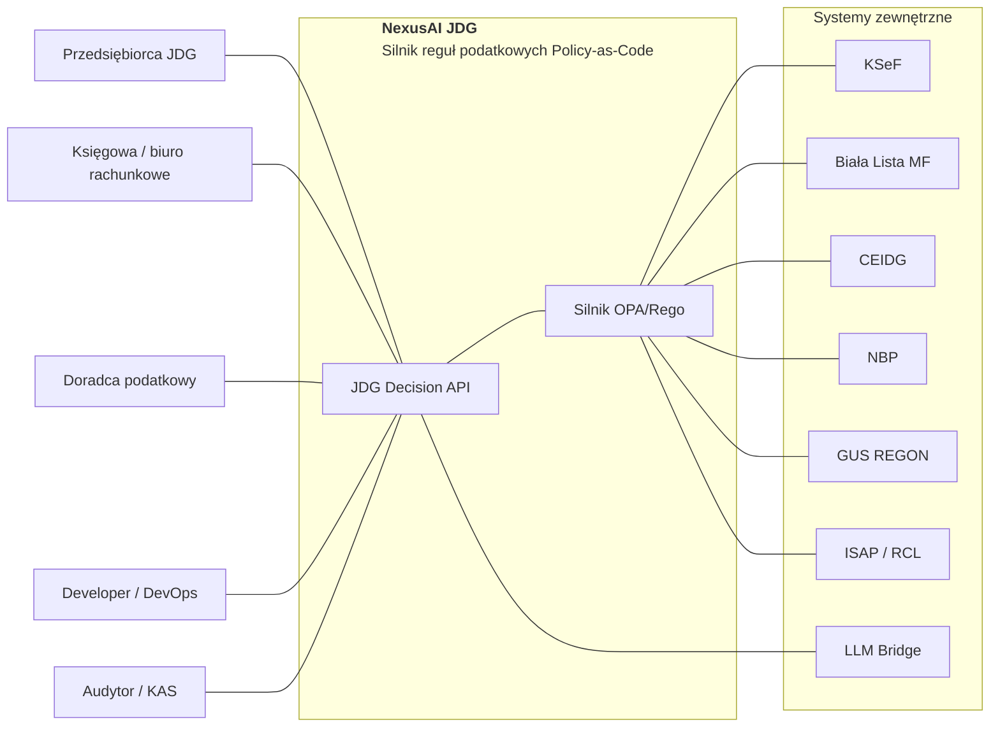
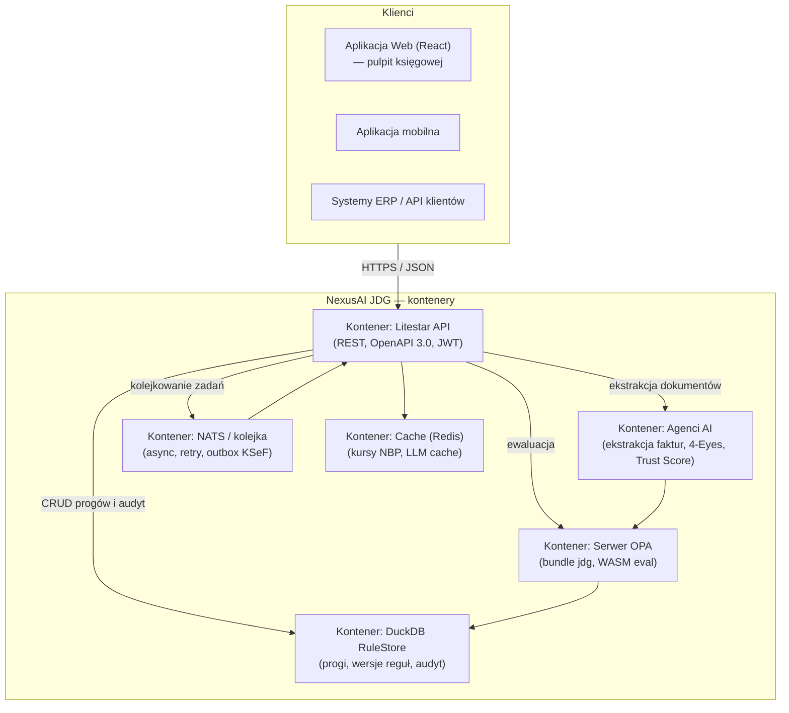
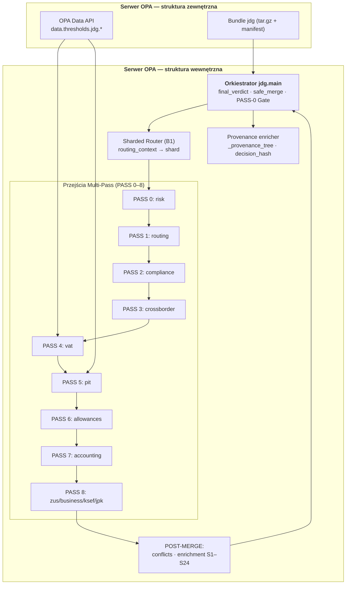
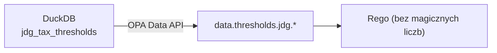
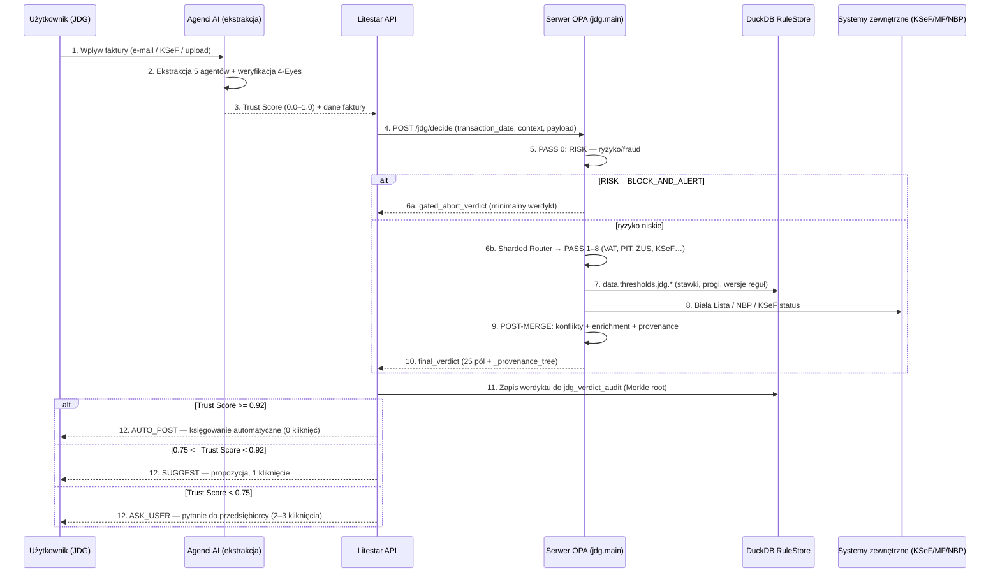
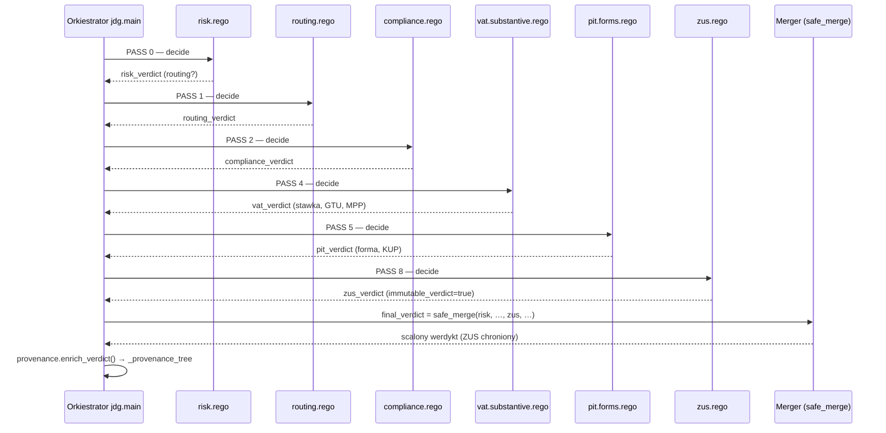
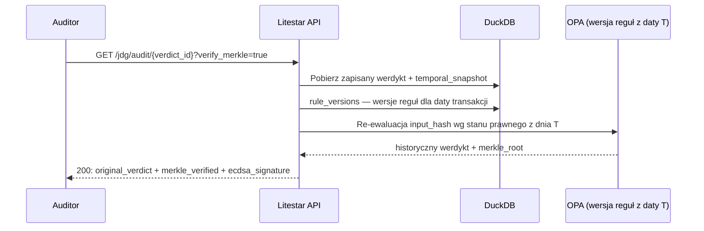

<!--
artifacts: [docs/ARCHITEKTURA.md, docs/ARCHITECTURE.md]
status: ACTIVE
owner: core
verified: 2026-09-13
verify_cmd: python3 tools/v3_p60_engines.py I11
-->

# 🏗️ NexusAI JDG — Architektura Systemu (C4 + Warstwy + Wzorce)

> **Status:** ENTERPRISE v8.3 | **Dokument:** ARCHITEKTURA.md | **Spójny z:** README.md, ADR 001–022, api/openapi.yaml
> **Cel:** Kompletny obraz architektury — od poziomu kontekstu (C4 L1) po wzorce projektowe i diagramy sekwencji procesów krytycznych.

> 📌 **Uwaga:** obok istnieje [ARCHITECTURE.md](ARCHITECTURE.md) — to **odrębny** dokument zawierający Architecture Decision Records (ADR 001–015). ARCHITEKTURA.md opisuje diagramy C4 i wzorce; ARCHITECTURE.md dokumentuje decyzje projektowe. Nie są duplikatami.

---

## 🔎 Wyszukiwarka (Ctrl+F)

`architektura` · `C4` · `context` · `container` · `component` · `warstwa` · `warstwy` · `layer` · `wzorzec` · `pattern` · `diagram sekwencji` · `sequence` · `multi-pass` · `shard` · `sharded router` · `safe_merge` · `first-match-wins` · `temporalność` · `time-travel` · `ADR` · `orka` · `orkiestrator` · `pipeline` · `proces decyzyjny` · `faktura` · `invoice`

---

## 1. Przegląd — zasada PWE

| | |
|---|---|
| **P — Problem** | ~60 pakietów reguł ewaluowanych sekwencyjnie dawało latencję ~28 s na transakcję; zmiany prawa wymagały edycji kodu Rego; brak możliwości odtworzenia decyzji sprzed nowelizacji. |
| **W — Wartość** | Architektura Multi-Pass + Sharded Router (O(1) routing), temporalność reguł (time-travel), niezmienny audyt (Merkle/HMAC) i próg-hurtownia w DuckDB (zero hardcoded values). |
| **E — Efekt** | Latencja p95 < 5 ms na shard, ~85% transakcji w AUTO_POST, każda decyzja dowodliwa przed KAS. |

---

## 2. Diagramy C4 — cztery poziomy

### 2.1. C4 Level 1 — Context (System in context)



**Opis:** NexusAI JDG jest **systemem decyzyjnym** pośredniczącym między użytkownikiem a urzędami skarbowymi. Konsumuje dane z systemów państwowych (KSeF, Biała Lista, CEIDG, NBP, GUS) i aktualizuje swoją wiedzę prawną z ISAP. **Kluczowa zależność:** bez OPA (silnik reguł) system nie podejmuje żadnej decyzji — jest to serce systemu.

### 2.2. C4 Level 2 — Container (Containers)



**Opis kontenerów:**

| Kontener | Technologia | Odpowiedzialność | Status |
|---|---|---|---|
| **Litestar API** | Python (Litestar), OpenAPI 3.0.3 | REST: `/jdg/decide`, `/simulate`, `/audit`, `/explain`, `/health`, `/thresholds`, `/manifest`, `/coverage`, `/rules/{id}`, `/legal-coverage` | 🟢 PRODUCTION |
| **Serwer OPA** | OPA v0.60+, bundle `jdg`, eval WASM | Ewaluacja reguł Rego, Multi-Pass, Sharded Router | 🟢 PRODUCTION |
| **DuckDB RuleStore** | DuckDB | `jdg_tax_thresholds`, `rule_versions`, `jdg_verdict_audit`, `isap_history`, `jdg_legal_cartography`, `jdg_prediction_history`, `jdg_stale_rules_registry`, `jdg_conflict_registry`, `jdg_explanation_cache` | 🟡 BETA |
| **Agenci AI** | 5 agentów ekstrakcji, 4-Eyes | Ekstrakcja danych z faktur, **Trust Score** ≥ 0.92 wymagany do AUTO_POST | 🟢 PRODUCTION |
| **NATS** | NATS JetStream | Kolejkowanie zadań async (KSeF outbox, e-Doręczenia, monitoring ISAP), retry z backoff | 🟡 BETA |
| **Cache** | Redis | Kursy NBP, cache wyjaśnień LLM (TTL 30 dni), limity | 🟡 BETA |

### 2.3. C4 Level 3 — Component (struktura wewnętrzna OPA + zewnętrzna)



**Opis komponentów OPA:**

| Komponent | Rola |
|---|---|
| `final_verdict` | Wybór ścieżki: `gated_abort_verdict` (BLOCK_AND_ALERT) → `sharded_sale_verdict` → `sharded_purchase_verdict` → `full_final_verdict` |
| `routing_context` | Buduje kontekst: `tax_form`, `transaction_type`, `entity_status`, `evaluation_quarter`, `is_cross_border`, `has_employees`, `is_vat_payer`, `requires_ksef` |
| `safe_merge(a,b)` | Scalanie werdyktów z ochroną werdyktów niemutowalnych (`immutable_verdict=true` — allowlist: `jdg.zus`, `jdg.zus.sickness_benefits`, `jdg.zus.enterprise_benefits`, `jdg.zus.health_contribution`, `jdg.business`, `jdg.security.fortress`) |
| `provenance.enrich_verdict()` | Dodaje `_provenance_tree`, `_package_decisions`, `_evaluation_ms`, `decision_hash` (SHA-256), Merkle root |

---

## 3. Warstwy architektoniczne

System mapuje klasyczne warstwy DDD na konkretne artefakty:

| Warstwa | Artefakty | Odpowiedzialność |
|---|---|---|
| **Presentation** (prezentacja) | `api/openapi.yaml`, endpointy REST `/jdg/*`, dokumenty UI | Przyjęcie żądań, autoryzacja JWT, walidacja wejścia (schema + semantic guard) |
| **Application** (aplikacja) | Orkiestrator `main_jdg.rego`, Sharded Router, Decision Composer, tryby AUTO_POST/SUGGEST/ASK_USER | Koordynacja przepływu decyzyjnego, wybór ścieżki ewaluacji, kompozycja odpowiedzi |
| **Domain** (domena) | 472 pliki Rego w pakietach `jdg.*` (VAT, PIT, ZUS, KKS, UoR, PCC, cross-border…), warstwa mikro-atomowa | Reguły biznesowe i prawne, pierwszeństwo dopasowania (First-Match-Wins), temporalność |
| **Infrastructure** (infrastruktura) | DuckDB RuleStore, bundle OPA, NATS, Redis, agenci AI, integracje zewnętrzne (KSeF, MF, CEIDG, NBP, GUS, ISAP), CI/CD | Pamięć, komunikacja, ekstrakcja danych, monitorowanie prawa |

> **Zasada zależności:** warstwy wyżej mogą zależeć od warstw niżej, nigdy odwrotnie. Reguły domenowe **nie** zawierają logiki I/O — prógów nie czyta się z DuckDB bezpośrednio w Rego, tylko przez `data.thresholds.jdg.*`.

### Warstwy reguł (mikro-architektura)

| Warstwa | Opis | Liczba plików |
|---|---|---|
| **Macro (Core)** | Reguły decyzyjne agregujące — VAT, PIT, ZUS, KKS, PKPiR, cross-border | ~153 |
| **Micro (atomowa)** | Pojedyncze artykuły ustaw (`rules/micro/plan33_*`, `micro/vat`, `micro/kks`…) | ~106 |
| **Enterprise S1–S24** | Inicjatywy strategiczne (optymalizacja, KSeF resilience, deklaracje, monitoring) | 25+ |
| **Hyper Plan45** | Reguły hiper-szczegółowe (terminy, limity, sankcje, e-Doręczenia, WIS) | 14 |

---

## 4. Wzorce projektowe

### 4.1. First-Match-Wins (else-chain) — ADR-001

Każdy plik Rego używa deterministycznej ewaluacji `else`-chain:

```rego
default decide := {"matched": false, "rule_id": "...no_match", "priority": 999}

decide := { ... } { condition_1 }       # pierwsza reguła (najwyższy priorytet)
else   := { ... } { condition_2 }       # druga
else   := { ... } { condition_3 }       # trzecia...
```

**Konsekwencje dla dewelopera:**
- Kolejność w pliku = kolejność ewaluacji. Nowe reguły wstawiaj w odpowiednie miejsce łańcucha.
- Nie przeplataj helper rules (`:=`) z `else :=` w łańcuchu.
- Testy muszą weryfikować kolejność.

### 4.2. Multi-Pass Evaluation — ADR-007

Przepływ: `INPUT → PASS 0 → 1 → 2 → … → 8 → POST-MERGE → final_verdict`.

> **Granice jakościowe kampanii V3:** wewnątrz POST-MERGE działa wersjonowany
> łańcuch kontraktów granicznych `p54 → … → p74 (hyper) → p75 (enterprise) →
> p76 (tools/gates) → p77 (tests/CI) → p78 (bundles/delivery) → p79 (API/UI/
> centrum decyzji) → p80 (docs/Legal Twin/certyfikacja)`, doklejany przez
> `safe_merge` przed runtime invariants. Każdy kontrakt jest fail-closed,
> DECOUPLED, `no_auto_post=true` i bramkuje WYNIKI swojej warstwy z evidence
> (`JDG/bundles/*_audit_*.json`). Pakiety: [MANIFEST.md §PAKIETY KAMPANII V3](../MANIFEST.md).

```mermaid
flowchart LR
    IN["INPUT (faktura + kontekst JDG)"]
    P0["PASS 0: RISK<br/>fraud · GAAR · GKS"]
    P1["PASS 1: ROUTING<br/>field confidence"]
    P2["PASS 2: COMPLIANCE<br/>Biała Lista · MPP"]
    P3["PASS 3: CROSSBORDER<br/>WNT · WDT · import"]
    P4["PASS 4: VAT<br/>stawki · GTU · odliczenia"]
    P5["PASS 5: PIT<br/>forma · KUP · zaliczki"]
    P6["PASS 6: ALLOWANCES<br/>ulgi podatkowe"]
    P7["PASS 7: ACCOUNTING<br/>PKPiR · amortyzacja"]
    P8["PASS 8: ZUS + BUSINESS<br/>+ KSeF + JPK + reszta"]
    PM["POST-MERGE<br/>konflikty · enrichment S1–S24 · provenance"]

    IN --> P0
    P0 -- "BLOCK_AND_ALERT → abort (gated_abort_verdict)" --> PM
    P0 --> P1
    P1 -- "BLOCK_AND_ALERT → abort" --> PM
    P1 --> P2 --> P3 --> P4 --> P5 --> P6 --> P7 --> P8
    P8 --> PM
```



### 4.3. Sharded Router (B1) — ADR-009

Router buduje `routing_context` i wybiera ścieżkę ewaluacji:

| Kontekst | Ścieżka | Pakiety |
|---|---|---|
| `BLOCK_AND_ALERT` (risk lub routing) | `gated_abort_verdict` | minimalny zestaw bezpieczeństwa |
| `DOMESTIC_SALE` + `ACTIVE` | `sharded_sale_verdict` | risk, kks, routing, compliance, validation, edge_cases, ksef_jpk, aml, mdr, substantive, forms, kup, accounting, business, zus + pakiety bezpieczeństwa (~50 pakietów) |
| `DOMESTIC_PURCHASE` + `ACTIVE` | `sharded_purchase_verdict` | jw. + deductions, procedures, corrections |
| cross-border / status ≠ ACTIVE | `full_final_verdict` | wszystkie ~60 pakietów |

### 4.4. Safe Merge z werdyktami niemutowalnymi

```rego
safe_merge(a, b) = a                       { has_immutable_flag(a) }  # a chronione
safe_merge(a, b) = object.union(b, a)      { has_immutable_flag(b) }  # b wygrywa
safe_merge(a, b) = object.union(a, b)      { not has_immutable_flag(a); not has_immutable_flag(b) }
```

**Dlaczego:** werdykty ZUS (P720/P722/P724) i biznesowe (P914) mają bezpośredni wpływ finansowy — nie mogą być nadpisane przez `risk.decide` ani pakiety advisory. Allowlist: `jdg.zus`, `jdg.zus.sickness_benefits`, `jdg.zus.enterprise_benefits`, `jdg.zus.health_contribution`, `jdg.business`, `jdg.security.fortress`.

### 4.5. Temporalność reguł (A2) — ADR-003

Reguły niosą `valid_from` / `valid_to`; wersje reguł żyją w `rule_versions` (DuckDB). Przy ewaluacji dla daty historycznej (np. kontrola KAS za 2025) system wybiera **wersję reguły obowiązującą w dniu transakcji** (np. P189: 150 dni przed 2025-07-01 → 90 dni od 2025-07-01 — SLIM VAT 3).

### 4.6. Zero Hardcoded Values (B2) — ADR-002



### 4.7. Immutable Audit Trail (A1) — ADR-006

Krytyczne werdykty mają `immutable_verdict: true`, są podpisywane HMAC-SHA256, a łańcuch decyzji weryfikowany przez Merkle Tree. Log w `jdg_verdict_audit` (verdict_id, input_hash, merkle_root, ecdsa_signature, bundle_version, shard_routed, evaluation_ms).

### 4.8. Standardowy werdykt 25-polowy — ADR-004

```json
{
  "matched": true,
  "rule_id": "jdg.domena.nazwa_reguly",
  "package": "jdg.domena",
  "priority": 100,
  "vat_rate": "0.23",
  "rounding_level": "position",
  "gtu_code": "GTU_04",
  "procedure": "",
  "pit_form": "SCALE",
  "pit_rate": "0.12",
  "kus_qualification": "deductible_full",
  "kus_percent": 100,
  "zus_social_base_type": "MALY_ZUS_PLUS",
  "zus_health_rate": "0.09",
  "_routing": "",
  "_routing_reason": "",
  "_legal_basis": "Art. 41 ust. 1 ustawy o VAT",
  "_warnings": []
}
```

### 4.9. Pozostałe wzorce

| Wzorzec | Gdzie | Opis |
|---|---|---|
| PASS-0 Gate | `main_jdg.rego` | Early abort przy `BLOCK_AND_ALERT` — redukcja latencji 40–60% dla transakcji fraudowych |
| Provenance enrichment | `provenance.rego` | `_provenance_tree`, `decision_hash`, Merkle root na końcu łańcucha |
| Konflikt międzydomenowy | `conflicts.rego` (POST-MERGE) | Wykrywa np. IP Box vs B+R na tym samym dochodzie — tylko flaguje (`_cross_domain_conflicts`), nie zmienia decyzji |
| Checkpoint-stub | ADR-015 | Reguły z `{ true }` muszą mieć `# CHECKPOINT-STUB` i znacznik w `_routing_reason` |
| Rule ID convention | ADR-008 | `jdg.<domena>.<kategoria>_<szczegół>` |
| Priorytety numeryczne | Developer Guide §3.2 | UoR: 100001–100743, PCC: 200001–200343, Akcyza: 250001–250143, Amortyzacja: 300001–300054, MDR: 350001–350062, Exit Tax/CFC: 360001–360044 |

---

## 5. Diagramy sekwencji — procesy krytyczne

### 5.1. Przetwarzanie faktury — od wpływu do decyzji



### 5.2. Proces decyzyjny Multi-Pass (szczegółowo)



### 5.3. Weryfikacja audytowa (time-travel)



---

## 6. Mapowanie ADR (Architecture Decision Records)

| ADR | Decyzja | Status |
|---|---|---|
| ADR-001 | First-Match-Wins else-chain | ✅ wdrożony |
| ADR-002 | Zero Hardcoded Values (thresholds) | ⚠️ częściowo (~265 wartości do migracji) |
| ADR-003 | Temporalność reguł (valid_from/valid_to) | ✅ wdrożony |
| ADR-004 | Standardowy werdykt 25-polowy | ✅ wdrożony |
| ADR-005 | Dual-Layer Architecture (Macro/Micro) | ⚠️ częściowo (106 plików micro) |
| ADR-006 | Immutable Audit Trail (HMAC + Merkle) | ✅ wdrożony |
| ADR-007 | Multi-Pass Evaluation (PASS 0–8 + POST-MERGE) | ✅ wdrożony |
| ADR-008 | Konwencja Rule ID `jdg.<domena>.<kategoria>` | ✅ (deduplikacja 336 id — Faza 3) |
| ADR-009 | Sharded Router (B1) — routing O(1) | ✅ wdrożony |
| ADR-010 | Mikro-atomy + deduplikacja | ⚠️ częściowo |
| ADR-011 | Policy Bundles + wersjonowanie (bundle.sh) | ✅ wdrożony |
| ADR-012 | Metryki pokrycia M1/M2/M3 | ✅ wdrożony |
| ADR-013 | Testy Rego w CI | ⚠️ częściowo — natywne testy Rego istnieją w `tests/rego/` i `tests/rego/micro/` (test_native_*.rego); cel ≥ 20 plików testowych do Q4 2026 |
| ADR-014 | Rozliczalność narzędzi (core/legacy/one-shot) | ✅ wdrożony |
| ADR-015 | Konwencja Checkpoint-Stubów | ✅ wdrożony |
| ADR-016 | Legal Twin / LKG (F1 V2) | ✅ wdrożony |
| ADR-017 | Warstwa Konstytucyjna — Runtime Invariants (F2 V2) | ✅ wdrożony |
| ADR-018 | Golden Oracle + ewaluacja różnicowa (F3 V2) | ✅ wdrożony |
| ADR-019 | Decision Certificate (F4 V2) | ✅ wdrożony |
| ADR-020 | Law Radar (F5 V2) | ✅ wdrożony |
| ADR-021 | Declarative Change (F6 V2) | ✅ wdrożony |
| ADR-022 | Orkiestrator Forteca — POST-MERGE invariants + certyfikat | ✅ wdrożony |

---

## 7. Architektura `policies/` — mirror reguł (starsza wersja)

Katalog `policies/` w repo zawiera **lżejszy mirror** reguł JDG:

```
policies/
├── jdg/                    # 32 pliki Rego (v2026.07.10) — orkiestrator + 30 pakietów
│   ├── main_jdg.rego       # Multi-Pass (bez Sharded Routera)
│   ├── vat/ pit/ zus/…     # pakiety domenowe
│   └── bundles/            # base + overlays v2026/v2027 (wersjonowane paczki)
├── tax/                    # VAT (substantive/gtu/deductions/procedures), CIT, PIT
├── tests/                  # test_native_jdg_*.rego
├── bundle.sh               # budowa bundle
└── Makefile
```

**Różnice względem `JDG/rules/`:** wersja w `policies/` nie ma Sharded Routera, 25-polowego werdyktu ani pakietów Enterprise S1–S24. Zawiera **overlays** `v2026`/`v2027` — mechanizm nakładek czasowych na bundle (rozbudowa wzorca ADR-011). **Zasada:** `JDG/rules/` jest źródłem prawdy; `policies/` służy do eksperymentów i wersjonowania.

---

## 8. Architektura `docs/` — mapa dokumentacji

| Warstwa dokumentacji | Dokument |
|---|---|
| Wejście | README.md, FAQ.md |
| Architektura | ARCHITEKTURA.md (ten dokument), [ARCHITEKTURA_OPA_ENTERPRISE_TARGET.md](ARCHITEKTURA_OPA_ENTERPRISE_TARGET.md) (cel V1), [WIZJA_OPA_ENTERPRISE_V2.md](WIZJA_OPA_ENTERPRISE_V2.md) (wizja V2 — niezachwiana pewność) |
| Struktura danych | STRUKTURA_PROJEKTU.md |
| Interfejs | API_REFERENCJA.md, api/openapi.yaml |
| Logika | LOGIKA_BIZNESOWA.md |
| Prawo | ZGODNOSC_PRAWNA.md, LEGAL_COVERAGE.md, LEGAL_REFERENCE_ACTS.md |
| Użytkownik | PODRECZNIK_UZYTKOWNIKA.md |
| Inicjatywy | P02…P24 (VAT_MACRO_P03.md, ZUS_MICRO_P08.md, AUDYT_KOMPLETNY_P24.md…) |
| Analiza i wizja | ANALIZA_STANU_OPA_JAKO_SYSTEM.md, ARCHITEKTURA_OPA_ENTERPRISE_TARGET.md, WIZJA_OPA_ENTERPRISE_V2.md |
| Proces | RULE_LIFECYCLE.md, OPA_REGO_DEVELOPER_GUIDE.md, DEVELOPER_GUIDE.md |

---

## 9. Limitacje i znane obszary rozwoju

| Obszar | Stan | Plan |
|---|---|---|
| Migracja 265 hardcoded wartości do DuckDB | ⚠️ w toku | Faza C7 |
| Deduplikacja 336 rule_id (makro/mikro) | ⚠️ w toku | Faza 3 |
| Natywne testy Rego | ⬜ brak | Faza 4 (cel ≥ 20 plików testowych Q4 2026) |
| Sharded Router w `policies/` | ⬜ brak | mirror do synchronizacji |
| Latencja full chain (transakcje cross-border) | ~8–12 s | optymalizacja kolejnych shardów |

---

*Spójny z: README.md · MANIFEST.md · ADR 001–015 · api/openapi.yaml · DEVELOPER_GUIDE.md*

## ADR-016: Legal Twin / Legal Knowledge Graph (LKG) — [NOWY, v8.2 / P01 V2 F1]

**Status:** ✅ Zaakceptowane (2026-08-08, P01 Fundament). PL/EN parity P60: sekcja przywrócona (dryf tłumaczenia wykryty bramką I11 — PL jest źródłem prawdy).

**Decyzja:** Ewolucja tabeli `jdg_legal_cartography` do pełnego **Legal Knowledge Graph** (`legal_graph`, migracja 003): akty → artykuły → ustępy → punkty z wersjonowaniem czasowym (jak reguły). Każda reguła i parametr dwukierunkowo powiązane z węzłami prawa. Podstawa prawna przestaje być stringiem — staje się **referencją** do węzła LKG (`_legal_basis_refs`).

**Metryki:** LCI (Legal Coverage Index ≥ 99%), TCL (Temporal Continuity 100%), RV (Rule–Law Verification 100%).

**Narzędzia:** `tools/legal_twin.py` (build LKG + indeksy), bramka RV w CI.

---

## ADR-017: Warstwa Konstytucyjna — Runtime Invariants — [NOWY, v8.2 / P01 V2 F2]

**Status:** ✅ Zaakceptowane (2026-08-08, P01 Fundament).

**Decyzja:** Katalog ~30 twardych niezmienników (INV-001..030) egzekwowanych na **każdym werdykcie w runtime** (koniec POST-MERGE w `main_jdg.rego`), a nie tylko w CI. Naruszenie = `CERTAINTY_BLOCKED` + alarm + auto-revert. Trzy poziomy: BUILD (blokada merge), RUNTIME (blokada werdyktu), STATISTICAL (auto-rollback bundle).

**Artefakty:** `rules/audit/runtime_invariants_enterprise.rego` (katalog INV + reguły egzekucji), `tools/invariant_checker.py` (bramka CI).

---

## ADR-018: Golden Oracle + Ewaluacja Różnicowa — [NOWY, v8.2 / P01 V2 F3]

**Status:** ✅ Zaakceptowane (2026-08-08, P01 Fundament).

**Decyzja:** Repozytorium złotych werdyktów (tabela `golden_verdicts`, migracja 003) jako „oracle przeszłości”: żadna zmiana nie może zmienić historycznego werdyktu bez uzasadnienia w diffie prawnym (UVR = 0). Ewaluacja różnicowa: domeny krytyczne liczone na ≥ 2 węzłach, hash werdyktu (`decision_hash`) musi się zgadzać.

**Narzędzia:** `tools/golden_replay.py` (record/replay/annotate/report), bramka GOLDEN_REPLAY w CI.

---

## ADR-019: Decision Certificate — [NOWY, v8.2 / P01 V2 F4]

**Status:** ✅ Zaakceptowane (2026-08-08, P01 Fundament).

**Decyzja:** Każdy werdykt generuje certyfikat decyzyjny z klasą pewności `CERTAIN` / `CONDITIONAL` / `NEEDS_ADVICE` oraz pieczęcią kryptograficzną (SHA-256 → Merkle → podpis HSM), weryfikowalną offline. Eksport PDF+XML dla KAS. AUTO_POST tylko dla CERTAIN.

**Narzędzia:** `tools/decision_certificate.py` (issue/verify/classes/export), tabela `decision_certificates` (migracja 003).

---

## ADR-020: Law Radar — Proaktywna Adaptacja — [NOWY, v8.2 / P01 V2 F5]

**Status:** ✅ Zaakceptowane (2026-08-08, P01 Fundament).

**Decyzja:** Monitoring **projektów ustaw** (RCL, Sejm, Senat) — nie tylko opublikowanych nowelizacji. Reguły przygotowywane z wyprzedzeniem (SHADOW, `valid_from` = data wejścia) — w dniu wejścia tylko promote. KPI: `lead_time_avg ≥ 30 dni` przed wejściem w życie.

**Narzędzia:** `tools/law_radar.py` (track/radar/status/prepare), tabela `draft_law_radar` (migracja 003).

---

## ADR-021: Declarative Change — [NOWY, v8.2 / P01 V2 F6]

**Status:** ✅ Zaakceptowane (2026-08-08, P01 Fundament).

**Decyzja:** Interfejs deklaratywny zmiany: człowiek opisuje zmianę w języku prostym (np. „stawka VAT 23% → 8% od 2027-01-01"), system mapuje na parametr/regułę, generuje diff, testy, impact, golden replay, PR 4-eyes i wdraża kanarkowo. Automatyzacja NIGDY: bez zdrowych metryk kanara, bez 2 podpisów dla domen niemutowalnych, bez dowodu zero referencji przy usuwaniu.

**Narzędzia:** `tools/declarative_change.py` (plan/execute/template/history), integracja z data_service (ścieżka danych < 1 min).

---

## ADR-022: Orkiestrator Forteca — POST-MERGE Invariants + Decision Certificate — [NOWY, v8.3 / P03 GLM52]

**Status:** ✅ Zaakceptowane (2026-08-08, P03 GLM52 Orkiestrator).

**Decyzja:** Na **końcu POST-MERGE** (`main_jdg.rego` → `final_verdict_enforced`) każdy werdykt przechodzi przez egzekucję runtime invariants (F2 V2) i otrzymuje `_invariant_report` (INV-001..042), `certainty_class` (CERTAIN/CONDITIONAL/NEEDS_ADVICE), `_certainty_guard` (host NIGDY nie wykonuje AUTO_POST dla CERTAINTY_BLOCKED — INV-006/INV-035), `_decision_certificate` (decision_hash + wersje bundle/rule/threshold + legal_basis_refs) oraz `_routing_context` (routing O(1), ADR-009).

**Katalog:** INV-001..042 w `rules/audit/runtime_invariants_enterprise.rego`; `evaluate(v)` — jednoźródłowa funkcja czysta (runtime, host, CI).

**Artefakty:** `rules/audit/runtime_invariants_enterprise.rego`, `rules/p03_orchestrator_innovations_v9.rego`, `rules/temporal.rego`, `rules/provenance.rego`, `tools/hardcoded_audit_gate.py`, `final_verdict_enforced` w `main_jdg.rego`.

---

## 9. Limitacje i znane obszary rozwoju (aktualizacja P60, 2026-09-13)

| Obszar | Stan (P60) |
|---|---|
| Migracja hardcoded wartości do DuckDB | ✅ domknięta falą P46 (zero hardcode, bramka HARDCODED_AUDIT) |
| Deduplikacja rule_id (makro/mikro) | ✅ domknięta falą P50 (unikalność w raportach P45–P59) |
| Natywne testy Rego | ✅ 100+ plików testowych (manifest_v2: 109) + kampania V3 P51–P59 |
| Sharded Router w `policies/` | ✅ mirror zsynchronizowany (hash-parity P48, 4/4 w P59/P60) |

*Spójny z: README.md · MANIFEST_2_0.md · ADR 001–022 · api/openapi.yaml · DEVELOPER_GUIDE.md*
