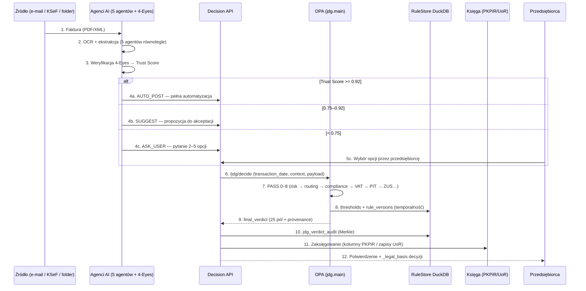
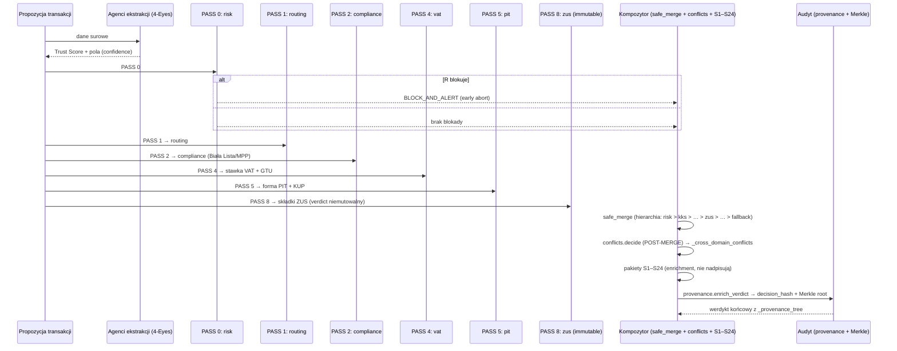
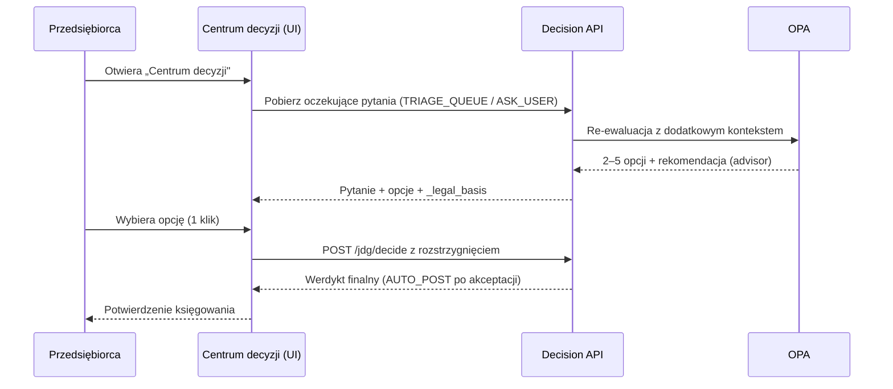

# ⚙️ NexusAI JDG — Logika Biznesowa: Moduły, Algorytmy i Debugowanie

> **Dokument:** LOGIKA_BIZNESOWA.md | **Zakres:** wszystkie pakiety reguł, orkiestrator, agenci AI, narzędzia
> **Cel:** Opis odpowiedzialności i algorytmów każdego kluczowego modułu, diagramy sekwencji procesów krytycznych (księgowanie faktury, proces decyzyjny), lista typowych błędów z rozwiązaniami oraz poradnik debugowania.

---

## 🔎 Wyszukiwarka (Ctrl+F)

`logika biznesowa` · `moduł` · `usługa` · `service` · `algorytm` · `przepływ danych` · `data flow` · `sekwencja` · `faktura` · `księgowanie` · `księgowanie faktury` · `Rada Agentów` · `rada` · `decyzja` · `AUTO_POST` · `SUGGEST` · `ASK_USER` · `błąd` · `problem` · `debug` · `debugowanie` · `log` · `verbose` · `rozwiązanie` · `troubleshooting`

---

## 1. Wartość biznesowa (PWE)

| | |
|---|---|
| **P — Problem** | Księgowa i developer nie wiedzą, który moduł odpowiada za jaką decyzję, jak debugować „zły werdykt" ani jak rozwiązać typowe problemy (konflikt reguł, zbyt niski Trust Score, degradacja KSeF). |
| **W — Wartość** | Ten rozdział wyjaśnia każdy moduł (co robi, jak, skąd bierze dane), procesy krok po kroku oraz katalog błędów z gotowymi rozwiązaniami. |
| **E — Efekt** | Skrócenie diagnozy problemu z dni do godzin; jasne granice odpowiedzialności modułów. |

---

## 2. Mapa modułów i usług

### 2.1. Warstwa decyzyjna (reguły OPA)

| Moduł (pakiet) | Odpowiedzialność | Algorytm / przepływ danych |
|---|---|---|
| **`jdg.main`** (orkiestrator) | Wybór ścieżki ewaluacji i scalanie werdyktów | `routing_context` → `final_verdict` (gated abort → sharded sale → sharded purchase → full chain) → `safe_merge` → provenance |
| **`jdg.risk`** (PASS 0) | Detekcja ryzyka: fraud, GAAR, GKS | Jeśli `_routing == BLOCK_AND_ALERT` → early abort (40–60% mniejsza latencja) |
| **`jdg.routing`** (PASS 1) | Routing po pewności pól (field confidence) | Niski confidence → `TRIAGE_QUEUE` |
| **`jdg.compliance`** (PASS 2) | Biała Lista MF, MPP/split payment, EPS | Walidacja kontrahenta + obowiązek mechanizmu podzielonej płatności |
| **`jdg.crossborder`** (PASS 3) | WNT, WDT, import, miejsce świadczenia | Wykrycie transakcji UE → kurs NBP → stawka/procedura |
| **`jdg.vat.substantive`** (PASS 4) | Stawki VAT, zwolnienia, GTU, MPP | First-Match-Wins po typie towaru/usługi (PKWiU/CN) → `vat_rate` + `gtu_code` |
| **`jdg.vat.deductions`** | Odliczenia VAT (Art. 86–95), proporcja, złe długi | Limit 90 dni (SLIM VAT 3) wg `data.thresholds.jdg.*` |
| **`jdg.pit.forms`** (PASS 5) | Forma opodatkowania (skala/liniowy/ryczałt/karta) | Wybór wg `pit_form` z kontekstu + temporalność progów |
| **`jdg.pit.kup`** | Kwalifikacja KUP/NKUP | `kus_qualification` + `kus_percent` (np. auto 75%, reprezentacja 0%) |
| **`jdg.allowances`** (PASS 6) | Ulgi podatkowe (10+ ulg) | Wybór ulgi wg warunków podatnika + limity z thresholdów |
| **`jdg.accounting`** (PASS 7) | PKPiR, amortyzacja, remanent | Kolumny 1–17 PKPiR, stawki KŚT, jednorazowa amortyzacja |
| **`jdg.zus`** (PASS 8) | Składki społeczne i zdrowotne (immutable) | Podstawa wg typu (`STANDARD`, `MALY_ZUS_PLUS`, `START_RELIEF`…) + stawki z thresholdów |
| **`jdg.kks`** | Kodeks Karny Skarbowy Art. 54–83 | Gradacja kar, stawki dzienne, czynny żal, przedawnienie |
| **`jdg.conflicts`** (POST-MERGE) | Konflikty międzydomenowe | Analiza `input` (dane źródłowe) → flagi `_cross_domain_conflicts` (np. IP Box vs B+R) — **nie zmienia decyzji** |
| **`jdg.edge_cases`** | Przypadki brzegowe (187 reguł) | Przekroczenie limitu VAT w trakcie roku, zawieszenie JDG, korekty |
| **`jdg.fallback`** | Ostatnia deska ratunku | Werdykt `no_match` z priorytetem 999 |
| **`jdg.provenance`** | Wzbogacanie werdyktu o ślad decyzyjny | `enrich_verdict(verdict, _package_decisions)` → `_provenance_tree`, `decision_hash`, Merkle root |

### 2.2. Warstwa Enterprise (inicjatywy S1–S24)

| Moduł | Inicjatywa | Odpowiedzialność |
|---|---|---|
| `tax_optimization` | S1 | Optymalizacja formy opodatkowania |
| `cross_domain_hub` | S2 | Inteligencja międzydomenowa |
| `judicial_rulings` | S3 | Predykcja wyroków / interpretacje |
| `audit_defense` | S4 | Obrona przed kontrolą KAS |
| `strategic_advisor` | S5 | Doradca strategiczny |
| `ksef_resilience` | S6 | Odporność KSeF (offline queue) |
| `ppk_pfron` | S7 | PPK / PFRON |
| `cashflow_predictor` | S8 | Predykcja przepływów podatkowych |
| `form_transition` | S9 | Symulacja zmiany formy opodatkowania |
| `banking` | S10 | Automatyzacja bankowości (PSD2/PolishAPI) |
| `annual_declaration` | S11 | Auto-fill PIT-36/36L/28 |
| `jpk_v7_autogen` | S12 | Auto-generacja JPK_V7M |
| `legislative_monitor` | S13 | Monitor zmian legislacyjnych |
| `neural_mesh` | S14 | Siatka neuronowa reguł (cross-domain fabric) |
| `nkup_enterprise` | S15 | NKUP pełne (Art. 23 PIT) |
| `exit_tax_mdr` | S16 | Exit tax + MDR |
| `vat_substantive_complete` | S21 | VAT Art. 11–135 pełne pokrycie |
| `tax_authority_interaction` | S22 | Auto-korespondencja z US/KAS/ZUS |
| `sanctions_optimization` | S23 | Optymalizacja kar KKS (4-ścieżkowa) |
| `lifecycle_manager` | S24 | Cykl życia JDG (CEIDG → exit) |

### 2.3. Usługi pomocnicze (Python)

| Usługa | Odpowiedzialność |
|---|---|
| **Agenci AI (5 agentów + 4-Eyes)** | Ekstrakcja danych z faktur (OCR, PDF), krzyżowa weryfikacja, **Trust Score** |
| **`isap_crawler.py`** | Codzienny monitoring ISAP — wykrywanie zmian aktów prawnych → `isap_history` |
| **`llm_bridge.py`** | Tłumaczenie werdyktów na język naturalny (C2, modele Gemini/Claude/GPT) |
| **`judgment_predictor.py`** | Predykcja decyzji organów (C1) |
| **`self_healing_engine.py`** | Auto-naprawa reguł (wykrywanie i korekta) |
| **`chaos_engineering.py`** | Testy odporności (wyłączanie zależności) |
| **`kks_penalty_simulator.py`** | Symulacja kar KKS (stawki dzienne, mnożniki) |
| **`dead_rule_detector.py`** | Wykrywanie martwych reguł (`{ true }` bez CHECKPOINT-STUB) |

---

## 3. Algorytmy kluczowe

### 3.1. Algorytm ewaluacji transakcji (pseudokod)

```
FUNKCJA evaluate(transaction_date, context, payload):
    1.  routing_context ← zbuduj(input)          # tax_form, tx_type, entity_status, quarter…
    2.  risk_verdict ← jdg.risk.decide            # PASS 0
    3.  JEŚLI risk_verdict._routing == BLOCK_AND_ALERT:
            return gated_abort_verdict            # early abort
    4.  routing_verdict ← jdg.routing.decide      # PASS 1
    5.  JEŚLI routing_verdict._routing == BLOCK_AND_ALERT:
            return gated_abort_verdict
    6.  WYBIERZ ścieżkę (Sharded Router):
        - cross-border lub entity_status ≠ ACTIVE → full_final_verdict
        - DOMESTIC_SALE → sharded_sale_verdict
        - DOMESTIC_PURCHASE → sharded_purchase_verdict
    7.  werdykt ← safe_merge(wszystkie decide z wybranej ścieżki)
    8.  werdykt ← safe_merge(werdykt, jdg.conflicts.decide)   # POST-MERGE
    9.  werdykt ← safe_merge(werdykt, pakiety S1–S24)          # enrichment
    10. werdykt ← provenance.enrich_verdict(werdykt, _package_decisions)
    11. ZAPISZ do jdg_verdict_audit (Merkle root, ECDSA)
    12. return werdykt
```

### 3.2. Algorytm safe_merge (ochrona werdyktów niemutowalnych)

```
safe_merge(a, b):
    JEŚLI a.immutable_verdict == true  → return a                 # a chronione
    JEŚLI b.immutable_verdict == true  → return union(b, a)       # b wygrywa
    INACZEJ                              → return union(a, b)     # a wygrywa (zewnętrzny pakiet ma priorytet)
```

Allowlist niemutowalności: `jdg.zus`, `jdg.zus.sickness_benefits`, `jdg.zus.enterprise_benefits`, `jdg.zus.health_contribution`, `jdg.business`, `jdg.security.fortress`.

### 3.3. Algorytm temporalny (time-travel)

```
WYBIERZ wersję reguły dla daty T (transakcji):
    FROM rule_versions
    WHERE rule_id = X
      AND valid_from <= T
      AND (valid_to IS NULL OR valid_to >= T)
    ORDER BY rule_version DESC LIMIT 1
```

Przykład: P189 (złe długi) — v1: 150 dni (do 2025-06-30), v2: 90 dni (od 2025-07-01, SLIM VAT 3).

### 3.4. Algorytm wyboru trybu automatyzacji

```
JEŚLI  Trust Score >= 0.92  → AUTO_POST  (zero kliknięć, ~85% transakcji)
JEŚLI  0.75 <= Trust Score < 0.92 → SUGGEST (1 kliknięcie, ~10–12%)
JEŚLI  Trust Score < 0.75   → ASK_USER  (2–3 kliknięcia, ~3–5%)
```

---

## 4. Diagramy sekwencji — procesy krytyczne

### 4.1. Księgowanie faktury — od wpływu do zapisu w księgach



### 4.2. Proces decyzyjny — „Rada Agentów" → werdykt

W systemie rolę „Rady" pełnią **zespół agentów ekstrakcyjnych (konsensus 4-Eyes)** oraz **pakiety decyzyjne OPA (Multi-Pass)** — każdy pakiet głosuje swoim werdyktem, a `safe_merge` z hierarchią priorytetów ustala werdykt końcowy:



### 4.3. Obsługa pytania ASK_USER (Centrum decyzji)



---

## 5. Typowe błędy i rozwiązania

| # | Objaw | Przyczyna | Rozwiązanie |
|---|---|---|---|
| 1 | Werdykt `BLOCK_AND_ALERT` dla zwykłej faktury | Brak reguły dla inputu (422) lub ryzyko | Sprawdź `/jdg/explain` i `_warnings`; zweryfikuj `expense_type`, `vat_rate`; uzupełnij pola inputu |
| 2 | `_cost_ms` > 100 ms | Transakcja cross-border → `full_final_verdict` (pełny łańcuch ~60 pakietów) | Oczekiwane dla full chain (~28 s wg komentarzy kodu; shard krajowy 8–12 s); użyj `/jdg/simulate` do analiz |
| 3 | ZUS nadpisany przez risk | Usunięcie z allowlisty `immutable_verdict` | Przywróć pakiet w `immutable_verdict_allowlist` (main_jdg.rego) |
| 4 | Zła stawka VAT dla daty historycznej | Brak temporalności / brak wersji w `rule_versions` | Wstaw wersję reguły z `valid_from`/`valid_to` (migracja 001) |
| 5 | Błąd 503 `external_degraded` | Biała Lista / CEIDG / KSeF offline | Sprawdź `/jdg/health`; włącz `fallback_active`; retry po `retry_after_seconds` |
| 6 | Duplikaty `rule_id` (369) | Reguła w makro i micro | Postępuj wg ADR-010: zachowaj makro, usuń micro; rename z sufiksem kontekstu |
| 7 | Reguła nigdy nie matchuje | Zły `else`-chain (kolejność) lub `{ true }` stub | Użyj `dead_rule_detector.py`; popraw kolejność; oznacz stub jako `CHECKPOINT-STUB` (ADR-015) |
| 8 | Reguła matchuje zawsze | Tautologia / `{ true }` bez warunku | Uruchom `tautology_guard.py --strict`; dodaj prawdziwy warunek |
| 9 | Test `opa test` nie pokrywa pakietu | Brak pliku `test_native_*.rego` | Wygeneruj test wg `tools/generate_test_suite.py` (cel: ≥20 plików testowych Q4 2026) |
| 10 | Threshold nie działa mimo zmiany w DuckDB | Cache OPA Data API / brak reloadu | Odśwież serwis thresholdów (hot-reload); sprawdź `data.thresholds.jdg.*` |
| 11 | Błąd walidacji reguł (validate_rules) | Brak `_legal_basis` / `_routing` / `_warnings` | Uzupełnij 25-polowy werdykt (ADR-004) |
| 12 | Bundle nie zawiera wszystkich reguł | Kolizje basename (fix R1) | Użyj `bundle.sh` v8.0 (zachowuje strukturę katalogów); porównaj licznik plików |
| 13 | Werdykt zmienia się między uruchomieniami | Nondeterminizm (mapa/obiekt) | Sprawdź determinizm (pakiet `rules/reliability_guarantee_enterprise.rego`); testuj przez `opa eval` z tym samym inputem |
| 14 | API zwraca 401 po godzinie | Wygasły JWT | Odśwież token w Auth Service (expiry typowo 60 min) |

---

## 6. Poradnik debugowania

### 6.1. Poziomy diagnostyki

| Poziom | Narzędzie | Kiedy |
|---|---|---|
| 1. Walidacja składni | `opa check JDG/rules/ -b` | Błędy składni Rego |
| 2. Testy reguł | `opa test JDG/tests/rego/ -v` | Regresja logiki |
| 3. Ewaluacja pojedyncza | `opa eval --input input.json 'data.jdg.main.final_verdict'` | Ręczna inspekcja werdyktu |
| 4. Walidacja jakości | `python JDG/tools/validate_rules.py --strict` | 9 walidacji spójności |
| 5. Lint | `python JDG/tools/lint_rego_rules.py --check --strict` | 6-check stylu |
| 6. Martwe reguły | `python JDG/tools/dead_rule_detector.py` | Reguły `{ true }` |
| 7. Tautologie | `python JDG/tools/tautology_guard.py --strict` | Reguły zawsze-true |
| 8. Konflikty pakietów | `python JDG/tools/cross_package_conflict_detector.py` | Kolizje między domenami |
| 9. API | `curl -s /jdg/health` + `_cost_ms` w werdykcie | Problemy runtime |

### 6.2. Tryby verbose

```bash
# OPA verbose — pełny ślad ewaluacji
opa eval --input input.json --explain full 'data.jdg.main.final_verdict'

# Python z debug logami
python -m pdb JDG/tools/validate_rules.py --strict

# Test z widocznym outputem
python -m pytest JDG/tests/test_temporal_validity.py -v --log-cli-level=DEBUG
```

### 6.3. Czego szukać w werdykcie

| Pole | Diagnoza |
|---|---|
| `_shard_routed` | Która ścieżka ewaluacji działała (`sale_scale_active`, `purchase_*`, `full_chain`) |
| `_provenance.path[]` | Które pakiety dopasowały / nie dopasowały — krok po kroku |
| `_provenance.rule_version_applied` | Która wersja temporalna reguły użyta |
| `_cross_domain_conflicts[]` | Konflikty między domenami (tylko INFO) |
| `_warnings[]` | Ostrzeżenia dla księgowej |
| `evaluation_ms` / `_cost_ms` | Wydajność |

### 6.4. Logi systemowe

- **Audyt decyzyjny:** tabela `jdg_verdict_audit` (niezmienna, Merkle).
- **Zmiany prawa:** tabela `isap_history` (crawl dzienny).
- **Predykcje:** tabela `jdg_prediction_history`.
- **Konflikty:** tabela `jdg_conflict_registry`.
- **Nieaktualne reguły:** tabela `jdg_stale_rules_registry`.
- **Śledzenie requestów:** nagłówek `X-Request-Id` / pole `request_id` w błędach.

### 6.5. Rekonstrukcja decyzji (audytor)

1. Weź `verdict_id` z systemu księgowego.
2. `GET /jdg/audit/{verdict_id}?verify_merkle=true` → `original_verdict` + `merkle_verified`.
3. Jeśli `merkle_verified == false` → manipulacja danymi — podnieś alert bezpieczeństwa.
4. `_provenance.temporal_snapshot_used` pokazuje stan prawny w dniu decyzji.

---

## 6b. Warstwy konstytucyjne ETAP 04–06 i kampania ETAP 10–28

> Od kampanii GLM 5.2 (2026-08) silnik JDG działa na trzech warstwach konstytucyjnych
> opisanych w [KAMPANIA_GLM52_ETAPY_10_28.md](KAMPANIA_GLM52_ETAPY_10_28.md).

### 6b.1. Control Plane Rule Lifecycle (ETAP 04) — zarządzanie zmianą reguł

- Każda zmiana reguły przechodzi fail-closed cykl: `PENDING_REVIEW → REVIEW → AUTHORIZE → CANARY (5%) → SHADOW_COMPARE (delta ≤ 2%) → RAMPED (25/50/100%) → SOAK (≥ 24 h) → ACTIVE → ROLLBACK`.
- **Zakaz:** żadna metoda tej warstwy nie zapisuje bezpośrednio do `JDG/rules/` ani `policies/` — mutacja produkcyjna jest `FORBIDDEN`; host konsumuje podpisany bundle.
- Operacje: `ADD / CHANGE / DEPRECATE / RETIRE / PURGE / SUSPEND / ROLLBACK` — każda z własnym manifestem, podpisem i ticketem.
- Narzędzie: `JDG/tools/control_plane_lifecycle.py` · migracja `007_jdg_v12_control_plane_lifecycle.sql`.

### 6b.2. Orchestrator Data Contract (ETAP 05) — kontrakt werdyktu

- **25 pól wejściowych** werdyktu (`matched, rule_id, package, priority, _routing, _legal_basis, vat_rate, …`) + rozszerzenia: `_provenance_tree`, `_invariant_report`, `_certainty_class`, `_certainty_guard`, `_decision_certificate`, `_routing_context`.
- **PASS 0–8** z early abort (PASS 0 RISK, 1 ROUTING, 2 COMPLIANCE, 3 CROSSBORDER — `BLOCK_AND_ALERT`; PASS 4–8 bez aborcji).
- **safe_merge (INV-018/042):** werdykty niemutowalne (ZUS, zdrowotna, business, security.fortress) nigdy nie są nadpisywane; allowlist chroniony w runtime.
- Narzędzie: `JDG/tools/orchestrator_data_contract.py` · testy: `test_orchestrator_data_contract.py`.

### 6b.3. Core Guards — Temporal Thresholds (ETAP 06) — 42 niezmienniki

- **INV-001..042** egzekwowane na każdym werdykcie: `evaluate(v)` (czysta funkcja) → `enforce(v)` (blokada/blokada z alarmem).
- Poziomy: **RUNTIME** (21, blokada werdyktu) · **BUILD** (14, blokada merge w CI) · **STATISTICAL** (7, auto-rollback).
- Przykłady: INV-001 (stawka VAT ∈ dozwolonego zbioru), INV-003 (brutto = netto × (1+stawka) ± epsilon), INV-030 (wersje bundle/rule/threshold w proweniencji), INV-035 (BLOCK_AND_ALERT → brak AUTO_POST).
- **Temporal Interval Algebra (INV-037):** zero luk + zero nakładek w oknach ważności; deterministyczny pin `max(valid_from)`.
- Narzędzie: `JDG/tools/core_guards_temporal_thresholds.py` · reguły: `rules/audit/runtime_invariants_enterprise.rego`.

### 6b.4. Kampania ETAP 10–28 — domeny i audyty

| ETAP | Domeny | Artefakty |
|:----:|--------|-----------|
| 10–11 | PIT Macro + Micro Reliefs | `pit_macro_etap10_innovations_v1.rego`, `pit_micro_reliefs_etap11_v1.rego` |
| 12–13 | ZUS Core + Micro | `zus_core_etap12_v1.rego`, `zus_micro_etap13_v1.rego` |
| 14–15 | PKPiR + UoR/Amortyzacja | `pkpir_etap14_v1.rego`, `uor_etap15_v1.rego` |
| 16–17 | KKS+Ordynacja + Cross-border | `kks_ord_etap16_v1.rego`, `crossborder_etap17_v1.rego` |
| 18–19 | Cykl życia JDG + PCC/lokalne/akcyza | `business_lifecycle_etap18_v1.rego`, `local_excise_etap19_v1.rego` |
| 20–21 | KSeF/JPK + RODO/AML/BDO/HR | `ksef_jpk_etap20_v1.rego`, `rodo_aml_bdo_hr_etap21_v1.rego` |
| 22–23 | Hyper Contexts + AI/Neural | `hyper_enterprise_contexts_etap22_v1.rego`, `enterprise_ai_neural_etap23_v1.rego` |
| 24–25 | Testy/CI + Narzędzia/API/Bundle | `tests_ci_quality_etap24_v1.rego`, `tools_api_rulestore_bundles_etap25_v1.rego` |
| 26–27 | Mirror sync + Red team/chaos | `policies_mirror_sync_etap26_v1.rego`, `cross_domain_red_team_etap27_v1.rego` |
| 28 | Certyfikacja końcowa | `final_certification_etap28_v1.rego` (14/14 bramek) |

Każdy etap: `JDG/tools/<domena>_etapNN_audit.py` (bramki) + `JDG/bundles/<domena>_etapNN_audit_state.json` (dowód) + pytest + natywny test Rego.

---

## 7. Narzędzia debugowania (tabela szybkiego dostępu)

| Narzędzie (JDG/tools) | Polecenie | Diagnozuje |
|---|---|---|
| `validate_rules.py` | `python tools/validate_rules.py --strict` | 9 walidacji |
| `lint_rego_rules.py` | `python tools/lint_rego_rules.py --check --strict` | styl, kolejność |
| `tautology_guard.py` | `python tools/tautology_guard.py --strict` | reguły zawsze-true |
| `dead_rule_detector.py` | `python tools/dead_rule_detector.py` | martwe reguły/stuby |
| `cross_package_conflict_detector.py` | `python tools/cross_package_conflict_detector.py` | konflikty pakietów |
| `rule_impact_simulator.py` | `python tools/rule_impact_simulator.py` | wpływ zmiany reguły |
| `temporal_drift_detector.py` | `python tools/temporal_drift_detector.py` | dryf wersji temporalnych |
| `self_healing_engine.py` | `python tools/self_healing_engine.py` | auto-naprawa |
| `zero_defect_certification.py` | `python tools/zero_defect_certification.py` | certyfikacja (score ≥ 85%) |
| `chaos_engineering.py` | `python tools/chaos_engineering.py` | odporność na awarie |
| `isap_crawler.py` | `python tools/isap_crawler.py` | aktualizacja prawa |
| `judgment_predictor.py` | `python tools/judgment_predictor.py` | predykcja decyzji organów |

---

*Spójny z: ARCHITEKTURA.md · API_REFERENCJA.md · DEVELOPER_GUIDE.md · OPA_REGO_DEVELOPER_GUIDE.md*
