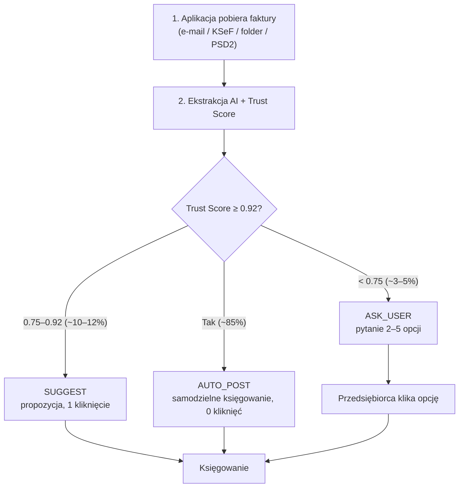
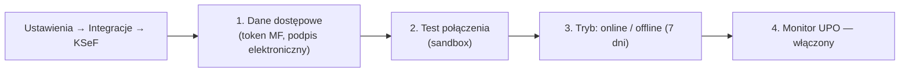

# 👤 NexusAI JDG — Podręcznik Użytkownika

> **Dokument:** PODRECZNIK_UZYTKOWNIKA.md | **Audytorium:** przedsiębiorca, księgowa, doradca, administrator
> **Cel:** Samowystarczalne instrukcje „krok po kroku" — od pierwszego uruchomienia przez codzienną pracę po konfigurację integracji.

---

## 🔎 Wyszukiwarka (Ctrl+F)

`podręcznik` · `użytkownik` · `user guide` · `pierwsze uruchomienie` · `konfiguracja` · `kreator` · `licencja` · `aktywacja` · `rola` · `role` · `RBAC` · `właściciel` · `właściciel` · `księgowa` · `doradca` · `administrator` · `workflow` · `AUTO_POST` · `ASK_USER` · `SUGGEST` · `faktura` · `faktury` · `centrum decyzji` · `decyzja` · `historia` · `raport` · `eksport` · `druk` · `stawki VAT` · `plan kont` · `polityka rachunkowości` · `integracja` · `KSeF` · `GUS` · `NBP` · `aktualizacja` · `update`

---

## 1. Wartość biznesowa (PWE)

| | |
|---|---|
| **P — Problem** | Użytkownik nie wie, jak zacząć, co kliknąć przy pierwszej fakturze i jak skonfigurować KSeF/GUS/NBP. |
| **W — Wartość** | Ten podręcznik prowadzi za rękę: konfiguracja wstępna, role, codzienny przepływ pracy, centrum decyzji, raporty. |
| **E — Efekt** | Pierwsza automatycznie zaksięgowana faktura w 15 minut; ~85% transakcji bez klikania. |

---

## 2. Pierwsze uruchomienie
Kreator konfiguracji i aktywacja licencji — od zera do pierwszej decyzji.

### 2.1. Kreator konfiguracji (Configuration Wizard)

Po zalogowaniu uruchom **Kreator konfiguracji** (menu: *Ustawienia → Kreator*). Wypełnij kolejno:

| Krok | Co podajesz | Dlaczego ważne |
|---|---|---|
| 1. Dane firmy | NIP, nazwa, adres, data rozpoczęcia JDG | Identyfikacja w CEIDG/GUS, walidacja Białej Listy |
| 2. Forma opodatkowania | Skala / liniowy / ryczałt / karta podatkowa | `pit_form` steruje regułami PIT (PASS 5) |
| 3. Status VAT | VAT-owiec / zwolniony / czynny | `vat_status` + ewentualne limity (Art. 113) |
| 4. Forma księgowości | PKPiR / pełna księgowość (UoR) | Automatyczna decyzja wg progu 2 000 000 EUR |
| 5. ZUS | Ulga na start, preferencyjny, Mały ZUS Plus | `zus_social_base_type` dla składek |
| 6. Integracje | KSeF, e-Doręczenia, konto bankowe (PSD2) | Krok 7 tego podręcznika |
| 7. Podsumowanie | Weryfikacja danych | Generowanie werdyktu konfiguracyjnego |

### 2.2. Aktywacja licencji

| Typ licencji | Zakres | Aktywacja |
|---|---|---|
| **Trial** | 30 dni, pełne funkcje | E-mail → link aktywacyjny |
| **Standard** | JDG + KSeF + JPK + deklaracje | Klucz licencyjny w panelu |
| **Pro (doradca)** | + symulacje KKS, optymalizacja S1–S24 | Klucz + uprawnienie `simulate` |
| **Enterprise (biuro)** | + wiele tenantów, RBAC, API | Umowa + klucz API |

> Po aktywacji uruchom **test połączeń**: *Ustawienia → Diagnostyka* (sprawdza KSeF, GUS, NBP, Białą Listę). Zielony status = system gotowy.

---

## 3. Role użytkowników (RBAC)

| Rola | Uprawnienia | Typowe zadania |
|---|---|---|
| **Właściciel** | Wszystko: konfiguracja, decyzje, integracje, użytkownicy | Zmiana formy opodatkowania, akceptacja ASK_USER, zarządzanie licencją |
| **Księgowa** | Księgowanie, korekty, raporty, centrum decyzji (bez zmiany polityki) | Weryfikacja SUGGEST, korekty, eksport JPK |
| **Doradca** | Odczyt + symulacje (`simulate`), analizy, obrona przed KAS | Analiza „co jeśli", szacowanie kar KKS, strategia |
| **Administrator** | Techniczne: integracje, aktualizacje, klucze API, logi | Wdrażanie bundle, klucze dostępu |
| **Audytor** (read-only) | `GET /jdg/audit/*`, raporty | Weryfikacja historycznych decyzji |

> 🔎 **Role systemowe vs funkcjonalne:** powyższe to role **funkcjonalne** (persony). Role **systemowe** RBAC w silniku (`rules/v3_p63_rbac_multitenant_closure.rego`, P63-I01) to 4 role: **entrepreneur / accountant / auditor / admin** — mapowanie: Właściciel→`entrepreneur`, Księgowa→`accountant`, Audytor→`auditor`, Administrator→`admin`. Rola **Doradca** to poziom licencji **Pro** (uprawnienie `simulate`), nie osobna rola RBAC. Brak roli = BLOCK (fail-closed).

**Mapowanie na token JWT:** `tenant_id`, `tenant_type` oraz uprawnienia `decide` / `simulate` / `audit` — zobacz [API_REFERENCJA.md §2.2](API_REFERENCJA.md).

---

## 4. Workflow — codzienna praca
Cztery kroki dnia: pobranie faktur → AUTO_POST → ASK_USER → jedna decyzja przedsiębiorcy.

### 4.1. Przepływ krok po kroku

### 4.2. Szczegóły codziennego workflow

**Krok 1 — Pobieranie faktur.** Aplikacja pobiera faktury z trzech kanałów:

| Kanał | Konfiguracja | Uwagi |
|---|---|---|
| **E-mail** | Podaj skrzynkę (IMAP) w *Integracje → E-mail* | Załączniki PDF/XML; rozpoznawanie szablonów |
| **KSeF** | Aktywne konto KSeF (obowiązek od 2026-02-01) | Faktury wystawione na NIP firmy |
| **Folder / upload** | Skopiuj pliki do folderu lub przeciągnij w aplikacji | Faktury papierowe → skan + OCR |

**Krok 2 — Ekstrakcja AI.** Pięć agentów ekstrahuje: numer, daty, kwoty, stawki VAT, kontrahenta, PKD. **Weryfikacja 4-Eyes** (dwa niezależne przeliczenia) ustala **Trust Score**.

**Krok 3 — Decyzja systemu** (AUTO_POST / SUGGEST / ASK_USER) — patrz tabela poniżej.

| Tryb | Co robisz | Ile kliknięć |
|---|---|---|
| **AUTO_POST** | Nic — system księguje, wysyła do KSeF i uzupełnia JPK | 0 |
| **SUGGEST** | Zatwierdzasz propozycję (przycisk „Zaksięguj") | 1 |
| **ASK_USER** | Odpowiadasz na pytanie w Centrum decyzji (2–5 opcji) | 2–3 |

**Krok 4 — Zapis i raport.** Każda decyzja trafia do niezmiennego logu (`jdg_verdict_audit`) z podstawą prawną — dostępna w *Historia decyzji*.

### 4.3. Przykład: faktura kosztowa z niejasną stawką

1. Faktura za „usługi doradcze" — agent nie jest pewien kodu PKD (`confidence = 0.70`).
2. Trust Score < 0.75 → **ASK_USER**.
3. Centrum decyzji pokazuje: *„Czy ta usługa to doradztwo podatkowe (zwolnione) czy marketing (23% VAT)?"* — 3 opcje.
4. Klikasz właściwą → system księguje z poprawną stawką i zapisuje decyzję w historii.

---

## 5. Centrum decyzji

**Gdzie:** menu *Centrum decyzji* (ikona 💬 z licznikiem oczekujących).

### 5.1. Jak odpowiadać na pytania

| Element UI | Znaczenie |
|---|---|
| **Pytanie** | Sformułowane w języku naturalnym (LLM Bridge) + podstawa prawna (`_legal_basis`) |
| **Opcje (2–5)** | Rekomendowane odpowiedzi; najlepsza oznaczona „rekomendowane" |
| **Wyjaśnienie** | Link „Dlaczego pytamy?" → krótkie uzasadnienie (provenance) |
| **Odłóż na później** | Pytanie wraca jutro (lub po zmianie kontekstu) |

### 5.2. Historia decyzji

| Filtr | Przykład |
|---|---|
| Zakres dat | 2026-01-01 – 2026-07-31 |
| Tryb | AUTO_POST / SUGGEST / ASK_USER |
| Status | zaksięgowane / oczekujące / odrzucone |
| Kontrahent / faktura | FV/2026/07/001 |

Każda pozycja historii pokazuje: werdykt (stawki, forma), podstawę prawną, drzewo proweniencji („pokaż szczegóły"), czas ewaluacji. Eksport do CSV/PDF dostępny.

---

## 6. Raporty
Przeglądanie, eksport i drukowanie — analityka i podatki.

### 6.1. Dostępne raporty

| Raport | Zawartość | Eksport |
|---|---|---|
| **Księgowania** | Lista zaksięgowanych dokumentów wg okresu, kanału, trybu | CSV, XLSX, PDF |
| **Podatki** | VAT należny/naliczony, zaliczki PIT, składki ZUS | CSV, XLSX |
| **Analityka** | Przychody/koszty wg kategorii, marża, prognoza podatkowa (S8) | PDF, wykresy |
| **Decyzje** | Oczekujące (ASK_USER) + historia | CSV, PDF |
| **Środki trwałe** | Przyjęcie, amortyzacja, likwidacja (KŚT) | CSV, XLSX |
| **Zgodność** | Pokrycie obowiązków, terminy, ryzyka (symulacje) | PDF |

### 6.2. Operacje na raportach

- **Przeglądanie:** filtry + wyszukiwarka pełnotekstowa.
- **Eksport:** wybierz format → plik pobierany na urządzenie.
- **Drukowanie:** PDF z nagłówkiem firmy, nadaje się do archiwum.
- **Automatyzacja:** raporty cykliczne (np. co miesiąc, e-mail) — *Ustawienia → Raporty cykliczne*.

---

## 7. Konfiguracja
Stawki VAT i progi, plan kont (PKPiR/UoR) oraz polityka rachunkowości.

### 7.1. Stawki VAT i progi

| Ustawienie | Domyślnie | Gdzie zmienić |
|---|---|---|
| Stawki (23/8/5/0/ZW) | wg `data.thresholds.jdg.*` | *Ustawienia → Podatki* (zmiana = nowy wiersz z datą obowiązywania!) |
| Limit zwolnienia Art. 113 | 200 000 zł | automatycznie z RuleStore |
| MPP (split payment) | próg 15 000 zł | automatycznie z RuleStore |
| Kody GTU | auto-przypisanie | *Ustawienia → GTU* |

> **Ważne:** zmiana stawki nie nadpisuje historii — nowa wartość obowiązuje od wskazanej daty (temporalność). Faktury sprzed zmiany rozliczane są starą stawką.

### 7.2. Plan kont (PKPiR / UoR)

| Forma | Konfiguracja |
|---|---|
| **PKPiR** | Mapowanie kolumn 1–17 (przychody/koszty/NKUP) — *Ustawienia → PKPiR* |
| **UoR** | Wykaz kont (syntetyka/analityka) — *Ustawienia → Plan kont*; wsparcie importu z biura rachunkowego |

### 7.3. Polityka rachunkowości

*Ustawienia → Polityka rachunkowości*: metoda kasowa/memoriałowa, zasady wyceny, inwentaryzacja, momenty przychodów. Wybory wpływają na pakiety `rules/uor/*` i `rules/accounting/*`.

---

## 8. Integracje — jak skonfigurować
KSeF, GUS, NBP i pozostałe — poświadczenia, test połączeń, typowe błędy.

### 8.1. KSeF (Krajowy System e-Faktur)

| Ustawienie | Opis |
|---|---|
| Tryb wysyłki | Online (natychmiast) / offline (kolejka + retry) |
| Sandbox | Testowanie bez skutków prawnych (`ksef_sandbox_harness`) |
| Monitor UPO | Automatyczne śledzenie potwierdzeń i alerty przy braku |
| Firewall | Blokada wysyłki przy wykryciu ryzyka (np. zły NIP) |

### 8.2. GUS (rejestry REGON/PKD)

- **Cel:** weryfikacja kontrahentów, statusów CEIDG, kodów PKD.
- **Konfiguracja:** *Ustawienia → Integracje → GUS* → klucz API BDL + uprawnienia do rejestru.
- **Użycie:** każda nowa faktura weryfikuje NIP/kontrahenta; rozbieżności → `TRIAGE_QUEUE`.

### 8.3. NBP (kursy walut)

| Ustawienie | Opis |
|---|---|
| Źródło | API NBP (Tabela A) — automatyczne |
| Cache | Kursy cache'owane (Redis), odświeżanie dzienne |
| Kursy historyczne | Wykorzystywane do transakcji wstecznych (WNT, import) |
| Fallback | Jeśli NBP offline → werdykt 503 `nbp_rate_available: false` |

### 8.4. Pozostałe integracje

| Integracja | Cel | Gdzie |
|---|---|---|
| **Biała Lista MF** | Status rachunku VAT kontrahenta | *Integracje → MF* |
| **e-Doręczenia / ePUAP** | Korespondencja z urzędami | `rules/edelivery_gateway_enterprise.rego` |
| **ISAP** | Monitor zmian prawa (automatyczny) | *Integracje → ISAP* (codzienny crawl) |
| **Bankowość (PSD2/PolishAPI)** | Automatyczne pobieranie wyciągów, płatności | *Integracje → Bank* (AIS/PIS) |
| **Księgowi zewnętrzni** | API + eksport JPK | *Integracje → API* |

---

## 9. Aktualizacje
Automatyczne, ręczne i rollback — jak bezpiecznie aktualizować silnik i reguły.

### 9.1. Aktualizacje automatyczne

| Co | Jak | Częstotliwość |
|---|---|---|
| **Reguły prawne (bundle)** | Automatyczne pobranie nowego bundle OPA z repo + wdrożenie `curl PUT /v1/bundles/jdg` | Po każdej zmianie prawa (ISAP monitor) |
| **Progi i stawki** | DuckDB `jdg_tax_thresholds` + hot-reload OPA Data API | Natychmiast po zmianie |
| **Zmiany aktów prawnych** | `isap_crawler` wykrywa nowelizację → Issue + analiza wpływu | Codziennie |
| **Aplikacja** | Release notes w panelu; aktualizacja automatyczna w nocy | Co wydanie |

### 9.2. Aktualizacje ręczne

1. *Ustawienia → Aktualizacje → Sprawdź dostępne.*
2. Podgląd zmian (wersja bundle, zmienione reguły, wpływ na decyzje).
3. **Wdrażaj** — system: pobiera bundle → waliduje (`opa check`) → wdraża → przebudowuje cache.
4. Weryfikacja: uruchom test decyzyjny (*Diagnostyka → Werdykt testowy*).

### 9.3. Rollback

Każdy bundle ma wersję (`bundle_version` w audycie). W przypadku regresji: *Aktualizacje → Historia → Wróć do vX.Y* — stare werdykty pozostają nienaruszone (time-travel).

---

## 10. Checklista gotowości (first-run)

- [ ] Kreator konfiguracji wypełniony (forma PIT, VAT, ZUS, księgowość)
- [ ] Licencja aktywowana
- [ ] Diagnostyka: KSeF ✅ GUS ✅ NBP ✅ Biała Lista ✅
- [ ] E-mail/folder podpięty do pobierania faktur
- [ ] KSeF w trybie online + monitor UPO
- [ ] Użytkownicy dodani (księgowa, doradca) z właściwymi rolami
- [ ] Testowa faktura → tryb SUGGEST/ASK_USER → akceptacja
- [ ] Pierwszy raport miesięczny wyeksportowany

---

## 11. Rozwiązywanie problemów — szybki start (użytkownik)

> Pełny katalog błędów (14 pozycji) i poradnik debugowania: [LOGIKA_BIZNESOWA.md §5–6](LOGIKA_BIZNESOWA.md). Kody błędów API: [API_REFERENCJA.md §6](API_REFERENCJA.md).

| Objaw | Pierwsza pomoc |
|---|---|
| Faktura utknęła w **TRIAGE_QUEUE** | Uzupełnij brakujące pola faktury (PKD, stawka, kwota) — patrz §4.3; system ponowi ewaluację |
| Błąd **503** `external_degraded` | *Diagnostyka* → status integracji (KSeF/GUS/NBP/Biała Lista); ponow po `retry_after_seconds` |
| Werdykt z „złą stawką VAT" | Sprawdź datę transakcji (temporalność — §7.1) i kod GTU/PKWiU towaru |
| Brak wysyłki do **KSeF** | *Integracje → KSeF* → test połączenia; faktura leży w kolejce offline (7 dni) z automatycznym retry |
| Pytanie **ASK_USER** nie znika | Odpowiedz w Centrum decyzji (§5.1) albo wybierz „Odłóż na później" |
| Złe księgowanie | Korekta: *Historia decyzji* → wybierz dokument → *Koryguj* (§5.2); pełny ślad zostaje w audycie |
| Nie masz dostępu do funkcji | Sprawdź rolę (§3) — np. symulacje wymagają roli Doradca (licencja Pro) |

---

## 12. Status certyfikacji — co musisz wiedzieć (2026-09-19)

> Synonimy: `certyfikat`, `kampania v3`, `P68`, `NOT_CERTIFIED`.

| Co | Status | Co to znaczy dla Ciebie |
|---|---|---|
| **Certyfikat fortecy reguł (repo)** | 🟢 WYDANY | logika decyzyjna jest domknięta 69/69 częściami kampanii V3, z dowodami z pomiaru (nie deklaracji) |
| **Certyfikat produkcyjny** | 🔴 NOT_CERTIFIED | środowisko produkcyjne wymaga jeszcze pętli kwartalnej i telemetrii (fala V4-F4) — traktuj wersję repo jako źródło prawdy reguł, nie jako potwierdzenie produkcji |
| **Podstawy prawne** | OZNACZONE | każda reguła ma `_legal_basis`; weryfikacja online w ISAP w fali V4-F1 — przed kontrolą KAS skonsultuj z doradcą podatkowym |
| **Odnowienie certyfikatu** | ≤90 dni / nowa epoka prawna / krytyczny deploy | forteca ponownie przechodzi hard gates i scoreboard (procedura: [KAMPANIA_V3_PROMPTY_P00_P68.md](KAMPANIA_V3_PROMPTY_P00_P68.md)) |

Pełny raport końcowy: `raporty_glm52_v3/RAPORT_V3_P68_RECERTYFIKACJA_FINALNA.txt`.

---

*Spójny z: README.md (glosariusz) · API_REFERENCJA.md (role JWT) · ZGODNOSC_PRAWNA.md (KSeF/JPK) · ARCHITEKTURA.md (kontenery)*
