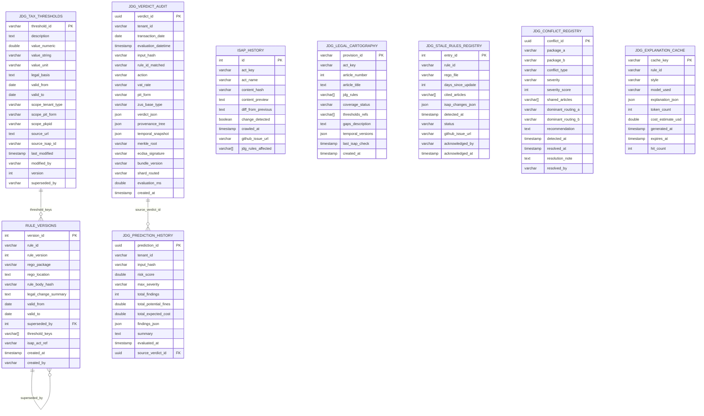
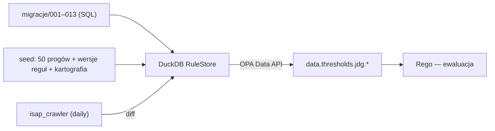

# 📁 NexusAI JDG — Struktura Projektu, Konwencje i Model Danych

> **Status:** ENTERPRISE v8.0 | **Dokument:** STRUKTURA_PROJEKTU.md | **Zakres:** `JDG/` + `policies/`
> **Cel:** Samowystarczalny przewodnik po plikach, konwencjach nazewniczych, bazie danych DuckDB (ERD, tabele, indeksy, zapytania) oraz strategii migracji i seedowania.

---

## 🔎 Wyszukiwarka (Ctrl+F)

`struktura` · `katalog` · `folder` · `drzewo` · `tree` · `konwencja` · `nazewnictwo` · `naming` · `rule_id` · `ERD` · `encja` · `tabela` · `kolumna` · `indeks` · `zapytanie` · `SQL` · `migracja` · `migration` · `seed` · `DuckDB` · `RuleStore` · `tabela 1` … `tabela 9`

---

## 1. Wartość biznesowa (PWE)

| | |
|---|---|
| **P — Problem** | Nowy developer nie wie, gdzie szukać reguły o podatku PCC, jak nazwać nowy plik Rego ani które tabele przechowują werdykty. Brak ERD utrudnia raportowanie. |
| **W — Wartość** | Ten dokument jest mapą: każdy katalog, konwencja i tabela opisane z przykładami. `rule_id` mówi, gdzie szukać kodu. |
| **E — Efekt** | Onboarding < 1 dzień, wyszukiwanie reguły metodą „nazwa → plik → linia" w minutę, bezpieczne migracje. |

---

## 2. Drzewo katalogów z przeznaczeniem

```
JDG/                                        ← KATALOG GŁÓWNY MODUŁU
├── README.md                               Strona główna + glosariusz + C4 Context
├── MANIFEST.md                             Tracker pokrycia reguł (AUTO — generate_manifest.py)
├── COVERAGE_REPORT.md                      Raport pokrycia prawnego (AUTO — generate_coverage_report.py)
├── generate_coverage_report.py             Kopie narzędzi (duplikaty tools/)
├── generate_missing_rules.py
├── unified_plan_v8.yaml                    Plan strategiczny v8 (24 inicjatywy)
├── unified_plan_progress.yaml              Postęp wdrożenia planu
│
├── rules/                                  ★ SERCE — 543 plików Rego w drzewie, 12 111 unikalnych rule_id
│   ├── main_jdg.rego                       Orkiestrator Multi-Pass + Sharded Router (1656 linii)
│   ├── _helpers_jdg.rego                   Helpery: thresholds, FC, MPP
│   ├── _metadata_jdg.rego                  Metadane reguł (severity, remediation, temporalność)
│   ├── risk.rego · routing.rego            PASS 0/1 — ryzyko i routing
│   ├── compliance.rego · kks.rego          PASS 2 — compliance; KKS Art. 54–83
│   ├── vat/                                PASS 4 — substantive, deductions, procedures, place_of_supply
│   ├── pit/                                PASS 5 — forms, kup, advances_returns, exemptions, art21…
│   ├── zus/                                PASS 8 — składki, zasiłki, zdrowotna (immutable)
│   ├── accounting/                         PKPiR, UoR, amortyzacja, leasing, transformer
│   ├── crossborder/                        WNT/WDT, post-Brexit, exit tax, CFC
│   ├── pcc/ · local_taxes/ · mdr/ · kks/ · rodo/ · uor/ · ksef/ · jpk/
│   ├── micro/                              ★ Warstwa atomowa — reguły per artykuł ustawy
│   │   ├── vat/ pit/ zus/ kks/ ord/ pcc/ pkpir/ amortyzacja/ rodo/ aml/ bdo/…
│   │   └── plan33_*.rego · plan34_*.rego   Generowane serie reguł
│   ├── jdg/hyper/                          Hyper Plan45 — deadlines, limits, sanctions, mdr, fx…
│   ├── security/                           security_fortress_v8.rego
│   └── *_enterprise.rego                   Inicjatywy S1–S24 (optimization, ksef_*, banking…)
│
├── tests/                                  Testy (288 pytest + 278 natywnych Rego)
│   ├── test_*.py                           pytest (16 skopiowanych z tests/ + enterprise + audyty ETAP 10–28)
│   ├── auto/test_auto_block_*.py           Automatyczne testy bloków tematycznych (~60 plików)
│   ├── rego/test_native_*.rego             Natywne testy Rego (opa test, w tym test_native_*_etapNN)
│   ├── rego/micro/test_native_micro_*.rego Testy mikro-atomów (27 obszarów)
│   └── jdg_rules_test.rego                 Testy reguł
│
├── tools/                                  ★ 1033 narzędzi Python
│   ├── generate_manifest.py                Manifest → MANIFEST.md
│   ├── validate_rules.py                   〓 9 walidacji jakości
│   ├── lint_rego_rules.py                  Linter 6-check
│   ├── generate_coverage_report.py         Raport pokrycia
│   ├── isap_crawler.py                     Crawler aktów prawnych ISAP
│   ├── llm_bridge.py                       LLM Bridge (C2)
│   ├── kks_*.py · zus_*.py · *_auditor.py  Toolkity domenowe i audytorzy
│   ├── api_doc_generator.py                Generator dokumentacji API
│   ├── self_healing_engine.py · chaos_engineering.py · zero_defect_certification.py
│   └── README.md                           Katalog kategorii (core/legacy/one-shot/analytics)
│
├── bundles/                                OPA Bundle
│   ├── bundle.sh                           Budowa tar.gz z zachowaniem struktury (fix R1)
│   └── manifest.json                       Manifest bundle (reguły kanoniczne + serwis thresholds; liczby wg daty budowy bundle)
│
├── docs/                                   ★ Dokumentacja (ta rodzina plików)
│   ├── ARCHITEKTURA.md · STRUKTURA_PROJEKTU.md (ten) · API_REFERENCJA.md
│   ├── LOGIKA_BIZNESOWA.md · ZGODNOSC_PRAWNA.md · PODRECZNIK_UZYTKOWNIKA.md · FAQ.md
│   ├── DEVELOPER_GUIDE.md · OPA_REGO_DEVELOPER_GUIDE.md · RULE_LIFECYCLE.md
│   ├── LEGAL_COVERAGE.md · LEGAL_REFERENCE_ACTS.md
│   ├── CONTROL_PLANE_RULE_LIFECYCLE.md (ETAP 04) · ORCHESTRATOR_DATA_CONTRACT.md (ETAP 05)
│   ├── CORE_GUARDS_TEMPORAL_THRESHOLDS.md (ETAP 06) · KAMPANIA_GLM52_ETAPY_10_28.md (ETAP 10–28)
│   └── P02_* … P24_*                       Dokumenty inicjatyw (VAT_MACRO_P03, ZUS_MICRO_P08…)
│
├── api/
│   └── openapi.yaml                        ★ Specyfikacja REST API (OpenAPI 3.0.3, 18 endpointów, 13 schematów)
│
└── migrations/                             ★ DuckDB RuleStore
    ├── 001_jdg_rule_store.sql              Tabele 1–5 + seed 50 progów
    ├── 002_jdg_enterprise_v7.sql           Tabele 6–9 (predykcje, stale rules, konflikty, cache)
    ├── 003_jdg_v8_legal_twin.sql           Legal Twin / LKG (ADR-016)
    ├── 004_jdg_v9_control_plane.sql        Control Plane v9
    ├── 005_jdg_v10_legal_sources.sql       Legal Sources v10
    ├── 006_jdg_v11_legal_traceability.sql  Legal Traceability v11
    ├── 007_jdg_v12_control_plane_lifecycle.sql  Control Plane Lifecycle v12
    ├── 008_jdg_v13_orchestrator_contract.sql    Orchestrator Data Contract v13
    ├── 009_jdg_v14_core_guards.sql         Core Guards v14
    ├── 010_jdg_v15_vat_macro.sql           VAT Macro v15
    ├── 011_jdg_v16_vat_micro.sql           VAT Micro v16
    ├── 012_jdg_v17_vat_micro_special.sql   VAT Micro Special v17
    └── 013_jdg_v18_tools_api_rulestore_bundles.sql  Tools/API/RuleStore/Bundles v18
    (razem: 13 migracji 001–013)

policies/                                   ← MIRROR REGUŁ (starsza wersja + eksperymenty)
├── jdg/                                    32 pliki Rego (v2026.07.10)
│   ├── main_jdg.rego                       Multi-Pass (bez shardów, bez 25 pól)
│   ├── vat/ pit/ zus/ kks/ accounting/…    Pakiety domenowe
│   └── bundles/
│       ├── base/manifest.json              Base bundle
│       └── overlays/v2026/ v2027/          Nakładki czasowe (wersjonowanie prawa)
├── tax/                                    VAT (substantive/gtu/deductions/procedures) + CIT + PIT
├── tests/                                  test_native_jdg_*.rego
├── bundle.sh · Makefile                    Budowa bundle, zadania
└── README.md                               Opis pakietów (30-pakietowy plan)
```

---

## 3. Konwencje nazewnicze
Rule ID (ADR-008), nazwy plików Rego, priorytety numeryczne, pakiety, kolumny SQL i endpointy — jedna konwencja w całym projekcie.


### 3.1. Rule ID (ADR-008)

```
jdg.<domena>.<kategoria>_<szczegół>
```

| Przykład | Domena | Znaczenie |
|---|---|---|
| `jdg.vat.substantive.fuel_pl` | VAT | Stawka paliwa krajowego |
| `jdg.pit.forms.scale` | PIT | Skala podatkowa |
| `jdg.zus.health_scale_rate` | ZUS | Składka zdrowotna skala |
| `jdg.kks.empty_invoice_art62` | KKS | Pusta faktura Art. 62 |
| `jdg.business.suspension_zus` | Business | Zawieszenie — ZUS |

### 3.2. Pliki Rego

| Wzorzec | Przykład | Przeznaczenie |
|---|---|---|
| `main_*.rego` | `main_jdg.rego` | Orkiestrator |
| `_helpers_*.rego` | `_helpers_jdg.rego` | Helpery (thresholds, MPP) |
| `_metadata_*.rego` | `_metadata_jdg.rego` | Metadane reguł |
| `<domena>.rego` | `kks.rego` | Pakiet domenowy główny |
| `<domena>/<podkategoria>.rego` | `vat/substantive.rego` | Podkategoria |
| `<kategoria>_enterprise.rego` | `ksef_resilience_enterprise.rego` | Inicjatywy Enterprise S1–S24 |
| `planNN_*.rego` | `plan42_detailed.rego` | Serie planistyczne (plan 23–45) |
| `pNN_*_innovations_v8/v9.rego` | `p03_vat_macro_innovations_v9.rego` | Innowacje fazowe v8/v9 |
| `micro/<domena>/<domena>.rego` | `micro/vat/vat.rego` | Reguły atomowe per artykuł |
| `*_v8.rego` / `*_v9.rego` | `security_fortress_v8.rego` | Wersjonowanie pliku |

### 3.3. Priorytety numeryczne (zakresy)

| Domena | Zakres priority | | Domena | Zakres priority |
|---|---|---:|---|---|---:|
| UoR | 100001–100743 | | Akcyza | 250001–250143 |
| PCC | 200001–200343 | | Amortyzacja | 300001–300054 |
| MDR | 350001–350062 | | Exit Tax/CFC/WHT | 360001–360044 |

### 3.4. Pakiety Rego

Format pakietu: `package jdg.<domena>[.<podkategoria>]` — np. `jdg.vat.substantive`, `jdg.zus.sickness_benefits`, `jdg.security.fortress`. Nazwy pakietów odpowiadają ścieżkom plików (mapowanie 1:1).

### 3.5. Tabele i kolumny (SQL)

- Nazwy tabel: `snake_case`, prefiks domeny (`jdg_*`) lub logiki (`rule_*`).
- Kolumny: `snake_case`, typ w nazwie tylko dla specyficznych pól (`value_numeric`, `value_string`).
- Klucze: `*_id` PRIMARY KEY, referencje `*_id` FOREIGN KEY (np. `source_verdict_id`).
- Wersjonowanie: `valid_from`/`valid_to` (NULL = aktualne), `superseded_by`, `version`.

### 3.6. Endpointy API

- Prefiks wersji `/v1`, domena `/jdg/*`.
- Rzeczowniki: `/jdg/decide`, `/jdg/simulate`, `/jdg/audit/{verdict_id}`, `/jdg/rules/{rule_id}`.
- Zasoby monitoringu: `/jdg/health`, `/jdg/manifest`, `/jdg/coverage`, `/jdg/legal-coverage`, `/jdg/thresholds`.

---

## 4. Model danych — ERD



---

## 5. Opis tabel — pola, typy, ograniczenia, indeksy, zapytania

> **Silnik:** DuckDB. **Ładowanie do Rego:** DuckDB → OPA Data API → `data.thresholds.jdg.*`.

### Tabela 1: `jdg_tax_thresholds` — progi, stawki i limity (B2)

| Kolumna | Typ | Ograniczenia | Opis |
|---|---|---|---|
| `threshold_id` | VARCHAR | PK | np. `vat_receipt_450_limit`, `P189.bad_debt_days` |
| `description` | TEXT | NOT NULL | Opis progu |
| `value_numeric` | DOUBLE | — | Wartość (PLN, EUR, dni, %) |
| `value_string` | VARCHAR | — | Wartość nie-numeryczna (`ZW`, `2026-02-01`) |
| `value_unit` | VARCHAR | — | `PLN`, `EUR`, `DAYS`, `PERCENT`, `DATE` |
| `legal_basis` | TEXT | — | Podstawa prawna |
| `valid_from` | DATE | NOT NULL | Początek obowiązywania |
| `valid_to` | DATE | NULL = aktualny | Koniec obowiązywania |
| `scope_tenant_type` | VARCHAR | — | `jdg`, `cit`, `all` |
| `scope_pit_form` | VARCHAR | — | `SCALE`, `LINEAR`, `LUMP_SUM`, `TAX_CARD` |
| `scope_pkpid` | VARCHAR | — | PKD (np. `62.01.Z`) |
| `source_url` / `source_isap_id` | TEXT/VARCHAR | — | Pochodzenie (ISAP/RCL) |
| `version` / `superseded_by` | INT/VARCHAR | — | Wersjonowanie |

**Indeksy:** `idx_thresholds_lookup (threshold_id, valid_from, valid_to)`, `idx_thresholds_active (threshold_id) WHERE valid_to IS NULL`, `idx_thresholds_scope (scope_tenant_type, scope_pit_form, scope_pkpid)`.

**Przykładowe zapytania:**
```sql
-- Aktywna stawka VAT podstawowa
SELECT value_numeric FROM jdg_tax_thresholds
WHERE threshold_id = 'vat_standard_rate' AND valid_to IS NULL;

-- Próg obowiązujący dla transakcji 2025-06-15 (time-travel)
SELECT * FROM jdg_tax_thresholds
WHERE threshold_id = 'vat_bad_debt_days'
  AND valid_from <= '2025-06-15'
  AND (valid_to IS NULL OR valid_to >= '2025-06-15');

-- Wszystkie progi ZUS dla formy SCALE
SELECT threshold_id, value_numeric, value_unit
FROM jdg_tax_thresholds
WHERE scope_tenant_type = 'jdg'
  AND (scope_pit_form = 'SCALE' OR scope_pit_form IS NULL)
  AND valid_to IS NULL
ORDER BY threshold_id;
```

**Seed:** 50 progów (VAT, PIT, ZUS/SUS, ryczałt, OrdPU, KKS, amortyzacja, KSeF, CEIDG, podatki lokalne, CFC) — pełna lista w `migrations/001_jdg_rule_store.sql`.

### Tabela 2: `rule_versions` — rejestr wersji reguł (A2)

| Kolumna | Typ | Ograniczenia | Opis |
|---|---|---|---|
| `version_id` | INTEGER | PK (sequence) | ID wersji |
| `rule_id` | VARCHAR | NOT NULL | np. `P189` |
| `rule_version` | INTEGER | NOT NULL, UNIQUE(rule_id, rule_version) | Numer wersji |
| `rego_package` / `rego_location` | VARCHAR/TEXT | NOT NULL | np. `jdg.vat` / `JDG/rules/vat/substantive.rego:195` |
| `rule_body_hash` | VARCHAR | NOT NULL | SHA-256 treści |
| `legal_change_summary` | TEXT | — | np. „SLIM VAT 3/2025: 150→90 dni" |
| `valid_from` / `valid_to` | DATE | NOT NULL / NULL=aktualny | Okno obowiązywania |
| `superseded_by` | INTEGER | FK → rule_versions | Która wersja zastąpiła |
| `threshold_keys` | VARCHAR[] | — | Powiązane progi |
| `isap_act_ref` | VARCHAR | — | Referencja ISAP |

**Indeksy:** `idx_rule_versions_active (rule_id, valid_from, valid_to) WHERE valid_to IS NULL`, `idx_rule_versions_date`, `idx_rule_versions_package`.

```sql
-- Odtwórz stan prawny dla transakcji z 2024 r. (przed SLIM VAT 3)
SELECT rule_id, rule_version, legal_change_summary
FROM rule_versions
WHERE rule_id = 'P189'
  AND valid_from <= '2024-06-01'
  AND (valid_to IS NULL OR valid_to >= '2024-06-01');
```

### Tabela 3: `jdg_verdict_audit` — niezmienny log werdyktów (A1)

| Kolumna | Typ | Opis |
|---|---|---|
| `verdict_id` | UUID PK | ID werdyktu |
| `tenant_id` | VARCHAR NOT NULL | Klient JDG |
| `transaction_date` | DATE NOT NULL | Data transakcji |
| `input_hash` | VARCHAR NOT NULL | SHA-256 input JSON |
| `rule_id_matched` / `action` | VARCHAR | Reguła i decyzja (`BLOCK_AND_ALERT`/`TRIAGE_QUEUE`/`ALLOW`) |
| `vat_rate`, `pit_form`, `zus_base_type` | VARCHAR | Kluczowe pola werdyktu |
| `verdict_json` | JSON NOT NULL | Pełny werdykt |
| `provenance_tree` / `temporal_snapshot` | JSON | A1/A2 ślady |
| `merkle_root` / `ecdsa_signature` | VARCHAR | Dowód kryptograficzny |
| `bundle_version` / `shard_routed` | VARCHAR | Wersja bundle i shard |
| `evaluation_ms` | DOUBLE | Latencja |

**Indeksy:** `idx_verdict_tenant_date (tenant_id, transaction_date)`, `idx_verdict_created`.

```sql
-- Wszystkie decyzje klienta za rok 2025
SELECT verdict_id, transaction_date, rule_id_matched, action, evaluation_ms
FROM jdg_verdict_audit
WHERE tenant_id = 'tnt_abc123'
  AND transaction_date BETWEEN '2025-01-01' AND '2025-12-31'
ORDER BY transaction_date;
```

### Tabela 4: `isap_history` — historia crawlowania ISAP (C3)

`id` PK, `act_key` (np. `I_vat`), `act_name`, `content_hash` (SHA-256), `content_preview`, `diff_from_previous`, `change_detected` (BOOLEAN), `crawled_at`, `github_issue_url`, `jdg_rules_affected` (VARCHAR[]). Indeks: `idx_isap_history_act (act_key, crawled_at)`.

```sql
-- Wykryte zmiany prawa w ostatnich 30 dniach
SELECT act_key, crawled_at, github_issue_url
FROM isap_history
WHERE change_detected = TRUE
  AND crawled_at >= CURRENT_DATE - INTERVAL 30 DAY;
```

### Tabela 5: `jdg_legal_cartography` — ontologia prawna (A3)

`provision_id` PK (np. `lex:VAT:Art113`), `act_key`, `article_number`, `article_title`, `jdg_rules` (VARCHAR[]), `coverage_status` (`COMPLETE`/`PARTIAL`/`PLANNED`/`MISSING`), `thresholds_refs`, `gaps_description`, `temporal_versions` (JSON), `last_isap_check`.

```sql
-- Luki w pokryciu prawa
SELECT provision_id, act_key, article_title, gaps_description
FROM jdg_legal_cartography
WHERE coverage_status != 'COMPLETE';
```

### Tabela 6: `jdg_prediction_history` — historia symulacji (C1)

`prediction_id` UUID PK, `tenant_id`, `input_hash`, `risk_score` (0–100), `max_severity` (`LOW/MEDIUM/HIGH/CRITICAL`), `total_findings`, `total_potential_fines`, `total_expected_cost`, `findings_json`, `summary`, `evaluated_at`, `source_verdict_id` FK → `jdg_verdict_audit`. Indeksy: `idx_prediction_tenant`, `idx_prediction_severity`.

```sql
-- Najnowsze symulacje wysokiego ryzyka
SELECT tenant_id, risk_score, total_potential_fines, evaluated_at
FROM jdg_prediction_history
WHERE max_severity IN ('HIGH', 'CRITICAL')
ORDER BY evaluated_at DESC
LIMIT 20;
```

### Tabela 7: `jdg_stale_rules_registry` — martwe/nieaktualne reguły

`entry_id` PK, `rule_id`, `rego_file`, `days_since_update`, `cited_articles` (VARCHAR[]), `isap_changes_json`, `detected_at`, `status` (`PENDING`/`ACKNOWLEDGED`/`FIXED`/`FALSE_POSITIVE`), `github_issue_url`, `acknowledged_by/at`. Indeks: `idx_stale_rules_status`.

```sql
-- Reguły wymagające przeglądu
SELECT rule_id, rego_file, days_since_update
FROM jdg_stale_rules_registry
WHERE status = 'PENDING'
ORDER BY days_since_update DESC;
```

### Tabela 8: `jdg_conflict_registry` — log konfliktów między pakietami

`conflict_id` UUID PK, `package_a`/`package_b`, `conflict_type`, `severity` (`CRITICAL`…`LOW`), `severity_score`, `shared_articles` (VARCHAR[]), `dominant_routing_a/b`, `recommendation`, `detected_at`/`resolved_at`, `resolution_note`, `resolved_by`. Indeks: `idx_conflict_severity`.

### Tabela 9: `jdg_explanation_cache` — cache wyjaśnień LLM (C2)

`cache_key` PK (SHA-256(rule_id+style+model)), `rule_id`, `style` (`advisor`/`compliance`/`educational`/`executive`/`eli5`), `model_used`, `explanation_json`, `token_count`, `cost_estimate_usd`, `generated_at`, `expires_at` (TTL 30 dni), `hit_count`. Indeks: `idx_explanation_rule (rule_id, style)`.

```sql
-- Cache hit rate
SELECT rule_id, style, hit_count, expires_at
FROM jdg_explanation_cache
ORDER BY hit_count DESC
LIMIT 10;
```

### Tabele 10+: warstwy v8.2–v8.3 (migracje 003–013)

| Tabela | Migracja | Przeznaczenie | Kluczowe kolumny |
|---|---|---|---|
| `legal_graph` | 003 | Legal Twin / Legal Knowledge Graph (ADR-016) | `node_id`, `act`, `article`, `paragraph`, `point`, `valid_from`, `valid_to`, `content_hash` |
| `golden_verdicts` | 003 | Golden Oracle — złote werdykty do ewaluacji różnicowej (ADR-018) | `verdict_id`, `decision_hash`, `input_snapshot`, `bundle_version`, `rule_version` |
| `decision_certificates` | 003 | Decision Certificate F4 (ADR-019) | `verdict_id`, `certainty_class`, `seal`, `merkle_proof`, `export_format` |
| `draft_law_radar` | 003 | Law Radar — projekty ustaw (ADR-020) | `amendment_id`, `source` (RCL/Sejm/Senat), `effective_date`, `lead_time_days`, `shadow_rules[]` |
| `control_plane_*` | 004, 007 | Control Plane — żądania, review, rollout, audit (ADR-021) | `change_id`, `operation`, `state` (PENDING_REVIEW…ACTIVE), `signature`, `ticket`, `supersedes` |
| `legal_sources` | 005 | Legal Sources — rejestr źródeł prawnych (ISAP/RCL) | `source_id`, `url`, `act`, `crawl_status`, `last_checked` |
| `legal_traceability` | 006 | Legal Traceability — łańcuch reguła ↔ przepis ↔ werdykt | `rule_id`, `legal_node_id`, `verdict_id`, `direction` |
| `orchestrator_contract` | 008 | Orchestrator Data Contract — kontrakt 25-polowy, provenance | `schema_version`, `field_registry`, `pass_config` |
| `core_guards` | 009 | Core Guards — katalog INV-001..042 + temporal thresholds | `invariant_id`, `level` (RUNTIME/BUILD/STATISTICAL), `severity`, `enforcement` |
| `vat_*` | 010–012 | VAT Macro/Micro/Special — progi, stawki, binding registry, KSeF/marża/proporcja | `article`, `rate`, `valid_from`, `valid_to`, `binding_micro_macro` |
| `tools_api_bundles` | 013 | Narzędzia/API/RuleStore/Bundles — wersjonowanie i integracja | `artifact_id`, `version`, `sha256`, `deployment_state` |

### 5.1. Domeny danych → tabele, endpointy i moduły reguł

> Mapa czterech domen biznesowych z checklisty: gdzie dane powstają, gdzie są przechowywane i jak je pobrać. Synonimy: `księgowania`, `bookings`, `raporty`, `reports`, `decyzje`, `decisions`, `środki trwałe`, `fixed assets`.

| Domena | Tabele (RuleStore) | Endpointy API | Moduły reguł |
|---|---|---|---|
| **Księgowania** (automatyczne / manualne / korekty) | `jdg_verdict_audit` (log werdyktów — tryb AUTO_POST/SUGGEST/ASK_USER w polu `decision_mode`), `rule_versions` (wersja reguły źródłowej) | `POST /jdg/decide` (auto), `POST /jdg/simulate` (manualne/korekty — co-if przed zapisem) | `jdg.accounting` (PKPiR), `rules/uor/*`, tryby pewności CERTAIN/CONDITIONAL/NEEDS_ADVICE |
| **Raporty** (analityka / podatki) | `jdg_tax_thresholds` (progi raportów), `decision_certificates` (podpisane zestawienia F4) | `GET /jdg/manifest`, `GET /jdg/coverage`, `GET /jdg/legal-coverage` (dane analityczne) | `jpk_v7_autogen_enterprise` (JPK_V7M), deklaracje PIT-36/36L/28, VAT-7 |
| **Decyzje** (oczekujące / historia) | `jdg_verdict_audit` (historia, Merkle-proof), `jdg_prediction_history` (symulacje), `jdg_conflict_registry` (konflikty) | `POST /jdg/decide` (ASK_USER → centrum decyzji), `GET /jdg/audit/{id}` (historia), `POST /jdg/explain` (wyjaśnienie) | Sharded Router + `safe_merge` (Application), Decision Certificate `seal` |
| **Środki trwałe** (przyjęcie / amortyzacja) | `jdg_tax_thresholds` (limity: jednorazowa 100k, niskocenne 10k, auto 150k/225k), `legal_graph` (art. 22k–22o) | `POST /jdg/decide` (przyjęcie/OT), `POST /jdg/simulate` (warianty amortyzacji) | `jdg.accounting` amortyzacja, `rules/accounting/*`, R04-INN-02/03 (jednorazowa, niskocenne) |

---

## 6. Strategia migracji i seedowania
Pipeline ładowania danych, katalog migracji 001–013 i zasady seedowania progów z obwieszczeń MF.


### 6.1. Pipeline ładowania danych



### 6.1a. Katalog migracji (001–013)

| Migracja | Zakres | Tabele / funkcje |
|---|---|---|
| `001_jdg_rule_store.sql` | Fundacja RuleStore | tabele 1–5 (`jdg_tax_thresholds`, `rule_versions`, `jdg_verdict_audit`, `isap_history`, `jdg_legal_cartography`) + seed 50 progów |
| `002_jdg_enterprise_v7.sql` | Enterprise v7 | tabele 6–9 (`jdg_prediction_history`, `jdg_stale_rules_registry`, `jdg_conflict_registry`, `jdg_explanation_cache`) |
| `003_jdg_v8_legal_twin.sql` | Legal Twin / LKG (ADR-016) | `legal_graph`, `golden_verdicts`, `decision_certificates`, `draft_law_radar` |
| `004_jdg_v9_control_plane.sql` | Control Plane v9 | rejestr zmian, review, rollout evidence |
| `005_jdg_v10_legal_sources.sql` | Legal Sources v10 | rejestr źródeł prawnych (ISAP/RCL) |
| `006_jdg_v11_legal_traceability.sql` | Legal Traceability v11 | łańcuch reguła ↔ przepis ↔ werdykt |
| `007_jdg_v12_control_plane_lifecycle.sql` | Control Plane Lifecycle v12 | żądania, review, rollout, audit append-only |
| `008_jdg_v13_orchestrator_contract.sql` | Orchestrator Data Contract v13 | kontrakt 25-polowy, provenance |
| `009_jdg_v14_core_guards.sql` | Core Guards v14 | katalog INV-001..042, temporal thresholds |
| `010_jdg_v15_vat_macro.sql` | VAT Macro v15 | progi/stawki VAT, MPP |
| `011_jdg_v16_vat_micro.sql` | VAT Micro v16 | atomy artykułowe, binding registry |
| `012_jdg_v17_vat_micro_special.sql` | VAT Micro Special v17 | KSeF, marża, proporcja, WDT/WNT |
| `013_jdg_v18_tools_api_rulestore_bundles.sql` | Tools/API/RuleStore/Bundles v18 | endpointy, wersjonowanie, integracja bundle |

### 6.2. Zasady migracji

1. **Wersjonowanie plików:** nowa tabela/kolumna → nowy plik `NNN_*.sql` w `migrations/` (obecnie **001–013**). Nie modyfikuj wydanych migracji.
2. **Idempotencja:** każda migracja używa `CREATE TABLE IF NOT EXISTS` / `CREATE INDEX IF NOT EXISTS` — można uruchamiać wielokrotnie.
3. **Seed tylko w migracji:** dane startowe (50 progów, wersje P189/P500/P523, kartografia `lex:VAT:Art113` itd.) zapisane są razem z DDL — powtarzalny stan bazowy.
4. **Temporalność w seedzie:** każdy próg ma `valid_from`/`valid_to`; zmiana prawa = `UPDATE` + nowy wiersz z `superseded_by`, **nie** edycja wiersza historycznego.
5. **Ładunek do OPA:** po migracji uruchom serwis thresholdów, aby OPA Data API wystawiło nowe wartości pod `data.thresholds.jdg.*` (hot-reload bez redeployu bundle).

### 6.3. Procedura zmiany progu (przykład: zmiana stawki)

```sql
-- 1) Zamknij stary próg
UPDATE jdg_tax_thresholds
SET valid_to = '2026-12-31'
WHERE threshold_id = 'vat_standard_rate' AND valid_to IS NULL;

-- 2) Wstaw nowy
INSERT INTO jdg_tax_thresholds
(threshold_id, description, value_numeric, value_unit, legal_basis, valid_from, valid_to, scope_tenant_type, modified_by, version, superseded_by)
SELECT 'vat_standard_rate', 'Stawka podstawowa VAT (nowa)', 0.24, 'PERCENT',
       'Art. 41 ust. 1 VAT (nowela 2027)', '2027-01-01', NULL, 'jdg',
       'system', version + 1, threshold_id
FROM jdg_tax_thresholds
WHERE threshold_id = 'vat_standard_rate' AND valid_to = '2026-12-31';
```

### 6.4. Odporność na błędy

- Migracje uruchamiane w transakcji — niepowodzenie nie zostawia stanu pośredniego.
- `isap_history.change_detected` przechwytuje zmiany prawa i tworzy Issue GitHub z listą pakietów do aktualizacji (`jdg_rules_affected`).
- `jdg_stale_rules_registry` raportuje reguły bez aktualizacji — cykl: PENDING → ACKNOWLEDGED → FIXED.

---

## 7. Ścieżki referencyjne (gdzie co leży)

| Szukasz… | Ścieżka |
|---|---|
| Stawki VAT 23% / 8% / 5% | `migrations/001` (seed) + `rules/vat/substantive.rego` |
| Skala PIT 12%/32% | `rules/pit/forms.rego` + `rules/micro/pit/pit.rego` |
| Składka zdrowotna 9%/4,9% | `rules/zus/health_contribution_enterprise.rego` + `rules/micro/zdrowotna/` |
| Kary KKS | `rules/kks.rego` + `rules/micro/kks/kks.rego` + `tools/kks_*` |
| KSeF | `rules/ksef_jpk.rego` + `rules/ksef_*_enterprise.rego` + `rules/micro/ksef/` |
| JPK_V7 | `rules/jpk_v7_autogen_enterprise.rego` + `rules/micro/jpk/` |
| OPA bundle | `bundles/bundle.sh` + `bundles/manifest.json` |
| OpenAPI | `api/openapi.yaml` |
| Testy reguł | `tests/rego/test_native_*.rego` |
| Testy blokowe | `tests/auto/test_auto_block_*.py` |
| Plan strategiczny | `unified_plan_v8.yaml` |
| Kampania V3 — zbiorczo | [docs/KAMPANIA_V3_PROMPTY_P00_P68.md](KAMPANIA_V3_PROMPTY_P00_P68.md) |

### 9.1. Katalogi kampanii V3 (P00–P68)

| Katalog/plik | Zawartość | Liczba |
|---|---|---:|
| `prompty_v3/` | prompty kampanii V3 (TXT, 1 część = 1 plik) | 70 |
| `raporty_glm52_v3/` | raporty wdrożenia `RAPORT_V3_PNN_*.txt` + handoffy `HANDOFF_V3_PNN.md` | 79 |
| `bundles/v3_*` | bundele dowodowe (bramki, silniki, evidence) + `v3_campaign_ledger.json` | 862 |
| `tools/v3_*` | narzędzia V3: silniki, bramki statyczne, run-all, ledger | 689 |
| `rules/v3_*.rego` | pakiety Rego V3 (kontrakty, domknięcia, P67/P68) | 53 |
| `tests/rego/test_v3_*.rego` | natywne testy Rego V3 (bramka podstawowa) | w drzewie tests/ |

> **Konwencja V3:** każda część = prompt TXT → raport TXT → narzędzia `v3_pNN_*` → bundele dowodowe `v3_pNN_*` → testy natywne + pytest → wpis w ledgerze `v3_campaign_ledger.json`.

---

*Spójny z: README.md · migrations/001–013 · tools/README.md · DEVELOPER_GUIDE.md*
