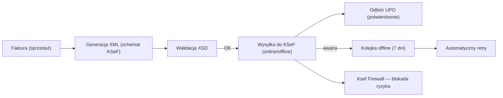
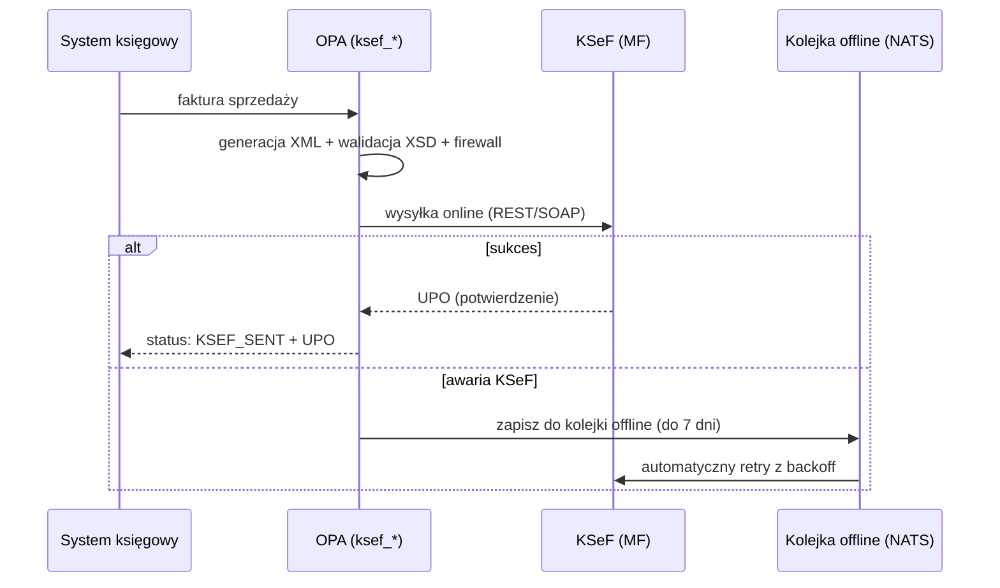
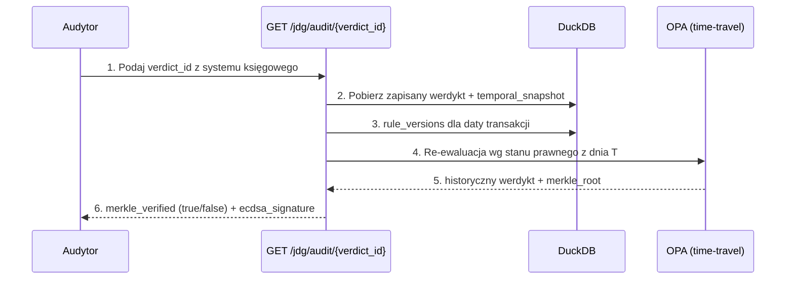

# ⚖️ NexusAI JDG — Zgodność z Przepisami (Compliance)

> **Dokument:** ZGODNOSC_PRAWNA.md | **Pokrycie:** 13 aktów prawnych, 12 111 unikalnych reguł (543 plików Rego w drzewie rules/, MANIFEST regen. 2026-09-19)
> **Cel:** Jak system zapewnia zgodność z przepisami księgowymi i podatkowymi, jak obsługuje KSeF/JPK/deklaracje, jak odtworzyć dowolną decyzję (ścieżka audytu) i jak długo przechowuje dane.

> ⚠️ **Zastrzeżenie:** Ten dokument opisuje funkcje silnika reguł i ich podstawy prawne. Nie stanowi porady prawnej. Ostateczną interpretację przepisów zawsze weryfikuj z doradcą podatkowym.

---

## 🔎 Wyszukiwarka (Ctrl+F)

`zgodność` · `compliance` · `przepisy` · `UoR` · `rachunkowość` · `IFRS` · `GAAP` · `KSeF` · `e-Faktura` · `e-faktura` · `XSD` · `XML` · `JPK` · `VAT-7` · `VAT-7K` · `CIT-8` · `PIT-36` · `PIT-36L` · `deklaracja` · `deklaracje` · `audyt` · `audit trail` · `ścieżka audytu` · `Merkle` · `retencja` · `przechowywanie` · `okresy` · `RODO` · `prawo` · `ustawa` · `akt prawny`

---

## 1. Wartość biznesowa (PWE)

| | |
|---|---|
| **P — Problem** | Przedsiębiorca nie wie, czy system spełnia wymogi KSeF/JPK, jak udowodnić poprawność decyzji sprzed 3 lat i jak długo trzymać dokumenty. |
| **W — Wartość** | Ten rozdział dokumentuje pokrycie ustaw, mechanizmy generowania e-faktur/deklaracji i kryptograficzną ścieżkę audytu. |
| **E — Efekt** | Gotowość na kontrolę KAS: każda decyzja ma podstawę prawną, hash i podpis — bez pracy ręcznej. |

---

## 2. Pokrycie aktów prawnych

| Akt prawny | Status | Kluczowe moduły reguł |
|---|---|---|
| **Ustawa o VAT** | ✅ 99% | `rules/vat/*`, `rules/micro/vat/*`, `rules/vat_substantive_complete_enterprise.rego`, `rules/vat_mpp_split_payment_enterprise.rego` |
| **Ustawa o PIT** | ✅ 98% | `rules/pit/*`, `rules/micro/pit/*`, `rules/pit/art21_exemptions_enterprise.rego` |
| **Ustawa o ZUS/SUS** | ✅ 95% | `rules/zus/*`, `rules/micro/zus/*`, `rules/micro/sus/*`, `rules/micro/zdrowotna/*` |
| **Ordynacja Podatkowa** | ✅ 98% | `rules/micro/ord/*`, `rules/ord/ord_innovations_v8.rego` |
| **KKS** | ✅ 99% | `rules/kks.rego`, `rules/micro/kks/*`, `rules/kks/*` |
| **Ustawa o Rachunkowości (UoR)** | ✅ 95% | `rules/uor/*`, `rules/accounting/uor_enterprise_live.rego`, `rules/micro/uor/*` |
| **Prawo Przedsiębiorców** | ✅ 100% | `rules/business/*`, `rules/micro/ceidg/*`, `rules/pp/*` |
| **Ustawa o PCC** | ✅ 95% | `rules/pcc/*`, `rules/local_taxes/pcc*.rego`, `rules/micro/pcc/*` |
| **Podatki lokalne + Akcyza** | ✅ 90% | `rules/local_taxes/*`, `rules/micro/akcyza/*` |
| **Ustawa o ryczałcie** | ✅ 95% | `rules/micro/ryczalt/*`, `rules/micro/plan33_ryc.rego` |
| **Ustawa o zarządzie sukcesyjnym** | ✅ 100% | `rules/micro/sukcesja/*` |
| **RODO** | ✅ 95% | `rules/rodo_extended.rego`, `rules/micro/rodo/*` |
| **AML + BDO** | ✅ 90% | `rules/compliance/aml_enterprise.rego`, `rules/micro/aml/*`, `rules/environmental/bdo_enterprise.rego`, `rules/micro/bdo/*` |
| **Obwieszczenia MF** (stawki/progi per rok) | ✅ seed RuleStore | `migrations/*rule_store*.sql` (seed z obwieszczeń), `rules/thresholds_jdg.rego` (snapshots wersjonowane), Law Radar (`tools/law_radar.py`) |

> **Źródła i pochodzenie danych prawnych (V3-20):** każdy akt ma wpis w
> [LEGAL_SOURCE_REGISTRY.md](LEGAL_SOURCE_REGISTRY.md) z hashem SHA-256 źródła
> (Dz.U./ISAP); progi roczne pochodzą z obwieszczeń MF (RuleStore seed,
> niezmiennik `seeded_from_official_gazettes` w kontrakcie V3-18) i są
> wersjonowane snapshotami temporalnymi. Ślad reguła↔artykuł: Legal Twin
> ([LEGAL_TWIN_TRACEABILITY.md](LEGAL_TWIN_TRACEABILITY.md)); system dostarcza
> evidence i wersje aktów — nie zastępuje interpretacji doradcy.

---

## 3. Zgodność z przepisami księgowymi (UoR, IFRS, GAAP)
PKPiR, pełna księgowość UoR i relacja do IFRS/GAAP — z mapowaniem na moduły reguł.


### 3.1. PKPiR (podatkowa księga przychodów i rozchodów)

| Wymóg | Implementacja |
|---|---|
| Kolumny 1–17 PKPiR | `rules/micro/pkpir/pkpir_kolumny.rego` + `rules/accounting/pkpir_enterprise_validation.rego` + `rules/accounting/pkpir_enterprise_live.rego` |
| Przychody / koszty | `pkpir_przychody.rego`, `pkpir_koszty.rego` |
| NKUP (nie stanowiące kosztów) | `pkpir_nkup.rego`, `rules/nkup_enterprise_complete.rego` (Art. 23 PIT) |
| Remanent | `pkpir_remanent.rego` |
| Korekty | `pkpir_korekty.rego` |
| Walidacja całości | `pkpir_enterprise_validator.rego` |

### 3.2. UoR (pełna księgowość)

| Wymóg | Implementacja |
|---|---|
| Obowiązek prowadzenia ksiąg (próg 2 000 000 EUR) | `rules/uor/uor_obligation.rego`, `rules/accounting/uor_enterprise_live.rego` |
| Księgi rachunkowe | `rules/uor/uor_books.rego` |
| Przychody i koszty (memoriałowo) | `rules/uor/uor_revenue.rego`, `rules/uor/uor_costs.rego` |
| Aktywa i amortyzacja | `rules/uor/uor_assets.rego`, `rules/accounting/depreciation_enterprise_complete.rego` |
| Zapasy / inwentaryzacja | `rules/uor/uor_inventory.rego` |
| Zamknięcie roku | `rules/uor/uor_closing.rego` |
| Sprawozdanie finansowe | `rules/uor/uor_financial_stmt.rego` |
| Decyzja PKPiR vs UoR | `rules/p09_ksiegowosc_pkpir_uor_innovations_v9.rego` (silnik decyzji) |
| Transformacja PKPiR → UoR | `rules/pkpir_to_uor_transformer.rego` |

### 3.3. IFRS / GAAP

| Standard | Zakres w systemie |
|---|---|
| **IFRS** | UoR polska jest zgodna z dyrektywą 2013/34/UE (baza = IFRS dla sprawozdań jednostkowych). System wspiera dane wejściowe w standardzie polskim (UoR), z regułami wyceny zgodnymi z ustawą — patrz `policies/tax/uor_valuation.rego` (mirror policies) i `rules/uor/uor_financial_stmt.rego`. |
| **GAAP** | Odpowiednikiem lokalnego GAAP jest polska UoR + KSR. Reguły wyceny, inwentaryzacji i sprawozdawczości pokryte w `rules/uor/*`. |

> **Uwaga:** Moduł JDG obsługuje podatkowy wymiar księgowości (PKPiR/UoR). Sprawozdawczość wg pełnych MSSF/IFRS dla jednostek zobowiązanych wymaga modułu korporacyjnego (CIT).

### 3.4. Przykład decyzji księgowej

```json
{
  "matched": true,
  "rule_id": "jdg.pkpir.kolumny.wplata_nr16",
  "vat_rate": "0.23",
  "kus_qualification": "deductible_full",
  "_legal_basis": "Rozporządzenie ws. PKPiR § 4-5",
  "_warnings": []
}
```

---

## 4. KSeF — Krajowy System e-Faktur
Generowanie XML, walidacja XSD, firewall i wysyłka do API KSeF — maszyną stanów w regułach.


### 4.1. Wymogi i progi (z `jdg_tax_thresholds`)

| Threshold | Wartość | Znaczenie |
|---|---|---|
| `ksef_mandatory_from_date` | `2026-02-01` | KSeF obowiązkowy od tej daty |
| `ksef_offline_grace_days` | 7 dni | Okres na przesłanie faktury offline |
| `ksef_sanction_max_pln` | 500 000 zł | Maksymalna sankcja za brak e-faktury |

### 4.2. Pipeline KSeF (od faktury do UPO)



| Krok | Moduł reguł |
|---|---|
| Generacja XML | `rules/ksef_innovations_enterprise.rego`, `rules/micro/ksef/ksef.rego` |
| Walidacja XSD / struktury | `rules/ksef_firewall_enterprise.rego`, `rules/ksef_sandbox_harness_enterprise.rego` |
| Wysyłka online | `rules/ksef_outbox_enterprise.rego` (outbox) |
| Kolejka offline + retry | `rules/ksef_offline_queue_enterprise.rego` |
| Odbiór UPO i śledzenie | `rules/ksef_upo_tracker_enterprise.rego` |
| Odporność na awarie | `rules/ksef_resilience_enterprise.rego` |
| Monitoring sankcji | `rules/ksef_sanction_monitor_enterprise.rego` |
| Paragony / digest | `rules/ksef_receipt_digest_enterprise.rego` |
| Testy sandbox | `rules/ksef_sandbox_harness_enterprise.rego` |

**Przepływ wysyłki:**



---

## 5. JPK — Jednolity Plik Kontrolny

| Struktura | Moduł | Opis |
|---|---|---|
| **JPK_V7M / V7K** (VAT) | `rules/jpk_v7_autogen_enterprise.rego`, `rules/micro/jpk/jpk.rego` | Ewidencje sprzedaży/zakupu + deklaracja VAT-7 |
| **JPK_KR** (księgi rachunkowe) | `rules/jpk_kr_st_generator_enterprise.rego` | Księgi rachunkowe |
| **JPK_ST** (środki trwałe) | `rules/jpk_kr_st_generator_enterprise.rego` | Środki trwałe |
| **JPK_CIT** | `rules/jpk_cit.rego` | Księgi i deklaracja CIT |
| Korekty JPK | `rules/jpk_corrections_workflow_enterprise.rego` | Korekta złożonego JPK |
| Terminy | `rules/jpk/plan26_deadlines.rego`, `rules/micro/plan33_jpk.rego` | Kalendarz terminów |

**Auto-generacja JPK_V7M (S12):**
- Rejestry sprzedaży i zakupu z `GTU` kodów (auto-przypisanie).
- Deklaracja VAT-7 z pól rejestrów.
- Walidacja krzyżowa (GTU, MPP, procedury).
- Ekstrakcja danych z KSeF.

---

## 6. Deklaracje podatkowe

| Deklaracja | Moduł | Generacja |
|---|---|---|
| **VAT-7 / VAT-7K** | `rules/jpk_v7_autogen_enterprise.rego` | Z rejestrów JPK_V7 (auto) |
| **PIT-36** (skala) | `rules/annual_declaration_enterprise.rego` | Auto-fill + uzgodnienie zaliczek |
| **PIT-36L** (liniowy) | `rules/annual_declaration_enterprise.rego` | Auto-fill |
| **PIT-28** (ryczałt) | `rules/annual_declaration_enterprise.rego` | Auto-fill |
| **CIT-8** (spółki, wstecznie) | `rules/jpk_cit.rego`, `rules/p16_estonian_cit_enterprise.rego` | Estonian CIT Art. 28c–28t |
| **PCC-3** | `rules/p15_pcc_local_excise_innovations_v8.rego` (auto-filler), `rules/pcc/*` | Umowy PCC |
| **ZUS DRA/ZUA** | `rules/p16_autoform_generator_enterprise.rego` (G1–G7) | Auto-formularze |
| **CEIDG-1, VAT-Z, PIT-4R/11** | `rules/p16_autoform_generator_enterprise.rego` | Auto-formularze G1–G7 |

**Optymalizacja i walidacja krzyżowa:**
- `rules/cross_declaration_validator_enterprise.rego` — spójność między deklaracjami.
- `rules/form_optimizer_enterprise.rego` + `rules/form_transition_simulator_enterprise.rego` — wybór/zmiana formy.
- `rules/annual_declaration_enterprise.rego` — wspólne rozliczenie małżonków, korekty zaliczek.

---

## 7. Ścieżka audytu — jak odtworzyć dowolną decyzję
Kryptograficzna rekonstrukcja werdyktu: decision_hash, Merkle-proof, time-travel — krok po kroku.


### 7.1. Niezmienny log (A1 + ADR-006)

Każdy werdykt jest zapisywany w `jdg_verdict_audit` z:

| Pole | Rola dowodowa |
|---|---|
| `input_hash` | SHA-256 wejścia — dowód, że werdykt dotyczy konkretnych danych |
| `verdict_json` | Pełny werdykt 25-polowy |
| `provenance_tree` | Które pakiety, warunki i podstawy prawne złożyły się na decyzję |
| `temporal_snapshot` | Stan progów i wersji reguł w dniu decyzji (A2) |
| `merkle_root` | Merkle Tree — integralność łańcucha werdyktów |
| `ecdsa_signature` | Sygnatura kryptograficzna (non-repudiation) |
| `bundle_version` / `shard_routed` | Wersja oprogramowania, która podjęła decyzję |
| `evaluation_ms` | Metryka wydajności |

### 7.2. Procedura odtworzenia decyzji (audytor / kontrola KAS)



**Kroki do wykonania przez audytora:**
1. Uzyskaj `verdict_id` (z faktury, rejestru lub `jdg_verdict_audit` po `tenant_id` + `transaction_date`).
2. `GET /jdg/audit/{verdict_id}?verify_merkle=true`.
3. Sprawdź `merkle_verified` — jeśli `false`, łańcuch został naruszony (alert).
4. Porównaj `original_verdict` z decyzją w systemie księgowym.
5. W razie sporu użyj `_provenance.path[]` do wyjaśnienia, **która reguła i na podstawie jakiego artykułu** zadecydowała.

### 7.3. Dodatkowe mechanizmy audytowe

| Mechanizm | Moduł |
|---|---|
| Obrona audytowa | `rules/audit_defense_enterprise.rego` (S4) |
| Audyt planów 44/45 | `rules/audit/plan44_audit.rego`, `rules/audit/plan45_audit.rego` |
| Reguły audytu enterprise | `rules/p16_rodo_aml_security_innovations_v9.rego` (audyt ścieżki decyzji, Merkle proof-chain) |
| Konflikty do rejestru | `jdg_conflict_registry` (tabela 8) |
| Predykcje audytowe | `tools/predictive_audit_shield.py`, `tools/blockchain_audit_trail.py` |
| **Legal Twin / LKG (ADR-016)** | `legal_graph` (migracja 003) — podstawa prawna jako referencja do węzła prawa (`_legal_basis_refs`), LCI ≥ 99% |
| **Golden Oracle (ADR-018)** | `golden_verdicts` (migracja 003) — ewaluacja różnicowa, UVR = 0, `decision_hash` |
| **Decision Certificate F4 (ADR-019)** | `decision_certificates` (migracja 003) + `POST /jdg/cert` — certyfikat z klasą pewności i pieczęcią, eksport PDF/XML dla KAS |
| **Core Guards INV-001..042 (ADR-017/022)** | `rules/audit/runtime_invariants_enterprise.rego` — `evaluate`/`enforce` na każdym werdykcie |

---

## 8. Przechowywanie danych — okresy retencji
Okresy retencji zgodne z prawem podatkowym i RODO, egzekwowane przez `rules/retention.rego`.


### 8.1. Reguły retencji (`rules/retention.rego`)

| Kategoria danych | Okres (standard) | Podstawa |
|---|---|---|
| Faktury i dokumenty księgowe | 5 lat (licząc od końca roku podatkowego) | OrdPU Art. 70, Art. 86 § 1 |
| Księgi podatkowe (PKPiR) | 5 lat | OrdPU Art. 86 |
| Karty przychodów / ewidencje | 5 lat | OrdPU Art. 86 |
| Dokumenty pracownicze (akta) | **50 lat** (zatrudnieni do 1998) / **10 lat** (zatrudnieni od 2019-01-01, zgłoszeni do ZUS) | Prawo pracy / `retention.rego` (HR, HR_POST_2019) |
| Dokumenty ZUS / składki | 5 lat | ZUS / SUS |
| Dowody osobiste / identyfikacyjne (RODO) | nie dłużej niż konieczne | RODO Art. 5 ust. 1 lit. e |
| Werdykty audytowe (JDG) | bezterminowo (dowód) | niezmienny log |
| Predykcje / symulacje | 5 lat | polityka wewnętrzna |
| Cache wyjaśnień LLM | 30 dni (TTL) | `jdg_explanation_cache.expires_at` |

> **Implementacja:** `rules/retention.rego` + `rules/micro/rodo/rodo_erasure.rego` (usuwanie na żądanie, Art. 17 RODO), `rules/micro/rodo/rodo_sankcje.rego` (sankcje Art. 83).

### 8.2. RODO — prawa podmiotów

| Prawo | Moduł |
|---|---|
| Rejestr czynności (Art. 30) | `rules/rodo_extended.rego`, `rules/micro/rodo/rodo.rego` |
| Prawo do usunięcia (Art. 17) | `rules/micro/rodo/rodo_erasure.rego` |
| Podprocesorzy (Art. 28) | `rules/micro/rodo/rodo_podprocesorzy.rego` |
| Zatrudnienie (Art. 88) | `rules/micro/rodo/rodo_zatrudnienie.rego` |
| AI marketing (Art. 22) | `rules/micro/rodo/rodo_ai_marketing.rego` |
| Sankcje (Art. 83) | `rules/micro/rodo/rodo_sankcje.rego` |
| Rozszerzone RODO | `rules/rodo_extended.rego` |

---

## 9. KKS — sankcje i czyny zabronione

| Obszar | Moduł | Przykłady |
|---|---|---|
| Art. 54 — uchylanie się od opodatkowania | `rules/kks.rego` | fałszywe deklaracje, ukrywanie przychodu, zawyżone koszty (P243) |
| Art. 56–62 — typy czynów | `rules/kks/*`, `rules/micro/kks/kks.rego` (473 reguły) | puste faktury Art. 62, VAT-owskie oszustwa |
| Gradacja kar, stawki dzienne | `rules/kks/enterprise_penalties.rego`, `_kks_macro_rates.rego` | mnożniki, recydywa, mała wartość |
| Czynny żal (Art. 16) | `tools/kks_voluntary_disclosure.py` + reguły | zawiadomienie przed wykryciem |
| Przedawnienie (Art. 44) / zatarcie (Art. 45) | `rules/kks/*`, `tools/kks_limitations_calendar.py` | kalendarz przedawnień |
| Optymalizacja sankcji (S23) | `rules/sanctions_optimization_enterprise.rego` | 4-ścieżkowy decision tree minimalizacji kary |
| Symulator kary | `tools/kks_penalty_simulator.py`, `tools/kks_risk_scorer.py` | wycena ryzyka |

---

## 10. Podsumowanie — mapa zgodności → moduły

| Wymóg | Gdzie szukać |
|---|---|
| PKPiR/UoR/amortyzacja | `docs/STRUKTURA_PROJEKTU.md` §7 + `rules/accounting/`, `rules/uor/`, `rules/micro/pkpir/` |
| KSeF | §4 tego dokumentu + `rules/ksef_*_enterprise.rego` |
| JPK | §5 + `rules/jpk_*.rego`, `rules/micro/jpk/` |
| Deklaracje | §6 + `rules/annual_declaration_enterprise.rego` |
| Audyt | §7 + `jdg_verdict_audit`, `GET /jdg/audit/{id}` |
| Retencja | §8 + `rules/retention.rego` |
| KKS | §9 + `rules/kks.rego`, `rules/micro/kks/` |
| Podstawy prawne reguł | `rules/_metadata_jdg.rego` + `docs/LEGAL_REFERENCE_ACTS.md` + `docs/LEGAL_COVERAGE.md` |

---

## 11. Certyfikacja zgodności po kampanii V3 (P68, 2026-09-19)

> Synonimy: `certyfikacja`, `recertification`, `P68`, `NOT_CERTIFIED`, `truth-first`, `epoka prawna`.

| Element | Status | Dowód |
|---|---|---|
| **Certyfikat fortecy (repo)** | 🟢 **WYDANY** (2026-09-19) | rozliczenie 23 rejestrów naprawczych P45–P67 (`tools/v3_p68_settlement.json`); hard gates 5/5 **z pomiaru** (0 naruszeń); scoreboard 9/9 filarów definicji sukcesu |
| **Certyfikat produkcyjny** | 🔴 **NOT_CERTIFIED** (jawne, truth-first) | brak pętli kwartalnej i zbioru telemetrii produkcyjnej — domknięcie w fali V4-F4 |
| **Podstawy prawne** | ⚠️ OZNACZONE (nie „zweryfikowane online") | weryfikacja w ISAP zaplanowana w fali V4-F1; rejestr źródeł: [LEGAL_SOURCE_REGISTRY.md](LEGAL_SOURCE_REGISTRY.md) |
| **Luki P0 rezydualne** | 2 szt. (P49-L01: 12 ogonów SUGGEST-tail; P50-L01: 217 parse errors) | plan fali V4-F0; ogony SUGGEST ≠ cichy AUTO_POST (pomiar P49: `silent_auto_post_max=0`) |
| **Polityka odnowienia** | ≤90 dni / zmiana epoki prawnej (P53) / krytyczny deploy (P38) — whichever first | `tools/v3_p68_run_all.py` + hard gates + scoreboard |

**Rozliczenie 23 rejestrów naprawczych:** 21 **DOMKNIETY** / 2 **CZESCIOWY** (P49, P50 — rezyduum P0 do V4-F0), każdy wpis z dowodem (bundle bramki lub rejestr części z luki rezydualnymi). Pełna tabela: [KAMPANIA_V3_PROMPTY_P00_P68.md](KAMPANIA_V3_PROMPTY_P00_P68.md).

---

*Spójny z: LEGAL_COVERAGE.md · LEGAL_REFERENCE_ACTS.md · rules/retention.rego · ADR-006 · api/openapi.yaml*
