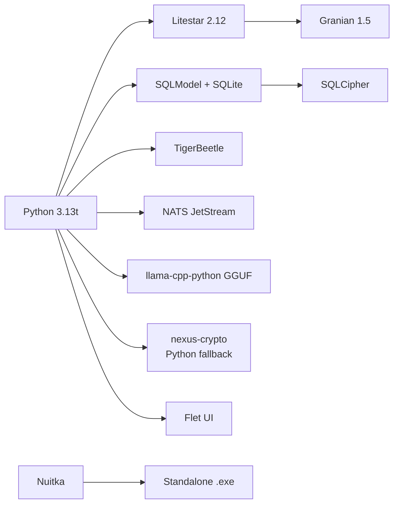

# NexusAI — Wirtualny Księgowy

> **NexusAI to nie aplikacja — to wirtualny księgowy.**
> Autonomiczna, lokalna platforma księgowa klasy Enterprise dla MŚP w Polsce.

[](docs/INTRODUCTION.md#status-projektu)
[](https://www.python.org/)
[](https://litestar.dev/)
[](https://www.rust-lang.org/)
[](LICENSE.txt)
[](docs/INDEX.md)

---

## 🚀 Szybki start (15 minut)

```bash
# 1. Instalacja pixi (jednorazowo)
curl -fsSL https://pixi.sh/install.sh | sh

# 2. Klonowanie repo i instalacja środowiska
git clone https://github.com/Gorski-Maciej/NexusAI.git
cd NexusAI
pixi install

# 3. Uruchomienie
pixi run api
```

Pełna instrukcja krok po kroku: [`docs/QUICKSTART.md`](docs/QUICKSTART.md).

---

## ✨ Kluczowe funkcje

| Funkcja | Opis |
|---|---|
| 🧾 **Księgowanie autonomiczne** | 5 Agentów AI analizuje fakturę i podejmuje decyzję: **AUTO_POST** (≥0.92), **SUGGEST** (≥0.75), lub **ASK_USER** (<0.75). Jeden poziom automatyzacji. |
| 🔍 **OCR ensemble (4 silniki)** | Tesseract + PaddleOCR + docTR + EasyOCR z konsensusem głosowania i Nadzorcą AI. Wyższe **recall** niż pojedynczy VLM. |
| 🤖 **5 Agentów AI (lokalnych)** | Orkiestrator (Granite 3.2 3B), Ekstrakcji Danych, Analityczny, Walidator Jakości, Środków Trwałych. 13 modeli GGUF. Cognitive Audit Trail, 4-Eyes Principle, Bayesian Trust Score. [Pełna specyfikacja →](docs/AGENTS.md) |
| 📜 **Pełna zgodność KSeF** | Generowanie XML wg schematu `FA_VAT(2)`, walidacja XSD, wysyłka do API KSeF MF. |
| 🔐 **Własny moduł kryptograficzny (Rust+Pure Python)** | AEAD ChaCha20-Poly1305, Argon2id KDF, SHA-256, mlock sekretów — w pakiecie `nexus-crypto`. **Domyślnie używa pure-Python fallbacku** (Rust opcjonalny dla wydajności produkcyjnej). |
| 🗄️ **4 silniki danych** | SQLite+SQLCipher (OLTP zaszyfrowany), DuckDB (OLAP), TigerBeetle (double-entry ledger), NATS JetStream (event bus + KV/Object Store). |
| 🪟 **Aplikacja desktopowa** | Flet (Flutter) — natywny UI, Material Design 3, offline-first. |
| 🚀 **Pojedynczy `.exe`** | Nuitka + Inno Setup → jeden plik binarny z wkompilowanym `mimalloc` (5–15% mniej RAM). |

---

## 📚 Dokumentacja

Cała dokumentacja znajduje się w katalogu [`docs/`](docs/INDEX.md):

| Sekcja | Plik | Opis |
|---|---|---|
| 0 | [`README.md`](README.md) | Strona główna (ten plik) |
| 3 | [Wprowadzenie](docs/INTRODUCTION.md) | Problem, wartość (PWE), użytkownicy, słownik |
| 4 | [Szybki start](docs/QUICKSTART.md) | Uruchomienie lokalne w 15 minut |
| 5 | [Architektura systemu](docs/ARCHITECTURE.md) | C4, ADRs, wzorce, sekwencje, model domeny |
| 6 | [Struktura projektu](docs/PROJECT_STRUCTURE.md) | Drzewo katalogów i konwencje |
| 7 | [Instalacja i konfiguracja](docs/INSTALLATION.md) | Zmienne środowiskowe, profile |
| 8 | [Baza danych](docs/DATABASE.md) | ERD, migracje, backup |
| 9 | [API / Komunikacja](docs/API.md) | Pełna specyfikacja REST/JWT |
| 10a | [Agenci AI](docs/AGENTS.md) | 5 agentów, 13 modeli, Cognitive Audit Trail, Decision Engine |
| 10 | [Moduły / Logika](docs/MODULES.md) | Serwisy, agenci, pipeline OCR |
| 11 | [Testowanie](docs/TESTING.md) | pytest, crosshair, locust |
| 12 | [Wdrożenie](docs/DEPLOYMENT.md) | Build, binarka, CI/CD |
| 13 | [Rozwiązywanie problemów](docs/TROUBLESHOOTING.md) | Diagnostyka |
| 14 | [Bezpieczeństwo](docs/SECURITY.md) | Threat model, krypto, OWASP |
| 15 | [Zgodność z przepisami](docs/COMPLIANCE.md) | UoR, IFRS, KSeF, JPK |
| 16 | [Proces rozwoju](docs/CONTRIBUTING.md) | Standardy, review, ADRs |
| 17 | [Podręcznik użytkownika](docs/USER_GUIDE.md) | Instrukcja dla przedsiębiorcy |
| 18 | [Słownik pojęć](docs/GLOSSARY.md) | Terminy księgowe i techniczne |
| 19 | [FAQ](docs/FAQ.md) | Najczęstsze pytania |

---

## 🎯 Misja

> „NexusAI to nie aplikacja — to wirtualny księgowy."

Przedsiębiorca w Polsce poświęca średnio **8 godzin tygodniowo** na prowadzenie księgowości. NexusAI przejmuje 90% tej pracy: od pobrania faktury z KSeF, przez ekstrakcję danych, walidację krzyżową, po decyzję księgową — bez wysyłania wrażliwych danych do chmury.

**Wartość (PWE):**
- **P**roblem: Ręczne księgowanie jest czasochłonne i podatne na błędy; dane finansowe firmy wyciekają do chmury obcej.
- **W**artość: Autonomia (AUTO_POST), pełna prywatność (offline-first), zgodność z UoR/IFRS, polskie standardy (KSeF, NIP, Biała Lista, NBP, GUS).
- **E**fekt: Przedsiębiorca poświęca **3 minuty dziennie** na decyzje (centrum decyzji), oszczędzając do **20 000 PLN/rok** na księgowości.

Pełna argumentacja w [`docs/INTRODUCTION.md`](docs/INTRODUCTION.md).

---

## 🛠️ Stos technologiczny



Pełne uzasadnienie wyborów w [`docs/ARCHITECTURE.md`](docs/ARCHITECTURE.md#kluczowe-decyzje-architektoniczne-adrs).

---

## 📦 Wymagania systemowe

| Parametr | Minimum | Zalecane |
|---|---|---|
| CPU | 4 rdzenie x86_64 | 8+ rdzeni (z AVX2) |
| RAM | 4 GB | 6 GB |
| Dysk | 5 GB | 10 GB SSD |
| System | Linux x86_64, Windows 10, macOS 12+ | Linux Ubuntu 22.04 LTS |
| Python | 3.13 free-threaded (3.13t) | Dostarczany przez pixi |
| Rust | **Niewymagany** (opcjonalny) | nexus-crypto działa jako pure-Python; Rust tylko dla produkcyjnego build .exe |

---

## 📜 Licencja

**Proprietary** — patrz [`LICENSE.txt`](LICENSE.txt).  
Wszelkie prawa zastrzeżone © 2026 NexusAI Team.

---

## 👥 Zespół

- **Technical Lead**: NexusAI Team
- **Architect**: NexusAI Team
- **Maintainerzy**: Zobacz [`docs/CONTRIBUTING.md`](docs/CONTRIBUTING.md)

---

## 🤝 Wsparcie

- 🐛 **Błędy**: zgłoś przez [GitHub Issues](https://github.com/Gorski-Maciej/NexusAI/issues)
- 💡 **Pomysły**: zgłoś przez GitHub Issues z etykietą `enhancement`
- 📖 **Wiki**: [github.com/Gorski-Maciej/NexusAI/wiki](https://github.com/Gorski-Maciej/NexusAI/wiki)

---

<div align="center">

**NexusAI — Twój wirtualny księgowy. Skup się na biznesie, księgowość dzieje się sama.**

*Made in Poland 🇵🇱*

</div>
