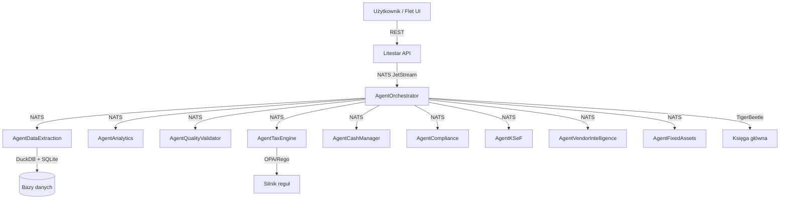
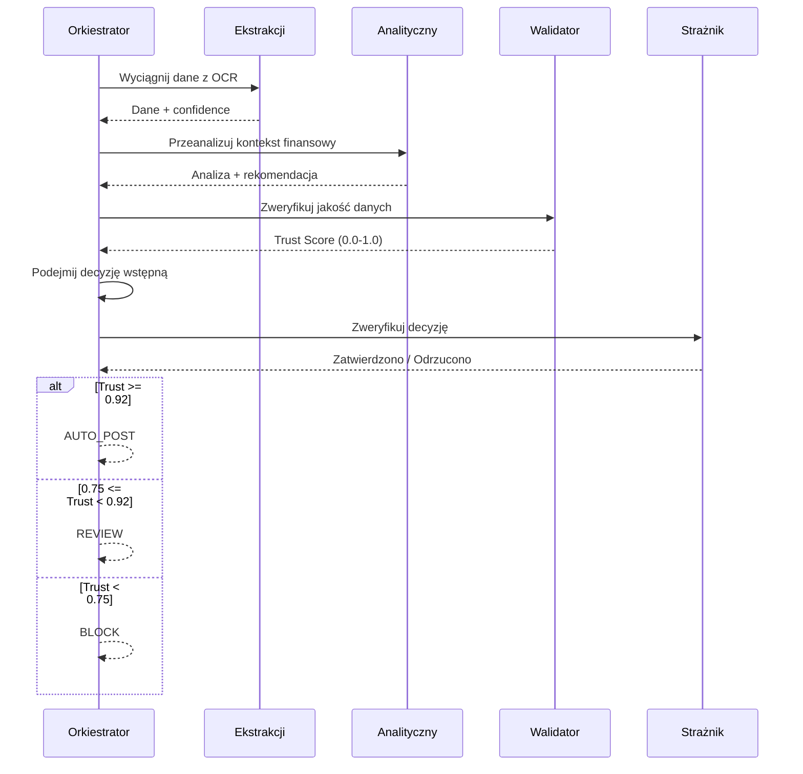

# 🤖 System Agentów AI NexusAI — Specyfikacja Enterprise (v3.0)

> **"Autonomiczne Biuro Księgowe — Architektura Agentów AI"**
>
> **Cel:** Umożliwić developerowi zrozumienie pełnego systemu agentów AI w 30 minut.
> **Kiedy czytać:** Przed implementacją nowego agenta, debugowaniem decyzji, lub dodawaniem modelu AI.
> **Podstawa:** `docs/SPECYFIKACJA_AGENTOW_ENTERPRISE.txt` + `RAPORT_TECHNOLOGII_NEXUSAI.txt`

---

## 1. Wizja systemu — Autonomiczne Biuro Księgowe

### 1.1 Filozofia architektury

System agentów AI został zaprojektowany jako **AUTONOMICZNE BIURO KSIĘGOWE** — zestaw 10 wyspecjalizowanych agentów, które:

- **DZIAŁAJĄ W TLE** — użytkownik nie musi wiedzieć, który agent przetwarza fakturę
- **PODEJMUJĄ DECYZJE** — w zielonej strefie (Trust Score ≥ 0.92) agenci samodzielnie księgują
- **UCZĄ SIĘ** — każda korekta użytkownika jest natychmiast wykorzystywana do poprawy przyszłych decyzji
- **KOORDYNUJĄ APLIKACJĘ** — sterują UI (Flet), kolejką zadań (Taskiq), NATS i bazami danych
- **SĄ ODPORNE** — każda decyzja przechodzi przez minimum 2 niezależne modele (architektura "zero trust to a single model")

### 1.2 Cztery poziomy autonomii

| Poziom | Nazwa | Zachowanie | Wymagany Trust Score |
|---|---|---|---|
| **LEVEL 0** | Manualny | Agent tylko proponuje, użytkownik zatwierdza każdą decyzję | — |
| **LEVEL 1** | Asystent | Agent decyduje w zielonej strefie, pyta w żółtej, blokuje w czerwonej | ≥ 0.75 |
| **LEVEL 2** | Autonomiczny | Agent decyduje w zielonej i żółtej, pyta tylko w czerwonej | ≥ 0.92 |
| **LEVEL 3** | W pełni autonomiczny | Agent podejmuje wszystkie decyzje, informuje podsumowaniem | ≥ 0.98 |

```python
# nexus_ai/agents/models.py
class AutonomyLevel(enum.IntEnum):
    MANUAL = 0
    ASSISTANT = 1
    AUTONOMOUS = 2
    FULL_AUTONOMOUS = 3
```

### 1.3 Architektura komunikacji



### 1.4 Stos technologiczny agentów

| Technologia | Rola |
|---|---|
| **llama-cpp-python** | Inferencja modeli GGUF (CPU/GPU) |
| **NATS JetStream + Taskiq** | Komunikacja między agentami |
| **DuckDB** | Pamięć episodyczna i analityka |
| **SQLite + sqlite-vec** | Pamięć semantyczna (wektory) |
| **TigerBeetle** | Księga główna (double-entry) |
| **msgspec** | Wszystkie struktury danych |
| **stamina** | Circuit breaker i retry |
| **nexus-crypto** | Proof chain kryptograficzny (SHA-256) |
| **OPA + Rego** | Deterministyczny silnik reguł |

---

## 2. Dziesięciu agentów AI — katalog

### 2.1 AgentOrchestrator — Centralny Mózg i Wirtualny CFO

**Rola:** Naczelny dyrektor finansowy. Koordynuje wszystkich agentów, podejmuje ostateczne decyzje, komunikuje się z użytkownikiem.

| Parametr | Wartość |
|---|---|
| **Model główny** | Granite 3.2 3B (GGUF, IQ4_XS) |
| **Model strażnika** | Granite Guardian 0.5B (GGUF, Q4_K_M) |
| **Model komunikatora** | Qwen3-Nano 0.5B (GGUF, Q4_K_M) |
| **RAM** | ~2.4 GB (Actor) + ~300 MB (Guardian) + ~400 MB (Communicator) |
| **Plik** | `nexus_ai/agents/orchestrator.py` |
| **Klasa** | `AgentOrchestrator(BaseAgent)` |

**Kluczowe mechanizmy:**
- **Dynamiczny Trust Score** — aktualizowany Bayesiańsko po każdej decyzji: `P(θ|D) ∝ P(D|θ) × P(θ)`
- **Decision Cache** — każda decyzja wektoryzowana w sqlite-vec, k-NN (k=5) dla podobnych faktur
- **Adaptive Thresholds** — progi AUTO_POST/REVIEW dynamiczne per kontrahent
- **Proof Chain SHA-256** — niepodważalny dowód dla organów skarbowych
- **Escalation Matrix** — inteligentna eskalacja (pora dnia, kanał, priorytet)

**Topiki NATS:**
| Temat | Kierunek | Opis |
|---|---|---|
| `council.task.request` | Wejście | Nowe zadanie |
| `council.decision.final` | Wyjście | Ostateczna decyzja |
| `council.decision.review` | Wyjście | Decyzja wymagająca przeglądu |
| `council.decision.learn` | Wejście | Korekta / feedback |
| `council.escalation` | Wyjście | Eskalacja do człowieka |
| `council.heartbeat` | Wyjście | Heartbeat (co 30s) |

**Proces decyzyjny:**


### 2.2 AgentDataExtraction — Forteca Precyzji

**Rola:** Ekstrakcja danych z dokumentów z precyzją przewyższającą profesjonalnego księgowego. Zero błędów w polach krytycznych.

| Parametr | Wartość |
|---|---|
| **Model klasyfikacji** | ParagonDetect (lekkie CNN, ONNX) |
| **Modele walidacji** | Granite Vision Guardian 0.3B + ModernBERT-NER-Finance 0.3B |
| **OCR** | Tesseract + PaddleOCR + docTR + EasyOCR |
| **RAM** | ~400 MB (Vision Guardian) + ~250 MB (NER) + OCR (~900 MB razem) |
| **Plik** | `nexus_ai/agents/extraction.py` |
| **Klasa** | `AgentDataExtraction(BaseAgent)` |

**Kluczowe mechanizmy:**
- **Cross-Validation Matrix (4×4)** — każde pole ekstrahowane przez 4 silniki niezależnie
  - 3/4 zgodność → akceptuj | 2/4 → Vision Guardian | <2/4 → ręczna weryfikacja
- **Active Learning OCR** — każda korekta użytkownika to nowy przykład treningowy w sqlite-vec
- **Invoice Template Matching** — wzorce faktur per kontrahent (embeddingi, k-NN)
- **Semantyczna walidacja** — NIP (suma kontrolna + Biała Lista), IBAN (MOD-97), kwoty (netto+VAT=brutto)
- **Confidence Calibration** — każde pole ma indywidualny confidence score

### 2.3 AgentAnalytics — Sztab Analityczny

**Rola:** Nieustanna analiza kondycji finansowej. Wykrywa trendy, anomalie i ryzyka zanim staną się problemem.

| Parametr | Wartość |
|---|---|
| **Model SQL** | Hrida-T2SQL-128k (GGUF, IQ3_M) |
| **Model analityczny** | Granite 3.2 3B (GGUF, IQ4_XS) |
| **Model detekcji** | Fin-RWKV-169M (GGUF, Q4_K_M) |
| **Model prognozy** | Lag-Llama 0.3B (GGUF, Q4_K_M) |
| **RAM** | ~1.0 GB (T2SQL) + ~2.4 GB (Granite) + ~100 MB (RWKV) |
| **Plik** | `nexus_ai/agents/analytics.py` |
| **Klasa** | `AgentAnalytics(BaseAgent)` |

**Kluczowe mechanizmy:**
- **Proaktywne monitorowanie 24/7** — cash flow 90 dni, DSO, terminy, VAT, P&L, anomalie (>2σ)
- **Natural Language Insights** — codzienny brief: "Wczoraj wpłynęło 5 faktur na 12,450 PLN"
- **Raporty automatyczne** — dzienne/tygodniowe/miesięczne/kwartalne przez DuckDB + Granite 3.2
- **Anomaly Detection** — Z-score, IQR, Mahalanobis distance, Isolation Forest, change point detection

### 2.4 AgentQualityValidator — Strażnik Integralności

**Rola:** Niezależny audytor. Weryfikuje każdą decyzję przed wykonaniem. Architektura "zero trust".

| Parametr | Wartość |
|---|---|
| **Model podatkowy** | Granite Guardian 0.5B (GGUF, Q4_K_M) |
| **Model fraud** | GraphSAGE-Encoder 0.1B (ONNX) |
| **Model ryzyka** | FinBERT-ESG 0.1B (GGUF, Q4_K_M) |
| **Model płynności** | Lag-Llama 0.3B (GGUF, Q4_K_M) |
| **RAM** | ~300 MB + ~100 MB + ~100 MB + ~200 MB |
| **Plik** | `nexus_ai/agents/quality_validator.py` |
| **Klasa** | `AgentQualityValidator(BaseAgent)` |

**Kluczowe mechanizmy:**
- **4-Eyes Principle** — obowiązkowy dla kwot > 50,000 PLN (2 niezależne weryfikacje)
- **Tax Compliance Engine** — OPA/Rego: stawki VAT, split payment, JPK_VAT, PKWiU
- **Fraud Graph Scanner** — graf powiązań (GraphSAGE): karuzele VAT, słupy, zmiany kont bankowych
- **Liquidity Stress Test** — Monte Carlo 1000 scenariuszy, ryzyko niedoboru >5% → WARNING
- **Vote Weighting** — Tax: 0.35, Fraud: 0.30, ESG: 0.20, Lag-Llama: 0.15 (Bayesian update)

### 2.5 AgentTaxEngine — Automatyczny Doradca Podatkowy

**Rola:** Automatyczne wyliczanie podatków VAT, PIT, CIT. Optymalizacja podatkowa w ramach prawa.

| Parametr | Wartość |
|---|---|
| **Silnik** | DuckDB + OPA/Rego + TigerBeetle |
| **Pliki** | `nexus_ai/services/tax_simulator.py`, `nexus_ai/services/tax_strategies.py`, `nexus_ai/tax/rules.rego` |

**Kluczowe mechanizmy:**
- **VAT Engine** — automatyczne określanie stawki (23/8/5/0/ZW), split payment (≥15k PLN), JPK_VAT(7)
- **PIT/CIT Engine** — kalkulacja zaliczek, KUP, amortyzacja, ulgi (B+R, IP Box)
- **Tax Optimization** — symulacje "co by było, gdyby" (DuckDB shadow ledger), estoński CIT
- **Deadline Management** — monitorowanie terminów, priorytety (US > ZUS > KSeF)

### 2.6 AgentCashManager — Zarządca Płynności

**Rola:** Zarządzanie przepływami pieniężnymi, planowanie płatności, optymalizacja salda.

| Parametr | Wartość |
|---|---|
| **Modele** | Lag-Llama (prognoza) + Fin-RWKV (anomalie) |
| **Pliki** | `nexus_ai/services/liquidity_oracle.py`, `nexus_ai/services/priority_engine.py` |

**Kluczowe mechanizmy:**
- **Cash Flow Forecast (90 dni)** — 3 scenariusze: optymistyczny/bazowy/pesymistyczny
- **Payment Optimizer** — priorytety (krytyczne > skonta > strategiczni > elastyczni)
- **Liquidity Buffer** — minimum 30 dni kosztów stałych, alert przy spadku
- **Working Capital** — DSO < 30 dni, DPO > 45 dni, Cash Conversion Cycle < 0

### 2.7 AgentCompliance — Strażnik Regulacyjny

**Rola:** Ciągłe monitorowanie zgodności z przepisami. Aktualizacja reguł. Raportowanie.

| Parametr | Wartość |
|---|---|
| **Silnik** | OPA + Rego + DuckDB |
| **Plik** | `nexus_ai/services/compliance_analytics.py` |

**Kluczowe mechanizmy:**
- **Regulatory Watch** — monitorowanie Dz.U., automatyczne parsowanie, aktualizacja reguł OPA
- **Compliance Audit** — cykliczna weryfikacja decyzji (RODO, UoR, KSeF, JPK)
- **Data Retention** — automatyczne zarządzanie cyklem życia (faktury 5 lat, księgi 10 lat)

### 2.8 AgentKSeF — Łącznik z Ministerstwem Finansów

**Rola:** Automatyczna wymiana z Krajowym Systemem e-Faktur.

| Parametr | Wartość |
|---|---|
| **Technologie** | httpx + hishel + xsdata + lxml + stamina |
| **Pliki** | `nexus_ai/services/ksef_service.py`, `nexus_ai/services/ksef_generator.py` |

**Kluczowe mechanizmy:**
- **Auto-Send** — każda zatwierdzona faktura → automatycznie do KSeF (FA(1), FA(2))
- **Status Monitor** — cykliczne sprawdzanie, auto-korekta błędów
- **KSeF Inbox** — pobieranie faktur przychodzących, automatyczne przetwarzanie

### 2.9 AgentVendorIntelligence — Wywiad Gospodarczy

**Rola:** Ocena wiarygodności kontrahentów, monitoring Białej Listy MF, GUS, KRD.

| Parametr | Wartość |
|---|---|
| **Technologie** | httpx + hishel + DuckDB + sqlite-vec |
| **Pliki** | `nexus_ai/services/vendor_intelligence.py`, `nexus_ai/services/white_list_service.py`, `nexus_ai/services/gus_bir_client.py` |

**Kluczowe mechanizmy:**
- **White List MF** — automatyczne sprawdzanie NIP, status VAT, konta bankowe
- **GUS BIR** — weryfikacja nazwy, adresu, PKD, formy prawnej
- **Vendor Risk Score** — historia płatności, zmiany kont, powiązania (grafy), wynik 0-100

### 2.10 AgentFixedAssets — Zarządca Środków Trwałych

**Rola:** Automatyczna klasyfikacja, amortyzacja i ewidencja środków trwałych.

| Parametr | Wartość |
|---|---|
| **Model** | Granite 3.2 3B (klasyfikacja) |
| **Plik** | `nexus_ai/services/fixed_assets.py` |

**Kluczowe mechanizmy:**
- **Auto-Classification** — ŚT vs materiał vs usługa (>10k PLN, >1 rok)
- **Depreciation Engine** — liniowa, degresywna, jednorazowa (<100k PLN), miesięczne odpisy

---

## 3. Decision Engine — Wielowarstwowy Silnik Decyzyjny

### 3.1 Strefy decyzyjne (Dynamic Thresholds)

Progi NIE są stałe — adaptują się Bayesiańsko:

```
auto_post_threshold = 0.92 - adjustment
review_threshold    = 0.75 - adjustment
adjustment = (alpha_vendor - beta_vendor) / (alpha_vendor + beta_vendor) × 0.1
```

| Kontrahent | α (poprawne) | β (błędne) | Adjustment | AUTO_POST |
|---|---|---|---|---|
| Znany (100 faktur) | 98 | 2 | 0.096 | **0.824** |
| Nowy (5 faktur) | 4 | 1 | 0.06 | 0.86 |
| Podejrzany (10 faktur) | 6 | 4 | 0.02 | **0.90** |

### 3.2 Konsensus między agentami

Ostateczna decyzja = ważony głos agentów:

| Agent | Waga |
|---|---|
| AgentOrchestrator | 0.35 |
| AgentTaxEngine | 0.25 |
| AgentQualityValidator | 0.40 (niezależny audytor) |

- 2/3 zgoda → akceptuj | 1/3 → REVIEW | 0/3 → BLOCK

### 3.3 Eskalacja do człowieka

Eskalacja następuje gdy:
- Trust Score < review_threshold
- QualityValidator zwróci ERROR
- Konsensus < 2/3
- Kwota > max_auto_post (100,000 PLN)
- Nowy kontrahent > 50,000 PLN
- Zmiana konta bankowego kontrahenta

### 3.4 Proof Chain SHA-256

Każda decyzja tworzy niepodważalny dowód:

```python
block = {
    "index": previous.index + 1,
    "decision_id": uuid,
    "agent_decisions": [...],
    "user_decision": None | "approve" | "correct" | "reject",
    "previous_hash": previous.hash,
    "hash": sha256(serialize(block))
}
```

### 3.5 Confidence Voting

```python
class ConfidenceVote(Struct, kw_only=True):
    model_name: str
    model_weight: float     # historyczna precyzja
    vote: str               # POST | REVIEW | BLOCK
    confidence: float       # confidence tej decyzji
    weighted_vote: float    # model_weight × confidence
```

---

## 4. System uczenia się — Continuous Learning Framework

### 4.1 Active Learning Loop

```
DECYZJA Agenta → KOREKTA Usera → NAUKA Modelu → POPRAWA Threshold
     ↑                                                    │
     └────────────────────────────────────────────────────┘
```

1. Agent podejmuje decyzję (z Trust Score)
2. Jeśli Trust Score < threshold → pytamy użytkownika
3. Użytkownik: zatwierdza / koryguje / odrzuca
4. Δ = |decision_agent - decision_user|
5. Bayesian update Trust Score
6. Jeśli Δ > 0.1 → dodaj do Active Learning Dataset
7. Jeśli dataset ≥ 100 → trigger fine-tuningu

### 4.2 Bayesian Trust Score

```python
class BayesianTrustScore:
    def __init__(self, alpha: float = 1.0, beta: float = 1.0):
        self.alpha = alpha
        self.beta = beta

    def update(self, correct: bool) -> None:
        if correct: self.alpha += 1
        else: self.beta += 1

    @property
    def trust_score(self) -> float:
        return self.alpha / (self.alpha + self.beta)

    @property
    def confidence(self) -> float:
        total = self.alpha + self.beta
        variance = (self.alpha * self.beta) / (total**2 * (total + 1))
        return max(0.0, 1.0 - variance * 12)
```

### 4.3 Propagacja korekt

| Typ | Mechanizm |
|---|---|
| **Bezpośrednia** | Agent otrzymuje feedback → Bayesian update |
| **Pośrednia** | Podobne przypadki w sqlite-vec → re-evaluacja (k-NN, k=10) |
| **Globalna** | Ten sam błąd >5 razy → aktualizacja reguł OPA |
| **Strukturalna** | Błąd wskazuje brakującą funkcjonalność → zadanie dev |

### 4.4 Korekty OCR (Online Learning)

Każda ręczna korekta OCR to nowy przykład w `ocr_corrections` (sqlite-vec):
- Nowa faktura → OCR → k-NN w korektach → preferuj skorygowaną wartość
- System uczy się układów faktur per-kontrahent

### 4.5 Reguły podatkowe z korekt

- Po 10 korektach tego samego typu → automatyczna aktualizacja reguł OPA/Rego
- Dla podobnych przypadków (k-NN, embedding faktury) — automatyczna korekta

---

## 5. Pamięć i uczenie się — Memory Systems

### 5.1 Episodic Memory (DuckDB)

```sql
CREATE TABLE events (
    id UUID PRIMARY KEY,
    event_type TEXT NOT NULL,    -- 'decision', 'correction', 'alert'
    agent TEXT NOT NULL,
    payload JSONB NOT NULL,
    timestamp TIMESTAMP DEFAULT NOW(),
    trace_id TEXT
);
```

### 5.2 Semantic Memory (sqlite-vec)

| Tabela vec0 | Dimensja | Zastosowanie |
|---|---|---|
| `invoice_vectors` | 384d, cosine | Główne embeddingi faktur |
| `vendor_invoices` | 768d, cosine | Embeddingi per kontrahent |
| `ocr_corrections` | 768d, cosine | Korekty OCR |
| `invoice_templates` | 768d, cosine | Wzorce faktur |
| `decision_patterns` | 768d, cosine | Wzorce decyzyjne |

### 5.3 Procedural Memory (OPA/Rego)

Reguły podatkowe i compliance przechowywane w OPA:
```rego
package tax.rules
split_payment_required[invoice_id] {
    invoice := input.invoices[_]
    invoice.amount_gross > 1500000  # w groszach
    invoice.currency == "PLN"
}
```

### 5.4 Working Memory (NATS KV Store)

Krótkoterminowa pamięć (TTL 1h):
- Bieżący stan agenta (loaded_models, active_tasks)
- Cache decyzji (diskcache zapasowy)
- Blokady (mutex dla operacji krytycznych)

---

## 6. Protokół komunikacji — NATS JetStream

### 6.1 Topologia topiców

```
nexus.agents.
├── orchestrator.{task.request, decision.final, decision.review, decision.learn, escalation, heartbeat}
├── extraction.{invoice.received, invoice.extracted, invoice.failed}
├── analytics.{query, result, alert}
├── quality.{check.request, check.result}
├── tax.{calculate, result, deadline}
├── cash.{forecast, payment.suggest, payment.executed}
├── compliance.{check, report, regulation.update}
├── ksef.{send, status, receive}
├── vendor.{check, result}
├── assets.{classify, depreciate}
└── system.{heartbeat, health, error}
```

### 6.2 Gwarancje dostarczenia

| Mechanizm | Opis |
|---|---|
| **At-least-once** | Każda wiadomość trwale zapisana w JetStream, manual ack |
| **Dead Letter Queue** | Po 3 nieudanych próbach → DLQ |
| **Duplicate Detection** | task_id = blake2b(task_name + sorted(kwargs)), window 2 min |
| **Priority Queue** | 1-10 (krytyczne → idle), QoS per poziom |

### 6.3 Circuit Breaker (stamina)

```python
@stamina.retry(on=(NatsError, TimeoutError), attempts=3, timeout=30.0)
async def publish_with_retry(topic: str, data: bytes) -> None: ...
```

- Próg: 5 błędów / 30 sekund → open circuit 60s → half-open → test

---

## 7. Bezpieczeństwo agentów AI

### 7.1 RBAC na poziomie agentów

| Rola | Dostęp |
|---|---|
| **admin** | Pełny dostęp do wszystkich agentów i konfiguracji |
| **accountant** | Dostęp do decyzji, raportów, korekt |
| **auditor** | Tylko odczyt (audyt) |
| **user** | Dostęp do dashboardu i decyzji |

### 7.2 Audit log każdej decyzji

```sql
CREATE TABLE audit_log (
    id UUID PRIMARY KEY,
    user_id UUID REFERENCES users(id),
    agent TEXT NOT NULL,
    action TEXT NOT NULL,        -- 'decision', 'correction', 'view', 'export'
    resource TEXT NOT NULL,      -- 'invoice:123', 'report:monthly'
    details JSONB,
    timestamp TIMESTAMP DEFAULT NOW(),
    proof_hash TEXT              -- SHA-256 w proof chain
);
```

### 7.3 Offline-first — modele lokalne

- Wszystkie modele GGUF działają LOKALNIE — dane NIE są wysyłane do chmury
- Weryfikacja SHA-256 modeli przed załadowaniem
- Żadne dane finansowe nie opuszczają komputera użytkownika

---

## 8. Monitoring i obserwowalność

### 8.1 OpenTelemetry tracing

```
Trace: process_invoice (root)
├── Span: extract_data (AgentDataExtraction)
├── Span: evaluate_decision (AgentOrchestrator)
│   ├── Span: llm_inference (Granite 3.2)
│   └── Span: guardian_check (Granite Guardian)
├── Span: quality_validation (AgentQualityValidator)
│   ├── Span: tax_check
│   ├── Span: fraud_check
│   └── Span: forecast
└── Span: final_decision
```

### 8.2 Metryki Prometheus

```
nexus_agent_decisions_total{agent="orchestrator",status="auto_post"} 1234
nexus_agent_latency_seconds{agent="extraction",engine="tesseract"} 2.3
nexus_trust_score{agent="orchestrator",vendor="known"} 0.94
nexus_correction_rate{agent="orchestrator"} 0.05
```

### 8.3 Performance budget (SLA)

| Agent | Prosta operacja | Złożona operacja |
|---|---|---|
| **Orchestrator** | < 1s (trusted vendor) | < 15s (nowy + walidacja) |
| **Extraction** | < 10s (prosty obraz) | < 60s (PDF + 4 silniki) |
| **Analytics** | < 1s (proste SQL) | < 30s (raport miesięczny) |
| **QualityValidator** | < 3s (tax check) | < 15s (full validation) |

---

## 9. Dodawanie nowego agenta

1. Pobierz model GGUF do `models/`
2. Dodaj konfigurację w `config/base.toml`:
   ```toml
   [models.new_agent]
   path = "models/new-agent.Q4_K_M.gguf"
   n_ctx = 4096
   ```
3. Utwórz klasę agenta dziedziczącą po `BaseAgent`:
   ```python
   from nexus_ai.agents.base import BaseAgent
   
   class NewAgent(BaseAgent):
       def __init__(self, model_manager=None, config=None):
           super().__init__(name="new-agent", model_manager=model_manager, config=config)
       
       async def process(self, data: dict) -> AgentDecision:
           model_path = self._config.get("path")
           prompt = self._build_prompt(data)
           result = await self.infer(model_path, prompt)
           return self._parse_result(result)
   ```
4. Zarejestruj w Orkiestratorze (`orchestrator.py`):
   ```python
   orchestrator.register_agent("new-agent", NewAgent(model_manager, config))
   ```
5. Dodaj topic NATS w `nexus_ai/agents/topics.py`
6. Dodaj handler Taskiq w `nexus_ai/agents/tasks.py`

---

## 10. Modele AI — tabela porównawcza

| Model | Agent | Rozmiar | RAM | Czas inferencji | Dokładność |
|---|---|---|---|---|---|
| Granite 3.2 3B IQ4_XS | Orchestrator (Actor) | ~1.8 GB | ~2.4 GB | 400-800ms | 92% |
| Granite Guardian 0.5B Q4_K_M | Orchestrator (Guardian) | ~350 MB | ~300 MB | 100-200ms | 95% |
| Qwen3-Nano 0.5B Q4_K_M | Orchestrator (Communicator) | ~350 MB | ~400 MB | 150-300ms | N/A |
| Granite Vision Guardian 0.3B | Extraction (Vision) | ~200 MB | ~250 MB | 200-400ms | 91% |
| ModernBERT-NER-Finance 0.3B | Extraction (NER) | ~180 MB | ~200 MB | 50-100ms | 97% |
| Hrida-T2SQL-128k IQ3_M | Analytics (SQL) | ~700 MB | ~1.0 GB | 1-3s | 85% |
| Fin-RWKV-169M Q4_K_M | Analytics (Detective) | ~95 MB | ~100 MB | 50-150ms | 88% |
| Lag-Llama 0.3B Q4_K_M | Cash Manager | ~170 MB | ~200 MB | 200-500ms | 83% |
| GraphSAGE-Encoder 0.1B ONNX | Quality (Fraud) | ~50 MB | ~100 MB | 30-80ms | 89% |
| FinBERT-ESG 0.1B Q4_K_M | Quality (Risk) | ~60 MB | ~80 MB | 40-100ms | 86% |
| ParagonDetect CNN ONNX | Extraction (Classify) | ~30 MB | ~50 MB | 50-100ms | 96% |
| Granite 3.2 3B IQ4_XS | Fixed Assets | ~1.8 GB | ~2.4 GB | 400-800ms | 90% |

**Łącznie:** 12 unikalnych modeli GGUF (Granite 3.2 3B współdzielony między Orchestrator i FixedAssets), ~6-7 GB RAM przy typowym użyciu (modele ładowane leniwie, TTL auto-unload 300s). Suma wszystkich modeli w tabeli: ~9.3 GB — ale nigdy nie są ładowane jednocześnie.

---

## 🔗 Zobacz również

- [Modele AI — pełny manifest](MODELS_MANIFEST.md) — szczegóły techniczne modeli
- [Architektura systemu](ARCHITECTURE.md) — C4, ADR, wzorce projektowe
- [Moduły i logika](MODULES.md) — serwisy biznesowe, pipeline OCR
- [Bezpieczeństwo](SECURITY.md) — model zagrożeń, szyfrowanie, RBAC
- [API / Komunikacja](API.md) — endpointy REST, JWT, NATS
- [Specyfikacja Agentów Enterprise](SPECYFIKACJA_AGENTOW_ENTERPRISE.txt) — pełna specyfikacja źródłowa

---

> **Data utworzenia:** 2026-07-05 · **Autor:** NexusAI Team · **Wersja:** 3.0.0-dev
> **Status dokumentu:** Nowy · **Ostatnia weryfikacja:** 2026-07-05 · **Weryfikator:** Technical Lead
> **Podstawa:** `docs/SPECYFIKACJA_AGENTOW_ENTERPRISE.txt` + `RAPORT_TECHNOLOGII_NEXUSAI.txt`
