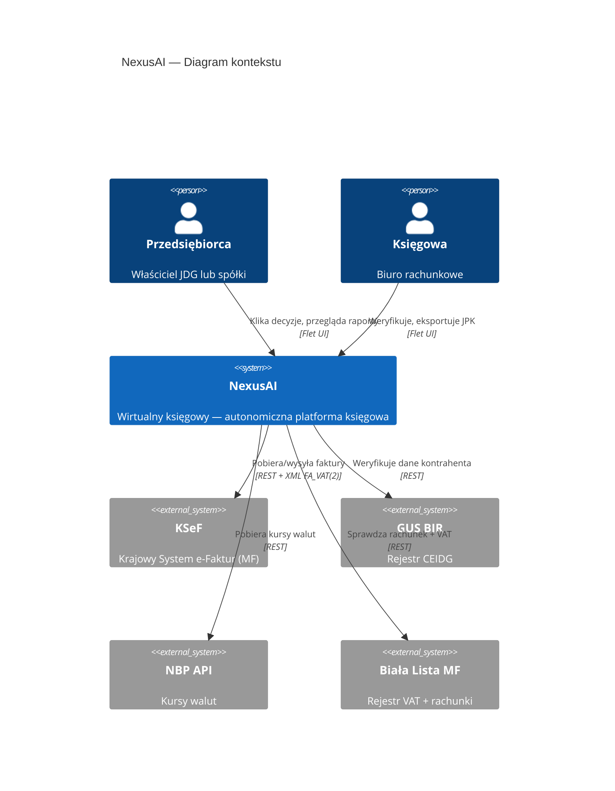
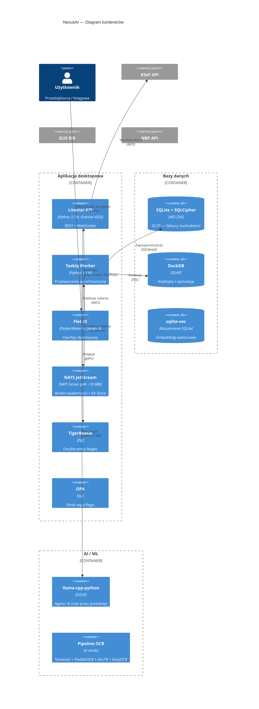
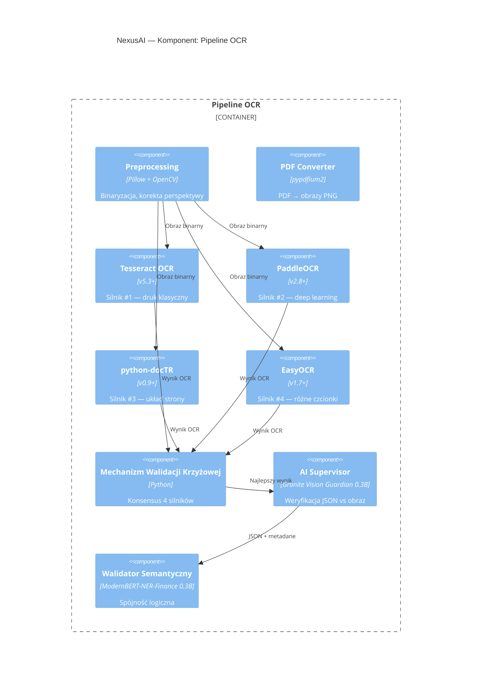
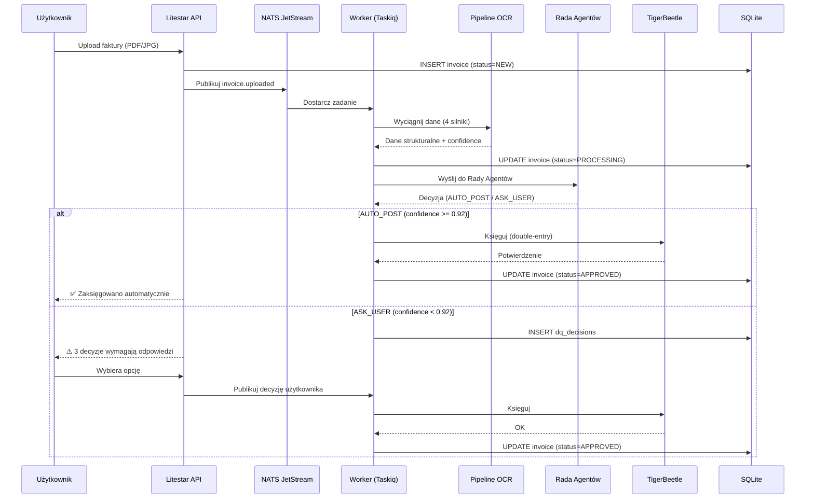
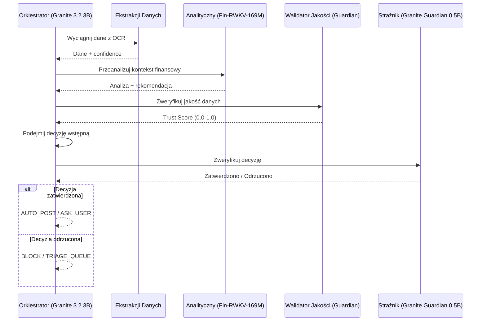
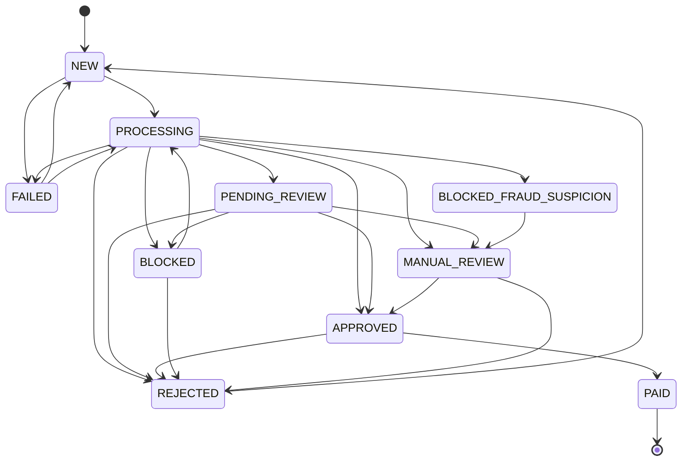

# 🏛️ Architektura systemu NexusAI

> **Cel:** Umożliwić developerowi zrozumienie pełnej architektury w 20 minut.  
> **Kiedy czytać:** Przed jakąkolwiek poważną zmianą w kodzie; przed code review.

---

## 1. Diagramy C4

### 1.1 Context (Poziom 1) — System i jego otoczenie



> **📝 Wersja tekstowa (ASCII fallback):**
> ```
> ┌──────────────────┐         ┌─────────────────────────────────┐
> │  Przedsiębiorca  │────────▶│            NexusAI              │
> │  (JDG / spółka)  │  Flet   │  Wirtualny Księgowy             │
> └──────────────────┘         └──────┬──────┬──────┬──────┬─────┘
>                                      │      │      │      │
>                               REST+XML   REST   REST   REST
>                                      │      │      │      │
>                               ┌──────┴┐ ┌───┴──┐ ┌──┴──┐ ┌──┴──────┐
>                               │ KSeF  │ │ GUS  │ │ NBP │ │ Biała   │
>                               │ e-Fakt│ │ CEIDG│ │ API │ │ Lista MF│
>                               └───────┘ └──────┘ └─────┘ └─────────┘
> ```

### 1.2 Container (Poziom 2) — Główne komponenty



> **📝 Wersja tekstowa (ASCII fallback):**
> ```
> ╔══════════════════════════════════════════════════════════════════════╗
> ║                     APLIKACJA DESKTOPOWA                            ║
> ║  ┌──────────┐  REST/WS   ┌──────────────┐   NATS    ┌───────────┐  ║
> ║  │ Flet UI  │◄──────────►│ Litestar API │◄────────►│ NATS      │  ║
> ║  │ (Flutter)│            │ (Granian)    │ JetStream│ Server    │  ║
> ║  └──────────┘            └──────────────┘          └─────┬─────┘  ║
> ║                                                  JetStream│       ║
> ║                                     ┌─────────────────────┤       ║
> ║                                     ▼                     ▼       ║
> ║                            ┌──────────────┐      ┌──────────────┐║
> ║                            │Taskiq Worker │      │Taskiq Worker │║
> ║                            │   (OCR)      │      │   (AI)       │║
> ║                            └──────┬───────┘      └──────┬───────┘║
> ║                                   │                     │        ║
> ╚═══════════════════════════════════╪═════════════════════╪════════╝
>                              ┌──────▼──────┐      ┌──────▼──────┐
>                              │  Bazy danych│      │ TigerBeetle │
>                              │ SQLite+Duck │      │  (ledger)   │
>                              └─────────────┘      └─────────────┘
> 
> ZEWNĘTRZNE: KSeF API | GUS BIR | NBP API
> AI/ML: llama-cpp-python (agenci przez protokoły) | Pipeline OCR (4 silniki)
> ```

### 1.3 Component (Poziom 3) — Pipeline OCR

> **Uwaga:** Nazwy modeli AI w diagramie to rekomendacje. W kodzie nie ma zharkodowanych modeli — `InferenceService` ładuje dowolny GGUF z konfiguracji.



> **📝 Wersja tekstowa (ASCII fallback):**
> ```
> PIPELINE OCR — 5 warstw przetwarzania:
> 
> [Preprocessing]  Pillow + OpenCV: binaryzacja, kontrast, korekta perspektywy
>        │
>        ├──▶ [Tesseract OCR v5.3]     Silnik #1: druk klasyczny (deterministyczny)
>        ├──▶ [PaddleOCR v2.8]         Silnik #2: deep learning (różne czcionki)
>        ├──▶ [python-docTR v0.9]      Silnik #3: rozumienie układu strony (DBNet)
>        └──▶ [EasyOCR v1.7]           Silnik #4: różnorodność językowa i czcionkowa
>        │
>        ▼
> [Walidacja Krzyżowa]  Konsensus Levenshteina: min. 3/4 silników musi się zgadzać
>        │
>        ▼
> [AI Supervisor]  Granite Vision Guardian 0.3B: porównuje JSON z oryginalnym obrazem
>        │
>        ▼
> [Walidator Semantyczny]  ModernBERT-NER-Finance 0.3B: NIP checksum, kwoty, daty
> ```

---

## 2. Warstwy architektoniczne (DDD)

NexusAI stosuje architekturę **Modularnego Monolitu** z wyraźnym podziałem na 4 warstwy:

```
┌─────────────────────────────────────────────────────────┐
│  PRESENTATION    Flet UI (Flutter), Material Design 3  │
├─────────────────────────────────────────────────────────┤
│  APPLICATION     Litestar API, Taskiq Workers,         │
│                  Event Handlers, CQRS Command/Query     │
├─────────────────────────────────────────────────────────┤
│  DOMAIN          Aggregates (Invoice, Contractor, Tax), │
│                  Value Objects (Money, NIP, IBAN),     │
│                  Domain Events, Domain Services        │
├─────────────────────────────────────────────────────────┤
│  INFRASTRUCTURE  SQLModel ORM, TigerBeetle Client,      │
│                  NATS Client, DuckDB, llama.cpp        │
└─────────────────────────────────────────────────────────┘
```

### 2.1 Domain Layer (`nexus_ai/domain/`)

- **Aggregaty:** `InvoiceAggregate`, `ContractorAggregate`, `TaxDecisionAggregate`
- **Value Objects:** `Money`, `NIP`, `IBAN`, `PESEL`, `SWIFT`, `InvoiceNumber`, `VatRate`, `TaxPeriod`, `AccountCode`
- **Domain Events:** `InvoiceCreated`, `InvoiceApproved`, `InvoiceRejected`, `InvoiceMarkedPaid`
- **Zasada:** Cała logika biznesowa jest w agregatach. Agregaty egzekwują niezmienniki i maszynę stanów.

### 2.2 Application Layer (`nexus_ai/api/`, `nexus_ai/services/`)

- **API:** Litestar controllers (27 endpointów)
- **Workery:** Taskiq + NATS JetStream
- **CQRS:** Rozdzielenie Command (zapis) od Query (odczyt)

### 2.3 Infrastructure Layer (`nexus_ai/core/`, `nexus_ai/db/`)

- **Bazy:** SQLite+SQLCipher (OLTP), DuckDB (OLAP), TigerBeetle (ledger)
- **Messaging:** NATS JetStream (event bus + KV Store)
- **AI:** llama-cpp-python (lokalna inferencja GGUF)
- **Crypto:** nexus-crypto (Rust+PyO3)

### 2.4 Presentation Layer (`nexus_ai/frontend/`)

- **Framework:** Flet (Flutter engine, Material Design 3)
- **Komunikacja:** REST + WebSocket przez lokalny UNIX socket
- **Tryby:** Desktop (natywny), Web (opcjonalnie)

---

## 3. Wzorce projektowe

| Wzorzec | Gdzie | Dlaczego |
|---|---|---|
| **CQRS** | `api/routes/` (commands) + `db/queries.py` (queries) | Rozdzielenie zapisu i odczytu dla optymalizacji OLTP/OLAP |
| **Event Sourcing** | `domain/aggregates.py` + `events/domain_events.py` | Pełny audit trail – każda zmiana to zdarzenie |
| **Repository** | `db/models.py` (SQLModel) | Abstrakcja dostępu do danych |
| **Unit of Work** | `db/transactions.py` | Atomowość operacji na wielu agregatach |
| **Chain of Responsibility** | Pipeline OCR (4 silniki → konsensus → walidator) | Przetwarzanie warstwowe z fallbackiem |
| **Strategy** | Silniki OCR (4 implementacje interfejsu `OcrEngine`) | Możliwość podmiany algorytmu |
| **Observer** | Event bus (`events/jetstream_bus.py`) | Luźne powiązanie komponentów |
| **Factory** | `InvoiceAggregate.create()` | Hermetyzacja tworzenia agregatów |
| **Specification** | Reguły podatkowe (`tax/rules.rego`) | Deklaratywne reguły biznesowe |
| **Saga** | `workflow_saga_state` / `core/saga.py` | Koordynacja długotrwałych procesów |
| **Outbox** | `outbox_events` + `OutboxRelay` | Niezawodna publikacja zdarzeń |
| **Decorator** | Taskiq `@task` + stamina `@retry` | Aspektowe dodawanie zachowań |
| **Adapter** | TigerBeetle client → `Money` (int cents) | Izolacja zewnętrznych API |
| **Singleton** | `db/database.py` — engine + session factory | Jeden punkt dostępu do DB |

---

## 4. Diagramy sekwencji

### 4.1 Przetwarzanie faktury od wpływu do decyzji



> **📝 Wersja tekstowa (ASCII fallback):**
> ```
> PRZETWARZANIE FAKTURY — od wpływu do decyzji:
> 
> Użytkownik        API              Worker             TigerBeetle
>    │                │                  │                    │
>    │─Upload PDF────▶│                  │                    │
>    │                │─INSERT invoice─▶│ (SQLite: NEW)      │
>    │                │─NATS publish──▶│                    │
>    │                │                  │─OCR (4 silniki)──│
>    │                │                  │─UPDATE PROCESSING│
>    │                │                  │─Rada Agentów─────│
>    │                │                  │─Decyzja──────────│
>    │                │                  │                    │
>    │          ┌─────┴─────┐            │                    │
>    │          │ AUTO_POST?│            │                    │
>    │          └─────┬─────┘            │                    │
>    │                │                  │                    │
>    │  [TAK: >0.92]  │                  │───Księguj────────▶│
>    │  ◀──✅ Gotowe──│◀─Potwierdzenie───│◀──OK──────────────│
>    │                │                  │                    │
>    │  [NIE: <0.92]  │                  │                    │
>    │  ◀──⚠️ 3 dec.──│◀─INSERT decisions│                    │
>    │  ──Wybór──────▶│─NATS publish───▶│───Księguj────────▶│
>    │  ◀──✅ Gotowe──│◀────────────────│◀──OK──────────────│
> ```

### 4.2 Rada Agentów — proces decyzyjny

> **Uwaga:** Nazwy modeli w diagramie to rekomendacje referencyjne. System używa generycznego silnika GGUF (`InferenceService`), który ładuje dowolne modele z konfiguracji — nie ma zharkodowanych nazw modeli.



> **📝 Wersja tekstowa (ASCII fallback):**
> ```
> RADA AGENTÓW — architektura "zero zaufania":
> 
>                     ┌──────────────────────┐
>                     │    ORKIESTRATOR      │
>                     │  Granite 3.2 3B      │
>                     └──┬───┬───┬───┬───┬──┘
>                        │   │   │   │   │
>            ┌───────────┘   │   │   │   └──────────┐
>            ▼               ▼   ▼   ▼              ▼
>     ┌────────────┐ ┌──────────┐ ┌──────────┐ ┌──────────┐
>     │ Ekstrakcji │ │Analitycz.│ │Walidator │ │ Strażnik │
>     │ (Vision)   │ │(Fin-RWKV)│ │Jakości   │ │(Guardian)│
>     └────────────┘ └──────────┘ └──────────┘ └──────────┘
>            │              │           │            │
>            └──────────────┴───────────┴────────────┘
>                           │
>                           ▼
>                 ┌──────────────────────┐
>                 │   DECYZJA KOŃCOWA   │
>                 │ AUTO_POST/ASK_USER  │
>                 │ BLOCK/TRIAGE_QUEUE  │
>                 └──────────────────────┘
> 
> Zasada: Każda decyzja Orkiestratora jest weryfikowana
> przez Strażnika Merytorycznego (Guardian 0.5B) przed
> wykonaniem. Jeśli Strażnik odrzuci → BLOCK.
> ```

---

## 5. Kluczowe decyzje architektoniczne (ADR)

### ADR-001: SQLite zamiast PostgreSQL

**Data:** 2025-02-01  
**Status:** Zaakceptowane

**Kontekst:** Aplikacja desktopowa, offline-first, jeden użytkownik na instancję.

**Decyzja:** Używamy SQLite przez SQLCipher (AES-256).

**Konsekwencje:**
- ✅ Zero administracji — baza to jeden plik
- ✅ Szyfrowanie transparentne (RODO)
- ✅ Pełne ACID, WAL mode dla współbieżności
- ❌ Mniejsza przepustowość zapisu vs PostgreSQL (ale niewidoczna przy <1000 transakcji/dzień)
- ✅ Brak zewnętrznego serwera DB

---

### ADR-002: TigerBeetle do księgi głównej

**Data:** 2025-03-15  
**Status:** Zaakceptowane

**Kontekst:** Potrzebujemy matematycznie gwarantowanego double-entry accounting.

**Decyzja:** TigerBeetle jako osobny silnik księgowy.

**Konsekwencje:**
- ✅ Każda transakcja MUSI bilansować się do zera (gwarancja na poziomie protokołu)
- ✅ Append-only — brak UPDATE, pełna niezmienność
- ✅ Kryptograficzne dowody dla każdej transakcji
- ✅ Gotowość na skalowanie (cluster mode)
- ❌ Dodatkowy proces (~50-100 MB RAM)

---

### ADR-003: NATS zamiast RabbitMQ

**Data:** 2025-01-10  
**Status:** Zaakceptowane

**Kontekst:** Potrzebujemy lekkiego brokera do komunikacji wewnętrznej.

**Decyzja:** NATS Server (plik ~10 MB) z JetStream.

**Konsekwencje:**
- ✅ Jeden plik binarny, brak kontenera
- ✅ Wbudowany KV Store i Object Store
- ✅ At-least-once delivery przez JetStream
- ✅ Dead Letter Queue
- ✅ ~15-25 MB RAM w spoczynku
- ✅ UNIX socket dla komunikacji lokalnej (bezpieczeństwo + szybkość)

---

### ADR-004: 4 silniki OCR zamiast jednego VLM

**Data:** 2025-04-20  
**Status:** Zaakceptowane

**Kontekst:** Faktury mają różną jakość, układ, czcionki i język.

**Decyzja:** Ensemble 4 silników: Tesseract (druk), PaddleOCR (DL), docTR (układ), EasyOCR (różnorodność).

**Konsekwencje:**
- ✅ Wyższa precyzja niż pojedynczy VLM (konsensus eliminuje błędy)
- ✅ Tesseract = 0 MB RAM (systemowy), pozostałe ~200-400 MB każdy
- ❌ Wyższe zużycie CPU i RAM przy przetwarzaniu
- ✅ Offline — wszystkie modele lokalne
- ✅ Statystycznie niemożliwe, by 4 różne algorytmy popełniły ten sam błąd

---

### ADR-005: Python 3.13 free-threaded (bez GIL)

**Data:** 2025-06-01  
**Status:** Zaakceptowane

**Kontekst:** Aplikacja wykonuje wiele zadań CPU-intensywnych równolegle (OCR, LLM, analityka).

**Decyzja:** Python 3.13t — interpreter bez Global Interpreter Lock.

**Konsekwencje:**
- ✅ Prawdziwa wielowątkowość — wszystkie wątki w jednym procesie
- ✅ 30-40% mniejsze zużycie RAM (brak kopiowania pamięci między procesami)
- ✅ Kod pozostaje prosty — standardowy `threading`, bez `multiprocessing`
- ❌ Wymaga kół binarnych `cp313t` dla bibliotek natywnych
- ✅ DuckDB, Polars, llama-cpp-python dostępne jako cp313t

---

### ADR-006: Modularny Monolit zamiast mikrousług

**Data:** 2025-02-15  
**Status:** Zaakceptowane

**Kontekst:** Aplikacja desktopowa — wszystkie komponenty na jednej maszynie.

**Decyzja:** Modularny monolit z komunikacją przez NATS (gotowy na przyszłe rozproszenie).

**Konsekwencje:**
- ✅ Prostsze wdrożenie — jeden proces
- ✅ Łatwiejsze debugowanie
- ✅ NATS jako przygotowanie do rozproszenia (wymiana UNIX socket → TCP)
- ❌ Trudniejsze testowanie izolowanych modułów (ale modularny podział to ułatwia)

---

### ADR-007: Własny moduł kryptograficzny w Rust (nexus-crypto)

**Data:** 2025-03-01  
**Status:** Zaakceptowane

**Kontekst:** Potrzebujemy minimum 3 algorytmów (AEAD, Argon2id, SHA-256) w maksymalnie bezpiecznej i lekkiej formie.

**Decyzja:** Własny moduł Rust + PyO3 zamiast zewnętrznych bibliotek.

**Konsekwencje:**
- ✅ Minimalna powierzchnia ataku (tylko potrzebne algorytmy)
- ✅ Natywna prędkość Rusta
- ✅ Pełna kontrola nad łańcuchem dostaw
- ❌ Wymaga kompilacji Rust przy buildzie

---

### ADR-008: Flet (Flutter) zamiast Electron/React dla interfejsu desktopowego

**Data:** 2025-07-15  
**Status:** Zaakceptowane

**Kontekst:** Potrzebujemy interfejsu desktopowego, który działa natywnie (nie w przeglądarce), jest wydajny, lekki, i może być rozwijany przez zespół Python.

**Alternatywy rozważane:**
- **Electron:** Ciężki (~200 MB RAM na pustą aplikację), wymaga znajomości JavaScript/TypeScript, podatny na XSS.
- **React/Next.js + Tauri:** Lepszy niż Electron (Rust backend), ale wciąż wymaga osobnego frontendowego stacka JS.
- **PyQt/PySide:** Dojrzałe, ale przestarzałe API, trudne do osiągnięcia nowoczesnego designu, licencja GPL/LGPL.
- **NiceGUI:** Python-first, ale renderuje UI w przeglądarce — nie jest natywne, gorzej z wydajnością.

**Decyzja:** Flet — framework Python używający silnika Flutter (Skia) do renderowania natywnych interfejsów.

**Konsekwencje:**
- ✅ **Natywna wydajność** — silnik Skia renderuje każdy piksel bezpośrednio, 60 FPS, brak przeglądarki
- ✅ **Jeden język (Python)** — frontend i backend w tym samym języku, zero kontekstowego przełączania
- ✅ **Material Design 3** — gotowy, profesjonalny design bez potrzeby zatrudniania designerów
- ✅ **Małe zużycie RAM** — ~50-80 MB (vs 200+ MB Electron/Tauri)
- ✅ **Multi-platform z jednego kodu** — ta sama baza działa jako desktop (Windows/Linux/macOS), aplikacja mobilna (iOS/Android) i web (SPA)
- ✅ **Bezpieczeństwo** — brak DOM, brak XSS, komunikacja z backendem przez UNIX socket
- ❌ Mniejszy ekosystem niż React — ale wystarczający dla aplikacji biznesowej
- ❌ Nietypowy model programowania (reaktywny, deklaratywny) — krzywa uczenia dla nowych developerów

---

## 6. Model domeny

### 6.1 Agregaty

| Agregat | Root | Niezmienniki |
|---|---|---|
| **InvoiceAggregate** | Faktura | Status transitions, kwoty >= 0, waluta ISO 4217 |
| **ContractorAggregate** | Kontrahent | NIP z sumą kontrolną, historia faktur |
| **TaxDecisionAggregate** | Decyzja podatkowa | Confidence 0.0-1.0, jedna decyzja na fakturę |

### 6.2 Value Objects (wszystkie immutable — `frozen=True`)

| VO | Typ | Walidacja |
|---|---|---|
| `Money` | `Decimal amount` + `str currency` | Kwota >= 0, kod ISO 4217 (3 litery), auto-round do 2 miejsc |
| `MoneyNet` | `Money netto` + `Decimal vat_rate` | Niezmiennik: netto + VAT = brutto |
| `NIP` | `str value` (10 cyfr) | Suma kontrolna (wagi: 6,5,7,2,3,4,5,6,7) |
| `IBAN` | `str value` (15-34 znaków) | Checksum MOD-97, kod kraju |
| `PESEL` | `str value` (11 cyfr) | Suma kontrolna, data urodzenia, płeć |
| `SWIFT` | `str value` (8 lub 11 znaków) | Format BBBBCCLLXXX |
| `InvoiceNumber` | `str value` | Format: SERIA/RRRR/MM/SEQ |
| `VatRate` | `Decimal value` + `str code` | Dozwolone: 0.23, 0.08, 0.05, 0.00 |
| `TaxPeriod` | `int year` + `int? month` + `int? quarter` | Miesiąc 1-12 lub kwartał 1-4 |
| `AccountCode` | `str value` | Format: X-YY-Z |
| `BusinessKind` | `str value` | Dozwolone rodzaje działalności |
| `KSeFMetadata` | `str? ksef_id` + `str? qr_code_url` | ID >= 10 znaków |

### 6.3 Maszyna stanów faktury



> **📝 Wersja tekstowa (ASCII fallback):**
> ```
> MASZYNA STANÓW FAKTURY:
> 
>                        ┌─────────┐
>                        │   NEW   │──────────────┐
>                        └────┬────┘              │
>                             │                   │
>                             ▼                   ▼
>                        ┌──────────┐        ┌────────┐
>               ┌───────│PROCESSING│        │ FAILED │
>               │       └──┬───┬───┘        └───┬────┘
>               │          │   │                │
>         ┌─────┤  ┌───────┘   └───────┬────────┘
>         │     │  │                   │         │
>         ▼     ▼  ▼                   ▼         │
>    ┌────────┐ ┌──────────┐  ┌───────────┐     │
>    │BLOCKED │ │PENDING   │  │ APPROVED  │◄────┘
>    │        │ │REVIEW    │  └─────┬─────┘
>    └───┬────┘ └────┬─────┘        │
>        │           │              ▼
>        │     ┌─────┴──────┐  ┌────────┐
>        │     │MANUAL      │  │  PAID  │ (terminalny)
>        │     │REVIEW      │  └────────┘
>        │     └─────┬──────┘
>        │           │
>        └──┬────────┘
>           ▼
>      ┌──────────┐
>      │ REJECTED │
>      └──────────┘
> ```

---

## 7. Stos technologiczny — pełne uzasadnienie

| Technologia | Rola | Dlaczego to (nie alternatywa) |
|---|---|---|
| **Python 3.13t** | Główny język | Free-threaded = brak GIL, prawdziwa wielowątkowość, 30-40% mniej RAM |
| **Rust ≥1.78** | Natywne moduły (PyO3) | Bezpieczeństwo pamięci, ekstremalna wydajność dla crypto i parserów XML |
| **Litestar ≥2.8** | Framework API | 10-20% szybszy od FastAPI, natywne msgspec, mniej zależności |
| **Granian ≥1.0** | Serwer ASGI | W Rust — 25-40% mniej RAM niż Uvicorn, UNIX socket, metryki wbudowane |
| **SQLite + SQLCipher** | OLTP | Jeden plik = zero administracji, AES-256 = zgodność RODO |
| **DuckDB ≥1.0** | OLAP | First-match-wins w SQL, zero konfiguracji, idealny do symulacji podatkowych |
| **TigerBeetle ≥0.16** | Księga główna | Matematyczna gwarancja double-entry, append-only, kryptograficzne dowody |
| **NATS JetStream** | Broker wiadomości | Plik ~10 MB, KV Store, DLQ, UNIX socket |
| **msgspec ≥0.18** | Serializacja | 2-3× szybszy od Pydantic v2, wbudowany parser TOML |
| **Taskiq ≥0.11** | Kolejka zadań | Async-native, cron-like scheduler, retry, integracja z NATS |
| **llama-cpp-python** | Inferencja LLM | Generyczny silnik GGUF — ładuje dowolne modele z konfiguracji, CPU/GPU |
| **Flet ≥0.28** | Desktop UI | Silnik Flutter, Material Design 3, Python-only |
| **Nuitka ≥1.8** | Kompilacja | Python → standalone .exe, mimalloc wkompilowany |
| **mimalloc ≥2.1** | Alokator pamięci | 5-15% mniej RAM, statycznie wkompilowany |
| **nexus-crypto** | Kryptografia | Rust+PyO3: AEAD+Argon2id+SHA-256, minimalny kod |
| **OPA ≥0.6x** | Silnik reguł | Rego — deklaratywne polityki podatkowe |
| **stamina ≥0.1** | Resilience | Async-native retry + circuit breaker |
| **hishel ≥0.1** | HTTP cache | Inteligentny cache respektujący Cache-Control |
| **fsspec ≥2024.3** | System plików | Abstrakcja: lokalny, S3, SFTP — jeden interfejs |
| **structlog + loguru** | Logowanie | Strukturalne logi + async silnik zapisu |
| **OpenTelemetry** | Monitoring | Traces, metrics, logs — standard CNCF |
| **pixi** | Środowisko | Jeden plik definiuje Python + PyPI + system deps |

---

## 8. Komunikacja między komponentami

```
┌──────────┐    REST/WS     ┌──────────┐    NATS     ┌──────────┐
│ Flet UI  │◄──────────────►│  Litestar │◄──────────►│  NATS    │
│ (Flutter)│  UNIX socket   │    API    │  JetStream │  Server  │
└──────────┘                └──────────┘            └──────────┘
                                  │                       │
                                  │ NATS                  │ NATS
                                  ▼                       ▼
                           ┌──────────┐            ┌──────────┐
                           │  Worker  │            │  Worker  │
                           │ (OCR)    │            │ (AI)     │
                           └──────────┘            └──────────┘
                                  │                       │
                                  ▼                       ▼
                           ┌──────────┐            ┌──────────┐
                           │ SQLite   │            │ Tiger    │
                           │ OLTP     │            │ Beetle   │
                           └──────────┘            └──────────┘
```

**Protokoły komunikacji:**
- **Flet ↔ API:** REST + WebSocket przez UNIX socket (`/tmp/nexus-api.sock`) lub `localhost:8000`
- **API ↔ Worker:** NATS JetStream (at-least-once, persistent)
- **Worker ↔ TigerBeetle:** gRPC przez UNIX socket (`/tmp/nexus-tb.sock`)
- **Worker ↔ SQLite:** Bezpośrednio (SQLModel/SQLAlchemy)
- **Worker ↔ DuckDB:** Bezpośrednio (wbudowany)
- **Worker ↔ LLM:** Bezpośrednio przez llama-cpp-python C-API
- **Worker ↔ OPA:** REST `localhost:8181`
- **Zewnętrzne API (KSeF, GUS, NBP, Biała Lista):** HTTPS przez httpx + hishel cache

---

## 9. Strategia backupu

Wszystkie dane są w jednym katalogu `app_data/`:
- `nexus.db` — SQLite (OLTP, szyfrowany AES-256)
- `tigerbeetle.bin` — TigerBeetle ledger
- `*.duckdb` — pliki DuckDB

Backup = skopiowanie `app_data/` z szyfrowaniem AEAD (nexus-crypto) i weryfikacją SHA-256.

---

## 🔗 Zobacz również

- [Baza danych](DATABASE.md) — schematy ERD, migracje, backup
- [Bezpieczeństwo](SECURITY.md) — threat model, szyfrowanie, OWASP
- [Moduły i logika](MODULES.md) — agenci AI, pipeline OCR, serwisy
- [Wdrożenie](DEPLOYMENT.md) — build, binarka, CI/CD
- [Zgodność z przepisami](COMPLIANCE.md) — UoR, KSeF, ścieżka audytu

---

> **Data aktualizacji:** 2026-07-04 · **Autor:** NexusAI Team · **Wersja:** 2.3.0
> **Status dokumentu:** Stabilny · **Ostatnia weryfikacja:** 2026-07-04 · **Weryfikator:** NexusAI Team
