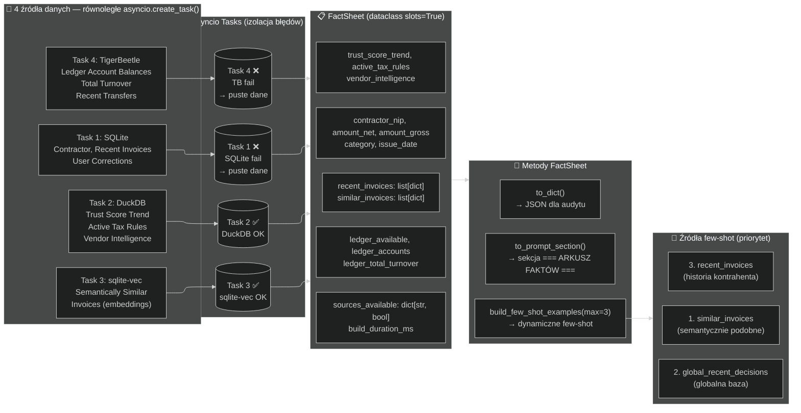
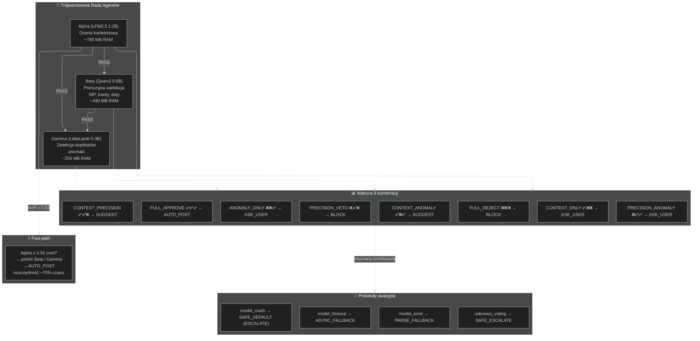
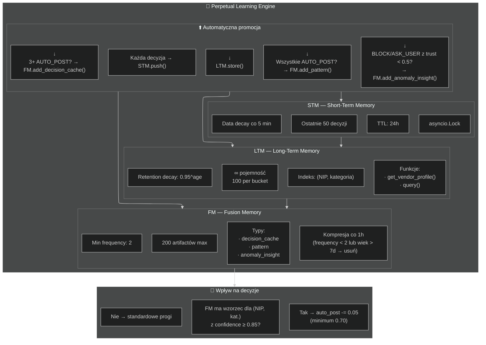
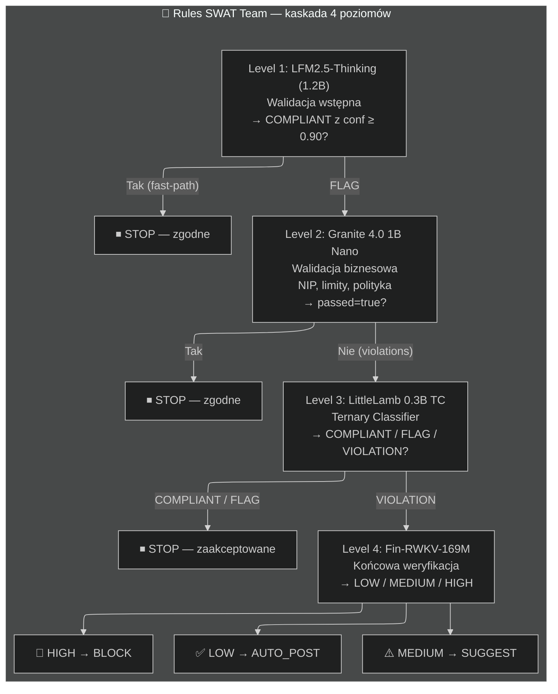
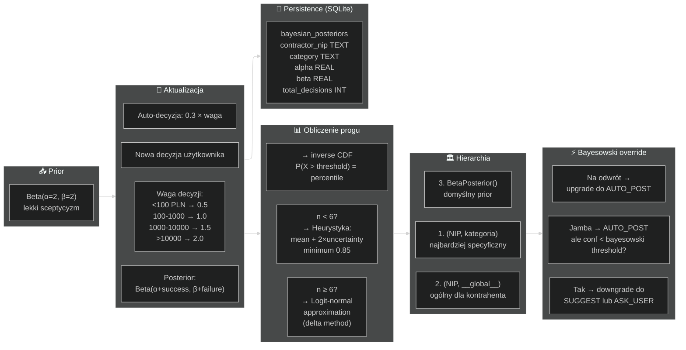
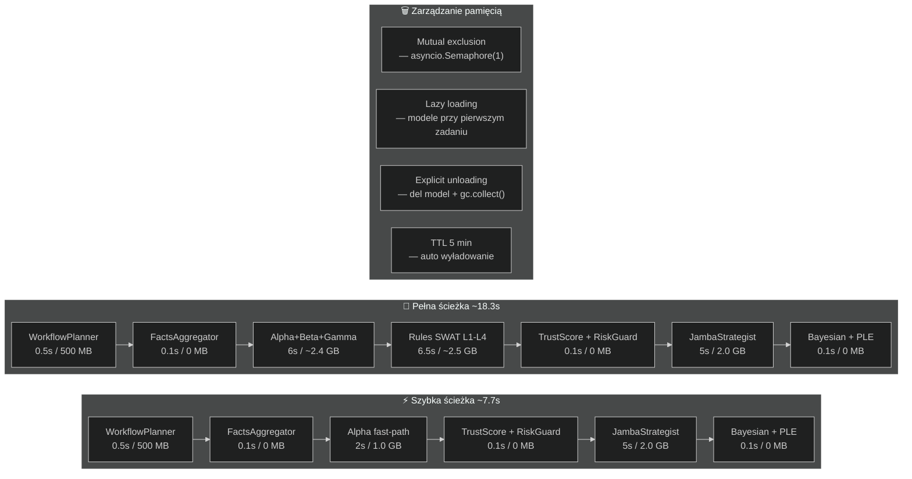
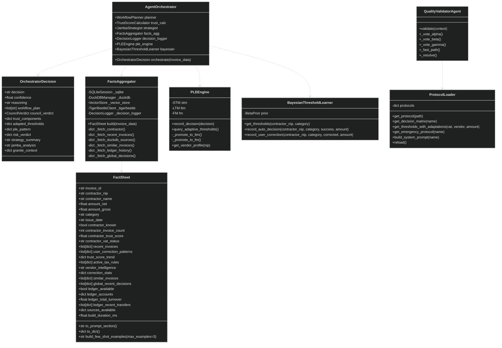

# Diagram Architektury NexusAI

> **Wersja:** 2.0
> **Data:** 2026-06-09
> **Format:** Mermaid.js (flowchart, sequence, C4, state, class)

---

## Spis diagramów

1. Diagram warstwowy — 4 warstwy architektury
2. Przepływ decyzyjny AgentOrchestrator
3. Struktura RAG / FactsAggregator
4. Council of Agents — matryca 8 kombinacji
5. Trójwarstwowa pamięć PLE
6. Kaskada Rules SWAT Team
7. Bayesowskie adaptacyjne progi
8. Ekonomia poznawcza — koszty i wydajność
9. Diagram klas — FactSheet i OrchestratorDecision
10. Full system context — C4 poziom 1

---

## 1. Diagram warstwowy

```mermaid
%%{init: {"flowchart": {"defaultRenderer": "elk"}, "theme": "dark", "themeVariables": {"fontSize": "14px", "primaryColor": "#1a1a2e", "secondaryColor": "#16213e", "tertiaryColor": "#0f3460"}}}%%
flowchart TB
    subgraph Warstwa0["🧠 Warstwa Orkiestracyjna"]
        direction TB
        AO["AgentOrchestrator\ncentralny mózg"]
        WP["WorkflowPlanner\nLittleLamb 0.3B\nsimple vs complex"]
        TC["TrustScoreCalculator\n5 komponentów\nai 0.30 + vendor 0.25 + data 0.20 + context 0.10 + risk 0.15"]
        JS["JambaStrategist\nJamba 3B\nAUTO_POST / SUGGEST / ESCALATE"]
        AO --> WP
        AO --> TC
        AO --> JS
    end

    subgraph Warstwa1["⚡ Warstwa Agentów i RAG"]
        direction TB
        RAG["FactsAggregator\nRAG Layer"]
        COA["Council of Agents"]
        RST["Rules SWAT Team"]
        PLE["PLE Engine"]
        RAG --> COA
        RAG --> RST
        COA --> JS
        RST --> JS
        PLE --> AO
    end

    subgraph Warstwa2["💾 Warstwa Danych"]
        direction TB
        SQL[("SQLite + SQLCipher\nOLTP")]
        DDB[("DuckDB\nOLAP")]
        SVEC[("sqlite-vec\nWektory")]
        TBDB[("TigerBeetle\nSecure Ledger")]
        SOP[("ProtocolLoader\nprotocols.toml")]
    end

    subgraph Warstwa3["📈 Warstwa Uczenia"]
        direction TB
        BL["BayesianThresholdLearner\nBeta posterior per (NIP, kat.)"]
        DL["DecisionLogger\ncouncil_decisions\ntrust_score_cache"]
        SG["SemanticGuard\nanomaly_rules\nsqlite-vec"]
        RG["RiskGuard\nrisk_thresholds"]
    end

    %% Połączenia między warstwami
    RAG --> SQL
    RAG --> DDB
    RAG --> SVEC
    RAG --> TBDB
    AO --> SOP
    BL --> JS
    DL --> RAG
    SG --> RAG
    RG --> TC
    PLE --> BL
    PLE --> DL
    PLE --> COA
    WP --> RAG

    style Warstwa0 fill:#1a1a2e,stroke:#e94560,stroke-width:2px
    style Warstwa1 fill:#16213e,stroke:#0f3460,stroke-width:2px
    style Warstwa2 fill:#0f3460,stroke:#533483,stroke-width:2px
    style Warstwa3 fill:#1a1a2e,stroke:#e94560,stroke-width:2px,stroke-dasharray:5,5
```



---

## 2. Przepływ decyzyjny

```mermaid
%%{init: {"sequence": {"showSequenceNumbers": true}, "theme": "dark"}}%%
sequenceDiagram
    actor User as Użytkownik
    participant AO as AgentOrchestrator
    participant RAG as FactsAggregator
    participant DB as SQLite/DuckDB
    participant WP as WorkflowPlanner
    participant CA as Council of Agents
    participant TC as TrustScoreCalculator
    participant RG as RiskGuard
    participant JS as JambaStrategist
    participant BL as BayesianThreshold
    participant PLE as PLE Engine
    participant DL as DecisionLogger

    Note over AO,DL: Krok 0 — RAG
    AO->>+RAG: build(invoice_data)
    RAG->>DB: 4 źródła równolegle
    DB-->>RAG: FactSheet
    RAG-->>-AO: FactSheet

    Note over AO,DL: Krok 1 — Plan
    AO->>+WP: plan(invoice_data, fact_sheet_text)
    WP-->>-AO: plan [simple / complex]

    Note over AO,DL: Krok 1b — Few-shot
    AO->>RAG: build_few_shot_examples()
    RAG-->>AO: few_shot_text

    alt Simple (fast-path)
        Note over AO,DL: Krok 2a — Alpha fast-path
        AO->>+CA: Alpha (LFM2.5)
        CA-->>-AO: APPROVE ≥ 0.92 → AUTO_POST
    else Complex
        Note over AO,DL: Krok 2b — Pełna rada
        AO->>+CA: Alpha + Beta + Gamma
        CA-->>-AO: council_verdict + trust_score
        AO->>+TC: calculate()
        TC-->>-AO: trust_components
        AO->>+RG: evaluate()
        RG-->>-AO: risk_verdict
    end

    Note over AO,DL: Krok 3 — Strategia
    AO->>+JS: analyze(fact_sheet, few_shot, raporty)
    JS-->>-AO: jamba_result

    Note over AO,DL: Krok 4 — Bayesowski override
    AO->>+BL: get_thresholds(contractor_nip, category)
    BL-->>-AO: adapted_thresholds
    Note over AO: if confidence < threshold → downgrade

    Note over AO,DL: Krok 5 — PLE
    AO->>+PLE: record_decision()
    PLE-->>-AO: ple_pattern

    Note over AO,DL: Krok 6 — Logowanie
    AO->>+DL: log_decision()
    DL-->>-AO: logged

    AO-->>-User: OrchestratorDecision
```

---

## 3. Struktura RAG



---

## 4. Council of Agents



---

## 5. Trójwarstwowa pamięć PLE



---

## 6. Kaskada Rules SWAT Team



---

## 7. Bayesowskie adaptacyjne progi



---

## 8. Ekonomia poznawcza



---

## 9. Diagram klas



---

## 10. Full System Context — C4

```mermaid
%%{init: {"flowchart": {"defaultRenderer": "elk"}, "theme": "dark"}}%%
flowchart TB
    User(("👤 Użytkownik\n(Księgowy / CFO)"))
    External("📄 System zewnętrzny\n(OCR, API bankowe,\nKSeF, GUS BIR)")

    subgraph System["NexusAI — System decyzyjny"]
        direction TB

        subgraph API["🔌 API / CLI"]
            API1["FastAPI / CLI\nPunkt wejścia"]
            API2["Background Tasks\nCelery / asyncio"]
        end

        subgraph Core["🧠 Core"]
            C1["AgentOrchestrator\nKoordynator"]
            C2["FactsAggregator\nRAG Layer"]
            C3["ProtocolLoader\nSOP Engine"]
        end

        subgraph Agents["🤖 Agenci"]
            A1["WorkflowPlanner\nLittleLamb 0.3B"]
            A2["Council of Agents\nAlpha / Beta / Gamma"]
            A3["Rules SWAT Team\nL1-L4 kaskada"]
            A4["JambaStrategist\nJamba 3B"]
        end

        subgraph Learning["📚 Uczenie"]
            L1["PLE Engine\nSTM / LTM / FM"]
            L2["BayesianThreshold\nBeta posterior"]
            L3["DecisionLogger\nDuckDB"]
            L4["SemanticGuard\nsqlite-vec"]
            L5["RiskGuard\nDuckDB"]
        end

        subgraph Storage["💾 Przechowywanie"]
            S1[("SQLite + SQLCipher\nInvoice, Contractor")]
            S2[("DuckDB\nAnalytics, Rules")]
            S3[("sqlite-vec\nEmbeddings")]
            S4[("TigerBeetle\nSecure Ledger")]
            S5[("Config\nprotocols.toml")]
        end
    end

    User --> API1
    External --> API1
    API1 --> C1
    C1 --> C2
    C1 --> C3
    C1 --> A1
    C1 --> A2
    C1 --> A3
    C1 --> A4
    C1 --> L1
    C1 --> L2
    C1 --> L3
    C2 --> S1
    C2 --> S2
    C2 --> S3
    C2 --> S4
    A2 --> L4
    A4 --> L5
    L2 --> S1
    L3 --> S2
    L4 --> S3
    C3 --> S5

    style System fill:#1a1a2e,stroke:#e94560,stroke-width:2px
    style API fill:#16213e,stroke:#0f3460
    style Core fill:#0f3460,stroke:#533483
    style Agents fill:#1a1a2e,stroke:#e94560
    style Learning fill:#16213e,stroke:#0f3460
    style Storage fill:#0f3460,stroke:#533483
```



---

> **Dokumentacja techniczna** — NexusAI v2.0
> **Ostatnia aktualizacja:** 2026-06-09
> **Plik:** `docs/ARCHITECTURE_DIAGRAM.md`
