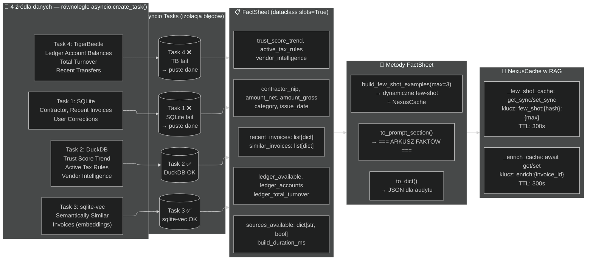
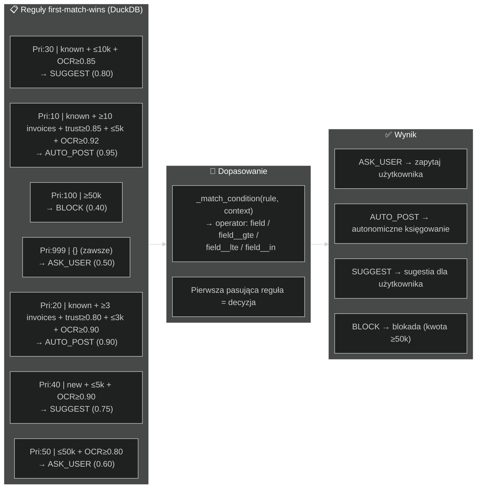
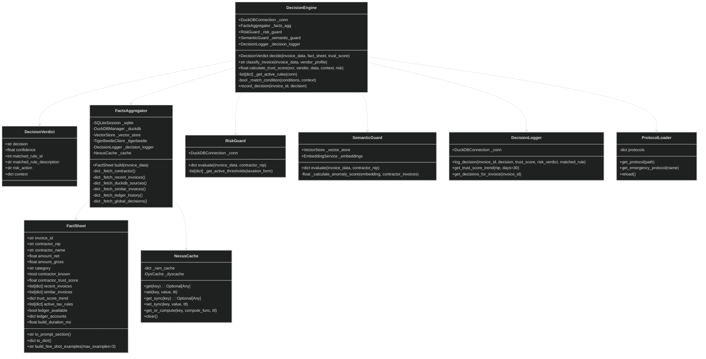
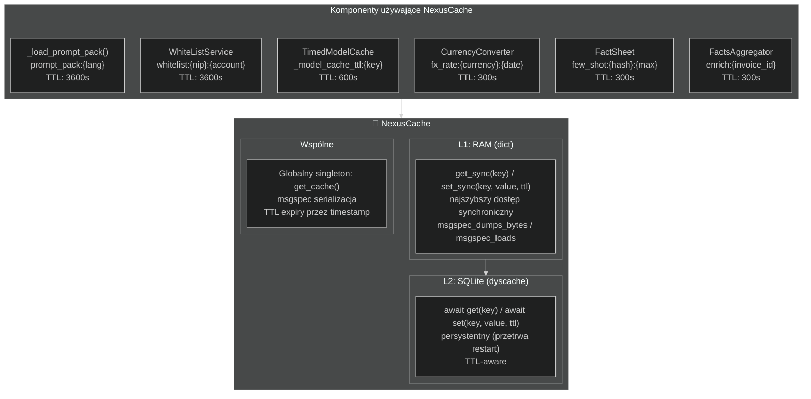
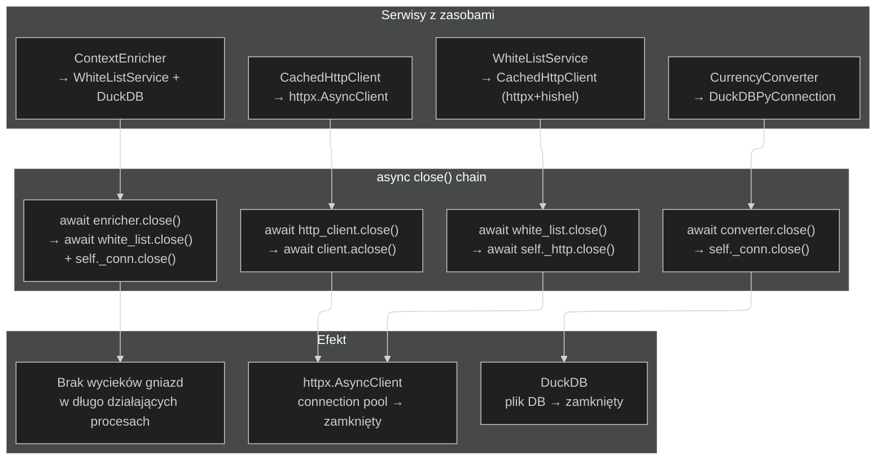
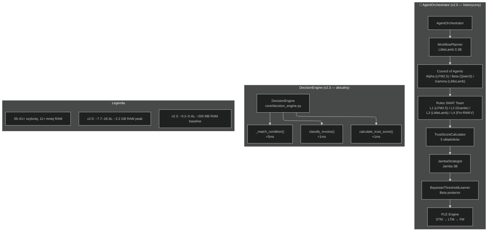

# Diagram Architektury NexusAI

> **Wersja:** 2.3
> **Data:** 2026-06-10
> **Format:** Mermaid.js (flowchart, sequence, C4)

---

## Spis diagramów

1. [Diagram warstwowy — 4 warstwy architektury](#1-diagram-warstwowy)
2. [Przepływ decyzyjny DecisionEngine](#2-przepływ-decyzyjny-decisionengine)
3. [Struktura RAG / FactsAggregator](#3-struktura-rag--factsaggregator)
4. [Macierz decyzyjna — first-match-wins](#4-macierz-decyzyjna)
5. [Diagram klas — komponenty decyzyjne](#5-diagram-klas)
6. [Ekonomia poznawcza — koszty i wydajność](#6-ekonomia-poznawcza)
7. [NexusCache — dwupoziomowa architektura cache](#7-nexuscache)
8. [Full system context — C4 poziom 1](#8-full-system-context)
9. [Cleanup lifecycle — async close()](#9-cleanup-lifecycle)
10. [Architektura v2.0 (historyczna)](#10-architektura-v20-historyczna)

---

## 1. Diagram warstwowy

```mermaid
%%{init: {"flowchart": {"defaultRenderer": "elk"}, "theme": "dark", "themeVariables": {"fontSize": "14px", "primaryColor": "#1a1a2e", "secondaryColor": "#16213e", "tertiaryColor": "#0f3460"}}}%%
flowchart TB
    subgraph Warstwa0["🧠 Warstwa Decyzyjna"]
        direction TB
        DE["DecisionEngine\ncore/decision_engine.py"]
        CI["classify_invoice()\nsimple / complex\n<1ms"]
        TS["calculate_trust_score()\n5 składników\n<1ms"]
        FW["_match_condition()\nfirst-match-wins\n<5ms"]
        DE --> CI
        DE --> TS
        DE --> FW
    end

    subgraph Warstwa1["⚡ Warstwa Wsparcia"]
        direction TB
        RAG["FactsAggregator\nRAG Layer\n4 źródła równolegle"]
        RG["RiskGuard\nDuckDB thresholdy\nper-pole confidence"]
        SG["SemanticGuard\nsqlite-vec\nanomalie semantyczne"]
        DL["DecisionLogger\nDuckDB\naudyt + trend"]
    end

    subgraph Warstwa2["💾 Warstwa Danych"]
        direction TB
        SQL[("SQLite + SQLCipher\nOLTP")]
        DDB[("DuckDB\nOLAP")]
        SVEC[("sqlite-vec\nWektory")]
        TBDB[("TigerBeetle\nSecure Ledger")]
        SOP[("ProtocolLoader\nprotocols.toml")]
        CACHE[("NexusCache\nL1 RAM + L2 SQLite")]
    end

    subgraph Warstwa3["🤖 Warstwa AI (tylko niefinansowe)"]
        direction TB
        OCR["LightOnOCR-1B\nOCR główny"]
        VA["Phi-3-mini 3.8B\nVisionAgent (fallback)"]
        EMB["llama-cpp-python\nEmbeddingi"]
    end

    %% Połączenia
    DE --> RAG
    DE --> RG
    DE --> SG
    DE --> DL
    RAG --> SQL
    RAG --> DDB
    RAG --> SVEC
    RAG --> TBDB
    RAG --> CACHE
    DE --> SOP
    RG --> DDB
    SG --> SVEC
    DL --> DDB

    style Warstwa0 fill:#1a1a2e,stroke:#e94560,stroke-width:2px
    style Warstwa1 fill:#16213e,stroke:#0f3460,stroke-width:2px
    style Warstwa2 fill:#0f3460,stroke:#533483,stroke-width:2px
    style Warstwa3 fill:#1a1a2e,stroke:#e94560,stroke-width:2px,stroke-dasharray:5,5
```



---

## 2. Przepływ decyzyjny DecisionEngine

```mermaid
%%{init: {"sequence": {"showSequenceNumbers": true}, "theme": "dark"}}%%
sequenceDiagram
    actor User as Użytkownik
    participant DE as DecisionEngine
    participant RAG as FactsAggregator
    participant DB as DuckDB
    participant RG as RiskGuard
    participant DL as DecisionLogger
    participant SRC as SQLite/sqlite-vec/TB

    Note over DE,SRC: Krok 0 — RAG
    DE->>+RAG: build(invoice_data)
    RAG->>SRC: 4 źródła równolegle
    SRC-->>RAG: FactSheet
    RAG-->>-DE: FactSheet

    Note over DE,SRC: Krok 1 — Klasyfikacja
    DE->>DE: classify_invoice()
    DE-->>DE: simple / complex

    Note over DE,SRC: Krok 2 — Trust score
    DE->>DE: calculate_trust_score()
    DE-->>DE: 0.0–1.0

    Note over DE,SRC: Krok 3 — Reguły
    DE->>DB: _get_active_rules()
    DB-->>DE: rules sorted by priority
    loop Dla każdej reguły
        DE->>DE: _match_condition()
        alt Pasuje
            DE->>DE: first-match → break
        end
    end

    Note over DE,SRC: Krok 4 — Risk
    DE->>+RG: evaluate()
    RG->>DB: risk_thresholds
    DB-->>RG: thresholdy
    RG-->>-DE: risk_verdict

    Note over DE,SRC: Krok 5 — Logowanie
    DE->>+DL: log_decision()
    DL->>DB: INSERT
    DL-->>-DE: logged

    DE-->>-User: DecisionVerdict
```

---

## 3. Struktura RAG / FactsAggregator



---

## 4. Macierz decyzyjna



---

## 5. Diagram klas



---

## 6. Ekonomia poznawcza

```mermaid
%%{init: {"flowchart": {"defaultRenderer": "elk"}, "theme": "dark"}}%%
flowchart LR
    subgraph SzybkaSciezka["⚡ Ścieżka decyzyjna ~0.2s"]
        S1["RAG (FactsAggregator)\n~100-300ms"]
        S2["Klasyfikacja\n<1ms"]
        S3["Trust score\n<1ms"]
        S4["DecisionEngine\n<5ms"]
        S5["RiskGuard\n<10ms"]
        S6["DecisionLogger\n<5ms"]
        S1 --> S2 --> S3 --> S4 --> S5 --> S6
    end

    subgraph Porownanie["📊 Porównanie z v2.0"]            V1["v2.3: ~0.2-0.4s | ~200 MB RAM"]
        V2["v2.0: ~7.7-18.3s | ~2.2 GB RAM"]
    end

    subgraph AIOnly["🤖 Tylko zadania AI"]
        A1["LightOnOCR-1B: ~800 MB RAM\nOCR faktur"]
        A2["Phi-3-mini: ~2.2 GB RAM\nVisionAgent (fallback)"]
        A3["llama-cpp-python: ~300 MB\nEmbeddingi"]
    end

    subgraph MemMgmt["🗑️ Zarządzanie pamięcią"]
        M1["Lazy loading\n— modele przy pierwszym zadaniu"]
        M2["Explicit unloading\n— del model + gc.collect()"]
        M3["Mutual exclusion\n— asyncio.Semaphore(1)"]
        M4["TTL 5 min\n— auto wyładowanie"]
    end
```

---

## 7. NexusCache — dwupoziomowa architektura cache



---

## 8. Full System Context — C4 poziom 1

```mermaid
%%{init: {"flowchart": {"defaultRenderer": "elk"}, "theme": "dark"}}%%
flowchart TB
    User(("👤 Użytkownik\n(Księgowy / CFO)"))
    External("📄 System zewnętrzny\n(OCR, API bankowe,\nKSeF, GUS BIR)")

    subgraph System["NexusAI — System decyzyjny v2.3"]
        direction TB

        subgraph API["🔌 API / CLI"]
            API1["Litestar / CLI\nPunkt wejścia"]
            API2["Background Tasks\nTaskiq + NATS"]
        end

        subgraph Core["🧠 Core"]
            C1["DecisionEngine\nSilnik decyzyjny"]
            C2["FactsAggregator\nRAG Layer"]
            C3["ProtocolLoader\nSOP Engine"]
            C4["NexusCache\nL1 RAM + L2 SQLite"]
        end

        subgraph Guards["🛡️ Strażnicy"]
            G1["RiskGuard\nDuckDB thresholdy"]
            G2["SemanticGuard\nsqlite-vec"]
        end

        subgraph Audit["📝 Audyt"]
            A1["DecisionLogger\nDuckDB"]
        end

        subgraph Storage["💾 Przechowywanie"]
            S1[("SQLite + SQLCipher\nInvoice, Contractor")]
            S2[("DuckDB\nAnalytics, Rules")]
            S3[("sqlite-vec\nEmbeddings")]
            S4[("TigerBeetle\nSecure Ledger")]
            S5[("Config\nprotocols.toml")]
        end

        subgraph AI["🤖 AI (tylko niefinansowe)"]
            AI1["LightOnOCR-1B\nOCR"]
            AI2["Phi-3-mini\nVisionAgent"]
            AI3["llama-cpp-python\nEmbeddingi"]
        end
    end

    User --> API1
    External --> API1
    API1 --> C1
    C1 --> C2
    C1 --> G1
    C1 --> G2
    C1 --> A1
    C1 --> C3
    C2 --> S1
    C2 --> S2
    C2 --> S3
    C2 --> S4
    C2 --> C4
    G1 --> S2
    G2 --> S3
    A1 --> S2
    C3 --> S5

    style System fill:#1a1a2e,stroke:#e94560,stroke-width:2px
    style API fill:#16213e,stroke:#0f3460
    style Core fill:#0f3460,stroke:#533483
    style Guards fill:#1a1a2e,stroke:#e94560
    style Audit fill:#16213e,stroke:#0f3460
    style Storage fill:#0f3460,stroke:#533483
    style AI fill:#1a1a2e,stroke:#e94560,stroke-dasharray:5,5
```



---

## 9. Cleanup lifecycle — async close()



| Serwis | Zasób | Metoda |
|---|---|---|
| `WhiteListService` | `CachedHttpClient` (httpx + hishel) | `await self._http.close()` |
| `CurrencyConverter` | `DuckDBPyConnection` | `self._conn.close()` |
| `ContextEnricher` | `WhiteListService` + DuckDB | `await self._white_list.close()` + `self._conn.close()` |
| `CachedHttpClient` | `httpx.AsyncClient` (connection pool) | `await self._client.aclose()` |

---

## 10. Architektura v2.0 (historyczna)

Poprzednia architektura wieloagentowa została uproszczona. Poniższy diagram jest zachowany jako dokumentacja stanu poprzedniego.



### Komponenty v2.0 → v2.3

| Komponent v2.0 | Model | Zastąpiony przez |
|---|---|---|
| Council of Agents | Alpha (LFM2.5), Beta (Qwen3), Gamma (LittleLamb) | `DecisionEngine.decide()` + DuckDB `decision_rules` |
| WorkflowPlanner | LittleLamb 0.3B | `classify_invoice()` |
| JambaStrategist | Jamba 3B | `DecisionEngine.decide()` |
| Rules SWAT Team | LFM2.5, Granite, LittleLamb, Fin-RWKV | Hierarchiczne reguły DuckDB |
| TrustScoreCalculator | — | `calculate_trust_score()` |
| PLE Engine | — | `DecisionLogger.get_trust_score_trend()` |
| BayesianThresholdLearner | — | Statystyki w DuckDB |
| AgentOrchestrator | — | `services/council_session.py`, `services/autopilot.py` (DEPRECATED) |

---

> **Dokumentacja techniczna** — NexusAI v2.3
> **Ostatnia aktualizacja:** 2026-06-10
> **Plik:** `docs/ARCHITECTURE_DIAGRAM.md`
