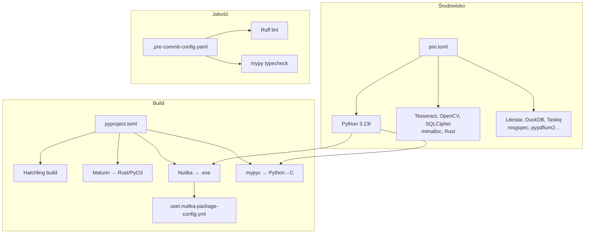

# 🔧 Konfiguracja Builda i Środowiska

> **Pliki:** `pixi.toml`, `pyproject.toml`, `.pre-commit-config.yaml`, `user.nuitka-package-config.yml`, `start.sh`
> **Status:** Stabilny · **Wersja:** 2.3.1-dev
> **Ostatnia aktualizacja:** 2026-07-05

---

## 1. Przegląd

NexusAI używa **trzech poziomów** konfiguracji build i środowiska:

| Poziom | Plik | Odpowiedzialność |
|---|---|---|
| **Environment Manager** | `pixi.toml` | Python, system deps, taski, zmienne środowiskowe |
| **Build Backend** | `pyproject.toml` | Hatchling, Maturin (Rust), Nuitka, narzędzia dev |
| **Pre-commit** | `.pre-commit-config.yaml` | Jakość kodu przed commitem |
| **Nuitka config** | `user.nuitka-package-config.yml` | Zaawansowane pakiety Nuitka |
| **Start script** | `start.sh` | Szybki start deweloperski |

### Diagram



---

## 2. Pixi — Environment Manager

**Plik:** `pixi.toml`

### Instalacja

```bash
curl -fsSL https://pixi.sh/install.sh | sh
pixi install        # Stwórz środowisko (tylko runtime)
pixi shell          # Aktywuj shell
```

### Zależności systemowe

```toml
[dependencies]
python = { version = "3.13.*", build = "*_cp313t" }  # Free-threaded
tesseract = ">=5.3.0"           # OCR
libopencv = ">=4.9.0"           # Image preprocessing
mimalloc = ">=2.1.0"            # Memory allocator
rust = ">=1.78.0"               # Rust toolchain
```

### Kluczowe taski pixi

| Task | Komenda | Opis |
|---|---|---|
| **dev** | `pixi run dev` | Pełne środowisko: NATS + TB + API + Worker |
| **api** | `pixi run api` | Serwer API (Granian + Litestar) |
| **worker** | `pixi run worker` | Worker Taskiq + NATS |
| **test** | `pixi run test` | Testy (pytest -x -v) |
| **typecheck** | `pixi run typecheck` | mypy strict |
| **build-rust** | `pixi run build-rust` | Kompilacja Rust (Maturin develop) |
| **mypyc-optimize** | `pixi run mypyc-optimize` | Kompilacja Python → C |
| **build-nuitka** | `pixi run build-nuitka` | Build Nuitka .exe |
| **migrate** | `pixi run migrate` | Migracje bazy danych |
| **seed** | `pixi run seed` | Załaduj dane demo |
| **deploy** | `pixi run deploy` | Wdrożenie produkcyjne |
| **doctor** | `pixi run doctor` | Diagnostyka systemu |

### Zmienne środowiskowe (activation.env)

```toml
[activation.env]
NEXUS_LOG_LEVEL = "info"
NEXUS_HOST = "127.0.0.1"
NEXUS_PORT = "8000"
NEXUS_DB_PATH = "${PIXI_PROJECT_ROOT}/app_data/nexus.db"

# Granian konfiguracja
NEXUS_GRANIAN_BACKLOG = "2048"
NEXUS_GRANIAN_HTTP = "auto"
NEXUS_GRANIAN_METRICS = "true"
NEXUS_GRANIAN_METRICS_ADDRESS = "127.0.0.1"
NEXUS_GRANIAN_METRICS_PORT = "9090"

# mimalloc — przeładowanie alokatora przez LD_PRELOAD
LD_PRELOAD = "$CONDA_PREFIX/lib/libmimalloc.so"
MIMALLOC_LARGE_OS_PAGES = "1"
MIMALLOC_RESERVE_HUGE_OS_PAGES = "1"
MIMALLOC_EAGER_COMMIT_DELAY = "0"
```

### Środowiska

| Środowisko | Instalacja | Użycie |
|---|---|---|
| **prod** (domyślne) | `pixi install` | Tylko runtime |
| **dev** | `pixi install --environment dev` | Runtime + dev tools (pytest, ruff, mypy, locust, crosshair) |

Taski produkcyjne mają prefix `prod:`:

```bash
pixi run prod:api          # API w produkcji
pixi run prod:migrate      # Migracje w produkcji
pixi run prod:deploy       # Wdrożenie produkcyjne
```

---

## 3. pyproject.toml — Build Backend

### Build System

```toml
[build-system]
requires = ["hatchling>=1.21", "hatch-vcs>=0.4", "maturin>=1.5"]
build-backend = "hatchling.build"
```

### Maturin — Rust/PyO3

```toml
[tool.maturin]
module-name = "nexus_crypto._core"
manifest-path = "nexus_ai/rust/Cargo.toml"
features = ["pyo3/extension-module"]
compatibility = "linux"
strip = true
```

### Mypyc — kompilacja Python → C

```toml
[tool.mypyc]
packages = [
    "nexus_ai/tax",
    "nexus_ai/core",
    "nexus_ai/services",
    "nexus_ai/db",
    "nexus_ai/events",
]
```

Kompilacja mypyc daje 2-5× przyspieszenie dla krytycznych modułów (tax, services).

### Ruff — linter

```toml
[tool.ruff.lint]
select = ["E", "F", "I", "W", "N", "UP", "S", "B", "RUF"]
ignore = ["E501", "N999"]
```

### Mypy — type checker (strict mode)

```toml
[tool.mypy]
strict = true
disallow_untyped_defs = true
```

### Crosshair — SMT property-based testing

```toml
[tool.crosshair]
max_examples = 500
max_unfold = 5
per_condition = 10.0
per_test_timeout = 30.0
```

### Nuitka — kompilacja do .exe

```toml
[tool.nuitka]
onefile = true
standalone = true
lto = true
enable-plugin = ["anti-bloat", "mimalloc", "multiprocessing", "trio"]
```

**Nuitka dołącza pakiety:**
- `include-package`: nexus_ai, nexus_crypto, granian, litestar, duckdb, polars, llama_cpp, msgspec, stamina, nats, taskiq, loguru, structlog, pendulum, opentelemetry, fsspec, sqlite_vec, anyio, lxml, PIL
- `include-data-dir`: nexus_ai/config, app_data, assets, migrations
- `nofollow-import-to`: tkinter, unittest, distutils, pip, pdb, test, itp.

### Hatch environments

```bash
# Test matrix: Python 3.13 + 3.13t (free-threaded)
hatch run test:run          # Python 3.13
hatch run test.3.13t:run    # Python 3.13t

# Lint
hatch run lint:check

# Typecheck
hatch run typecheck:check

# Release
hatch run release:dry-run   # Suchy przebieg
hatch run release:full      # Build + publish + git tag
```

---

## 4. Pre-commit Hooks

**Plik:** `.pre-commit-config.yaml`

```yaml
repos:
  - repo: https://github.com/astral-sh/ruff-pre-commit
    rev: v0.3.0
    hooks:
      - id: ruff          # Linter
      - id: ruff-format   # Formatter
  
  - repo: https://github.com/pre-commit/mirrors-mypy
    rev: v1.8.0
    hooks:
      - id: mypy          # Type checker

  - repo: https://github.com/pre-commit/pre-commit-hooks
    rev: v4.5.0
    hooks:
      - id: trailing-whitespace
      - id: end-of-file-fixer
      - id: check-yaml
      - id: check-toml
      - id: check-added-large-files
      - id: check-merge-conflict
      - id: detect-private-key
```

### Instalacja

```bash
pre-commit install
pre-commit run --all-files  # Ręczne uruchomienie
```

---

## 5. Nuitka Package Config

**Plik:** `user.nuitka-package-config.yml`

Zaawansowana konfiguracja dla pakietów wymagających natywnych DLL/SO:

```yaml
# Konfiguracja dla llama-cpp-python (GGUF inference)
- module-name: "llama_cpp"
  data-files:
    patterns: ["*.so", "*.dylib", "*.dll"]

# Konfiguracja dla DuckDB
- module-name: "duckdb"
  data-files:
    patterns: ["*.so", "*.dylib"]

# Konfiguracja dla OpenCV
- module-name: "cv2"
  data-files:
    patterns: ["*.so"]

# Konfiguracja dla silników OCR
- module-name: "paddleocr"
- module-name: "doctr"
- module-name: "easyocr"

# Konfiguracja dla sqlite-vec
- module-name: "sqlite_vec"
  data-files:
    patterns: ["*.so"]
```

---

## 6. Start Script

**Plik:** `start.sh`

Szybki skrypt startowy dla środowiska deweloperskiego:

```bash
#!/bin/bash
git pull origin main        # Pobierz najnowszy kod
fastcode                     # Auto-formatowanie
git add -A                   # Stage wszystkich zmian
git commit -m "Freebuff: auto-commit [$(date +'%Y-%m-%d %H:%M:%S')]"
git push origin main         # Push do main
```

> **Uwaga:** Skrypt `start.sh` jest narzędziem deweloperskim (Freebuff auto-commit), NIE do użytku produkcyjnego.

---

## 7. Taski CI/CD w pixi

### Test i jakość kodu

```bash
pixi run lint               # ruff check
pixi run format-check       # ruff format --check
pixi run typecheck          # mypy strict
pixi run test               # pytest -x -v
pixi run test-cov           # pytest --cov
pixi run security-scan      # ruff S rules
```

### Build

```bash
pixi run build-rust              # Maturin develop
pixi run build-rust-release      # Maturin release
pixi run mypyc-optimize          # Python → C
pixi run build-nuitka            # Nuitka .exe
pixi run build-nuitka-fast       # Nuitka standalone
```

### Deploy

```bash
pixi run deploy                  # test → build → migrate → restart
pixi run deploy-quick            # build-rust → migrate → restart
pixi run deploy-check            # Suchy przebieg
pixi run rollback                # Cofnij ostatnie wdrożenie
```

---

> **Zobacz również:**
> - [`INSTALLATION.md`](INSTALLATION.md) — Instalacja i konfiguracja
> - [`DEPLOYMENT.md`](DEPLOYMENT.md) — Wdrożenie i deployment
> - [`CONTRIBUTING.md`](CONTRIBUTING.md) — Standardy kodowania
> - [`WORKFLOWS.md`](WORKFLOWS.md) — CI/CD GitHub Actions
> - [`CONFIG.md`](CONFIG.md) — Konfiguracja aplikacji (TOML)
