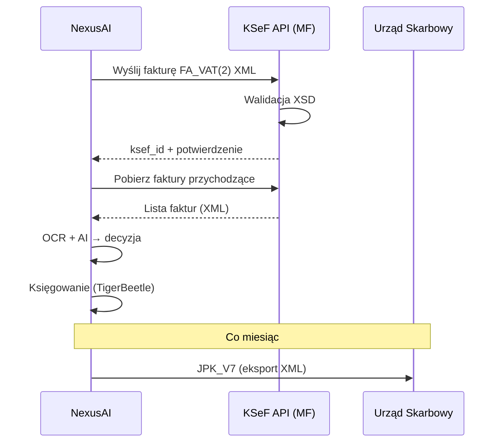
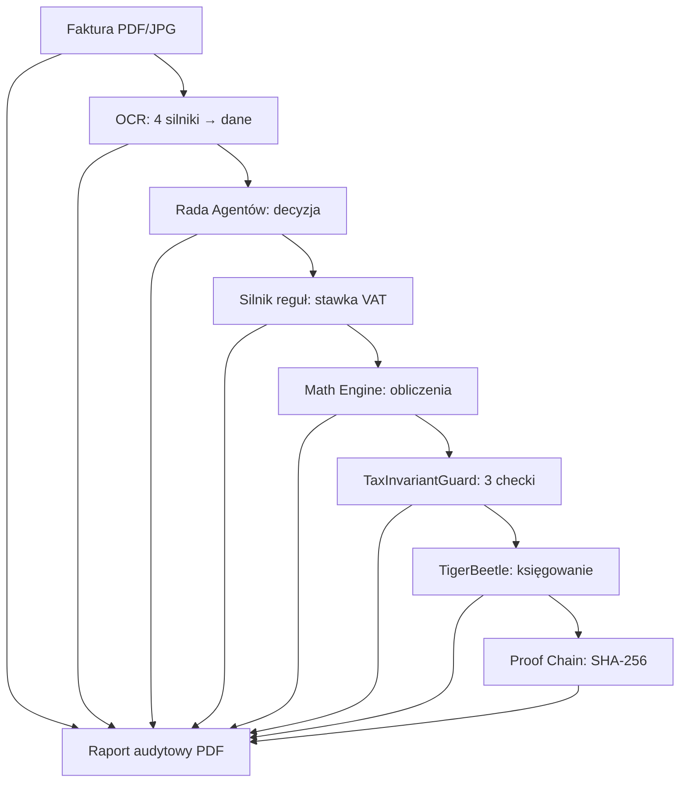

# 📋 Zgodność z przepisami (Compliance)

> **Cel:** Udokumentować zgodność NexusAI z polskimi i międzynarodowymi przepisami księgowymi.  
> **Kiedy czytać:** Przed audytem księgowym; przed wdrożeniem produkcyjnym.

---

## 1. Zgodność z przepisami księgowymi

### 1.1 Ustawa o Rachunkowości (UoR)

NexusAI jest zgodny z **Ustawą z dnia 29 września 1994 r. o rachunkowości** (Dz.U. 1994 nr 121 poz. 591 z późn. zm.):

| Wymóg UoR | Implementacja |
|---|---|
| **Art. 4 — Zasada memoriałowa** | Każda faktura księgowana w dacie obowiązku podatkowego |
| **Art. 6 — Rzetelność** | TaxInvariantGuard — 3 niezmienniki matematyczne |
| **Art. 7 — Dokumentacja** | Audit Log — każda zmiana rejestrowana |
| **Art. 13 — Okres przechowywania** | `retention_period_years=5` (konfigurowalne) |
| **Art. 20 — Dowody księgowe** | Proof Chain SHA-256 — niezmienny łańcuch |
| **Art. 22 — Korekty** | Storno czerwone/czarne (audit_storno.py) |
| **Art. 24 — Księgi rachunkowe** | Double-entry (TigerBeetle) |
| **Art. 28 — Wycena** | FIFO, amortyzacja liniowa/degresywna |

### 1.2 Międzynarodowe Standardy (IFRS / MSSF)

| Standard | Implementacja |
|---|---|
| **IFRS 15** (Revenue) | Przychody z umów z klientami — dekretacja |
| **IFRS 16** (Leases) | Leasing — klasyfikacja i księgowanie |
| **IAS 2** (Inventories) | Zapasy — wycena FIFO |
| **IAS 12** (Income Taxes) | Odroczony podatek dochodowy |
| **IAS 16** (PPE) | Środki trwałe + amortyzacja |
| **IAS 21** (FX) | Rewaluacja walutowa (NBP) |

### 1.3 US GAAP

Podstawowa zgodność przez TigerBeetle (double-entry) i Polars (analityka GAAP-compliant). Pełna zgodność GAAP wymaga konfiguracji planu kont wg US GAAP Chart of Accounts.

---

## 2. KSeF (Krajowy System e-Faktur)

### 2.0 Przepływ faktury przez KSeF



> **📝 Wersja tekstowa (ASCII fallback):**
> ```
> PRZEPŁYW FAKTURY PRZEZ KSeF:
>
> NexusAI                KSeF API (MF)           Urząd Skarbowy
>    │                        │                        │
>    │─Wyślij FA_VAT(2)─────▶│                        │
>    │                     ┌──┴──┐                     │
>    │                     │Walid.│ (XSD)              │
>    │                     └──┬──┘                     │
>    │◀──ksef_id + potw.────│                        │
>    │                        │                        │
>    │─Pobierz przychodzące─▶│                        │
>    │◀──Lista faktur (XML)──│                        │
>    │                        │                        │
>    │ OCR + AI → decyzja     │                        │
>    │ Księgowanie (TB)       │                        │
>    │                        │                        │
>    │───JPK_V7 (co miesiąc)─────────────────────────▶│
> ```

### 2.1 Generowanie faktur ustrukturyzowanych

NexusAI generuje faktury w formacie **FA_VAT(2)** zgodnie ze schematem XSD Ministerstwa Finansów:

```python
# nexus_ai/services/ksef_generator.py
from xsdata.formats.dataclass.serializers import XmlSerializer

def generate_fa_vat(invoice: Invoice) -> str:
    """Generuj XML FA_VAT(2) dla faktury."""
    fa = KSeFFaktura(
        naglowek=Naglowek(
            kod_formularza="FA_VAT",
            wariant_formularza="2",
            data_wytworzenia=datetime.now(),
        ),
        podmiot=Podmiot(nip=company_nip, nazwa=company_name),
        faktura=Faktura(
            p_1=invoice.number,
            p_2a=invoice.issue_date,
            p_3a=nip_to_ksef(invoice.contractor_nip),
            # ... pełne mapowanie pól
        ),
    )
    return XmlSerializer().render(fa)
```

### 2.2 Walidacja XSD

Każda wygenerowana faktura jest walidowana względem oficjalnego schematu XSD przed wysyłką:

```python
from lxml import etree

schema = etree.XMLSchema(file="nexus_ai/integrations/ksef/schema/FA_VAT.xsd")
if not schema.validate(xml_tree):
    raise KSeFValidationError(schema.error_log)
```

### 2.3 Wysyłka do KSeF

```bash
# Wyślij fakturę do KSeF
curl -X POST http://127.0.0.1:8000/api/v1/ksef/send/{invoice_id} \
  -H "Authorization: Bearer $TOKEN"

# Response: {"ksef_id": "1234567890ABCDEF", "status": "sent"}
```

### 2.4 Pobieranie faktur z KSeF

```bash
curl http://127.0.0.1:8000/api/v1/ksef/inbox?from=2026-07-01 \
  -H "Authorization: Bearer $TOKEN"
```

---

## 3. JPK (Jednolity Plik Kontrolny)

### 3.1 Struktury JPK wspierane

| Struktura | Opis | Status |
|---|---|---|
| **JPK_V7M** | Ewidencja VAT (miesięczna) | ✅ |
| **JPK_V7K** | Ewidencja VAT (kwartalna) | ✅ |
| **JPK_FA** | Faktury VAT | ✅ |
| **JPK_KR** | Księgi rachunkowe | ✅ |
| **JPK_WB** | Wyciągi bankowe | ✅ |
| **JPK_PKPIR** | Podatkowa księga przychodów i rozchodów | ✅ |

### 3.2 Eksport JPK

```bash
# Wygeneruj JPK_V7M za czerwiec 2026
curl http://127.0.0.1:8000/api/v1/exports/jpk-v7m?period=2026-06 \
  -H "Authorization: Bearer $TOKEN"
# Response: XML gotowy do wysyłki do MF
```

---

## 4. Deklaracje podatkowe

### 4.1 VAT-7 / VAT-7K

Automatyczne generowanie deklaracji VAT na podstawie zaksięgowanych faktur:

- **Netto sprzedaży** — suma faktur sprzedażowych
- **Netto zakupów** — suma faktur kosztowych
- **VAT należny** — suma VAT od sprzedaży
- **VAT naliczony** — suma VAT od zakupów (z uwzględnieniem proporcji)
- **Do zapłaty / Do zwrotu** — różnica

### 4.2 CIT-8

Dla spółek (CIT):

- Przychody — faktury sprzedażowe
- Koszty uzyskania przychodów — faktury kosztowe kwalifikowane
- Dochód / Strata — różnica
- Podatek należny — dochód × 19% (lub 9% dla małego podatnika)

### 4.3 PIT-36 / PIT-36L

Dla JDG:

- **PIT-36** (skala podatkowa): 12% do 120 000 PLN, 32% powyżej
- **PIT-36L** (liniowy): 19% od dochodu
- **Ryczałt**: stawki 2%-17% w zależności od kodu PKWiU

---

## 5. Ścieżka audytu

### 5.0 Rekonstrukcja śladu audytu



> **📝 Wersja tekstowa (ASCII fallback):**
> ```
> ŚCIEŻKA AUDYTU — 8 warstw dowodu dla urzędu:
>
> [Faktura PDF/JPG] ─────────────────────────────┐
>        │                                        │
>        ▼                                        │
> [1. OCR: 4 silniki → dane + confidence]         │
>        │                                        │
>        ▼                                        │
> [2. Rada Agentów: decyzja + modele]             │
>        │                                        │
>        ▼                                        │
> [3. Silnik reguł: stawka VAT + rule_id]         │
>        │                                        │
>        ▼                                        │
> [4. Math Engine: netto, VAT, brutto w gr]       ├──▶ [RAPORT AUDYTOWY PDF]
>        │                                        │     (dla urzędu skarbowego)
>        ▼                                        │
> [5. TaxInvariantGuard: 3 niezmienniki ✅]       │
>        │                                        │
>        ▼                                        │
> [6. TigerBeetle: transfer double-entry]         │
>        │                                        │
>        ▼                                        │
> [7. Proof Chain: SHA-256] ──────────────────────┘
>
> Raport zawiera oryginalny dokument + każdy krok decyzji.
> ```

### 5.1 Odtworzenie decyzji krok po kroku

```sql
-- Pełna ścieżka audytu dla faktury inv-12345
SELECT 
    a.timestamp,
    a.user_id,
    a.action,
    a.field_changed,
    a.old_value,
    a.new_value
FROM audit_logs a
WHERE a.invoice_id = 'inv-12345'
ORDER BY a.timestamp ASC;

-- Decyzje podatkowe
SELECT 
    d.created_at,
    d.title,
    d.message,
    d.resolution
FROM dq_decisions d
WHERE d.reference_id = 'inv-12345'
ORDER BY d.created_at;

-- Transfery w księdze głównej
SELECT 
    lt.source_account,
    lt.target_account,
    lt.amount_minor,
    lt.status,
    lt.created_at
FROM ledger_transfers lt
WHERE lt.source_document_id = 'inv-12345';
```

### 5.2 Dowód dla urzędu skarbowego

NexusAI generuje raport audytowy w formacie PDF/HTML:

```bash
curl http://127.0.0.1:8000/api/v1/audit/report/inv-12345 \
  -H "Authorization: Bearer $TOKEN"
```

Raport zawiera:
1. Oryginalny dokument (PDF/JPG)
2. Dane wyciągnięte przez OCR (z metadanymi confidence)
3. Decyzję Rady Agentów (które modele, jakie confidence)
4. Zastosowaną regułę podatkową (rule_id, warunek, werdykt)
5. Obliczenia matematyczne (netto, VAT, brutto w groszach)
6. Wynik walidacji (TaxInvariantGuard)
7. Zapis w księdze głównej (TigerBeetle transfer)
8. Hash SHA-256 całego śladu

---

## 6. Przechowywanie danych

### 6.1 Okresy retencji zgodne z prawem

| Dokument | Okres | Podstawa prawna |
|---|---|---|
| Faktury VAT | 5 lat | Art. 86 § 1 Ordynacji podatkowej |
| Księgi rachunkowe | 5 lat | Art. 74 UoR |
| Dowody księgowe | 5 lat | Art. 74 UoR |
| Deklaracje podatkowe | 5 lat | Art. 70 § 1 Ordynacji podatkowej |
| Listy płac | 10 lat | Art. 125a Ustawy o emeryturach |
| Sprawozdania finansowe | Trwale | Art. 74 UoR |

### 6.2 Automatyczne czyszczenie

```sql
-- Faktury starsze niż retention_period_years są oznaczane jako usunięte
UPDATE invoices 
SET is_deleted = 1, 
    deleted_at = datetime('now')
WHERE issue_date < datetime('now', '-5 years')
  AND is_deleted = 0;
```

### 6.3 Bezpieczne usuwanie

```python
# nexus_ai/services/security_service.py
class SecurityService:
    def secure_delete(self, file_path: str) -> None:
        """Nadpisz zerami przed usunięciem (zgodnie z RODO)."""
        with open(file_path, "wb") as f:
            f.write(b'\x00' * os.path.getsize(file_path))
        os.remove(file_path)
```

---

## 7. White List / Biała Lista MF

### 7.1 Automatyczna weryfikacja

Przy każdej fakturze powyżej 15 000 PLN (lub konfigurowalnie), system automatycznie sprawdza rachunek bankowy kontrahenta w Białej Liście MF.

### 7.2 Odpowiedzialność solidarna

Jeśli rachunek kontrahenta NIE znajduje się na Białej Liście:
- System automatycznie blokuje płatność (status BLOCKED)
- Generuje alert dla użytkownika
- Zapisuje zdarzenie w `audit_logs`

---

## 8. Split Payment (MPP)

Dla faktur powyżej 15 000 PLN brutto (towary/usługi z załącznika nr 15):
- System automatycznie oznacza fakturę jako wymagającą MPP
- Generuje odpowiedni przelew (osobno netto, osobno VAT)
- Raportuje w JPK_V7

---

## 🔗 Zobacz również

- [Bezpieczeństwo](SECURITY.md) — RODO, retencja, bezpieczne usuwanie
- [Baza danych](DATABASE.md) — schemat audit_logs, ścieżka audytu SQL
- [Moduły i logika](MODULES.md) — silnik reguł podatkowych, TaxInvariantGuard
- [API](API.md) — endpointy KSeF, eksport JPK
- [Architektura](ARCHITECTURE.md) — Proof Chain SHA-256, ADR-002 (TigerBeetle)

---

> **Data aktualizacji:** 2026-07-05 · **Autor:** NexusAI Team · **Wersja:** 3.0.0-dev
> **Status dokumentu:** Stabilny · **Ostatnia weryfikacja:** 2026-07-05 · **Weryfikator:** NexusAI Team
