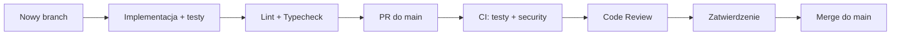

# 🤝 Proces rozwoju (Contributing)

> **Cel:** Opisać standardy kodowania, proces PR i onboardingu.  
> **Kiedy czytać:** Przed pierwszym PR; przy dołączaniu do zespołu.

---

## 1. Konfiguracja środowiska deweloperskiego

```bash
# 1. Zainstaluj pixi
curl -fsSL https://pixi.sh/install.sh | sh

# 2. Sklonuj i zainstaluj
git clone https://github.com/Gorski-Maciej/NexusAI.git
cd NexusAI
pixi install

# 3. Uruchom pełne środowisko dev
pixi run dev
```

---

## 2. Standardy kodowania

### 2.1 Python

- **Python ≥3.13** (free-threaded, z type hints)
- **Formatowanie:** Ruff (`pixi run format`)
- **Lint:** Ruff (`pixi run lint`)
- **Type checking:** mypy **strict mode** (`pixi run typecheck`)
- **Wszystkie publiczne funkcje** muszą mieć type hints
- **Zakaz `float`** dla kwot finansowych — używaj `Decimal` lub `int` (grosze)

```python
# ✅ DOBRZE
def compute_vat(net_cents: int, vat_rate: Decimal) -> int:
    """Oblicz VAT w groszach."""
    return int((Decimal(str(net_cents)) * vat_rate).quantize(
        Decimal("1"), rounding=ROUND_HALF_UP
    ))

# ❌ ŹLE
def compute_vat(net, rate):
    return net * rate  # float!
```

### 2.2 Konwencje nazewnicze

| Element | Konwencja | Przykład |
|---|---|---|
| Pliki | `snake_case` | `triage_service.py` |
| Klasy | `PascalCase` | `TriageService` |
| Funkcje/metody | `snake_case` | `should_triage_document()` |
| Stałe | `SCREAMING_SNAKE` | `TRIAGE_CONFIDENCE_THRESHOLD` |
| Moduły prywatne | `_prefix` | `_billing_store.py` |
| Serwisy | `*Service` | `AuditService` |
| Controllery | `*Controller` | `TriageController` |
| DTO | `*DTO` | `TriageItemDTO` |
| Modele SQL | `*Model` | `InvoiceModel` |

### 2.3 Docstringi

Używaj Google-style docstringów:

```python
def create_invoice(
    number: str,
    contractor_nip: str,
    amount_net: Decimal,
) -> Invoice:
    """Utwórz nową fakturę.
    
    Args:
        number: Numer faktury (format: FV/RRRR/MM/SEQ).
        contractor_nip: NIP kontrahenta (10 cyfr).
        amount_net: Kwota netto w PLN.
    
    Returns:
        Nowo utworzona faktura w stanie NEW.
    
    Raises:
        InvalidNIPError: Jeśli NIP jest nieprawidłowy.
        ValueError: Jeśli kwota netto jest ujemna.
    """
```

---

## 3. Konwencje commitów (Conventional Commits)

```
<type>(<scope>): <opis>

feat(invoices): dodaj endpoint wysyłki do KSeF
fix(api): popraw wyciek tokenu JWT przy refresh
docs(architecture): dodaj diagram C4 dla pipeline OCR
perf(ocr): zrównoleglij 4 silniki OCR
test(billing): dodaj testy property-based dla VAT
refactor(db): migracja z pandas na polars
chore(deps): aktualizuj litestar do 2.12.0
security(crypto): rotuj klucze JWT
```

### Dozwolone scope'y:

`api`, `db`, `services`, `ocr`, `ai`, `tax`, `security`, `ui`, `build`, `ci`, `docs`, `deps`

---

## 4. Proces Code Review

### 4.1 Przepływ PR



### 4.2 Checklist przed PR

- [ ] Kod sformatowany (`pixi run format`)
- [ ] Lint przechodzi (`pixi run lint`)
- [ ] Typecheck przechodzi (`pixi run typecheck`)
- [ ] Testy przechodzą (`pixi run test`)
- [ ] Dodane testy dla nowej funkcjonalności
- [ ] Dokumentacja zaktualizowana (jeśli dotyczy)
- [ ] Commit messages zgodne z Conventional Commits

---

## 5. Gałęzie

| Gałąź | Przeznaczenie |
|---|---|
| `main` | Produkcyjna — tylko przez PR + review |
| `develop` | Integracyjna (opcjonalnie) |
| `feat/*` | Nowe funkcje |
| `fix/*` | Poprawki błędów |
| `docs/*` | Dokumentacja |
| `perf/*` | Optymalizacje |
| `security/*` | Poprawki bezpieczeństwa |

---

## 6. Jak dodawać nowe funkcje

### 6.1 Nowa reguła podatkowa (OPA/Rego)

1. Edytuj `nexus_ai/tax/rules.rego`
2. Dodaj test w `tests/rego/`
3. Uruchom testy reguł

```rego
# nexus_ai/tax/rules.rego
package tax.vat

# Nowa reguła: stawka 0% dla eksportu
vat_rate = 0.00 {
    input.transaction_type == "EXPORT"
    input.vendor_country != "PL"
}
```

### 6.2 Nowy agent AI

1. Pobierz model GGUF do `models/`
2. Dodaj konfigurację modelu w `config/base.toml` (sekcja `[models]`)
3. Utwórz klasę w `nexus_ai/services/nowy_agent.py`
4. Zarejestruj agenta w `nexus_ai/core/ai_context.py`
5. Dodaj handler w `nexus_ai/events/taskiq_events.py`
6. Dodaj testy w `tests/test_nowy_agent.py`

```python
# nexus_ai/services/nowy_agent.py
from nexus_ai.core.inference import InferenceService

class NowyAgent:
    def __init__(self, model_path: str):
        self.llm = InferenceService(model_path)
    
    async def process(self, context: dict) -> dict:
        prompt = self._build_prompt(context)
        result = await self.llm.generate(prompt)
        return self._parse_result(result)
```

### 6.3 Nowy endpoint API

1. Utwórz plik w `nexus_ai/api/routes/nazwa.py`
2. Zdefiniuj DTO jako `msgspec.Struct`
3. Dodaj endpoint z typowaniem
4. Zarejestruj w `nexus_ai/api/app.py`
5. Dodaj testy

```python
# nexus_ai/api/routes/nazwa.py
from litestar import get, post
from msgspec import Struct

class NoweDto(Struct):
    pole1: str
    pole2: int

@get("/api/v1/nowe")
async def lista() -> list[NoweDto]: ...

@post("/api/v1/nowe")
async def utworz(data: NoweDto) -> NoweDto: ...
```

### 6.4 Nowa migracja bazy danych

1. Utwórz plik `migrations/00N_opis.sql` (gdzie N = kolejny numer)
2. Zachowaj IDEMPOTENCJĘ (`IF NOT EXISTS`, `INSERT OR IGNORE`)
3. Uruchom migrację: `pixi run migrate`

---

## 7. Zasady wersjonowania (SemVer)

```
v3.0.0-dev  →  vMAJOR.MINOR.PATCH

MAJOR: przełomowe zmiany (API breaking, nowy silnik DB)
MINOR: nowe funkcje (nowy agent, nowy endpoint)
PATCH: poprawki błędów, aktualizacje zależności
```

Aktualna wersja: **3.0.0-dev** "Agentic Architecture"

---

## 8. Zgłaszanie błędów

Użyj [GitHub Issues](https://github.com/Gorski-Maciej/NexusAI/issues):

```markdown
**Tytuł:** [BUG] OCR nie rozpoznaje polskich znaków w PaddleOCR

**Środowisko:**
- NexusAI: 3.0.0-dev
- OS: Ubuntu 22.04
- Python: 3.13.2 (free-threaded)

**Kroki do odtworzenia:**
1. Upload faktury z polskimi znakami (załącznik)
2. Czekaj na OCR
3. Sprawdź wynik

**Oczekiwane:** Polskie znaki rozpoznane poprawnie
**Rzeczywiste:** "Łódź" → "Lodz", "ś" → "s"

**Logi:** [załącznik debug.log]
```

---

## 9. Aktualizacja dokumentacji

Po każdej zmianie:
1. Zaktualizuj odpowiedni plik w `docs/`
2. Dodaj wpis w `docs/CHANGELOG.md`
3. W PR dodaj `docs:` w scope

---

## 🔗 Zobacz również

- [Testowanie](TESTING.md) — jak pisać testy, szablony, narzędzia
- [Agenci AI](AGENTS.md) — jak dodać nowego agenta, modele GGUF
- [Architektura](ARCHITECTURE.md) — wzorce projektowe, ADR, model domeny
- [Słownik pojęć](GLOSSARY.md) — terminy techniczne i księgowe

---

> **Data aktualizacji:** 2026-07-05 · **Autor:** NexusAI Team · **Wersja:** 3.0.0-dev
> **Status dokumentu:** Stabilny · **Ostatnia weryfikacja:** 2026-07-05 · **Weryfikator:** NexusAI Team
