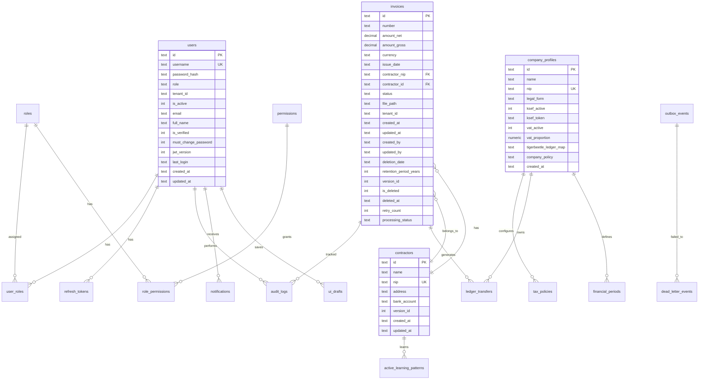

# 🗄️ Baza danych (Database)

> **Cel:** Zrozumieć schemat bazy danych, strategię migracji i backupu.  
> **Kiedy czytać:** Przed pracą ze schematem DB, przed migracjami.

---

## 1. Architektura wielobazowa

NexusAI używa **4 silników danych**, każdy do innego celu:

```
┌─────────────────────────────────────────────────────────────┐
│ SQLite + SQLCipher (AES-256)                               │
│ OLTP — faktury, kontrahenci, użytkownicy, decyzje          │
│ Plik: app_data/nexus.db (~5-50 MB)                         │
├─────────────────────────────────────────────────────────────┤
│ DuckDB                                                      │
│ OLAP — analityka, symulacje podatkowe, agregacje            │
│ Plik: app_data/analytics.duckdb                             │
├─────────────────────────────────────────────────────────────┤
│ TigerBeetle                                                 │
│ Double-entry ledger — księga główna                         │
│ Plik: data/tigerbeetle.bin                                  │
├─────────────────────────────────────────────────────────────┤
│ sqlite-vec (rozszerzenie SQLite)                            │
│ Wektory embeddingów dla wyszukiwania semantycznego          │
│ Wbudowane w nexus.db                                        │
└─────────────────────────────────────────────────────────────┘
```

---

## 2. Diagram ERD (główne encje)



> **📝 Wersja tekstowa (ASCII fallback):**
> ```
> GŁÓWNY DIAGRAM ERD:
> 
> users ──┬── user_roles ──── roles ──── role_permissions ──── permissions
>         │        │
>         │  refresh_tokens
>         │  audit_logs
>         │
> invoices ──┬── audit_logs
>            ├── ledger_transfers
>            └── contractors (FK: contractor_nip)
> 
> contractors ─── active_learning_patterns
> 
> company_profiles ──┬── tax_policies
>                     ├── ledger_transfers
>                     └── financial_periods
> 
> outbox_events ─── dead_letter_events
> 
> KLUCZOWE RELACJE:
>   users.id          → user_roles.user_id, refresh_tokens.user_id
>   roles.id          → user_roles.role_id, role_permissions.role_id
>   permissions.id    → role_permissions.permission_id
>   invoices.id       → audit_logs.invoice_id, ledger_transfers.source_document_id
>   contractors.id    → active_learning_patterns.contractor_nip
>   company_profiles.id → tax_policies.company_id, ledger_transfers.company_id
> ```

---

## 3. Opis wszystkich tabel

### 3.1 Core OLTP (migracja 001)

#### `invoices` — Faktury

| Pole | Typ | Opis |
|---|---|---|
| `id` | TEXT PK | UUID faktury |
| `number` | TEXT | Numer faktury (FV/2026/06/001) |
| `amount_net` | DECIMAL(12,2) | Kwota netto |
| `amount_gross` | DECIMAL(12,2) | Kwota brutto |
| `currency` | TEXT(3) | Kod waluty ISO 4217 (domyślnie PLN) |
| `issue_date` | TEXT | Data wystawienia (ISO 8601) |
| `contractor_nip` | TEXT(10) | NIP kontrahenta |
| `contractor_id` | TEXT | FK → contractors.id |
| `status` | TEXT | Status faktury (maszyna stanów) |
| `file_path` | TEXT | Ścieżka do pliku PDF/JPG |
| `tenant_id` | TEXT | ID najemcy (domyślnie 'default') |
| `retention_period_years` | INTEGER | Okres przechowywania (domyślnie 5) |
| `is_deleted` | INTEGER | Miękkie usunięcie (0/1) |
| `deletion_date` | TEXT | Data usunięcia |
| `retry_count` | INTEGER | Liczba ponownych prób przetwarzania |
| `processing_status` | TEXT | Status przetwarzania |

**Indeksy:**
- `idx_invoices_contractor_nip` — wyszukiwanie po NIP
- `idx_invoices_tenant_status` — dashboard per tenant
- `idx_invoices_updated_at` — sortowanie po dacie
- `idx_invoices_number` — wyszukiwanie po numerze

**Statusy:** `NEW`, `PROCESSING`, `PENDING_REVIEW`, `APPROVED`, `REJECTED`, `BLOCKED`, `PAID`, `MANUAL_REVIEW`, `FAILED`, `BLOCKED_FRAUD_SUSPICION`

#### `contractors` — Kontrahenci

| Pole | Typ | Opis |
|---|---|---|
| `id` | TEXT PK | UUID kontrahenta |
| `name` | TEXT NOT NULL | Nazwa firmy |
| `nip` | TEXT(10) UNIQUE | NIP (10 cyfr) |
| `address` | TEXT | Adres siedziby |
| `bank_account` | TEXT(26) | Numer rachunku (IBAN) |
| `version_id` | INTEGER | Wersja (optimistic locking) |

#### `outbox_events` — Wzorzec Outbox

| Pole | Typ | Opis |
|---|---|---|
| `id` | TEXT PK | UUID zdarzenia |
| `event_type` | TEXT | Typ zdarzenia |
| `aggregate_id` | TEXT | ID agregatu |
| `payload` | TEXT | JSON z danymi zdarzenia |
| `status` | TEXT | PENDING / PROCESSING / SENT / FAILED |
| `retry_count` | INTEGER | Liczba ponownych prób |
| `processed` | INTEGER | Czy przetworzone (0/1) |

#### `audit_logs` — Log audytu

| Pole | Typ | Opis |
|---|---|---|
| `id` | TEXT PK | UUID wpisu |
| `invoice_id` | TEXT | FK → invoices.id |
| `user_id` | TEXT | Kto wykonał akcję |
| `action` | TEXT | Rodzaj akcji |
| `field_changed` | TEXT | Które pole |
| `old_value` | TEXT | Stara wartość |
| `new_value` | TEXT | Nowa wartość |
| `timestamp` | TEXT | Czas zdarzenia |

#### `users` — Użytkownicy

| Pole | Typ | Opis |
|---|---|---|
| `id` | TEXT PK | UUID użytkownika |
| `username` | TEXT UNIQUE | Nazwa użytkownika |
| `password_hash` | TEXT | Hash hasła (Argon2id) |
| `role` | TEXT | Rola (admin/owner/accountant/worker/viewer) |
| `tenant_id` | TEXT | ID najemcy |
| `is_active` | INTEGER | Czy aktywny (0/1) |
| `email` | TEXT | Adres e-mail |
| `full_name` | TEXT | Imię i nazwisko |
| `is_verified` | INTEGER | Czy e-mail zweryfikowany |
| `must_change_password` | INTEGER | Wymuszona zmiana hasła |
| `jwt_version` | INTEGER | Wersja JWT (inkrementacja → unieważnienie) |
| `last_login` | TEXT | Ostatnie logowanie |

### 3.2 RBAC (migracja 002)

#### `roles` — Role systemowe

| Pole | Typ | Opis |
|---|---|---|
| `id` | TEXT PK | UUID roli |
| `name` | TEXT UNIQUE | Nazwa (admin, owner, accountant, worker, viewer) |
| `description` | TEXT | Opis roli |
| `is_system` | INTEGER | Czy rola systemowa (1) |

#### `permissions` — Uprawnienia

| Pole | Typ | Opis |
|---|---|---|
| `id` | TEXT PK | UUID uprawnienia |
| `codename` | TEXT UNIQUE | Kod (invoice.read, admin.users) |
| `resource` | TEXT | Zasób (invoice, admin, report) |
| `action` | TEXT | Akcja (read, write, delete) |

### 3.3 Roboton_Reflekton (migracja 001)

#### `company_profiles` — Profile firm

| Pole | Typ | Opis |
|---|---|---|
| `id` | TEXT(36) PK | UUID profilu |
| `name` | TEXT(255) | Nazwa firmy |
| `nip` | TEXT(10) UNIQUE | NIP |
| `legal_form` | TEXT(32) | Forma prawna (JDG, sp. z o.o., itp.) |
| `ksef_active` | INTEGER | Czy KSeF aktywny |
| `ksef_token` | TEXT(512) | Token API KSeF |
| `vat_active` | INTEGER | Czy VAT czynny |
| `vat_proportion` | NUMERIC(5,4) | Proporcja VAT (domyślnie 1.0) |
| `tigerbeetle_ledger_map` | TEXT | Mapowanie kont na TigerBeetle |
| `company_policy` | TEXT | Polityka rachunkowości (JSON) |

#### `tax_policies` — Polityki podatkowe

| Pole | Typ | Opis |
|---|---|---|
| `id` | TEXT(36) PK | UUID polityki |
| `company_id` | TEXT(36) FK | FK → company_profiles |
| `tax_form` | TEXT(32) | Forma opodatkowania |
| `pit_costs_enabled` | INTEGER | Czy koszty PIT |
| `requires_full_ledger` | INTEGER | Czy pełna księgowość |
| `vat_settlement_cycle` | TEXT(32) | Cykl VAT (monthly/quarterly) |
| `effective_from` | TEXT | Data wejścia w życie |

#### `ledger_transfers` — Transfery księgowe

| Pole | Typ | Opis |
|---|---|---|
| `id` | TEXT(36) PK | UUID transferu |
| `company_id` | TEXT(36) FK | FK → company_profiles |
| `source_account` | BIGINT | Konto źródłowe (Wn) |
| `target_account` | BIGINT | Konto docelowe (Ma) |
| `amount_minor` | BIGINT | Kwota w jednostkach (grosze) |
| `currency` | TEXT(3) | Waluta (PLN) |
| `source_document_id` | TEXT(36) | ID dokumentu źródłowego (faktura) |
| `status` | TEXT(32) | pending / committed / failed |

### 3.4 Warstwa dostępu do danych (15 modułów)

NexusAI zawiera rozbudowaną warstwę dostępu do danych z 23 modułami. Poniżej kluczowe:

#### Silnik i sesje (`db/database.py`)
Centralna inicjalizacja SQLAlchemy Engine dla SQLCipher:
- **`create_oltp_engine()`** — tworzy silnik z poolem połączeń (`QueuePool`, pool_size=5, max_overflow=10), PRAGMAMI (WAL, synchronous=NORMAL, cache_size=50MB, mmap_size=4GB, auto_vacuum=FULL) i SQLCipher AES-256 (PRAGMA key, cipher_page_size=4096, kdf_iter=64000, HMAC_SHA512, PBKDF2)
- **`create_session_factory()`** — fabryka sesji z automatycznym multi-tenant filtrem (`with_loader_criteria WHERE tenant_id = ?`)
- **`create_session_factory(tenant_id=...)`** — dedykowana fabryka dla konkretnego tenanta
- **`init_schema()`** — utworzenie wszystkich tabel przy pierwszym starcie
- **`consolidate_database()`** — WAL checkpoint TRUNCATE + VACUUM + ANALYZE
- **`probe_sqlcipher()`** — detekcja SQLCipher (przez PRAGMA cipher_version lub ctypes.CDLL)

#### Modele (`db/models.py`)
Definiuje wszystkie modele SQLModel (Invoice, Contractor, User, OutboxEvent, itp.) z `__slots__` dla oszczędności RAM.

#### Lifecycle hooks (`db/hooks.py`)
Rejestruje zdarzenia SQLAlchemy:
- **`register_db_hooks(config)`** — rejestruje 2 hooki:
  - `after_flush_replicate` — automatyczna replikacja faktur do DuckDB (`invoices_replica`) po każdym flush
  - `before_flush_validate` — walidacja danych przed zapisem (NIP 10 cyfr, waluta 3 znaki, event_type alfanumeryczny, username 3+ znaki, role z dozwolonych)
- **Validator registry**: `_VALIDATORS[Invoice]`, `_VALIDATORS[Contractor]`, itp. — zamiast if/elif/elif

#### Kolejka wiadomości (`db/message_queue.py`)
`AsyncSQLiteQueue` — lekka, atomowa kolejka komunikatów:
- **enqueue/dequeue/ack/nack** — atomiczne operacje w jednej transakcji SQLite
- **Priorytety** (1-10, domyślnie 5)
- **Opóźnione wiadomości** (delay_until)
- **Dead Letter Queue** — automatyczne przenoszenie po max_retries (domyślnie 3)
- **enqueue_batch()** — wiele wiadomości w jednej transakcji
- **replay_dlq()** — przywrócenie DLQ do kolejki
- Partial indexes dla dequeue/delayed/DLQ

#### Zapytania i FTS (`db/queries.py`)
Łączy paginację, FTS5 i widoki analityczne:
- **`CursorPagination`** — keyset/cursor pagination (zamiast OFFSET — wydajniejsza dla 1M+ rekordów)
- **`FTSManager`** — pełnotekstowe wyszukiwanie przez FTS5 z trigram tokenizerem (tabele: `invoices_fts`, `contractors_fts`, `audit_logs_fts`, `events_fts`), hybrydowe FTS5+vec0, automatyczne triggery po INSERT/UPDATE/DELETE
- **`AnalyticsViews`** — zmaterializowane widoki biznesowe w DuckDB: `m_monthly_summary` (statystyki per miesiąc z LAG, moving average), `m_top_contractors` (ranking kontrahentów z share%), `m_cashflow_projection` (prognoza przepływów z window functions)

#### Bezpieczeństwo DB (`db/security.py`)
- **`SQLCipherConfig(Struct)`** — typowana konfiguracja z walidacją zakresów (cipher_page_size, kdf_iter, HMAC, KDF)
- **`KeyRotation`** — rotacja kluczy SQLCipher przez `PRAGMA rekey` (bez dump/restore), szyfrowany backup z innym kluczem, harmonogram rotacji (domyślnie co 90 dni)
- **`SQLCipherConfig.generate_key()`** — generowanie 256-bitowego klucza przez `os.urandom(32)` + base64

#### Transakcje i Outbox (`db/transactions.py`)
- **`OutboxManager.publish()`** — zapis zdarzenia w tej samej transakcji co dane biznesowe (Transactional Outbox)
- **`process_events()`** — przetwarzanie partii zdarzeń z pessimistic locking (`with_for_update(skip_locked=True)`), order_by FIFO, maksymalnie 5 retry zanim trafi do DLQ

#### Pozostałe moduły DB

| Moduł | Odpowiedzialność |
|---|---|
| `db/database.py` | Init silnika SQLCipher + sesji + multi-tenant filtr |
| `db/models.py` | Wszystkie modele SQLModel (Invoice, Contractor, User, OutboxEvent itp.) |
| `db/hooks.py` | Lifecycle hooks: walidacja przed flush, replikacja do DuckDB po flush |
| `db/message_queue.py` | AsyncSQLiteQueue — atomowa kolejka komunikatów z priorytetami, DLQ, batch |
| `db/queries.py` | CursorPagination + FTS5 full-text search + AnalyticsViews (materialized DuckDB views) |
| `db/security.py` | SQLCipherConfig + KeyRotation (PRAGMA rekey) + harmonogram 90 dni |
| `db/transactions.py` | OutboxManager (Transactional Outbox) + pessimistic locking worker |
| `db/async_db_pool.py` | Asynchroniczny pool połączeń SQLite (asyncio-friendly) |
| `db/async_backup.py` | Backup asynchroniczny (online, non-blocking, fsspec) |
| `db/async_base_service.py` | Klasa bazowa dla serwisów asynchronicznych DB |
| `db/projection_models.py` | Modele projekcji CQRS (read models) |
| `db/analytics_schema.py` | Schemat dla zapytań analitycznych (OLAP) |
| `db/aggregate_functions.py` | Niestandardowe funkcje agregujące SQL (MEDIAN, MODE, PERCENTILE, PRODUCT) |
| `db/analytics.py` | Helpery analityczne (DuckDBManager, PolarsSQLContext) |
| `db/vector_store.py` | Integracja sqlite-vec dla embeddingów i wyszukiwania semantycznego |

---

## 3a. sqlite-vec — wyszukiwanie wektorowe

<!-- UZUPEŁNIONE: dodano sekcję o sqlite-vec i AsyncVectorStore -->

### 3a.1 AsyncVectorStore

**Plik:** `nexus_ai/db/vector_store.py`

Asynchroniczny wrapper dla **sqlite-vec** — rozszerzenia SQLite dodającego typ wektorowy i funkcje odległości.

```python
from nexus_ai.db.vector_store import AsyncVectorStore

store = AsyncVectorStore(db_path="app_data/vectors.db")

# Inicjalizacja tabeli vec0
await store.ensure_vec0_table(
    table_name="invoice_vectors",
    use_int8=False,  # True = kwantyzacja int8 (4x mniej RAM)
)

# Batch insert
await store.insert_vectors_batch(
    vectors=[
        ("inv-123", [0.1, 0.2, ...]),  # (rowid, embedding)
        ("inv-124", [0.3, 0.4, ...]),
    ],
    table_name="invoice_vectors",
    metadata=[
        {"category_code": "IT", "amount_net": "1000.00"},
        {"category_code": "FUEL", "amount_net": "500.00"},
    ],
)

# Wyszukiwanie podobieństwa
results = await store.search_similar(
    query_vector=[0.1, 0.2, ...],
    limit=10,
    distance_metric="cosine",  # cosine, l2, inner_product, manhattan
    table_name="invoice_vectors",
    partition={"category_code": "IT"},  # Partycjonowanie
)
# → [{rowid, embedding, _distance, category_code, amount_net}, ...]
```

### 3a.2 Unified Schema Registry

Cztery predefiniowane tabele vec0:

| Tabela | Dymen. | Partycja | Metadane | Opis |
|---|---|---|---|---|
| `invoice_vectors` | 384 | — | — | Główne embeddingi faktur dla wyszukiwania semantycznego |
| `vendor_invoices` | 768 | `vendor_nip` | `category_code`, `amount_net`, `id` | Faktury per-kontrahent dla detekcji anomalii |
| `ocr_corrections` | 768 | `tenant_id`, `contractor_nip` | `contractor_nip`, `tenant_id`, `id` | Korekty OCR użytkownika dla aktywnego uczenia |
| `invoice_templates` | 768 | `contractor_nip` | `contractor_nip`, `layout_features` | Wzorce faktur dla automatycznego dekretowania |

### 3a.3 Funkcje odległości

| Funkcja SQL | Nazwa w API | Zastosowanie |
|---|---|---|
| `vec_distance_cosine` | `cosine` | Podobieństwo semantyczne (domyślna) |
| `vec_distance_l2` | `l2` | Odległość euklidesowa |
| `vec_distance_inner_product` | `inner_product` | Iloczyn skalarny |
| `vec_distance_manhattan` | `manhattan` | Odległość Manhattan |

### 3a.4 Kwantyzacja int8

```python
# 4x mniej pamięci, ~2% spadek dokładności
await store.ensure_vec0_table(table_name="invoice_vectors", use_int8=True)
await store.insert_vectors_batch(vectors, table_name="invoice_vectors", use_int8=True)
```

---

## 3b. CQRS Projection Models

<!-- UZUPEŁNIONE: dodano sekcję o CQRS read models -->

**Plik:** `nexus_ai/db/projection_models.py`

Modele SQLModel dla CQRS read-side — projekcje zdenormalizowane dla szybkich zapytań.

### 3b.1 InvoiceReadModel

Denormalizowany widok faktur z indeksami warunkowymi:

```python
class InvoiceReadModel(SQLModel, table=True):
    __tablename__ = "invoice_read_model"
    
    invoice_id: str = Field(primary_key=True)
    number: str | None
    contractor_nip: str | None
    contractor_name: str | None
    amount_net: float | None
    amount_gross: float | None
    currency: str = "PLN"
    status: ProjectionInvoiceStatus  # Enum
    current_version: int = 0
    approved_by: str | None
    blocked_reason: str | None
    trust_score: float = 0.0
```

**Indeksy:**
- `idx_invoice_rm_status` — na statusie
- `idx_invoice_rm_contractor` — na contractor_nip
- `idx_invoice_rm_blocked` — WHERE status = 'blocked' (warunkowy)
- `idx_invoice_rm_approved` — WHERE status = 'approved' (warunkowy)
- `idx_invoice_rm_pending` — WHERE status IN ('created', 'submitted') (warunkowy)
- `idx_invoice_rm_contractor_upper` — UPPER(contractor_nip) (expression index)

### 3b.2 DecisionAnalytics

Analityczny widok decyzji:

```python
class DecisionAnalytics(SQLModel, table=True):
    __tablename__ = "decision_analytics"
    
    decision_id: str = Field(primary_key=True)
    invoice_id: str
    event_type: str
    decision: str | None
    trust_score: float = 0.0
    ai_confidence: float = 0.0
    alpha_vote: str | None
    beta_vote: str | None
    gamma_vote: str | None
    decision_pattern: str | None
    reasoning: str | None
    original_decision: str | None
    user_decision: str | None
    user_id: str | None
    version: int = 0
    timestamp: str | None
```

### 3b.3 UserPreferences

Preferencje użytkownika jako SQLModel z JSON-em:

```python
def to_dict(self) -> dict:
    return self.model_dump(mode="json")

@classmethod
def from_dict(cls, data) -> UserPreferences:
    return cls.model_validate(data)
```

---

## 3c. AsyncBackup — asynchroniczny backup

**Plik:** `nexus_ai/db/async_backup.py`

Asynchroniczny backup wszystkich baz danych z użyciem `sqlite3.backup()` i fsspec:

```python
from nexus_ai.db.async_backup import AsyncBackup, create_async_backup

backup = AsyncBackup()

# Backup wszystkich baz
results = await backup.backup_all(
    output_dir="backups/2026-07-05",
    suffix="daily",
)
# → {"oltp": {"status": "ok", "size_mb": 12.5}, ...}

# Backup pojedynczej bazy
result = await backup.backup_single(
    source_path="app_data/nexus.db",
    target_path="backups/nexus_20260705.db",
)
# → {"status": "ok", "size_mb": 12.5, "duration_s": 0.45, "atomic": True}

# Backup do RAM
await backup.backup_to_memory("app_data/nexus.db")

# Convenience function
results = await create_async_backup("backups/today")
```

**Cechy:**
- Natywny `sqlite3.Connection.backup()` — atomiczny, online, non-blocking
- fsspec — działa z file://, s3://, memory://
- SQLCipher — backup między szyfrowanymi bazami
- `TransactionalFileSystem` — atomowość backupu
- 4 domyślne bazy: oltp, event_store, projections_invoices, projections_decisions

---

### 3.5 Serwisy (migracja 003)

#### `dq_decisions` — Kolejka decyzji

| Pole | Typ | Opis |
|---|---|---|
| `id` | INTEGER PK | ID decyzji |
| `user_id` | TEXT | FK → users.id |
| `title` | TEXT | Tytuł pytania |
| `message` | TEXT | Treść pytania |
| `source_agent` | TEXT | Który agent zadał pytanie |
| `status` | TEXT | pending / resolved / expired |
| `priority` | INTEGER | Priorytet (1-5) |
| `expires_at` | TEXT | Data wygaśnięcia |
| `resolution` | TEXT | Odpowiedź użytkownika |

#### `notifications` — Powiadomienia

| Pole | Typ | Opis |
|---|---|---|
| `id` | INTEGER PK | ID powiadomienia |
| `user_id` | TEXT | FK → users.id |
| `title` | TEXT | Tytuł |
| `message` | TEXT | Treść |
| `category` | TEXT | Kategoria (info/warning/error/decision) |
| `priority` | INTEGER | Priorytet |
| `is_read` | INTEGER | Czy przeczytane |
| `requires_action` | INTEGER | Czy wymaga akcji |

#### `failed_tasks` — Dead Letter Queue

| Pole | Typ | Opis |
|---|---|---|
| `id` | TEXT PK | UUID zadania |
| `task_name` | TEXT | Nazwa zadania |
| `payload` | TEXT | Dane wejściowe (JSON) |
| `error_message` | TEXT | Komunikat błędu |
| `stack_trace` | TEXT | Stack trace |
| `retry_count` | INTEGER | Liczba prób |
| `resolved` | INTEGER | Czy naprawione |

#### `task_status` — Status zadań asynchronicznych

| Pole | Typ | Opis |
|---|---|---|
| `task_id` | TEXT PK | UUID zadania |
| `task_name` | TEXT | Nazwa zadania |
| `status` | TEXT | PENDING / PROCESSING / COMPLETED / FAILED / CANCELLED |
| `progress` | REAL | Postęp 0.0–1.0 |
| `result` | TEXT | JSON z wynikiem |
| `error_message` | TEXT | Komunikat błędu |
| `created_at` | TEXT | Czas utworzenia |
| `updated_at` | TEXT | Czas aktualizacji |

#### `ui_drafts` — Drafty UI

| Pole | Typ | Opis |
|---|---|---|
| `tenant_id` | TEXT | ID najemcy (PK) |
| `actor_id` | TEXT | ID użytkownika (PK) |
| `draft_key` | TEXT | Klucz draftu (PK) |
| `payload_json` | TEXT | JSON z danymi draftu |
| `updated_at` | TEXT | Czas ostatniej aktualizacji |

#### `scheduled_tasks` — Harmonogram

| Pole | Typ | Opis |
|---|---|---|
| `id` | INTEGER PK | ID zadania |
| `name` | TEXT | Nazwa |
| `task_type` | TEXT | Typ (ksef_sync, nbp_rates, backup) |
| `trigger_at` | TEXT | Czas wyzwolenia |
| `interval_minutes` | INTEGER | Interwał (NULL = jednorazowe) |
| `is_active` | INTEGER | Czy aktywne |
| `next_run_at` | TEXT | Następne uruchomienie |

---

## 4. Strategia migracji

### 4.1 System natywnych migracji SQL

NexusAI używa własnego, minimalistycznego systemu migracji (zastąpił Alembic):

```
migrations/
├── 001_init.sql           # Inicjalizacja (tabele core)
├── 002_missing_tables.sql # RBAC, DLQ, brakujące kolumny
├── 003_service_tables.sql # Tabele serwisowe
├── 004_supermoces.sql     # Indeksy, constraints, seed
└── run_migrations.py      # Runner
```

### 4.2 Zasady migracji

- **Numerowane sekwencyjnie:** `NNN_opis.sql`
- **Idempotentne:** Każda migracja używa `CREATE TABLE IF NOT EXISTS`, `INSERT OR IGNORE`
- **Tylko SQL:** Żadnego Pythona w migracjach (czytelność, audytowalność)
- **Brak rollback:** Forward-only (zgodnie z filozofią Event Sourcing)

### 4.3 Komendy

```bash
pixi run migrate          # Wykonaj wszystkie pending migracje
pixi run migrate-check    # Sprawdź aktualną wersję
pixi run migrate-history  # Pokaż historię
pixi run migrate-dry      # Suchy przebieg
```

---

## 5. Seed danych

```bash
pixi run seed   # ładuje demo dane (faktury, kontrahenci)
```

Dane seed są w `scripts/seed_data.py` + `scripts/seed_data.toml`.  
Role i permissions są seedowane w migracji `004_supermoces.sql`:

```sql
INSERT OR IGNORE INTO roles (id, name, description, is_system) VALUES
    ('role-system-admin', 'admin', 'System administrator', 1),
    ('role-system-owner', 'owner', 'Business owner', 1),
    ('role-system-accountant', 'accountant', 'Accountant', 1),
    ('role-system-worker', 'worker', 'Worker', 1),
    ('role-system-viewer', 'viewer', 'Viewer', 1);
```

---

## 6. Backup i przywracanie

### 6.1 Backup (automatyczny, dzienny)

```bash
# Backup wszystkich danych
pixi run backup
# → app_data/backups/nexus_backup_2026-07-04T12:00:00.enc
```

Co jest backupowane:
- `app_data/nexus.db` (SQLite)
- `data/tigerbeetle.bin` (TigerBeetle ledger)
- `app_data/*.duckdb` (DuckDB)

### 6.2 Szyfrowanie backupu

- Algorytm: AEAD ChaCha20-Poly1305 (nexus-crypto)
- Weryfikacja: SHA-256 checksum
- Klucz: z Vault (keyring systemowy)

### 6.3 Przywracanie

```bash
pixi run restore --file app_data/backups/nexus_backup_2026-07-04.enc
```

Proces:
1. Weryfikacja SHA-256
2. Deszyfrowanie AEAD
3. Zatrzymanie serwisów
4. Podmiana plików
5. Restart

---

## 7. Przykładowe zapytania

### 7.1 Dashboard — faktury oczekujące

```sql
SELECT status, COUNT(*) as cnt, SUM(amount_gross) as total
FROM invoices
WHERE tenant_id = 'default'
  AND is_deleted = 0
GROUP BY status
ORDER BY total DESC;
```

### 7.2 Ślad audytu dla faktury

```sql
SELECT timestamp, user_id, action, field_changed, old_value, new_value
FROM audit_logs
WHERE invoice_id = 'abc123'
ORDER BY timestamp ASC;
```

### 7.3 Decyzje oczekujące na użytkownika

```sql
SELECT title, message, source_agent, priority, created_at
FROM dq_decisions
WHERE user_id = 'user-1'
  AND status = 'pending'
ORDER BY priority ASC, created_at DESC;
```

### 7.4 Analityka — VAT per miesiąc (DuckDB)

```sql
SELECT 
    strftime(issue_date, '%Y-%m') as month,
    SUM(amount_net) as total_net,
    SUM(amount_gross - amount_net) as total_vat,
    COUNT(*) as invoice_count
FROM invoices
WHERE status = 'APPROVED'
  AND issue_date >= '2026-01-01'
GROUP BY month
ORDER BY month;
```

---

### 3.10 AsyncSQLiteQueue — kolejka komunikatów

**Plik:** `nexus_ai/db/message_queue.py`

Lekka, atomowa kolejka komunikatów w SQLite z priorytetami i DLQ:

```python
from nexus_ai.db.message_queue import AsyncSQLiteQueue

queue = AsyncSQLiteQueue(
    db_path="app_data/queue.db",
    max_retries=3,
    poll_interval=0.1,
)

# Enqueue
msg_id = await queue.enqueue(
    queue="invoice.process",
    payload={"invoice_id": "inv-123"},
    priority=5,                # 1-10, domyślnie 5
    delay_seconds=60,          # Opóźnienie
)

# Batch enqueue (jedna transakcja)
ids = await queue.enqueue_batch([
    {"queue": "ocr", "payload": {...}, "priority": 3},
    {"queue": "ocr", "payload": {...}, "priority": 4},
])

# Dequeue (atomicznie)
msg = await queue.dequeue(queue="invoice.process")
if msg:
    await queue.ack(msg["id"])        # Potwierdź
    # lub
    await queue.nack(msg["id"], error="timeout")  # Nie potwierdzaj

# Przywrócenie z DLQ
replayed = await queue.replay_dlq()  # → liczba przywróconych

# Statystyki
stats = await queue.get_stats()
# → {"pending": 10, "processing": 2, "dlq": 1, "dead_letter": 1}
```

**Indeksy cząstkowe (partial indexes):**
- `idx_mq_dequeue` — WHERE status = 'pending' (priorytet DESC, czas ASC)
- `idx_mq_delayed` — WHERE status = 'pending' AND delay_until IS NOT NULL
- `idx_mq_dlq` — WHERE status = 'dlq'

---

## 🔗 Zobacz również

- [Architektura](ARCHITECTURE.md) — 4 silniki danych, ADR-001 (SQLite vs PostgreSQL), ADR-002 (TigerBeetle)
- [Moduły i logika](MODULES.md) — tabele dq_decisions, ledger_transfers w kontekście przepływu decyzji
- [Bezpieczeństwo](SECURITY.md) — SQLCipher AES-256, szyfrowanie backupu
- [Wdrożenie](DEPLOYMENT.md) — BackupManager, przywracanie

---

> **Data aktualizacji:** 2026-07-04 · **Autor:** NexusAI Team · **Wersja:** 2.3.0
> **Status dokumentu:** Stabilny · **Ostatnia weryfikacja:** 2026-07-04 · **Weryfikator:** NexusAI Team
