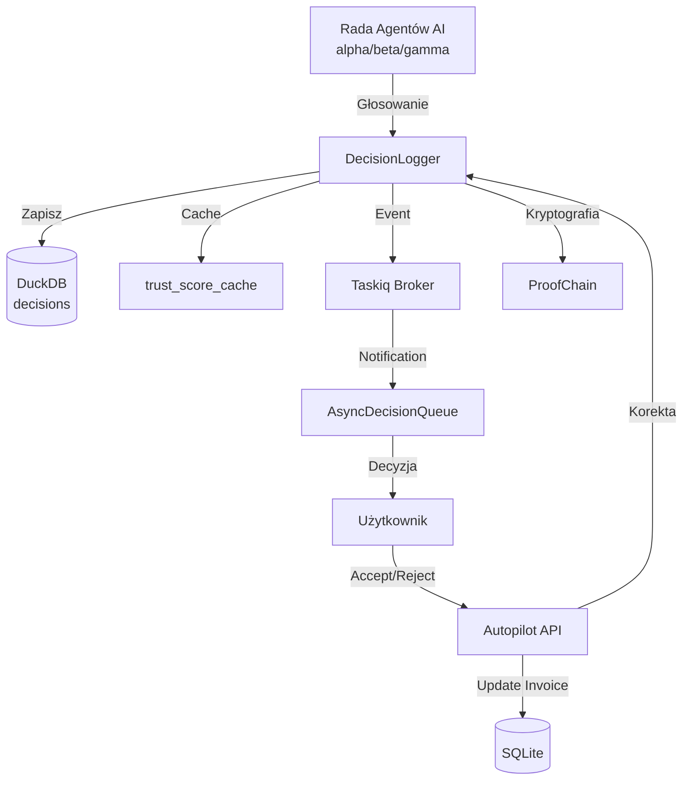

# 🧠 System Decyzyjny — DecisionLogger, DecisionQueue, TrustScore

> **Plik:** `nexus_ai/services/decision_*.py`, `nexus_ai/api/routes/autopilot.py`
> **Status:** Stabilny · **Wersja:** 3.0.0-dev
> **Ostatnia aktualizacja:** 2026-07-05

---

## 1. Przegląd

System decyzyjny NexusAI odpowiada za rejestrowanie, kolejkowanie i analizę decyzji podejmowanych przez Radę Agentów AI oraz użytkowników.

```
nexus_ai/services/
├── decision_structs.py     # GlobalDecision, TrustTrend, CorrectionStats
├── decision_logger.py      # DecisionLogger — logowanie decyzji do DuckDB
├── decision_queue.py       # AsyncDecisionQueue — trwała kolejka decyzji
├── event_log.py            # AsyncEventLog — rejestr zdarzeń
└── proof_chain.py          # ProofChain — kryptograficzny łańcuch audytowy

nexus_ai/api/routes/
└── autopilot.py            # AutopilotController — REST API dla decyzji
```

### Architektura



---

## 2. DecisionLogger

**Plik:** `services/decision_logger.py`

Loguje decyzje Rady Agentów do DuckDB z pełnym kontekstem PLE (STM/LTM/FM), trendem trust score i statystykami korekt.

### Schemat tabel

#### `decisions` — główna tabela decyzji

```sql
CREATE TABLE IF NOT EXISTS decisions (
    id              VARCHAR PRIMARY KEY,
    invoice_id      VARCHAR,
    event_type      VARCHAR,
    alpha_vote      JSON,      -- Głos agenta Alfa
    beta_vote       JSON,      -- Głos agenta Beta  
    gamma_vote      JSON,      -- Głos agenta Gamma
    final_decision  VARCHAR,   -- AUTO_POST / SUGGEST / BLOCK / ASK_USER
    trust_score     DOUBLE,    -- 0.0 – 1.0
    trust_components JSON,     -- ai_confidence, vendor_reliability, data_consistency, context_trust
    context         JSON,      -- contractor_nip, category, transaction_date
    timestamp       TIMESTAMP,
    previous_hash   VARCHAR(64), -- SHA-256 poprzedniej decyzji
    current_hash    VARCHAR(64), -- SHA-256 bieżącej decyzji
    user_correction VARCHAR,     -- ACCEPTED / REJECTED / VOID
    decision_level  VARCHAR,     -- auto_post / suggest / ask
    decision_pattern VARCHAR,    -- trusted / new_vendor / low_confidence / black_flag
    ple_stm_snapshot JSON,       -- Krótkoterminowa pamięć PLE
    ple_ltm_profile JSON         -- Długoterminowy profil PLE
);
```

#### `trust_score_cache` — cache trust score dla kontrahentów

```sql
CREATE TABLE IF NOT EXISTS trust_score_cache (
    id                VARCHAR PRIMARY KEY,
    contractor_nip    VARCHAR,
    category          VARCHAR,
    trust_score       DOUBLE,
    ai_confidence     DOUBLE,
    vendor_reliability DOUBLE,
    data_consistency  DOUBLE,
    context_trust     DOUBLE,
    final_decision    VARCHAR,
    user_correction   VARCHAR,
    timestamp         TIMESTAMP
);
```

#### `decisions_meta` — metadane deliberacji

```sql
CREATE TABLE IF NOT EXISTS decisions_meta (
    decision_id             VARCHAR PRIMARY KEY,
    invoice_id              VARCHAR,
    deliberation_duration_ms INTEGER,
    levels_used             JSON,
    model_swap_count        INTEGER,
    timestamp               TIMESTAMP
);
```

### Logowanie decyzji

```python
from nexus_ai.services.decision_logger import DecisionLogger, TrustComponents, DecisionContext
from nexus_ai.db.analytics import DuckDBManager

mgr = DuckDBManager(db_path="data/analytics.db", sqlite_path="data/nexus.db")
logger = DecisionLogger(mgr)

await logger.log_decision(
    invoice_id="inv-123",
    alpha_verdict={"decision": "AUTO_POST", "confidence": 0.95},
    beta_verdict={"decision": "AUTO_POST", "confidence": 0.92},
    gamma_verdict={"decision": "SUGGEST", "confidence": 0.88},
    final_decision="AUTO_POST",
    trust_score=0.92,
    trust_components=TrustComponents(
        ai_confidence=0.92,
        vendor_reliability=0.95,
        data_consistency=0.98,
        context_trust=0.85,
    ),
    context=DecisionContext(
        contractor_nip="1234567890",
        category="it_services",
        transaction_date="2026-06-15",
        company_tax_form="JDG",
    ),
    decision_level="auto_post",
    decision_pattern="trusted",
)
```

### Query i analiza

```python
# Trend trust score dla kontrahenta (30 dni)
trend = logger.get_trust_score_trend(contractor_nip="1234567890", days=30)
# → TrustTrend(known=True, records=42, avg_trust=0.91, trend="up", ...)

# Statystyki korekt użytkownika
stats = logger.get_user_correction_stats()
# → CorrectionStats(total_decisions=1000, total_corrected=45, correction_rate=0.045, ...)

# Decyzje dla faktury
decisions = logger.get_decisions_for_invoice(invoice_id="inv-123")
# → list[DecisionRecord]

# Podobne przypadki globalnie
similar = logger.get_globally_similar_cases(category="it_services", limit=5)
# → list[GlobalDecision]
```

### Korekta użytkownika

```python
await logger.record_user_correction(invoice_id="inv-123", correction="REJECTED")
# Aktualizuje decisions i trust_score_cache
# Emituje event DecisionOverridden przez broker
```

---

## 3. AsyncDecisionQueue

**Plik:** `services/decision_queue.py`

Trwała (async) kolejka decyzji z priorytetami i terminami ważności.

### Status i priorytety

```python
class DecisionStatus(enum.Enum):
    PENDING   = "pending"     # Oczekuje na decyzję
    APPROVED  = "approved"    # Zaakceptowana
    REJECTED  = "rejected"    # Odrzucona
    EXPIRED   = "expired"     # Wygasła

class DecisionPriority(enum.IntEnum):
    LOW      = 0   # Informacyjne
    NORMAL   = 1   # Standardowe
    HIGH     = 2   # Wymaga uwagi
    CRITICAL = 3   # Pilne
```

### API kolejki

```python
from nexus_ai.services.decision_queue import AsyncDecisionQueue
from sqlalchemy.ext.asyncio import create_async_engine

engine = create_async_engine("sqlite+aiosqlite:///data/nexus.db")
dq = AsyncDecisionQueue(engine=engine)

# Dodaj decyzję
decision_id = await dq.enqueue(
    user_id="user-123",
    notification_id=42,
    title="Nowa faktura — FV/2026/06/001",
    message="Faktura od nowego kontrahenta wymaga weryfikacji",
    source_agent="Orkiestrator",
    reference_type="invoice",
    reference_id="inv-123",
    priority=DecisionPriority.HIGH,
    expires_in_hours=48,
)

# Pobierz oczekujące
pending = await dq.get_pending(user_id="user-123", limit=20)

# Rozstrzygnij
success = await dq.resolve(
    decision_id=decision_id,
    resolution="Zaakceptowano",
    status="approved",
    contractor_nip="1234567890",
)

# Statystyki
stats = await dq.get_stats(user_id="user-123")
# → {"total": 50, "pending": 3, "resolved_today": 12}
```

---

## 4. TrustScore i analiza trendów

System oblicza trust score na podstawie 4 komponentów:

| Komponent | Zakres | Opis |
|---|---|---|
| `ai_confidence` | 0.0–1.0 | Średnia pewność agentów AI |
| `vendor_reliability` | 0.0–1.0 | Historia kontrahenta (liczba faktur, korekty) |
| `data_consistency` | 0.0–1.0 | Spójność danych (OCR vs KSeF vs Biała Lista) |
| `context_trust` | 0.0–1.0 | Zaufanie kontekstowe (branża, kwota, okres) |

### TrustTrend

```python
class TrustTrend(Struct, kw_only=True):
    known: bool                    # Czy kontrahent ma historię
    records: int                   # Liczba decyzji w bazie
    avg_trust: float               # Średni trust score
    min_trust: float               # Minimalny trust score
    max_trust: float               # Maksymalny trust score
    trend: str                     # "up" / "down" / "stable"
    decisions_breakdown: dict      # AUTO_POST: 30, SUGGEST: 8, BLOCK: 4
    component_averages: dict       # ai_confidence: 0.92, vendor_reliability: 0.88, ...
```

### CorrectionStats

```python
class CorrectionStats(Struct, kw_only=True):
    total_decisions: int           # Wszystkie decyzje
    total_corrected: int           # Skorygowane przez użytkownika
    correction_rate: float         # Wskaźnik korekt (0.045 = 4.5%)
    decision_breakdown: dict       # AUTO_POST: 800, SUGGEST: 150, BLOCK: 50
    level_breakdown: dict          # auto_post: 700, suggest: 200, ask: 100
    correction_breakdown: list     # [{"from": "AUTO_POST", "to": "REJECTED", "count": 10}]
```

### Progi decyzyjne (TaxDecisionAggregate)

| Poziom | Próg trust score | Akcja |
|---|---|---|
| **auto_post** | ≥ 0.92 | Automatyczne księgowanie |
| **suggest** | ≥ 0.75, < 0.92 | Sugestia dla użytkownika |
| **ask** | < 0.75 | Pytanie z 2-5 opcjami |

---

## 5. DecisionStructs

**Plik:** `services/decision_structs.py`

Współdzielone struktury dla DecisionLogger i FactsAggregator.

```python
class GlobalDecision(Struct, kw_only=True):
    contractor_nip: str
    category: str
    decision: str
    trust_score: float
    ai_confidence: float
    timestamp: str

class TrustTrend(Struct, kw_only=True):
    known: bool = False
    records: int = 0
    avg_trust: float = 0.0
    min_trust: float = 0.0
    max_trust: float = 0.0
    trend: str = "stable"
    decisions_breakdown: dict = {}
    component_averages: dict = {}

class CorrectionStats(Struct, kw_only=True):
    total_decisions: int = 0
    total_corrected: int = 0
    correction_rate: float = 0.0
    decision_breakdown: dict = {}
    level_breakdown: dict = {}
    correction_breakdown: list = []
    ai_confidence_correction_rate: float = 0.0
    vendor_reliability_correction_rate: float = 0.0
    data_consistency_correction_rate: float = 0.0
    context_trust_correction_rate: float = 0.0
```

---

## 6. Autopilot API

**Plik:** `api/routes/autopilot.py`

REST API do zarządzania decyzjami AI.

| Endpoint | Metoda | Opis |
|---|---|---|
| `/api/v1/autopilot/decisions` | GET | Lista decyzji (paginacja kursorem) |
| `/api/v1/autopilot/decisions/{invoice_id}` | GET | Szczegóły decyzji (alpha/beta/gamma) |
| `/api/v1/autopilot/decisions/{invoice_id}/accept` | POST | Akceptacja decyzji |
| `/api/v1/autopilot/decisions/{invoice_id}/reject` | POST | Odrzucenie decyzji |
| `/api/v1/autopilot/trust-score/{nip}` | GET | Trend trust score kontrahenta |
| `/api/v1/autopilot/stats` | GET | Statystyki autopilota |
| `/api/v1/autopilot/evaluate` | POST | Ręczne wywołanie ewaluacji |

### Przykład: akceptacja decyzji

```python
POST /api/v1/autopilot/decisions/inv-123/accept

# Odpowiedź:
{
    "result": "OK",
    "invoice_id": "inv-123",
    "action": "ACCEPTED"
}

# W tle:
# 1. User correction → DecisionLogger (ACCEPTED)
# 2. Invoice status → APPROVED (optimistic locking)
# 3. Background task → emit DecisionOverridden event
# 4. Background task → send notification
```

---

> **Zobacz również:**
> - [`DOMAIN.md`](DOMAIN.md) — TaxDecisionAggregate, progi decyzyjne
> - [`EVENTS.md`](EVENTS.md) — DecisionMade, DecisionOverridden events
> - [`MODULES.md`](MODULES.md) — Rada Agentów AI, FactsAggregator
> - [`MODELS_MANIFEST.md`](MODELS_MANIFEST.md) — Modele AI agentów
> - [`SECURITY.md`](SECURITY.md) — Proof Chain (łańcuch audytowy)
