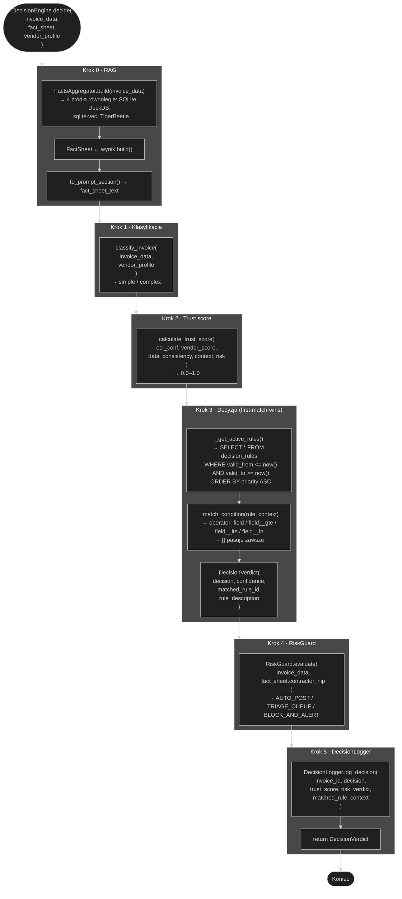
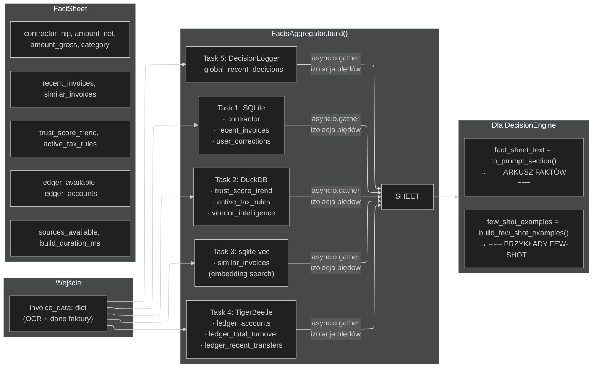
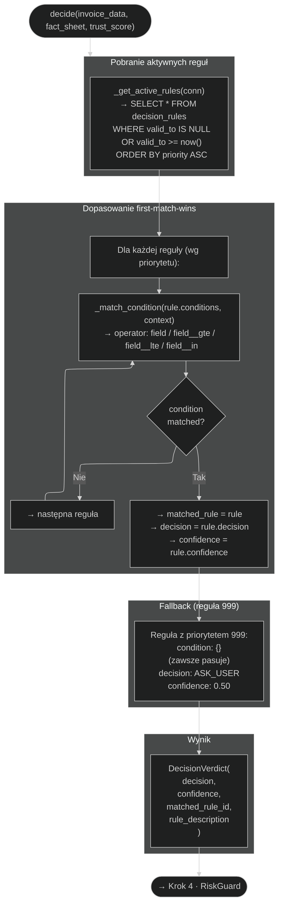
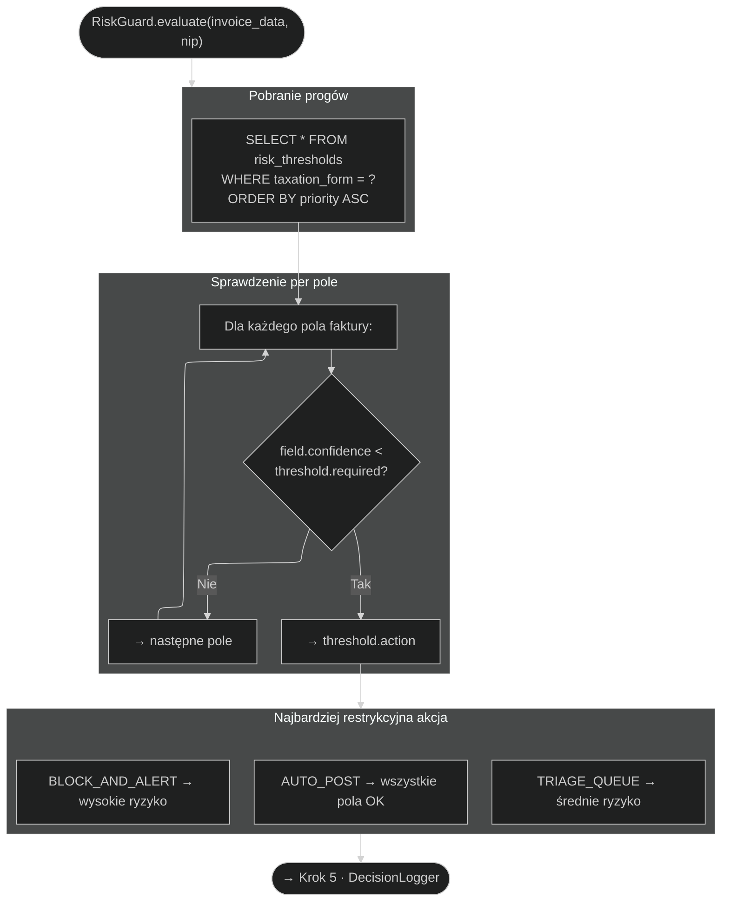
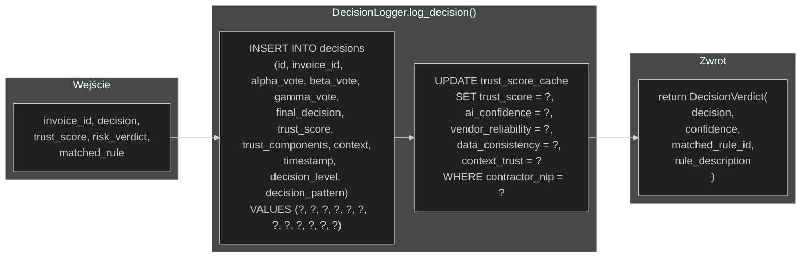
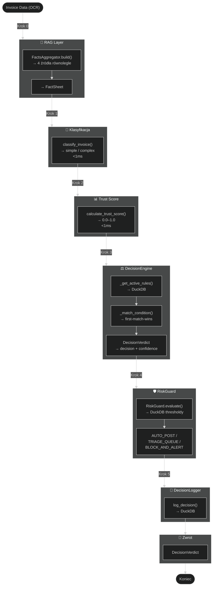
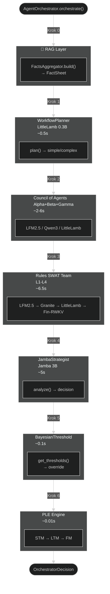

# Przepływ decyzyjny DecisionEngine.decide()

> **Wersja:** 2.3
> **Data:** 2026-06-10
> **Plik źródłowy:** `nexus_ai/core/decision_engine.py`
> **Format:** Mermaid.js flowchart

---

## Spis treści

1. [Główny przepływ — przegląd](#1-główny-przepływ)
2. [Krok 0 — RAG (FactsAggregator.build)](#2-krok-0--rag)
3. [Krok 1 — Klasyfikacja (classify_invoice)](#3-krok-1--klasyfikacja-classify_invoice)
4. [Krok 2 — Trust score (calculate_trust_score)](#4-krok-2--trust-score-calculate_trust_score)
5. [Krok 3 — Decyzja (decide)](#5-krok-3--decyzja-decide)
6. [Krok 4 — RiskGuard](#6-krok-4--riskguard)
7. [Krok 5 — DecisionLogger](#7-krok-5--decisionlogger)
8. [Pełny przepływ — jeden diagram](#8-pełny-przepływ)
9. [Macierz decyzyjna — reguły first-match-wins](#9-macierz-decyzyjna)
10. [Metryki wydajności](#10-metryki-wydajności)
11. [Appendix A — Architektura v2.0 (historyczna)](#11-appendix-a--architektura-v20-historyczna)
12. [Appendix B — NexusCache w przepływie decyzyjnym](#12-appendix-b--nexuscache-w-przepływie-decyzyjnym)

---

## 1. Główny przepływ



---

## 2. Krok 0 — RAG



---

## 3. Krok 1 — Klasyfikacja classify_invoice

`classify_invoice()` to deterministyczna funkcja SQL-like, która zastępuje WorkflowPlanner (LittleLamb 0.3B):

```python
def classify_invoice(invoice_data, vendor_profile=None) -> str:
    if amount <= 5000 and vendor_known and vendor_count >= 3 and ocr_conf >= 0.85:
        return "simple"
    return "complex"
```

| Warunek | Simple | Complex |
|---|---|---|
| Kwota brutto | ≤ 5000 PLN | > 5000 PLN |
| Kontrahent znany | Tak (≥3 faktury) | Opcjonalnie |
| OCR confidence | ≥ 0.85 | Dowolny |
| Czas wykonania | **<1ms** | **<1ms** |

---

## 4. Krok 2 — Trust score calculate_trust_score

5-składnikowa kalkulacja zastępująca TrustScoreCalculator:

```
trust = ocr_conf × 0.30 + vendor_score × 0.25 + data_consistency × 0.20
        + context × 0.10 + risk × 0.15
```

| Składnik | Waga | Źródło |
|---|---|---|
| `ocr_conf` | 0.30 | Pipeline OCR (LightOnOCR-1B, docTR, EasyOCR, PaddleOCR) |
| `vendor_score` | 0.25 | Historia kontrahenta (SQLite) |
| `data_consistency` | 0.20 | Zgodność pędów faktury |
| `context` | 0.10 | Kontekst kontrahenta (DuckDB) |
| `risk` | 0.15 | RiskGuard threshold |

**Czas wykonania:** **<1ms** (obliczenia w pamięci)

---

## 5. Krok 3 — Decyzja decide



### Przykład dopasowania

Dla faktury: znany kontrahent, 15 faktur, trust 0.88, kwota 4500 PLN, OCR 0.94:

| Prio | Warunek | Pasuje? | Decyzja |
|---|---|---|---|
| 10 | known + ≥10 + trust ≥0.85 + ≤5k + OCR≥0.92 | ✅ | **AUTO_POST** (conf=0.95) |
| 20 | (skip — już dopasowano) | — | — |

---

## 6. Krok 4 — RiskGuard

`RiskGuard.evaluate()` sprawdza progi ufności per pole faktury w DuckDB `risk_thresholds`:



---

## 7. Krok 5 — DecisionLogger



---

## 8. Pełny przepływ



---

## 9. Macierz decyzyjna

| Priorytet | Warunek | Decyzja | Confidence |
|---|---|---|---|
| 10 | known + ≥10 invoices + trust ≥0.85 + amount ≤5k + OCR ≥0.92 | **AUTO_POST** | 0.95 |
| 20 | known + ≥3 invoices + trust ≥0.80 + amount ≤3k + OCR ≥0.90 | **AUTO_POST** | 0.90 |
| 30 | known + amount ≤10k + OCR ≥0.85 | **SUGGEST** | 0.80 |
| 40 | new + amount ≤5k + OCR ≥0.90 | **SUGGEST** | 0.75 |
| 50 | amount ≤50k + OCR ≥0.80 | **ASK_USER** | 0.60 |
| 100 | amount ≥50k | **BLOCK** | 0.40 |
| 999 | Zawsze (fallback) | **ASK_USER** | 0.50 |

### Czynniki wpływające na końcową decyzję

1. **Dopasowana reguła** — pierwsza reguła, której warunki pasują (priorytet ASC)
2. **Trust score** — 5-składnikowa kalkulacja używana w warunkach reguł
3. **RiskGuard** — może zmienić decyzję na `TRIAGE_QUEUE` / `BLOCK_AND_ALERT`
4. **Klasyfikacja simple/complex** — wpływa na to, które źródła RAG są priorytetowe

### Końcowe wartości `decision`

| Wartość | Znaczenie |
|---|---|
| `AUTO_POST` | Automatyczne księgowanie — wysoka pewność (≥0.85) |
| `SUGGEST` | Sugestia dla użytkownika — umiarkowana pewność (0.75–0.84) |
| `ASK_USER` | Zapytaj użytkownika — niska pewność lub fallback |
| `BLOCK` | Blokada — kwota ≥50k lub wysoki risk |

---

## 10. Metryki wydajności

### Decision timing

| Operacja | Typowy czas | Uwagi |
|---|---|---|
| `classify_invoice()` | **<1ms** | Tylko porównania SQL-like |
| `calculate_trust_score()` | **<1ms** | Obliczenia w pamięci |
| `_get_active_rules()` | **<5ms** | SELECT z DuckDB |
| `_match_condition()` per rule | **<0.5ms** | Porównania słownikowe |
| `decide()` (całość) | **<5ms** | First-match-wins |
| `RiskGuard.evaluate()` | **<10ms** | DuckDB + per-field check |
| `DecisionLogger.log()` | **<5ms** | INSERT do DuckDB |
| **Całkowity czas decyzji** | **~10–20ms** | Bez RAG |

### Z RAG

| Komponent | Typowy czas |
|---|---|
| `FactsAggregator.build()` | ~100–300ms |
| `build_few_shot_examples()` (cache hit) | <10ms |
| `decide()` + `RiskGuard` + `DecisionLogger` | ~20ms |
| **Całkowity** | **~200–400ms** |

### Porównanie z poprzednią architekturą (v2.0)

| Scenariusz | v2.0 (wieloagentowa) | v2.3 (DecisionEngine) | Zmiana |
|---|---|---|---|
| Simple + RAG | ~7.8s | **~0.2s** | **39× szybciej** |
| Complex + RAG | ~18.3s | **~0.3s** | **61× szybciej** |
| RAM peak | ~2.2 GB | **~200 MB** | **11× mniej RAM** |

---

## 11. Appendix A — Architektura v2.0 (historyczna)

### Przepływ decyzyjny AgentOrchestrator (zastąpiony)

Poprzednia architektura używała kaskady 7+ komponentów AI:



**Total: ~7.7–18.3s zależnie od ścieżki**

### Dlaczego zastąpiony?

| Czynnik | v2.0 (wieloagentowa) | v2.3 (DecisionEngine) |
|---|---|---|
| Czas decyzji | 7.7–18.3s | 10–20ms |
| RAM | ~2.2 GB peak | ~200 MB baseline |
| Determinizm | LLM z temperature=0.1 | SQL first-match-wins |
| Testowalność | Trudna (LLM non-deterministic) | Łatwa (SQL + reguły) |
| Konserwacja | Fine-tuning modeli | INSERT do DuckDB |
| Koszt | Drogie inferencje GPU | Darmowe (CPU only) |

---

## 12. Appendix B — NexusCache w przepływie decyzyjnym

| Komponent | Cache'owane dane | Klucz | TTL | Typ dostępu |
|---|---|---|---|---|
| `_load_prompt_pack()` | Mapy promptów (lang → template → instrukcja) | `prompt_pack:{lang}` | 3600s | `get_sync/set_sync` (L1+L2) |
| `FactSheet._few_shot_cache` | Sekcje few-shot | `few_shot:{hash}:{max}` | 300s | `get_sync/set_sync` (L1+L2) |
| `FactsAggregator._enrich_cache` | Wzbogacone podobne faktury | `enrich:{invoice_id}` | 300s | `await get/set` (L1+L2) |
| `WhiteListService` | Wyniki Białej Listy MF | `whitelist:{nip}:{account}` | 3600s | L1+L2 (async) |
| `CurrencyConverter` | Kursy walut NBP | `fx_rate:{currency}:{date}` | 300s | L1 (sync) |
| `TimedModelCache` | TTL metadata modeli ML | `_model_cache_ttl:{key}` | 600s | TTL metadata (L1) |

---

> **Dokumentacja techniczna** — NexusAI v2.3
> **Ostatnia aktualizacja:** 2026-06-10
> **Plik:** `docs/DECISION_FLOW.md`
