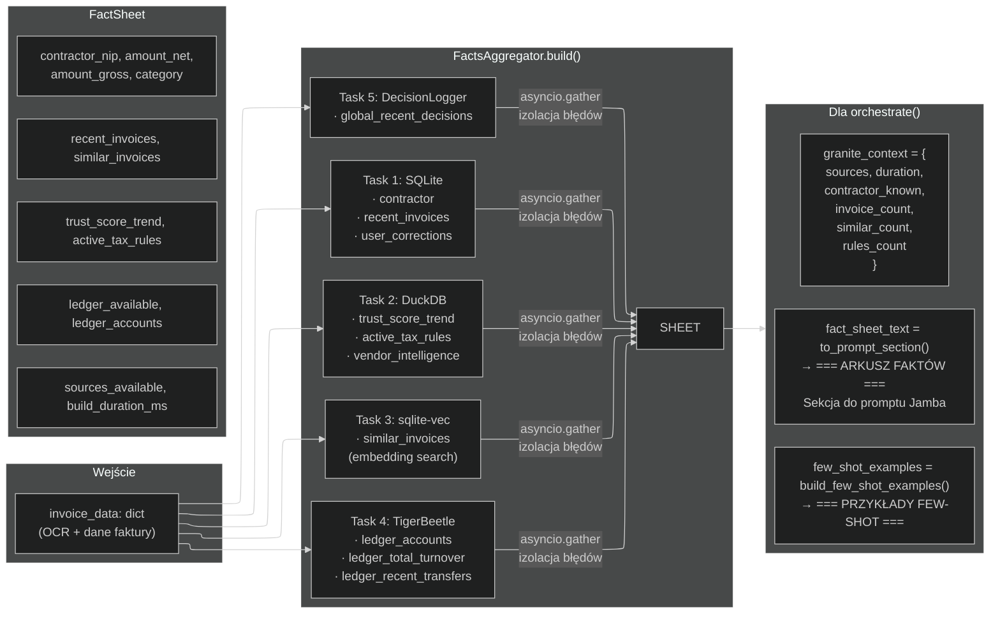
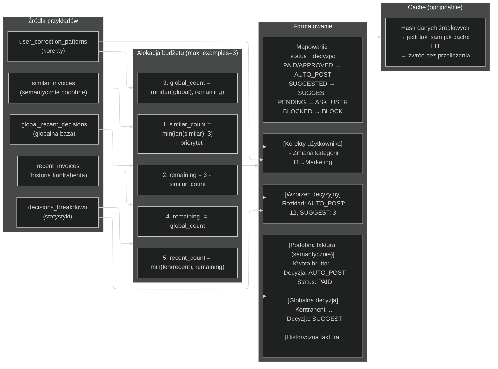
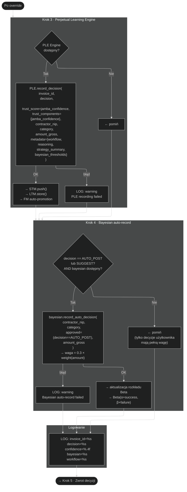
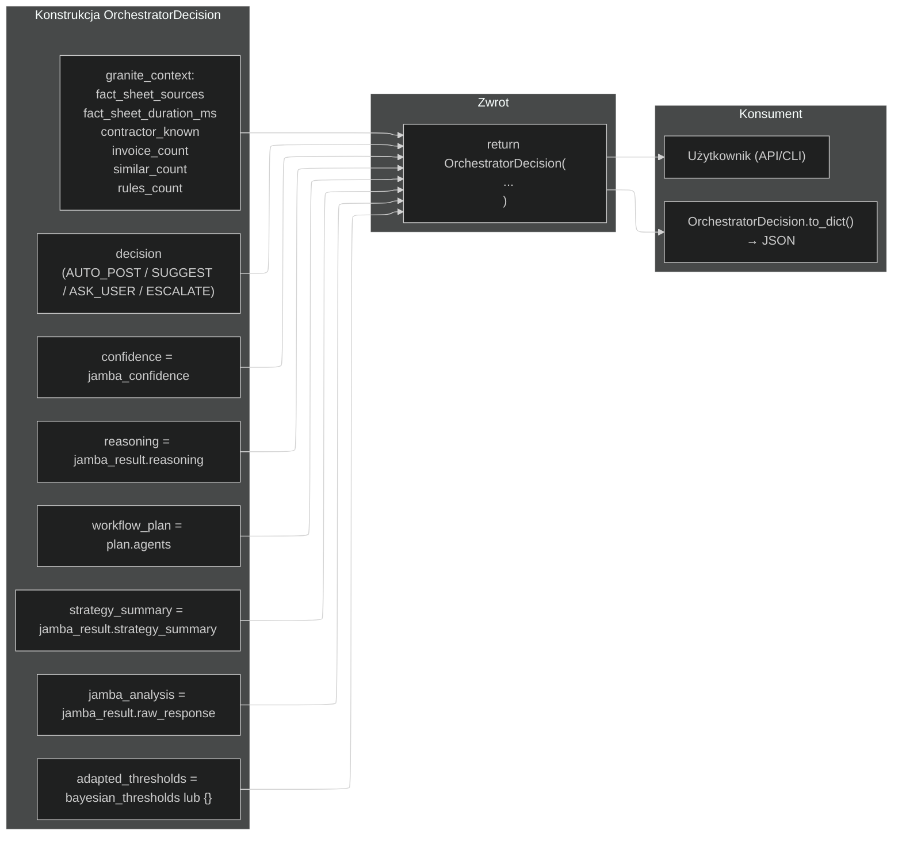
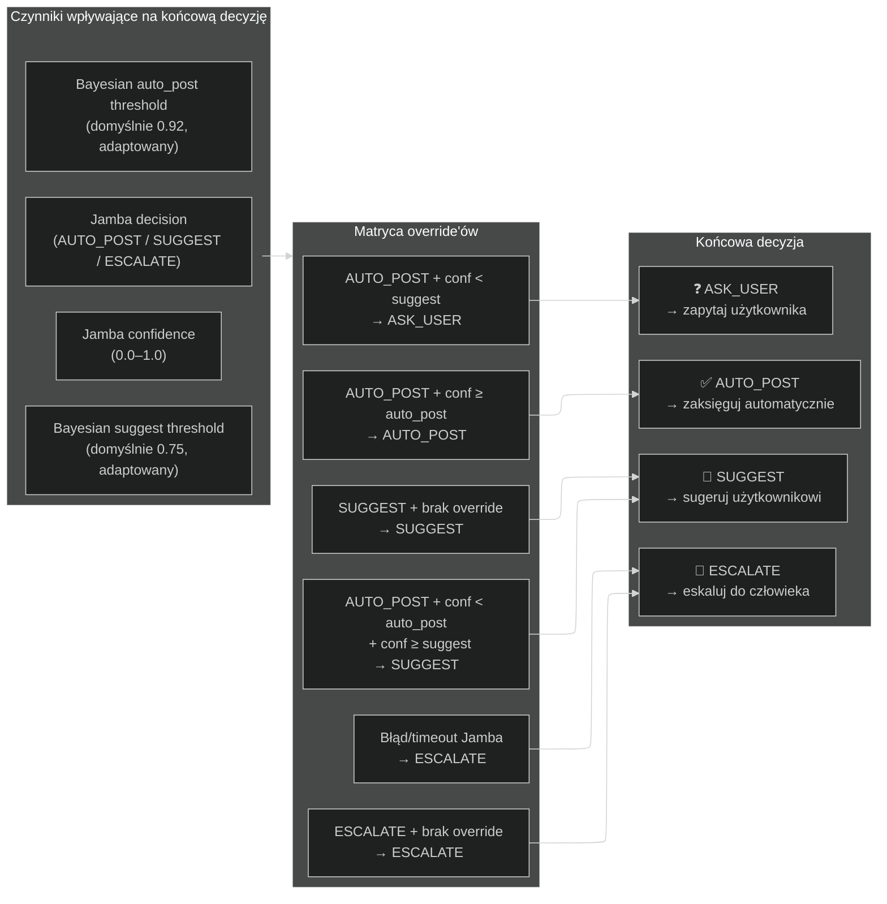

# Przepływ decyzyjny AgentOrchestrator.orchestrate()

> **Wersja:** 2.0
> **Data:** 2026-06-09
> **Plik źródłowy:** `nexus_ai/services/agent_orchestrator.py`
> **Format:** Mermaid.js flowchart

---

## Spis diagramów

1. [Główny przepływ — przegląd wysokopoziomowy](#1-główny-przepływ)
2. [Krok 0 — RAG (FactsAggregator.build)](#2-krok-0--rag)
3. [Krok 1 — WorkflowPlanner.plan](#3-krok-1--workflowplannerplan)
4. [Krok 1b — Few-shot z FactSheet](#4-krok-1b--few-shot-z-factsheet)
5. [Krok 2 — JambaStrategist.analyze](#5-krok-2--jambastrategistanalyze)
6. [Krok 2b–2c — Bayesowski override](#6-krok-2b2c--bayesowski-override)
7. [Krok 3–4 — PLE i Bayesian auto-record](#7-krok-34--ple-i-bayesian-auto-record)
8. [Krok 5 — Zwrot OrchestratorDecision](#8-krok-5--zwrot-orchestratordecision)
9. [Pełny przepływ — jeden diagram](#9-pełny-przepływ)
10. [Macierz decyzyjna — finalne decyzje](#10-macierz-decyzyjna)

---

## 1. Główny przepływ

```mermaid
%%{init: {"flowchart": {"defaultRenderer": "elk"}, "theme": "dark", "themeVariables": {"fontSize": "14px"}}}%%
flowchart TB
    START(["orchestrate(\n  invoice_id,\n  invoice_data,\n  vendor_profile,\n  quality_report,\n  analytics_report,\n  extraction_report\n)"]) 
    
    START --> K0
    
    subgraph K0["Krok 0 · RAG"]
        FA["FactsAggregator.build(invoice_data)\n→ 4 źródła równolegle: SQLite, DuckDB,\n  sqlite-vec, TigerBeetle"]
        FS["FactSheet ← wynik build()"]
        PST["to_prompt_section()\n→ fact_sheet_text"]
        FA --> FS --> PST
    end
    PST --> K1

    subgraph K1["Krok 1 · WorkflowPlanner"]
        WP["WorkflowPlanner.plan(\n  invoice_data,\n  vendor_profile,\n  fact_sheet_text\n)"]
        PLAN["plan = {\"agents\": [...], \"reasoning\": ...}"]
        WP --> PLAN
    end
    PLAN --> K1B

    subgraph K1B["Krok 1b · Few-shot"]
        FS2["FactSheet.build_few_shot_examples(max_examples=3)\n→ 3-warstwowy priorytet:\n  1. similar_invoices\n  2. global_recent_decisions\n  3. recent_invoices"]
        FSE["few_shot_examples (str)"]
        FS2 --> FSE
    end
    FSE --> K2

    subgraph K2["Krok 2 · JambaStrategist"]
        JS["JambaStrategist.analyze(\n  invoice_data,\n  quality_report,\n  analytics_report,\n  extraction_report,\n  fact_sheet_text,\n  few_shot_examples\n)"]
        JR["jamba_result = {\n  decision: AUTO_POST | SUGGEST | ESCALATE,\n  confidence: 0.0–1.0,\n  reasoning: str,\n  strategy_summary: str\n}"]
        JS --> JR
    end
    JR --> K2B

    subgraph K2B["Krok 2b · Bayesowskie progi"]
        BL{BayesianThresholdLearner\ndostępny?}
        BL -->|"Tak"| GT["get_thresholds(\n  contractor_nip,\n  category,\n  amount_gross\n) → bayesian_thresholds"]
        BL -->|"Nie"| BTN["bayesian_thresholds = None"]
        GT -->|"OK"| K2C
        GT -->|"błąd"| BTN
        BTN --> K3
    end

    subgraph K2C["Krok 2c · Bayesowski override"]
        COND1{decision == \"AUTO_POST\"\ni bayesian_thresholds != None?}
        COND1 -->|"Nie"| K3
        COND1 -->|"Tak"| COND2{jamba_confidence <\nbayesian[\"auto_post\"]?}
        COND2 -->|"Nie"| K3
        COND2 -->|"Tak"| COND3{jamba_confidence >=\nbayesian[\"suggest\"]?}
        COND3 -->|"Tak"| OVER1["decision = \"SUGGEST\"\ndowngrade AUTO_POST→SUGGEST"]
        COND3 -->|"Nie"| OVER2["decision = \"ASK_USER\"\ndowngrade AUTO_POST→ASK_USER"]
        OVER1 --> K3
        OVER2 --> K3
    end

    subgraph K3["Krok 3 · PLE"]
        COND4{PLE Engine\ndostępny?}
        COND4 -->|"Tak"| PR["PLE.record_decision(\n  invoice_id,\n  decision,\n  trust_score,\n  contractor_nip,\n  category,\n  amount_gross,\n  metadata\n)"]
        COND4 -->|"Nie"| K4
        PR --> K4
    end

    subgraph K4["Krok 4 · Bayesian auto-record"]
        COND5{decision == AUTO_POST\nlub SUGGEST?\ni bayesian dostępny?}
        COND5 -->|"Tak"| BR["Bayesian.record_auto_decision(\n  contractor_nip,\n  category,\n  approved=(decision==AUTO_POST),\n  amount_gross\n)\n→ waga: 0.3 × weight(amount)"]
        COND5 -->|"Nie"| K5
        BR --> K5
    end

    subgraph K5["Krok 5 · Zwrot decyzji"]
        RET["return OrchestratorDecision(\n  decision,\n  confidence=jamba_confidence,\n  reasoning,\n  workflow_plan,\n  strategy_summary,\n  jamba_analysis,\n  adapted_thresholds,\n  granite_context\n)"]
    end
    K5 --> END(["Koniec"])
```

---

## 2. Krok 0 — RAG



---

## 3. Krok 1 — WorkflowPlanner.plan

```mermaid
%%{init: {"flowchart": {"defaultRenderer": "elk"}, "theme": "dark"}}%%
flowchart TB
    subgraph Input["Wejście"]
        I1["invoice_data (amount, NIP, OCR conf)"]
        I2["vendor_profile (known, invoice_count, trust_score)"]
        I3["fact_sheet_text (RAG) — opcjonalnie"]
    end

    subgraph Prompt["Budowa promptu"]
        P["WORKFLOW_PLANNER_PROMPT\n+ dane faktury\n+ profil kontrahenta\n+ (opcjonalnie) arkusz faktów"]
    end

    subgraph Inference["Inferencja LittleLamb 0.3B"]
        INF["model.create_chat_completion(\n  max_tokens=256,\n  temperature=0.1\n)"]
        TIMEOUT{{"timeout?\nasyncio.wait_for()"}}
        INF --> TIMEOUT
    end

    subgraph Parse["Parsowanie odpowiedzi"]
        PARSE["msgspec_loads(raw)\n+ regex fallback\n+ walidacja agentów\n(whitelist: EKSTRAKCJA,\nWALIDACJA, ANALITYKA,\nDECYZJA)"]
    end

    subgraph Result["Wynik"]
        R1["agents = [\"EKSTRAKCJA\", \"WALIDACJA\"]\n→ simple (niska kwota, znany)"]
        R2["agents = [\"EKSTRAKCJA\", \"WALIDACJA\",\n\"ANALITYKA\", \"DECYZJA\"]\n→ complex (wysoka kwota, nowy)"]
        R3["agents = pełny zestaw\n→ fallback (timeout/błąd)"]
    end

    I1 --> P
    I2 --> P
    I3 --> P
    P --> INF
    TIMEOUT -->|"Tak"| R3
    TIMEOUT -->|"Nie"| PARSE
    PARSE -->|"poprawnie"| R1
    PARSE -->|"błąd"| R3
    PARSE -->|"prosta faktura"| R1
    PARSE -->|"złożona faktura"| R2
```

---

## 4. Krok 1b — Few-shot z FactSheet



---

## 5. Krok 2 — JambaStrategist.analyze

```mermaid
%%{init: {"flowchart": {"defaultRenderer": "elk"}, "theme": "dark"}}%%
flowchart TB
    subgraph Input["Wejścia"]
        I1["invoice_data"]
        I2["quality_report (Alpha/Beta/Gamma)"]
        I3["analytics_report (trendy, anomalie)"]
        I4["extraction_report (OCR, pola)"]
        I5["fact_sheet_text (RAG)"]
        I6["few_shot_examples"]
    end

    subgraph Prompt["Budowa promptu"]
        P1["JAMBA_SYSTEM_PROMPT\n→ rola stratega finansowego"]
        P2["=== DANE FAKTURY ===\nID, NIP, kwota, kategoria"]
        P3["fact_sheet_section\n=== ARKUSZ FAKTÓW ==="]
        P4["few_shot_section\n=== PRZYKŁADY FEW-SHOT ==="]
        P5["=== RAPORT WALIDATORA JAKOŚCI ===\nDecyzja, poziom, zaufanie"]
        P6["=== RAPORT ANALITYCZNY ===\nTrendy, anomalie, podsumowanie"]
        P7["=== RAPORT EKSTRAKCJI DANYCH ===\nPola, średnie zaufanie"]
    end

    subgraph Inference["Inferencja Jamba 3B"]
        INF["model.create_chat_completion(\n  max_tokens=1024,\n  temperature=0.1\n)"]
        TIMEOUT{{"timeout?\nasyncio.wait_for()"}}
        INF --> TIMEOUT
    end

    subgraph Parse["Parsowanie"]
        PARSE["msgspec_loads(raw)\n+ regex fallback\n→ decision, confidence, reasoning,\n  strategy_summary"]
    end

    subgraph Fallback["Fallback"]
        ERR["return {\n  decision: \"ESCALATE\",\n  confidence: 0.0,\n  reasoning: \"Timeout/Error\"\n}"]
    end

    subgraph Output["Wynik"]
        O1["decision: AUTO_POST / SUGGEST / ESCALATE"]
        O2["confidence: 0.0–1.0"]
        O3["reasoning: str"]
        O4["strategy_summary: str"]
        O5["raw_response: str"]
    end

    I1 --> P1
    I2 --> P2
    I3 --> P3
    I4 --> P4
    I5 --> P5
    I6 --> P6
    P1 & P2 & P3 & P4 & P5 & P6 & P7 --> Prompt
    Prompt --> INF
    TIMEOUT -->|"Tak"| ERR
    TIMEOUT -->|"Nie"| PARSE
    PARSE -->|"OK"| Output
    PARSE -->|"błąd JSON"| ERR
    ERR --> Output
```

---

## 6. Krok 2b–2c — Bayesowski override

```mermaid
%%{init: {"flowchart": {"defaultRenderer": "elk"}, "theme": "dark"}}%%
flowchart TB
    START(["Po JambaStrategist"])
    START --> K2B

    subgraph K2B["Krok 2b · Pobranie progów"]
        COND0{BayesianThresholdLearner\ndostępny?}
        COND0 -->|"Tak"| GET["bayesian.get_thresholds(\n  contractor_nip,\n  category,\n  amount_gross\n)"]
        COND0 -->|"Nie"| NONE["bayesian_thresholds = None"]
        GET -->|"OK"| OK["bayesian_thresholds = {\n  auto_post: 0.92,\n  suggest: 0.75,\n  ask_user: 0.50\n} (adaptowane)"]
        GET -->|"błąd"| NONE
        OK --> K2C
        NONE --> NEXT
    end

    subgraph K2C["Krok 2c · Bayesowski override"]
        COND1{Jamba decision ==\n\"AUTO_POST\"?\nAND thresholds != None?}
        COND1 -->|"Nie → zachowaj"| SKIP["← zachowaj decyzję Jamba"]
        COND1 -->|"Tak"| COND2{confidence <\nthresholds[\"auto_post\"]?}
        COND2 -->|"Nie → OK"| SKIP
        COND2 -->|"Tak → override"| COND3{confidence >=\nthresholds[\"suggest\"]?}
        COND3 -->|"Tak"| DOWN1["decision = \"SUGGEST\"\n→ DEGRADE"]
        COND3 -->|"Nie"| DOWN2["decision = \"ASK_USER\"\n→ DEGRADE"]
    end

    subgraph Effect["Efekt"]
        E1["LOG: bayesian override\nAUTO_POST→SUGGEST\n(jamba=0.85 < bayesian_auto=0.92)"]
        E2["LOG: bayesian override\nAUTO_POST→ASK_USER\n(jamba=0.60 < bayesian_suggest=0.75)"]
    end

    DOWN1 --> E1
    DOWN2 --> E2
    SKIP --> NEXT(["→ Krok 3 · PLE"])
    E1 --> NEXT
    E2 --> NEXT
```

---

## 7. Krok 3–4 — PLE i Bayesian auto-record



---

## 8. Krok 5 — Zwrot OrchestratorDecision



---

## 9. Pełny przepływ

```mermaid
%%{init: {"flowchart": {"defaultRenderer": "elk"}, "theme": "dark", "themeVariables": {"fontSize": "13px"}}}%%
flowchart TB
    START([orchestrate(invoice_id, invoice_data, vendor_profile,\nquality_report, analytics_report, extraction_report)])
    START -->|"Krok 0"| RAG

    subgraph RAG["🧠 RAG Layer"]
        FA["FactsAggregator.build(invoice_data)\n→ 4 źródła równolegle + DecisionLogger"]
        FS["→ FactSheet"]
        FST["→ fact_sheet_text = to_prompt_section()"]
        FA --> FS --> FST
    end
    FST -->|"Krok 1"| WP

    subgraph WP["📋 WorkflowPlanner"]
        WPP["plan(invoice_data, vendor, fact_sheet_text)\n→ LittleLamb 0.3B"]
        WPR["→ plan.agents = [EKSTRAKCJA, WALIDACJA]\nlub + ANALITYKA, DECYZJA"]
        WPP --> WPR
    end
    WPR -->|"Krok 1b"| FEW

    subgraph FEW["🎯 Few-shot"]
        FSB["FactSheet.build_few_shot_examples(max=3)\n→ podobne > globalne > historyczne"]
        FSX["→ few_shot_examples (str)"]
        FSB --> FSX
    end
    FSX -->|"Krok 2"| JAMBA

    subgraph JAMBA["⚖️ JambaStrategist"]
        JS["analyze(invoice_data, raporty,\nfact_sheet_text, few_shot)"]
        JR["→ {decision, confidence, reasoning,\n  strategy_summary}"]
        JS --> JR
    end
    JR -->|"Krok 2b"| BAYES
    
    subgraph BAYES["📊 Bayesowski override"]
        BL{Bayesian dostępny?}
        BL -->|"Tak"| THR["get_thresholds(NIP, kat.)\n→ auto_post=0.92, suggest=0.75"]
        THR --> BO{confidence < próg?\nAND decision == AUTO_POST?}
        BO -->|"Tak"| DOWN["downgrade do SUGGEST lub ASK_USER"]
        BO -->|"Nie"| KEEP["← zachowaj decyzję"]
        BL -->|"Nie"| KEEP
    end
    DOWN -->|"Krok 3"| PLE
    KEEP -->|"Krok 3"| PLE

    subgraph PLE["🧬 PLE Engine"]
        PLEC{PLE dostępny?}
        PLEC -->|"Tak"| PLER["record_decision()\n→ STM → LTM → FM"]
        PLEC -->|"Nie"| PLESK
        PLER --> PLESK
    end
    
    subgraph PLESK["← pomiń PLE"]
    end
    PLESK -->|"Krok 4"| BAR
    
    subgraph BAR["🔄 Bayesian auto-record"]
        BARC{decision AUTO_POST\nlub SUGGEST?\nAND bayesian?}
        BARC -->|"Tak"| BARR["record_auto_decision()\n→ waga 0.3 × weight"]
        BARC -->|"Nie"| BARSK
        BARR --> BARSK
    end

    subgraph BARSK["← pomiń Bayesian"]
    end
    BARSK -->|"Krok 5"| RET

    subgraph RET["🏁 Zwrot"]
        ORD["return OrchestratorDecision(\n  decision,\n  confidence,\n  reasoning,\n  workflow_plan,\n  strategy_summary,\n  jamba_analysis,\n  adapted_thresholds,\n  granite_context\n)"]
    end
    ORD --> END(["Koniec"])
```

---

## 10. Macierz decyzyjna



---

> **Dokumentacja techniczna** — NexusAI v2.0
> **Ostatnia aktualizacja:** 2026-06-09
> **Plik:** `docs/DECISION_FLOW.md`

---

## 11. Metryki wydajności

> **Pliki źródłowe:** `nexus_ai/core/config.py`, `nexus_ai/services/agent_orchestrator.py`, `nexus_ai/services/facts_aggregator.py`
> **Ostatnia analiza:** 2026-06-09

### 11.1. Timeouty (z konfiguracji)

| Parametr | Domyślnie | Zmienna środowiskowa | Dotyczy |
|---|---|---|---|
| `decision_timeout_seconds` | **60s** | `NEXUS_DECISION_TIMEOUT` | JambaStrategist (strategiczna decyzja) |
| `autopilot_agent_timeout_seconds` | **30s** | `NEXUS_AUTOPILOT_AGENT_TIMEOUT` | WorkflowPlanner, Council (Alpha/Beta/Gamma), Rules SWAT (L1–L4), Analytics Agent |

Każda warstwa ma własny timeout. Gdy model przekroczy timeout:
- **WorkflowPlanner** → pełny zestaw 4 agentów (safe default)
- **Council Alpha/Beta/Gamma** → `DecisionVerdict.error("Timeout")` → warstwa uznawana za ERROR w matrycy
- **Rules SWAT L1–L4** → `decision="FLAG"` / `passed=False` / `classification="FLAG"` z confidence=0.0
- **JambaStrategist** → `decision="ESCALATE"`, `confidence=0.0`, `reasoning="Timeout"`

### 11.2. Model inference times (CPU, średnie)

| Model | Rozmiar | RAM (załadowany) | Czas inferencji (CPU) | Używany w |
|---|---|---|---|---|
| LittleLamb 0.3B TC | ~250 MB | ~500 MB | **~0.5s** | WorkflowPlanner, Council Gamma, Rules L3 |
| LFM2.5 1.2B | ~780 MB | ~1.0 GB | **~2s** | Council Alpha, Rules L1 |
| Qwen3 0.6B | ~430 MB | ~0.9 GB | **~3s** | Council Beta |
| Granite 4.0 1B Nano | ~500 MB | ~0.8 GB | **~3s** | Rules L2 |
| Fin-RWKV-169M | ~170 MB | ~170 MB | **~0.5s** | Rules L4 |
| Jamba 3B | ~1.8 GB | ~2.0 GB | **~5s** | JambaStrategist |

> **Uwaga:** Tylko jeden model jest w RAM w danym momencie (`ModelManager` z `asyncio.Semaphore(1)`). Modele są ładowane lazy (przy pierwszym zadaniu) i wyładowywane po TTL 5 minut bezczynności.

### 11.3. RAG Layer (FactsAggregator.build)

Wszystkie źródła danych uruchamiane równolegle przez `asyncio.create_task()`:

| Źródło | Typ | Zależność | Typowy czas |
|---|---|---|---|
| SQLite: contractor | OLTP | Odpytanie Contractor + Invoice (count) | ~10–30ms |
| SQLite: recent_invoices | OLTP | SELECT + ORDER BY + LIMIT 5 | ~10–30ms |
| SQLite: corrections | OLTP | SELECT ActiveLearningPattern | ~10–30ms |
| DuckDB: trust_score_trend | OLAP | Agregacja 30-dniowa | ~20–50ms |
| DuckDB: active_tax_rules | OLAP | SELECT WHERE aktywne | ~10–20ms |
| DuckDB: vendor_intel | OLAP | SELECT z VendorAnalyst | ~20–50ms |
| DuckDB: correction_stats | OLAP | Agregacja korekt | ~10–30ms |
| DuckDB: global_decisions | OLAP | SELECT z trust_score_cache | ~10–30ms |
| DuckDB: global_similar | OLAP | SELECT + ORDER BY trust_score | ~20–40ms |
| sqlite-vec: similar | Wektorowa | Embedding + search_similar(top 5) | ~50–150ms |
| TigerBeetle: ledger | Secure Ledger | 3× get_account_credits_posted | ~30–100ms |

**Typowy czas RAG:** **~50–200ms** (wszystkie źródła równolegle, najwolniejsze to sqlite-vec)

**Wpływ RAG na czas decyzji:**
- RAG dodaje **~0.05–0.2s** do ścieżki decyzyjnej
- W porównaniu do ~7.7s (fast-path) to **<3% narzutu**
- Wszystkie źródła mają izolację błędów — awaria jednego nie opóźnia reszty
- Test (`test_facts_aggregator.py`) asercja: `build_duration_ms > 0` i `< 5000ms` (5s safe guard)

### 11.4. Scenariusze decyzyjne

#### Scenariusz A: Simple + z RAG (najczęstszy)

```
WorkflowPlanner (0.5s)
    → LittleLamb 0.3B: decyzja simple
→ FactsAggregator (0.1s)
    → 6–10 zapytań równolegle do SQLite, DuckDB, sqlite-vec, TigerBeetle
→ Council Alpha (2s)
    → LFM2.5 1.2B: fast-path (confidence ≥ 0.92 → pomija Beta+Gamma)
→ TrustScore + RiskGuard (0.1s)
    → Kalkulacja z 5 komponentów + ewaluacja reguł
→ FactSheet.build_few_shot_examples (0.01s)
    → Cache HIT (jeśli dane niezmienione) lub przebudowa
→ JambaStrategist (5s)
    → Jamba 3B: strategiczna decyzja (z arkuszem faktów + few-shot)
→ BayesianThreshold + PLE (0.1s)
    → Pobranie adaptacyjnych progów + override + zapis do STM/LTM/FM
────────────────────────────────────────
≈ ~7.8s total  (95% czasu = Jamba + Council)
```

#### Scenariusz B: Simple + bez RAG

```
WorkflowPlanner (0.5s) → Council Alpha (2s) → TrustScore (0.1s)
→ JambaStrategist (5s) → Bayesian + PLE (0.1s)
────────────────────────────────────────
≈ ~7.7s total  (oszczędność RAG: ~0.1s = ~1%)
```

#### Scenariusz C: Complex + z RAG (nowy kontrahent, wysoka kwota)

```
WorkflowPlanner (0.5s)
    → LittleLamb 0.3B: decyzja complex
→ FactsAggregator (0.1s)
→ Council Alpha + Beta + Gamma (6s)
    → LFM2.5 (2s) → Qwen3 (3s, równolegle z LittleLamb 1s) ≈ 3s seq
→ Rules SWAT L1–L4 (6.5s)
    → LFM2.5 (2s) → Granite (3s) → LittleLamb (1s) → Fin-RWKV (0.5s)
→ TrustScore + RiskGuard (0.1s)
→ JambaStrategist (5s)
→ BayesianThreshold + PLE (0.1s)
────────────────────────────────────────
≈ ~18.3s total  (nawet ~20s z garbage collection)
```

#### Scenariusz D: Complex + bez RAG

```
WorkflowPlanner (0.5s) → Council (6s) → Rules (6.5s) → TrustScore (0.1s)
→ JambaStrategist (5s) → Bayesian + PLE (0.1s)
────────────────────────────────────────
≈ ~18.2s total
```

### 11.5. Porównanie scenariuszy

| Scenariusz | RAG | Council | Rules | Jamba | Bayes + PLE | **Total** |
|---|---|---|---|---|---|---|
| **Prosta faktura, z RAG** | 0.1s | 2s (fast-path) | — | 5s | 0.1s | **~7.8s** |
| **Prosta faktura, bez RAG** | — | 2s (fast-path) | — | 5s | 0.1s | **~7.7s** |
| **Złożona faktura, z RAG** | 0.1s | 6s (Alpha+Beta+Gamma) | 6.5s | 5s | 0.1s | **~18.3s** |
| **Złożona faktura, bez RAG** | — | 6s | 6.5s | 5s | 0.1s | **~18.2s** |
| **Timeout Jamba** | 0.1s | 2–6s | 0–6.5s | 60s | — | **~60–73s** (czeka na timeout) |
| **Błąd RAG + Complex** | 0s (fail) | 6s | 6.5s | 5s | 0.1s | **~17.6s** (izolacja błędów) |

### 11.6. Warstwy pomijane w fast-path

Gdy WorkflowPlanner zwróci `simple` (tylko `EKSTRAKCJA` + `WALIDACJA`), pomijane są:

| Pomijana warstwa | Oszczędność czasu |
|---|---|
| Council Beta + Gamma | ~3s (zamiast sekwencji 2s+3s+1s → tylko Alpha 2s) |
| Rules SWAT L1–L4 | ~6.5s (cała kaskada reguł) |
| Analytics Agent | ~3s (Qwen2.5 1.5B) |

**Łączna oszczędność fast-path:** ~10.5s (57% czasu pełnej ścieżki)

### 11.7. PLE Engine — timing operacji

| Operacja | Typowy czas | Uwagi |
|---|---|---|
| STM.push() | <1ms | Append do listy w pamięci |
| LTM.store() | <5ms | Insert/update dict w pamięci |
| FM.add_decision_cache() | <1ms | Insert/update dict w pamięci |
| STM decay check | ~5ms | Co 5 minut, usuwa starsze niż 24h |
| LTM decay check | ~10ms | Raz na godzinę, waga <0.1 usuwane |
| FM compaction | ~20ms | Raz na godzinę, frequency <2 usuwane |
| `record_decision()` (całość) | **<10ms** | STM + LTM + ew. FM auto-promotion |

> PLE jest operacją w pamięci (RAM), bez zapytań do baz danych. Cały zapis decyzji zajmuje <10ms.

### 11.8. BayesianThresholdLearner — timing

| Operacja | Typowy czas | Uwagi |
|---|---|---|
| `get_thresholds()` | **<5ms** | Odczyt z SQLite + obliczenie percentyla |
| `record_auto_decision()` | **<5ms** | Aktualizacja rozkładu Beta + zapis do SQLite |
| `record_user_decision()` | **<10ms** | Pełna waga decyzji (1.0×amount_weight) |

### 11.9. Wykres czasowy (przybliżony)

```
Simple + RAG (7.8s):
  WP ████ (0.5s)
  RAG ▏ (0.1s)
  Alpha █████████████████ (2s)
  TS ▏ (0.1s)
  Jamba ██████████████████████████████████████████████ (5s)
  Bay ▏ (0.1s)

Complex + RAG (18.3s):
  WP ██▌ (0.5s)
  RAG ▏ (0.1s)
  Alpha ███████████ (2s)
  Beta █████████████████ (3s)
  Gamma █████▌ (1s)
  Rules ████████████████████████████████████ (6.5s)
  TS ▏ (0.1s)
  Jamba █████████████████████████████ (5s)
  Bay ▏ (0.1s)
```

### 11.10. ModelManager — mutual exclusion

| Operacja | Czas |
|---|---|
| Model load (first use) | ~1–3s (zależne od rozmiaru modelu i dysku) |
| acquire/release | <1ms (tylko semafor) |
| Model unload (TTL expiry) | ~10–100ms (del model + gc.collect) |
| Memory peak (Jamba 3B loaded) | ~2.0 GB RAM |
| Memory baseline (brak modeli) | ~200 MB RAM |

> **Peak memory:** System nigdy nie trzyma więcej niż 1 modelu w RAM. Przy 2.0 GB (Jamba) + 200 MB (system) = **~2.2 GB peak**.

---

# Appendix A — JAMBA_SYSTEM_PROMPT

> **Plik źródłowy:** `nexus_ai/services/agent_orchestrator.py` (linia ~478)
> **Model:** Jamba 3B (strategiczne wnioskowanie)
> **Rola:** Strateg finansowy analizujący pełny obraz faktury na podstawie raportów agentów

System prompt jest stały — nie zmienia się między decyzjami. Określa rolę modelu i format odpowiedzi JSON.

```
Jesteś strategiem finansowym analizującym pełny obraz faktury.
Otrzymujesz raporty od wyspecjalizowanych agentów:
1. Agent Walidator Jakości — ocena jakości danych i anomalii
2. Agent Analityczny — trendy i anomalie statystyczne
3. Agent Ekstrakcji Danych — dane surowe z faktury

Na podstawie tych raportów podejmij ostateczną decyzję.
Return ONLY a valid JSON object. No other text.
{
    "decision": "AUTO_POST" | "SUGGEST" | "ESCALATE",
    "confidence": 0.0-1.0,
    "reasoning": "Szczegółowe uzasadnienie decyzji",
    "strategy_summary": "Strategiczne podsumowanie w 2-3 zdaniach"
}
```

**Obsługiwane wartości `decision`:**

| Wartość | Znaczenie | Opis |
|---------|-----------|------|
| `AUTO_POST` | Automatyczne księgowanie | Model ma wysoką pewność (≥92% po Bayesie) — brak potrzeby weryfikacji człowieka |
| `SUGGEST` | Sugestia dla użytkownika | Model jest umiarkowanie pewny (≥75%) — proponuje decyzję, ale wymaga akceptacji |
| `ESCALATE` | Eskalacja do człowieka | Model ma niską pewność lub system nie może podjąć decyzji autonomicznie |

> **Uwaga:** Wartość `ASK_USER` nie jest zwracana przez Jamba — pojawia się dopiero po bayesowskim override w `Krok 2c`, gdy `AUTO_POST` zostaje zdegradowany z powodu zbyt niskiego confidence względem adaptacyjnego progu.

---

# Appendix B — WORKFLOW_PLANNER_PROMPT

> **Plik źródłowy:** `nexus_ai/services/agent_orchestrator.py` (linia ~120)
> **Model:** LittleLamb 0.3B (lekki model dla prostych decyzji)
> **Rola:** Inteligentny orkiestrator procesu fakturowania — decyduje które agenty uruchomić

```
Jesteś inteligentnym orkiestratorem procesu fakturowania.
Otrzymujesz dane faktury i profil kontrahenta.
Twoim zadaniem jest zdecydować, które kontrole są potrzebne:

- EKSTRAKCJA — weryfikacja danych faktury przez Agent Ekstrakcji Danych
- WALIDACJA — walidacja jakości przez Agent Walidator Jakości
- ANALITYKA — analiza trendów i wykrywanie anomalii statystycznych
- DECYZJA — ostateczna decyzja na podstawie wszystkich raportów

Zasady optymalizacji:
- Dla PROSTYCH faktur (niska kwota, znany kontrahent) uruchom TYLKO EKSTRAKCJA + WALIDACJA
- Dla ZŁOŻONYCH faktur (wysoka kwota, nowy kontrahent) uruchom PEŁNY zestaw

Return ONLY a valid JSON object. No other text.
{
    "agents": ["EKSTRAKCJA", "WALIDACJA"] lub ["EKSTRAKCJA", "WALIDACJA", "ANALITYKA", "DECYZJA"],
    "reasoning": "Krótkie uzasadnienie decyzji (1-2 zdania)"
}
```

**Przykładowy prompt wejściowy (budowany w `_build_prompt()`):**

```
{WORKFLOW_PLANNER_PROMPT}

=== DANE FAKTURY ===
- NIP kontrahenta: 1234567890
- Kwota netto: 4500.00 PLN
- Kwota brutto: 5535.00 PLN
- Kategoria: usługi IT
- OCR confidence: 0.92

=== PROFIL KONTRAHENTA ===
- Znany: tak
- Liczba faktur: 12
- Trust score: 0.85

Faktura jest PROSTA (→ tylko EKSTRAKCJA + WALIDACJA) gdy:
- Kwota brutto ≤ 5000 PLN
- Kontrahent znany (invoice_count ≥ 3)
- OCR confidence ≥ 0.85

=== ARKUSZ FAKTÓW (RAG) ===
... (jeśli dostępny, doklejony przez WorkflowPlanner.plan)
```

**Przykładowa odpowiedź modelu (simple):**

```json
{
    "agents": ["EKSTRAKCJA", "WALIDACJA"],
    "reasoning": "Faktura niskokwotowa (5535 PLN), znany kontrahent z 12 fakturami — tylko ekstrakcja i walidacja wystarczą."
}
```

**Przykładowa odpowiedź modelu (complex):**

```json
{
    "agents": ["EKSTRAKCJA", "WALIDACJA", "ANALITYKA", "DECYZJA"],
    "reasoning": "Faktura powyżej progu 5000 PLN — wymagana pełna analiza."
}
```

**Lista agentów (whitelist):**

| Nazwa | Opis |
|-------|------|
| `EKSTRAKCJA` | Weryfikacja danych faktury przez Agent Ekstrakcji Danych |
| `WALIDACJA` | Walidacja jakości przez Agent Walidator Jakości |
| `ANALITYKA` | Analiza trendów i wykrywanie anomalii statystycznych |
| `DECYZJA` | Ostateczna decyzja na podstawie wszystkich raportów |

> **Fallback:** Gdy model zwróci nieprawidłową listę agentów (timeout, błąd JSON, nieznane nazwy), system uruchamia pełny zestaw 4 agentów.

---

# Appendix C — Pełny prompt JambaStrategist

> **Plik źródłowy:** `nexus_ai/services/agent_orchestrator.py`, metoda `JambaStrategist._build_prompt()`
> **Model:** Jamba 3B

Poniższy kod w Pythonie pokazuje, jak dokładnie budowany jest prompt przekazywany do modelu:

```python
def _build_prompt(
    self,
    invoice_data: dict[str, Any],
    quality_report: dict[str, Any] | None,
    analytics_report: dict[str, Any] | None,
    extraction_report: dict[str, Any] | None,
    fact_sheet_text: str | None = None,
    few_shot_examples: str | None = None,
) -> str:
    q = quality_report or {}
    a = analytics_report or {}
    e = extraction_report or {}

    # fact_sheet_text ma własny nagłówek (=== ARKUSZ FAKTÓW ===)
    fact_sheet_section = f"\n{fact_sheet_text}" if fact_sheet_text else ""

    # few_shot_examples ma własny nagłówek (=== PRZYKŁADY FEW-SHOT ===)
    few_shot_section = f"\n\n{few_shot_examples}\n" if few_shot_examples else ""

    return f"""{JAMBA_SYSTEM_PROMPT}

=== DANE FAKTURY ===
- ID: {invoice_data.get('invoice_id', 'brak')}
- NIP: {invoice_data.get('contractor_nip', 'brak')}
- Kwota brutto: {invoice_data.get('amount_gross', '?')} PLN
- Kategoria: {invoice_data.get('category', 'brak')}{fact_sheet_section}{few_shot_section}
=== RAPORT WALIDATORA JAKOŚCI ===
- Decyzja: {q.get('decision', 'N/A')}
- Poziom: {q.get('level', 'N/A')}
- Zaufanie: {q.get('trust_score', 'N/A')}

=== RAPORT ANALITYCZNY ===
- Trendy: {len(a.get('trends', []))}
- Anomalie: {len(a.get('anomalies', []))}
- Podsumowanie: {a.get('summary', 'N/A')[:200]}

=== RAPORT EKSTRAKCJI DANYCH ===
- Pola: {len(e.get('extracted_fields', []))}
- Średnie zaufanie: {e.get('avg_confidence', 0.5)}"""
```

**Przykładowy kompletny prompt (z danymi):**

```
Jesteś strategiem finansowym analizującym pełny obraz faktury.
Otrzymujesz raporty od wyspecjalizowanych agentów:
... (JAMBA_SYSTEM_PROMPT)

=== DANE FAKTURY ===
- ID: inv-2026-06-001
- NIP: 1234567890
- Kwota brutto: 12300.00 PLN
- Kategoria: usługi IT

=== ARKUSZ FAKTÓW (FactsAggregator) ===
Źródła danych: SQLite=✓, DuckDB=✓, sqlite-vec=✓

Faktura #inv-2026-06-001
  Kontrahent: Firma XYZ (NIP: 1234567890)
  Kwota netto: 10000.00 PLN
  Kwota brutto: 12300.00 PLN
  Kategoria: usługi IT
  Data wystawienia: 2026-06-09

...

=== PRZYKŁADY FEW-SHOT (historyczne decyzje) ===

Przykład 1:
[Podobna faktura (semantycznie, odległość: 0.1234)]
  Kwota brutto: 15000.00
  Kategoria: usługi IT
  Decyzja Rady: AUTO_POST
  Trust score: 0.95
  Status w systemie: PAID

Przykład 2:
[Globalnie podobny przypadek (inny kontrahent)]
  NIP: 9876543210
  Kategoria: usługi IT
  Podjęta decyzja: SUGGEST
  Trust score: 0.72

=== RAPORT WALIDATORA JAKOŚCI ===
- Decyzja: APPROVE
- Poziom: STANDARD
- Zaufanie: 0.88

=== RAPORT ANALITYCZNY ===
- Trendy: 3
- Anomalie: 1
- Podsumowanie: Kwota typowa dla tego kontrahenta, brak sezonowości

=== RAPORT EKSTRAKCJI DANYCH ===
- Pola: 12
- Średnie zaufanie: 0.94
```

**Przykładowa odpowiedź modelu:**

```json
{
    "decision": "AUTO_POST",
    "confidence": 0.93,
    "reasoning": "Faktura od znanego kontrahenta (12 faktur w historii), kwota typowa dla kategorii usługi IT, raporty Walidatora i Ekstrakcji wskazują wysoką jakość danych. Trust score kontrahenta 0.85. Podobna faktura z przeszłości została zaksięgowana automatycznie.",
    "strategy_summary": "Wysoka pewność (93%) — AUTO_POST dla znanego kontrahenta z typową kwotą i wysoką jakością danych."
}
```

---

# Appendix D — FactSheet.to_prompt_section()

> **Plik źródłowy:** `nexus_ai/services/facts_aggregator.py` (linia ~184)
> **Rola:** Generuje sekcję `=== ARKUSZ FAKTÓW ===` wstrzykiwaną do promptu Jamba

```python
def to_prompt_section(self) -> str:
    """Konwertuj FactSheet na sekcję promptu dla modelu."""
    lines = ["=== ARKUSZ FAKTÓW (FactsAggregator) ==="]
    lines.append("")

    # Źródła danych
    src = self.sources_available
    lines.append(f"Źródła danych: SQLite={'✓' if src.get('sqlite') else '✗'}, "
                  f"DuckDB={'✓' if src.get('duckdb') else '✗'}, "
                  f"sqlite-vec={'✓' if src.get('vector_store') else '✗'}")
    lines.append("")

    # Podstawowe dane
    lines.append(f"Faktura #{self.invoice_id}")
    lines.append(f"  Kontrahent: {self.contractor_name} (NIP: {self.contractor_nip})")
    lines.append(f"  Kwota netto: {self.amount_net:.2f} PLN")
    lines.append(f"  Kwota brutto: {self.amount_gross:.2f} PLN")
    lines.append(f"  Kategoria: {self.category}")
    lines.append(f"  Data wystawienia: {self.issue_date}")
    lines.append("")

    # Kontrahent
    known = "znany" if self.contractor_known else "nowy"
    lines.append(f"Kontrahent: {known}")
    lines.append(f"  Liczba faktur w historii: {self.contractor_invoice_count}")
    lines.append(f"  Trust score: {self.contractor_trust_score:.2f}")
    lines.append(f"  Status VAT: {self.contractor_vat_status}")
    lines.append("")

    # Trend trust score (jeśli dostępny)
    trend = self.trust_score_trend
    if trend.get("known"):
        lines.append(f"Trend trust score (ostatnie 30 dni):")
        lines.append(f"  Średnia: {trend.get('avg_trust', 0):.4f}")
        lines.append(f"  Trend: {trend.get('trend', 'brak')}")
        lines.append(f"  Liczba decyzji: {trend.get('records', 0)}")
        lines.append("")

    # Podobne faktury z embeddingów
    similar = self.similar_invoices[:3]
    if similar:
        lines.append("Podobne faktury (semantycznie):")
        for i, inv in enumerate(similar, 1):
            dist = inv.get("_distance", 0)
            lines.append(f"  {i}. ID={inv.get('id', '?')} "
                          f"kwota={inv.get('amount_gross', '?')} "
                          f"kategoria={inv.get('category', '?')} "
                          f"(odległość: {dist:.4f})")
        lines.append("")

    # TigerBeetle (secure ledger) — rozbity na konta z opisami
    if self.ledger_available:
        lines.append("TigerBeetle (secure ledger):")
        ACCOUNT_LABELS = {
            "401-01": "Usługi obce (expense)",
            "202":    "Rozrachunki z dostawcami (payables)",
            "221-01": "VAT naliczony (input VAT)",
        }
        if self.ledger_accounts:
            lines.append("  Salda kont (zaksięgowane):")
            for sym, bal in sorted(self.ledger_accounts.items()):
                label = ACCOUNT_LABELS.get(sym, f"Konto {sym}")
                lines.append(f"    {label}")
                lines.append(f"      → {bal:.2f} PLN")
            active = {sym: bal for sym, bal in self.ledger_accounts.items() if bal > 0}
            zero = {sym: bal for sym, bal in self.ledger_accounts.items() if bal == 0}
            if active:
                lines.append(f"  Aktywne konta: {len(active)}")
            if zero:
                lines.append(f"  Konta zerowe: {len(zero)}")
        lines.append(f"  Łączny obrót: {self.ledger_total_turnover:.2f} PLN")
        transfers = self.ledger_recent_transfers[:3]
        if transfers:
            lines.append("  Ostatnie transfery:")
            for i, t in enumerate(transfers, 1):
                account = t.get("account", "?")
                label = ACCOUNT_LABELS.get(account, f"Konto {account}")
                lines.append(f"    {i}. {label}")
                lines.append(f"        kwota: {t.get('balance_pln', t.get('amount', '?'))} PLN")
                if t.get("note"):
                    lines.append(f"        ({t['note']})")
        lines.append("")

    # Aktywne reguły podatkowe (max 5)
    rules = self.active_tax_rules[:5]
    if rules:
        lines.append("Aktywne reguły podatkowe:")
        for i, rule in enumerate(rules, 1):
            lines.append(f"  {i}. {rule.get('description_template', rule.get('condition_sql', '?'))}")
        lines.append("")

    # Korekty użytkownika (max 3)
    corrections = self.user_correction_patterns[:3]
    if corrections:
        lines.append("Ostatnie korekty użytkownika:")
        for c in corrections:
            lines.append(f"  - {c.get('description', '')}")
        lines.append("")

    return "\n".join(lines)
```

**Przykładowy output:**

```
=== ARKUSZ FAKTÓW (FactsAggregator) ===

Źródła danych: SQLite=✓, DuckDB=✓, sqlite-vec=✓

Faktura #inv-2026-06-001
  Kontrahent: Firma XYZ (NIP: 1234567890)
  Kwota netto: 10000.00 PLN
  Kwota brutto: 12300.00 PLN
  Kategoria: usługi IT
  Data wystawienia: 2026-06-09

Kontrahent: znany
  Liczba faktur w historii: 15
  Trust score: 0.85
  Status VAT: czynny

Trend trust score (ostatnie 30 dni):
  Średnia: 0.9200
  Trend: rosnący
  Liczba decyzji: 8

Podobne faktury (semantycznie):
  1. ID=inv-123 kwota=15000 kategoria=usługi IT (odległość: 0.1234)
  2. ID=inv-456 kwota=8000 kategoria=usługi IT (odległość: 0.2345)

TigerBeetle (secure ledger):
  Salda kont (zaksięgowane):
    Rozrachunki z dostawcami (payables)
      → 25000.00 PLN
    Usługi obce (expense)
      → 12000.00 PLN
    VAT naliczony (input VAT)
      → 5000.00 PLN
  Aktywne konta: 3
  Łączny obrót: 42000.00 PLN
  Ostatnie transfery:
    1. Rozrachunki z dostawcami (payables)
        kwota: 25000.00 PLN
        (Saldo bieżące)

Aktywne reguły podatkowe:
  1. VAT 23% dla usług IT
  2. Limit 15000 PLN dla kontrahentów zagranicznych

Ostatnie korekty użytkownika:
  - Zmiana kategorii z "usługi IT" na "doradztwo"
```

---

# Appendix E — FactSheet.build_few_shot_examples()

> **Plik źródłowy:** `nexus_ai/services/facts_aggregator.py` (linia ~300)
> **Rola:** Generuje sekcję `=== PRZYKŁADY FEW-SHOT ===` z 4-warstwowym priorytetem

**Algorytm alokacji budżetu (max_examples=3):**

1. **similar_invoices** — semantycznie podobne faktury (sqlite-vec) — najwyższy priorytet
   - Wzbogacone o `council_decision` z DuckDB (pełna decyzja Rady Agentów)
   - Gdy `council_decision` dostępny → używa `final_decision`, `trust_score`, `decision_level`, `council_pattern`, `user_correction`
   - Fallback: mapowanie `status SQLite → decyzja` (PAID→AUTO_POST, SUGGESTED→SUGGEST, itd.)
2. **globally_similar_cases** — globalnie podobne przypadki (DuckDB, kategoria + trust_score) — dodane w 2026
3. **global_recent_decisions** — ostatnie decyzje wszystkich kontrahentów z DuckDB — dopełnienie
4. **recent_invoices** — historia kontrahenta (SQLite) — najniższy priorytet

Dodatkowo na końcu doklejane są:
- `[Wzorzec decyzyjny dla tego kontrahenta]` — rozkład decyzji z ostatnich 30 dni
- `[Ostatnie korekty użytkownika]` — maksymalnie 2

```python
def build_few_shot_examples(self, max_examples: int = 3) -> str:
    # Oblicz hash danych źródłowych — jeśli taki sam jak poprzednio i cache
    # zawiera wpis dla tego max_examples, zwróć cache bez przeliczania.
    data_hash = hash((
        str(self.recent_invoices),
        str(self.similar_invoices),
        str(self.globally_similar_cases),
        str(self.global_recent_decisions),
        str(self.trust_score_trend.get("decisions_breakdown", {})),
        str(self.user_correction_patterns),
    ))
    if data_hash == self._few_shot_data_hash and max_examples in self._few_shot_cache:
        cached = self._few_shot_cache[max_examples]
        if cached:
            logger.debug("[FactSheet] few-shot cache hit: %d chars", len(cached))
        return cached

    examples: list[str] = []

    # 1. Podobne faktury semantycznie (najwyższy priorytet)
    similar_count = min(len(self.similar_invoices), max_examples)
    remaining = max_examples - similar_count

    for inv in self.similar_invoices[:similar_count]:
        amount = inv.get("amount_gross", "?")
        category = inv.get("category", "?")
        distance = inv.get("_distance", 0)
        raw_status = inv.get("status")
        status = str(raw_status).upper() if raw_status is not None else "?"

        # Pełna decyzja Rady z DuckDB — jeśli dostępna, preferujemy ją
        council = inv.get("council_decision")
        if council and council.get("final_decision"):
            decision = str(council["final_decision"])
            trust = float(council.get("trust_score", 0.0))
            level = str(council.get("decision_level", ""))
            pattern = str(council.get("council_pattern", ""))
            correction = str(council.get("user_correction", "")) if council.get("user_correction") else ""

            entry = (
                f"[Podobna faktura (semantycznie, odległość: {distance:.4f})]\n"
                f"  Kwota brutto: {amount}\n"
                f"  Kategoria: {category}\n"
                f"  Decyzja Rady: {decision}\n"
                f"  Trust score: {trust:.2f}\n"
                f"  Status w systemie: {status}"
            )
            if level:
                entry += f"\n  Poziom decyzyjny: {level}"
            if pattern:
                entry += f"\n  Wzorzec: {pattern}"
            if correction:
                entry += f"\n  Korekta użytkownika: {correction}"
            examples.append(entry)
        else:
            # Fallback: mapuj status z SQLite na decyzję
            decision_map = {
                "PAID": "AUTO_POST",
                "APPROVED": "AUTO_POST",
                "SUGGESTED": "SUGGEST",
                "PENDING": "ASK_USER",
                "BLOCKED": "BLOCK",
            }
            decision = decision_map.get(status, "SUGGEST")
            examples.append(
                f"[Podobna faktura (semantycznie, odległość: {distance:.4f})]\n"
                f"  Kwota brutto: {amount}\n"
                f"  Kategoria: {category}\n"
                f"  Podjęta decyzja: {decision}\n"
                f"  Status: {status}"
            )

    # 2–4. Dopełnij globalnymi przypadkami (kod skrócony)
    # ...

    # 5. Wzorzec decyzyjny (statystyki)
    # 6. Korekty użytkownika

    result = "=== PRZYKŁADY FEW-SHOT (historyczne decyzje) ==="
    for i, example in enumerate(examples, 1):
        result += f"\n\nPrzykład {i}:\n{example}"

    # Zapisz do cache
    self._few_shot_data_hash = data_hash
    self._few_shot_cache[max_examples] = result
    return result
```

**Przykładowy output (max_examples=3):**

```
=== PRZYKŁADY FEW-SHOT (historyczne decyzje) ===

Przykład 1:
[Podobna faktura (semantycznie, odległość: 0.1234)]
  Kwota brutto: 15000.00
  Kategoria: usługi IT
  Decyzja Rady: AUTO_POST
  Trust score: 0.95
  Status w systemie: PAID
  Poziom decyzyjny: standard
  Wzorzec: council_alpha_beta

Przykład 2:
[Globalnie podobny przypadek (inny kontrahent, kategoria: usługi IT)]
  NIP: 9876543210
  Kategoria: usługi IT
  Podjęta decyzja: SUGGEST
  Trust score: 0.72

Przykład 3:
[Globalna decyzja (inny kontrahent)]
  NIP: 1112223334
  Kategoria: doradztwo
  Podjęta decyzja: ESCALATE
  Trust score: 0.45

[Wzorzec decyzyjny dla tego kontrahenta]
  Liczba decyzji: 8 w ostatnich 30 dniach
  Rozkład decyzji: AUTO_POST: 5, SUGGEST: 2, ESCALATE: 1
  Trend trust score: rosnący (śr. 0.92)

[Ostatnie korekty użytkownika]
  - Zmiana kategorii z "usługi IT" na "doradztwo"
```

**Macierz mapowania status → decyzja:**

| Status SQLite | Decyzja (fallback) | Opis |
|---------------|-------------------|------|
| `PAID` | `AUTO_POST` | Faktura opłacona — automatyczne księgowanie |
| `APPROVED` | `AUTO_POST` | Faktura zatwierdzona — automatyczne księgowanie |
| `SUGGESTED` | `SUGGEST` | Faktura sugerowana — wymaga akceptacji |
| `PENDING` | `ASK_USER` | Faktura oczekująca — zapytaj użytkownika |
| `BLOCKED` | `BLOCK` | Faktura zablokowana — odrzuć |
| inny/brak | `SUGGEST` | Domyślna decyzja dla nieznanego statusu |

---

**Struktura `council_decision` (z DuckDB):**

Gdy `_enrich_similar_with_decision()` znajdzie decyzję Rady Agentów w DuckDB, do słownika podobnej faktury doklejany jest klucz `council_decision` z następującymi polami:

```json
{
    "final_decision": "AUTO_POST",
    "trust_score": 0.95,
    "alpha_vote": "APPROVE",
    "beta_vote": "APPROVE",
    "gamma_vote": "ABSTAIN",
    "decision_level": "standard",
    "council_pattern": "council_alpha_beta",
    "user_correction": null
}
```

---

> **Dokumentacja techniczna** — NexusAI v2.0
> **Ostatnia aktualizacja:** 2026-06-09
> **Plik:** `docs/DECISION_FLOW.md`
