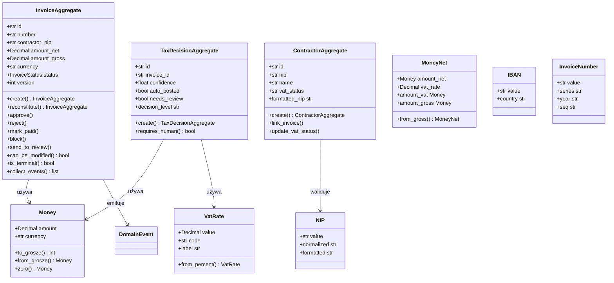
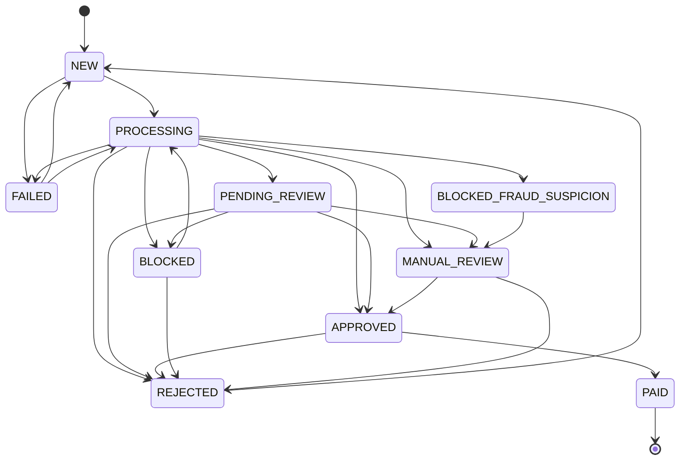

# 🧩 Warstwa Domenowa — Aggregates i Value Objects (DDD)

> **Plik:** `nexus_ai/domain/`
> **Status:** Stabilny · **Wersja:** 2.3.1-dev
> **Ostatnia aktualizacja:** 2026-07-05

---

## 1. Przegląd

NexusAI stosuje **Domain-Driven Design (DDD)** z wyraźnie wydzieloną warstwą domenową w `nexus_ai/domain/`. Warstwa ta zawiera:

- **Aggregates** — Aggregate Roots egzekwujące niezmienniki biznesowe
- **Value Objects** — Niezmienne obiekty z walidacją (msgspec.Struct, frozen=True)
- **Domain Events** — Fakty biznesowe rejestrowane jako niezmienne zdarzenia

```
nexus_ai/domain/
├── aggregates.py     # InvoiceAggregate, ContractorAggregate, TaxDecisionAggregate
├── values.py         # 11 Value Objects: Money, NIP, IBAN, PESEL, SWIFT, VatRate, ...
└── __init__.py
```

### Kluczowe zasady

1. **Agregaty egzekwują niezmienniki** — stan zmienia się tylko przez metody agregatu (nie settery)
2. **Value Objects są immutable** — msgspec.Struct z `frozen=True`
3. **Money używa Decimal** — nigdy float dla kwot finansowych
4. **Domain Events są faktami** — niezmienne zdarzenia, które się wydarzyły
5. **Jedna transakcja na agregat** — każda operacja biznesowa to jedna transakcja na jednym agregacie

---

## 2. Diagram warstwy domenowej



---

## 3. Aggregates

### 3.1 InvoiceAggregate — Aggregate Root faktury

Główny agregat systemu. Egzekwuje maszynę stanów faktury i rejestruje zdarzenia domenowe.

#### Factory: `InvoiceAggregate.create()`

```python
from nexus_ai.domain.aggregates import InvoiceAggregate
from decimal import Decimal

invoice = InvoiceAggregate.create(
    number="FV/2026/06/001",
    contractor_nip="1234567890",
    amount_net=Decimal("1000.00"),
    amount_gross=Decimal("1230.00"),
    currency="PLN",
)
assert invoice.status == "NEW"
assert invoice.version == 1
```

**Walidacje:**
- `amount_net < 0` → `ValueError`
- `amount_gross < 0` → `ValueError`
- `currency` nie jest 3-literowym kodem ISO → `ValueError`

#### Reconstitute: `InvoiceAggregate.reconstitute()`

Odtworzenie agregatu z bazy danych (bez walidacji — dane są już zweryfikowane):

```python
invoice = InvoiceAggregate.reconstitute(
    id="abc123",
    number="FV/2026/06/001",
    contractor_nip="1234567890",
    amount_net=Decimal("1000.00"),
    amount_gross=Decimal("1230.00"),
    currency="PLN",
    status="APPROVED",
    version=3,
    created_at=pendulum.now("UTC"),
    updated_at=pendulum.now("UTC"),
)
```

#### State Machine — dozwolone tranzycje



**Kod maszyny stanów:**

```python
_ALLOWED_TRANSITIONS = {
    InvoiceStatus.NEW: frozenset({PROCESSING, FAILED}),
    InvoiceStatus.PROCESSING: frozenset({PENDING_REVIEW, APPROVED, REJECTED, BLOCKED, ...}),
    InvoiceStatus.APPROVED: frozenset({PAID, REJECTED}),
    # ... wszystkie tranzycje zdefiniowane jako ClassVar
}

def _transition(self, new_status: InvoiceStatus) -> None:
    allowed = self._ALLOWED_TRANSITIONS.get(self.status, frozenset())
    if new_status not in allowed:
        raise ValueError(
            f"Nielegalna tranzycja: {self.status} -> {new_status}. "
            f"Dozwolone: {[s.value for s in allowed]}"
        )
```

#### Metody stanu

| Metoda | Nowy status | Emituje event | Opis |
|---|---|---|---|
| `approve()` | APPROVED | `InvoiceApproved` | Zatwierdź fakturę |
| `reject(reason)` | REJECTED | `InvoiceRejected` | Odrzuć fakturę |
| `mark_paid(amount)` | PAID | `InvoiceMarkedPaid` | Oznacz jako opłaconą |
| `block(reason, score)` | BLOCKED | `InvoiceBlocked` | Zablokuj fakturę |
| `block_fraud(reason, score)` | BLOCKED_FRAUD_SUSPICION | `InvoiceBlocked` | Zablokuj z podejrzeniem fraudu |
| `send_to_review(reason, confidence)` | PENDING_REVIEW | `InvoiceSentToReview` | Przekaż do weryfikacji |
| `mark_processing()` | PROCESSING | — | Rozpocznij przetwarzanie |
| `mark_failed()` | FAILED | — | Oznacz jako błąd |

#### Queries

```python
invoice.can_be_modified()       # True tylko w NEW lub PENDING_REVIEW
invoice.can_be_auto_approved()  # True w PROCESSING lub PENDING_REVIEW
invoice.is_terminal()            # True w PAID lub REJECTED
invoice.amount_vat              # amount_gross - amount_net (lub None)
```

#### Event Sourcing

```python
# Po wykonaniu operacji biznesowej:
events = invoice.collect_events()  # → lista DomainEvent (cleared)
assert invoice.has_pending_events() is False
```

---

### 3.2 ContractorAggregate — Aggregate Root kontrahenta

Egzekwuje walidację NIP przy tworzeniu i przechowuje referencje do faktur.

```python
from nexus_ai.domain.aggregates import ContractorAggregate

contractor = ContractorAggregate.create(
    nip="1234567890",
    name="Firma XYZ Sp. z o.o.",
)
assert contractor.formatted_nip == "123-456-78-90"
```

**Walidacja NIP:** Używa `NIP` Value Object z sumą kontrolną.

**Metody:**

| Metoda | Opis |
|---|---|
| `link_invoice(invoice_id)` | Powiąż fakturę z kontrahentem |
| `unlink_invoice(invoice_id)` | Usuń powiązanie faktury |
| `update_vat_status(status)` | Aktualizuj status VAT (z białej listy MF) |

**Właściwości:**

| Właściwość | Opis |
|---|---|
| `invoice_count` | Liczba powiązanych faktur |
| `formatted_nip` | NIP w formacie `XXX-XXX-XX-XX` |

---

### 3.3 TaxDecisionAggregate — Aggregate Root decyzji podatkowej

Egzekwuje trzy poziomy zaufania (auto-post, suggest, ask).

```python
from nexus_ai.domain.aggregates import TaxDecisionAggregate
from nexus_ai.domain.values import Money, VatRate, TaxPeriod

decision = TaxDecisionAggregate.create(
    invoice_id="inv-123",
    confidence=0.94,
    vat_rate=VatRate(value=Decimal("0.23"), code="23"),
    amount_net=Money(amount=Decimal("1000.00")),
    amount_vat=Money(amount=Decimal("230.00")),
    account_code=account_code,
    tax_period=TaxPeriod(year=2026, month=6),
)
assert decision.auto_posted is True      # confidence >= 0.92
assert decision.decision_level == "auto_post"
assert decision.requires_human() is False
```

**Progi decyzyjne (ClassVar):**

| Poziom | Próg confidence | Akcja |
|---|---|---|
| **auto_post** | ≥ 0.92 | Automatyczne księgowanie |
| **suggest** | ≥ 0.75, < 0.92 | Sugestia dla użytkownika |
| **ask** | < 0.75 | Pytanie z 2-5 opcjami |

---

## 4. Domain Events

Wewnętrzne zdarzenia domenowe (nie mylić z zewnętrznymi eventami z `events/domain_events.py`):

```python
@dataclass(frozen=True, slots=True)
class DomainEvent:
    event_id: str = field(default_factory=lambda: uuid.uuid4().hex)
    timestamp: pendulum.DateTime = field(default_factory=lambda: pendulum.now("UTC"))
    aggregate_id: str = ""

@dataclass(frozen=True, slots=True)
class InvoiceCreated(DomainEvent):
    invoice_number: str | None = None
    contractor_nip: str | None = None
    amount_net: Decimal | None = None
```

| Event | Emitowany przez | Opis |
|---|---|---|
| `InvoiceCreated` | `InvoiceAggregate.create()` | Faktura utworzona |
| `InvoiceApproved` | `InvoiceAggregate.approve()` | Faktura zatwierdzona |
| `InvoiceRejected` | `InvoiceAggregate.reject()` | Faktura odrzucona |
| `InvoiceMarkedPaid` | `InvoiceAggregate.mark_paid()` | Faktura opłacona |
| `InvoiceSentToReview` | `InvoiceAggregate.send_to_review()` | Faktura do weryfikacji |
| `InvoiceBlocked` | `InvoiceAggregate.block()` / `block_fraud()` | Faktura zablokowana |

---

## 5. Value Objects

Wszystkie Value Objects są **immutable** — `msgspec.Struct, frozen=True, kw_only=True`.

### 5.1 Money — kwota finansowa

```python
from nexus_ai.domain.values import Money

m = Money(amount=Decimal("123.45"), currency="PLN")
assert str(m) == "123.45 PLN"
assert m.to_grosze() == 12345

# Arytmetyka (walidacja waluty)
m2 = Money(amount=Decimal("200.00"))
m3 = m + m2          # → Money(323.45, PLN)
m4 = m * Decimal("2")  # → Money(246.90, PLN)

# Konwersje
m5 = Money.from_grosze(12345)     # → Money(123.45, PLN)
m6 = Money.zero("EUR")            # → Money(0.00, EUR)
m7 = Money.from_float(123.45)     # → Money(123.45, PLN)  # tylko dla testów

# Właściwości
assert m6.is_zero
assert m.is_positive
assert not m.rounded(0).is_positive  # → Money(123.00, PLN)
```

**Niezmienniki:**
- `amount < 0` → `ValueError`
- `currency` nie jest 3-literowym kodem ISO → `ValueError`
- Auto-round do 2 miejsc po przecinku (ROUND_HALF_UP)
- Blokada operacji na różnych walutach (`CurrencyMismatchError`)

### 5.2 MoneyNet — netto + VAT = brutto

```python
from nexus_ai.domain.values import MoneyNet

net = MoneyNet(
    amount_net=Money(amount=Decimal("1000.00")),
    vat_rate=Decimal("0.23"),
)
assert net.amount_vat.amount == Decimal("230.00")
assert net.amount_gross.amount == Decimal("1230.00")

# Z brutto
gross = MoneyNet.from_gross(
    amount_gross=Money(amount=Decimal("1230.00")),
    vat_rate=Decimal("0.23"),
)
assert gross.amount_net.amount == Decimal("1000.00")
```

**Niezmiennik:** `netto + VAT = brutto` (zawsze).

### 5.3 NIP — identyfikator podatkowy

```python
from nexus_ai.domain.values import NIP

nip = NIP(value="123-456-78-90")
assert nip.normalized == "1234567890"
assert nip.formatted == "123-456-78-90"
assert str(nip) == "123-456-78-90"
```

**Walidacja:** Suma kontrolna z wagami `(6,5,7,2,3,4,5,6,7)` modulo 11.

### 5.4 IBAN — numer rachunku bankowego

```python
from nexus_ai.domain.values import IBAN

iban = IBAN(value="PL61123456789012345678901234")
assert iban.country == "PL"
assert str(iban) == "PL61 1234 5678 9012 3456 7890 1234"
```

**Walidacja:** Długość 15-34 znaków, checksum MOD-97.

### 5.5 SWIFT/BIC — kod banku

```python
from nexus_ai.domain.values import SWIFT

swift = SWIFT(value="PKOPPLPW")
assert swift.bank_code == "PKOP"
assert swift.country_code == "PL"
assert swift.location_code == "PW"
assert swift.branch_code is None

swift2 = SWIFT(value="PKOPPLPWXXX")
assert swift2.branch_code == "XXX"
```

**Format:** `BBBBCCLL` (8 znaków) lub `BBBBCCLLXXX` (11 znaków).

### 5.6 PESEL — identyfikator osoby

```python
from nexus_ai.domain.values import PESEL

pesel = PESEL(value="90010112345")
assert pesel.get_gender() == "male"  # lub "female"
assert pesel.get_birth_date() == "1990-01-01"
```

**Walidacja:** Suma kontrolna z wagami `(1,3,7,9,1,3,7,9,1,3)` modulo 10.

### 5.7 InvoiceNumber — numer faktury

```python
from nexus_ai.domain.values import InvoiceNumber

inv_num = InvoiceNumber(value="FV/2026/06/001")
assert inv_num.series == "FV"
assert inv_num.year == "2026"
assert inv_num.seq == "001"
```

**Format:** `SERIA/RRRR/MM/SEQ` — walidowany przez regex.

### 5.8 VatRate — stawka VAT

```python
from nexus_ai.domain.values import VatRate

vat = VatRate(value=Decimal("0.23"), code="23")
assert vat.label == "23%"
assert vat.rate_23
assert not vat.rate_8

# Z percent
vat2 = VatRate.from_percent(8)
assert vat2.value == Decimal("0.08")
```

**Dozwolone stawki:** 23%, 8%, 5%, 0% (ClassVar `_ALLOWED`).

### 5.9 TaxPeriod — okres rozliczeniowy

```python
from nexus_ai.domain.values import TaxPeriod

tp = TaxPeriod(year=2026, month=6)
assert tp.is_month
assert tp.months == [6]

tp2 = TaxPeriod(year=2026, quarter=2)
assert tp2.is_quarter
assert tp2.months == [4, 5, 6]
```

### 5.10 AccountCode — kod konta księgowego

```python
from nexus_ai.domain.values import AccountCode

acct = AccountCode(value="401-1")
assert acct.team == "4"
assert acct.is_expense
assert not acct.is_revenue
```

| Team | Typ | Zespoły kont |
|---|---|---|
| 0, 1 | Aktywa | Środki trwałe, obrotowe |
| 2, 3, 8 | Pasywa | Zobowiązania, kapitały |
| 4, 5 | Koszty | Rodzajowe, układ kalkulacyjny |
| 7 | Przychody | Przychody ze sprzedaży |

### 5.11 KSeFMetadata — metadane e-faktury

```python
from nexus_ai.domain.values import KSeFMetadata

meta = KSeFMetadata(ksef_id="1234567890ABCDEF")
assert meta.is_registered
assert meta.verification_url == "https://ksef.mf.gov.pl/web/api/verify/1234567890ABCDEF"
```

---

## 6. Hierarchia błędów domenowych

```python
class DomainError(ValueError):
    """Base dla wszystkich błędów domenowych."""

class CurrencyMismatchError(DomainError):
    """Rzucany gdy próbujemy operować na różnych walutach."""
    code = "CURRENCY_MISMATCH"

class InvalidIBANError(DomainError):
    """Rzucany gdy IBAN jest nieprawidłowy."""

class InvalidNIPError(DomainError):
    """Rzucany gdy NIP jest nieprawidłowy."""

class InvalidPESELError(DomainError):
    """Rzucany gdy PESEL jest nieprawidłowy."""
```

---

## 7. BusinessKind — rodzaj działalności

```python
from nexus_ai.domain.values import BusinessKind

kind = BusinessKind(value="it")
assert kind.is_service
assert not kind.is_trade
```

| Kategoria | Wartości |
|---|---|
| Usługi | it, consulting, legal, accounting, marketing, construction, transport |
| Handel | retail, wholesale, ecommerce |
| Produkcja | manufacturing, food, pharma |
| Inne | other (domyślne) |

---

## 8. Zasady używania warstwy domenowej

1. **Tylko przez serwisy** — API/controllers nie powinny bezpośrednio używać agregatów
2. **Jedna transakcja na agregat** — `UnitOfWork` koordynuje transakcje
3. **Collect events po każdej operacji** — `aggregate.collect_events()` po każdej zmianie
4. **Reconstitute przed każdą mutacją** — zawsze odtwarzaj agregat z DB przed modyfikacją
5. **OC wersji** — używaj `version` do optimistic locking
6. **Value Objects są immutable** — nigdy nie modyfikuj, zawsze twórz nowe

---

> **Zobacz również:**
> - [`ARCHITECTURE.md`](ARCHITECTURE.md) — warstwy DDD, wzorce projektowe
> - [`FOUNDATION.md`](FOUNDATION.md) — UnitOfWork, BaseRepository, Result pattern
> - [`MODULES.md`](MODULES.md) — serwisy używające agregatów
> - [`EVENTS.md`](EVENTS.md) — Event Sourcing dla zdarzeń domenowych
> - [`DATABASE.md`](DATABASE.md) — persystencja agregatów
