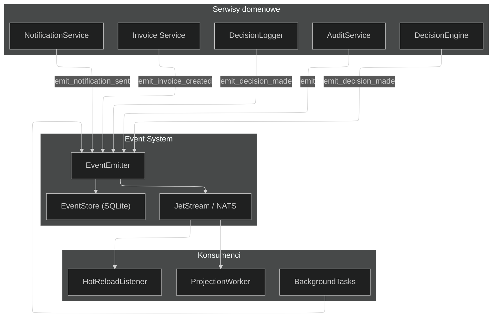

# Event-Driven Architecture — NexusAI Event Sourcing

> **Wersja:** 1.0
> **Data:** 2026-06-14
> **Status:** Implementowana (Faza 3 audytu)
> **Pliki źródłowe:** `nexus_ai/events/`, `nexus_ai/services/notification_service.py`,
> `nexus_ai/services/decision_logger.py`, `nexus_ai/api/background_tasks.py`

---

## Spis treści

1. [Wprowadzenie](#1-wprowadzenie)
2. [Architektura Event Sourcing](#2-architektura-event-sourcing)
3. [Domenowe Eventy](#3-domenowe-eventy)
4. [EventStore — trwałe przechowywanie](#4-eventstore)
5. [EventEmitter — publikacja eventów](#5-eventemitter)
6. [JetStream Event Bus — NATS](#6-jetstream-event-bus)
7. [Projections — CQRS](#7-projections)
8. [Eventy w serwisach](#8-eventy-w-serwisach)
9. [Background Tasks](#9-background-tasks)
10. [Diagram przepływu](#10-diagram-przepływu)

---

## 1. Wprowadzenie

NexusAI implementuje **Event Sourcing** (zdarzeniowe źródło prawdy) z **CQRS** (Command Query Responsibility Segregation) na NATS JetStream.

### Kluczowe założenia

- **Append-only** — eventy są tylko dodawane, nigdy modyfikowane
- **Silne typowanie** — wszystkie eventy to `msgspec.Struct` z walidacją
- **Dual-write** — każdy event zapisywany lokalnie (EventStore) i publikowany (NATS)
- **CQRS projections** — modele odczytu budowane przez ProjectionWorker
- **Fire-and-forget** — eventy domenowe emitowane przez BackgroundTask (bez blokowania odpowiedzi HTTP)

### Komponenty

| Komponent | Plik | Odpowiedzialność |
|---|---|---|
| `domain_events.py` | `nexus_ai/events/domain_events.py` | Definicje eventów domenowych (msgspec.Struct) |
| `EventStore` | `nexus_ai/events/event_store.py` | Append-only SQLite store |
| `EventEmitter` | `nexus_ai/events/event_emitter.py` | Fasada publikująca eventy |
| `JetStreamEventBus` | `nexus_ai/events/jetstream_bus.py` | NATS JetStream pub/sub |
| `ProjectionWorker` | `nexus_ai/events/projection_worker.py` | CQRS reader (background worker) |
| `background_tasks.py` | `nexus_ai/api/background_tasks.py` | Fire-and-forget BackgroundTask helpers |

---

## 2. Domenowe Eventy

Wszystkie eventy domenowe dziedziczą po `DomainEvent` (msgspec.Struct) i są zdefiniowane w `domain_events.py`.

### DomainEvent (bazowy)

```python
class DomainEvent(msgspec.Struct):
    event_type: str
    aggregate_id: str
    version: int
    data: dict[str, object] = msgspec.field(default_factory=dict)
```

### Zdefiniowane eventy

| Event | Typ | Emitowany przez | Opis |
|---|---|---|---|
| `InvoiceCreated` | `invoice.created` | Invoice Service | Faktura utworzona |
| `InvoiceSubmitted` | `invoice.submitted` | Pipeline OCR | Faktura przesłana do przetwarzania |
| `InvoiceApproved` | `invoice.approved` | Decision Engine | Faktura zatwierdzona |
| `InvoiceRejected` | `invoice.rejected` | Decision Engine | Faktura odrzucona |
| `InvoiceBlocked` | `invoice.blocked` | RiskGuard | Faktura zablokowana (wysokie ryzyko) |
| `InvoicePaid` | `invoice.paid` | Ledger Service | Faktura opłacona |
| `DecisionMade` | `decision.made` | DecisionLogger | Decyzja podjęta przez DecisionEngine |
| `DecisionOverridden` | `decision.overridden` | Autopilot | Decyzja nadpisana przez użytkownika |
| `NotificationSent` | `notification.sent` | NotificationService | Powiadomienie wysłane |
| `OutboxEventEmitted` | `outbox.emitted` | Outbox Relay | Event outbox opublikowany |

### Rejestracja eventów

Eventy są zarejestrowane w `_EVENT_TYPE_REGISTRY` w `domain_events.py`:

```python
_EVENT_TYPE_REGISTRY: dict[str, type[DomainEvent]] = {
    "invoice.created": InvoiceCreated,
    "invoice.submitted": InvoiceSubmitted,
    ...
    "notification.sent": NotificationSent,
}
```

Funkcja `domain_event_from_dict()` deserializuje słownik do odpowiedniego typu eventu na podstawie `event_type`.

---

## 3. EventStore

`EventStore` (`event_store.py`) to append-only SQLite store z snapshotami.

### Funkcje

| Metoda | Opis |
|---|---|
| `append_events(aggregate_type, aggregate_id, events, expected_version)` | Append-only z optimistic locking |
| `read_events(aggregate_type, aggregate_id)` | Odczyta wszystkie eventy dla aggregate |
| `read_events_since(sequence_id)` | Streaming eventów od danego momentu |
| `save_snapshot(aggregate_type, aggregate_id, snapshot)` | Zapis snapshotu |
| `get_snapshot(aggregate_type, aggregate_id)` | Odczyta ostatni snapshot |
| `get_latest_version(aggregate_type, aggregate_id)` | Pobierz ostatnią wersję |

### Schemat

```sql
CREATE TABLE events (
    sequence_id INTEGER PRIMARY KEY AUTOINCREMENT,
    aggregate_type TEXT NOT NULL,
    aggregate_id TEXT NOT NULL,
    version INTEGER NOT NULL,
    event_type TEXT NOT NULL,
    event_data TEXT NOT NULL,
    created_at TEXT NOT NULL,
    UNIQUE(aggregate_type, aggregate_id, version)
);
```

---

## 4. EventEmitter

`EventEmitter` (`event_emitter.py`) to centralna fasada do publikowania eventów.

### Metody

| Metoda | Opis |
|---|---|
| `emit(event)` | Główna metoda — zapisuje w EventStore + publikuje na NATS |
| `emit_notification_sent(...)` | Helper dla NotificationSent |

### Dual-write

Każde `emit()` wykonuje dwie operacje w sekwencji:

```python
async def emit(self, event: DomainEvent) -> None:
    # 1. Zapisz lokalnie (EventStore)
    await self._event_store.append_events(
        aggregate_type, aggregate_id, [event], expected_version
    )
    # 2. Opublikuj na NATS
    await self._bus.publish(event)
```

---

## 5. Eventy w serwisach

### NotificationService

Po wysłaniu powiadomienia emituje `NotificationSent`:

```python
if self._event_emitter is not None:
    await self._event_emitter.emit_notification_sent(
        user_id=recipient_id,
        notification_type=channel,
        title=title,
        channels=[channel],
    )
```

### DecisionLogger

Po każdej decyzji emituje `DecisionMade`. Po nadpisaniu przez użytkownika emituje `DecisionOverridden`.

```python
if self._event_emitter is not None:
    await self._event_emitter.emit_decision_made(...)
```

### AuditService

Po każdej zarejestrowanej zmianie emituje event:

```python
if self._event_emitter is not None:
    await self._event_emitter.emit(event)
```

---

## 6. Background Tasks

Fire-and-forget BackgroundTask helpers w `background_tasks.py`:

| Funkcja | Używana w | Opis |
|---|---|---|
| `emit_decision_overridden_bg(event_emitter, invoice_id, ...)` | `triage.py` | Emituje DecisionOverridden w tle |
| `emit_invoice_created_bg(event_emitter, invoice_data, ...)` | `invoices.py` | Emituje InvoiceCreated w tle |
| `emit_decision_and_notification_bg(event_emitter, notif_service, ...)` | `autopilot.py` | Emituje DecisionOverridden + powiadomienie |

Wszystkie funkcje przyjmują `**kwargs` dla kompatybilności z `BackgroundTask` i używają `structlog` dla logowania.

---

## 7. Diagram przepływu



---

> **Dokumentacja techniczna** — NexusAI Event-Driven Architecture
> **Ostatnia aktualizacja:** 2026-06-14
