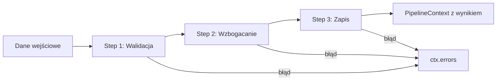
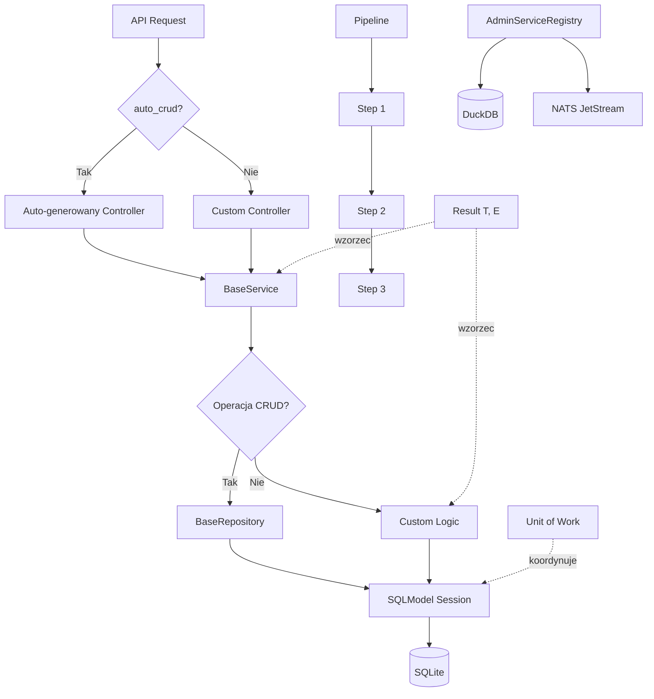

# 🧱 Warstwa Foundation — fundament architektoniczny NexusAI

> **Cel:** Udokumentować generyczne komponenty infrastrukturalne, które eliminują powtarzalny kod w całym systemie.  
> **Kiedy czytać:** Przed tworzeniem nowego serwisu, repozytorium lub pipeline'u.

---

## 1. Przegląd — co daje warstwa Foundation?

Warstwa `nexus_ai/core/foundation/` to zestaw **generycznych, typowanych komponentów** eliminujących boilerplate. Zastępuje łącznie **~10 300 linii** powtarzalnego kodu:

| Komponent | Oszczędność | Zastosowanie |
|---|---|---|
| `BaseService[T, CreateDTO, UpdateDTO]` | ~4 700 linii | CRUD dla wszystkich modeli SQLModel |
| `auto_crud()` | ~3 730 linii | Automatyczne endpointy REST |
| `AdminServiceRegistry` | ~1 030 linii | Serwisy administracyjne z DuckDB + NATS |
| `BaseRepository[T]` | ~800 linii | Dostęp do danych |
| `Pipeline[T]` + `Step[T]` | Eliminuje powtarzalną orkiestrację | OCR, walidacja, decyzje |

---

## 2. Result Pattern — monada Either (`Result[T, E]`)

### 2.1 Koncepcja

`Result[T, E]` to **monada Either** — wzorzec funkcyjny eliminujący wyjątki jako flow control. Zamiast `raise` lub `try/except`, funkcje zwracają `Ok(value)` lub `Err(error)`.

```python
from nexus_ai.core.types import Result, Ok, Err

def divide(a: int, b: int) -> Result[float, str]:
    if b == 0:
        return Result.err("Division by zero")
    return Result.ok(a / b)

result = divide(10, 2)
if result.is_ok:
    value = result.unwrap()  # 5.0
else:
    error = result.unwrap_err()  # "Division by zero"
```

### 2.2 API

| Metoda | Opis |
|---|---|
| `Result.ok(value)` | Tworzy sukces |
| `Result.err(error)` | Tworzy błąd |
| `is_ok` / `is_err` | Sprawdza wariant |
| `unwrap()` | Wyciąga wartość (raise przy Err) |
| `unwrap_or(default)` | Wartość lub fallback |
| `unwrap_err()` | Wyciąga błąd (raise przy Ok) |
| `map(func)` | Transformuje wartość (tylko Ok) |
| `map_err(func)` | Transformuje błąd (tylko Err) |
| `and_then(func)` | Chain-owanie (flatMap) |
| `or_else(func)` | Obsługa błędu (flatMap na Err) |

### 2.3 Discriminated Subclasses (zero `type: ignore`)

W implementacji użyto **dyskryminowanych podklas** `Ok[T, E]` i `Err[T, E]` dziedziczących po `Result[T, E]`. Dzięki `@final` i polom `value`/`error` type checker precyzyjnie zawęża typ:

```python
@final
class Ok(Result[T, E]):
    @property
    def value(self) -> T:  # zawsze nie-None dla Ok
        return self._value

@final
class Err(Result[T, E]):
    @property
    def error(self) -> E:  # zawsze nie-None dla Err
        return self._error
```

### 2.4 PaginatedResponse

```python
from nexus_ai.core.types import PaginatedResponse

response = PaginatedResponse.create(items, total=150, page=1, page_size=20)
# PaginatedResponse(root=items, total=150, page=1, page_size=20)
# response.total_pages -> 8
# response.has_next -> True
```

---

## 3. Unit of Work — atomowe transakcje

### 3.1 Koncepcja

`UnitOfWork` koordynuje **jedną transakcję** obejmującą wiele repozytoriów. Wszystkie zmiany są zatwierdzane atomowo — albo wszystkie, albo żadna.

### 3.2 Użycie

```python
from nexus_ai.core.foundation.unit_of_work import UnitOfWork

# Sync (context manager)
with UnitOfWork(session) as uow:
    invoice_repo = uow.repository(Invoice)
    contractor_repo = uow.repository(Contractor)
    
    invoice_repo.add(new_invoice)
    contractor_repo.update(contractor, last_activity=now)
    # commit automatyczny na __exit__ bez wyjątku

# Async
async with UnitOfWork(session) as uow:
    repo = uow.repository(Invoice)
    repo.add(new_invoice)
    # commit automatyczny na __aexit__

# Z factory sesji
from nexus_ai.core.foundation.unit_of_work import uow_context

async with uow_context(session_factory) as uow:
    ...
```

### 3.3 Zachowanie transakcyjne

| Scenariusz | Zachowanie |
|---|---|
| Bez wyjątku | `commit()` |
| Wyjątek w `__exit__` | `rollback()` + log warning |
| `commit()` już wywołany | No-op (idempotentne) |

---

## 4. Pipeline — sekwencyjne przetwarzanie

### 4.1 Koncepcja

`Pipeline[T]` wykonuje listę `Step[T]` sekwencyjnie, przekazując `PipelineContext[T]` między krokami. Zastępuje ręczną orkiestrację w OCR, walidacji i procesach decyzyjnych.

### 4.2 Struktura



### 4.3 Przykład — pipeline OCR

```python
from nexus_ai.core.foundation.pipeline import Pipeline, Step, PipelineContext

class PreprocessStep(Step[dict]):
    async def process(self, ctx: PipelineContext[dict]) -> None:
        image = ctx.data["image"]
        ctx.data["processed"] = preprocess(image)

class OcrStep(Step[dict]):
    async def process(self, ctx: PipelineContext[dict]) -> None:
        ctx.data["text"] = run_ocr(ctx.data["processed"])

class ValidateStep(Step[dict]):
    async def process(self, ctx: PipelineContext[dict]) -> None:
        if not ctx.data.get("text"):
            ctx.add_error(ValueError("OCR returned no text"))

pipeline = Pipeline([
    PreprocessStep(),
    OcrStep(),
    ValidateStep(),
], raise_on_error=False)

ctx = await pipeline.run({"image": image_bytes})
if ctx.errors:
    print(f"Pipeline failed with {len(ctx.errors)} errors")
```

### 4.4 PipelineContext

| Pole | Typ | Opis |
|---|---|---|
| `data` | `T` | Główne dane (mutowalne, współdzielone między krokami) |
| `metadata` | `dict` | Metadane (tenant_id, user_id, correlation_id) |
| `errors` | `list[Exception]` | Lista błędów zebranych podczas przetwarzania |
| `add_error(err)` | metoda | Dodaj błąd do kontekstu |

---

## 5. BaseRepository — generyczny dostęp do danych

### 5.1 Koncepcja

`BaseRepository[T: SQLModel]` zapewnia **pełne CRUD + paginację** dla dowolnego modelu SQLModel. Wszystkie operacje są synchroniczne — dla async, wrap w `anyio.to_thread.run_sync()`.

### 5.2 API

```python
from nexus_ai.core.foundation.base_repository import BaseRepository

repo = BaseRepository[Invoice](session)

# Create
invoice = repo.create(number="FV/2026/07/001", amount=10000)
repo.add(invoice)  # flush bez tworzenia obiektu

# Read
invoice = repo.get_by_id("inv-123")
all_paid = repo.find(status="PAID", limit=50)
first = repo.find_one(nip="1234567890")

# Update
repo.update(invoice, status="APPROVED")
repo.update_by_id("inv-123", status="APPROVED")

# Delete
repo.delete(invoice)
repo.delete_by_id("inv-123")

# Aggregate
count = repo.count(status="NEW")
exists = repo.exists("inv-123")

# Paginacja
response = repo.paginate(page=1, page_size=20, order_by="-created_at")
# PaginatedResponse z items, total, page, page_size
```

### 5.3 Wymagania dla modelu

Model musi mieć pole `id` (primary key) — `BaseRepository` sprawdza to w `__init__`.

---

## 6. BaseService — generyczny CRUD dla serwisów

### 6.1 Koncepcja

`BaseService[T, CreateDTO, UpdateDTO]` eliminuje **~4 700 linii** powtarzalnego kodu CRUD. Wystarczy:

```python
from nexus_ai.core.foundation.base_service import BaseService

class InvoiceService(BaseService[Invoice, InvoiceCreateDTO, InvoiceUpdateDTO]):
    pass

# Wszystkie endpointy dostępne automatycznie:
service.create(data)
service.get("inv-123")
service.list(limit=50, status="PAID")
service.update("inv-123", data)
service.delete("inv-123")
service.count(status="NEW")
service.exists("inv-123")
service.paginate(page=1, page_size=20)
```

### 6.2 Auto-inferencja modelu

Jeśli klasa nazywa się `InvoiceService`, automatycznie wykrywa model `Invoice` z rejestru SQLAlchemy. Dla niestandardowych nazw:

```python
class CustomService(BaseService[Invoice, InvoiceCreateDTO, InvoiceUpdateDTO]):
    def __init__(self, session):
        super().__init__(session, model=Invoice)
```

### 6.3 DTO (Data Transfer Objects)

DTO są definiowane jako `msgspec.Struct`:

```python
from msgspec import Struct

class InvoiceCreateDTO(Struct):
    number: str
    amount_net: str
    contractor_nip: str
    issue_date: str
    vat_rate: str = "0.23"
```

---

## 7. AdminServiceRegistry — samo-rejestrujące serwisy admin

### 7.1 Koncepcja

`AdminServiceRegistry` eliminuje **~1 030 linii** boilerplate'u dla serwisów administracyjnych. Każdy serwis dziedziczący po `AdminServiceRegistry` automatycznie rejestruje się w słowniku `_registry`.

### 7.2 Użycie

```python
from nexus_ai.core.foundation.admin_registry import AdminServiceRegistry, rule_service

@rule_service("risk.thresholds.updated")
class RiskThresholdService(AdminServiceRegistry):
    @classmethod
    def list(cls) -> list[dict]:
        with cls.db() as conn:
            rows = conn.execute("SELECT * FROM risk_thresholds WHERE active = true").fetchall()
            return cls._read_rows(rows, ("id", "name", "condition", "output", "priority"))

# Auto-rejestracja: nazwa klasy -> "risk_threshold"
service_cls = AdminServiceRegistry.get("risk_threshold")
thresholds = service_cls.list()
```

### 7.3 Auto-rejestracja

| Klasa | Rejestracja jako | NATS subject |
|---|---|---|
| `RiskThresholdService` | `risk_threshold` | `risk.thresholds.updated` |
| `BillingRuleService` | `billing_rule` | `billing.rules.updated` |
| `LedgerRuleService` | `ledger_rule` | `ledger.rules.updated` |
| `TaxRuleService` | `tax_rule` | `tax.rules.updated` |

### 7.4 DuckDB context manager

```python
@classmethod
@contextmanager
def db(cls) -> Iterator[duckdb.DuckDBPyConnection]:
    config = AppConfig()
    conn = duckdb.connect(str(config.duckdb_path))
    try:
        cls._on_connect(conn)
        yield conn
    finally:
        conn.close()
```

---

## 8. auto_crud — automatyczne endpointy REST

### 8.1 Koncepcja

`auto_crud()` generuje **kompletny kontroler REST CRUD** z modelu SQLModel — **~3 730 linii oszczędności**. Automatycznie tworzy:

- `GET /{path}` — lista z paginacją
- `GET /{path}/{id}` — pobranie po ID
- `POST /{path}` — utworzenie
- `PUT /{path}/{id}` — aktualizacja
- `DELETE /{path}/{id}` — usunięcie

### 8.2 Użycie

```python
from nexus_ai.core.foundation.auto_crud import auto_crud

# Minimalne użycie
AlertController = auto_crud("alerts", SecurityAlert, tags=["Admin"])

# Z custom DTO i wykluczeniem DELETE
InvoiceController = auto_crud(
    "invoices",
    Invoice,
    create_dto=InvoiceCreateDTO,
    update_dto=InvoiceUpdateDTO,
    tags=["Invoices"],
    exclude_endpoints={"delete"},
)

# Rozszerzenie o dodatkowe endpointy
class InvoiceExtendedController(InvoiceController):
    @post("/upload")
    async def upload(self, data: UploadDTO) -> dict:
        ...
```

### 8.3 Cache endpointów

Każda wygenerowana klasa jest **cache'owana** w `_ENDPOINT_CACHE` — to samo wywołanie `auto_crud` z tymi samymi parametrami zwróci tę samą klasę.

---

## 9. Diagram — przepływ danych przez warstwę Foundation



---

## 10. Kiedy używać którego komponentu?

| Scenariusz | Użyj |
|---|---|
| Nowy model z CRUD API | `auto_crud()` + `BaseService` |
| Dostęp do danych w serwisie | `BaseRepository[T]` |
| Transakcja na wielu modelach | `UnitOfWork` |
| Sekwencyjne przetwarzanie | `Pipeline[T]` + `Step[T]` |
| Serwis administracyjny z DuckDB | `AdminServiceRegistry` |
| Obsługa błędów bez wyjątków | `Result[T, E]` |

---

## 🔗 Zobacz również

- [Architektura](ARCHITECTURE.md) — warstwy DDD, wzorce projektowe
- [API](API.md) — endpointy używające auto_crud
- [Moduły](MODULES.md) — serwisy zbudowane na BaseService
- [Struktura projektu](PROJECT_STRUCTURE.md) — lokalizacja `nexus_ai/core/foundation/`

---

> **Data utworzenia:** 2026-07-05 · **Autor:** NexusAI Team · **Wersja:** 3.0.0-dev
> **Status dokumentu:** Nowy · **Ostatnia weryfikacja:** 2026-07-05 · **Weryfikator:** Technical Lead
