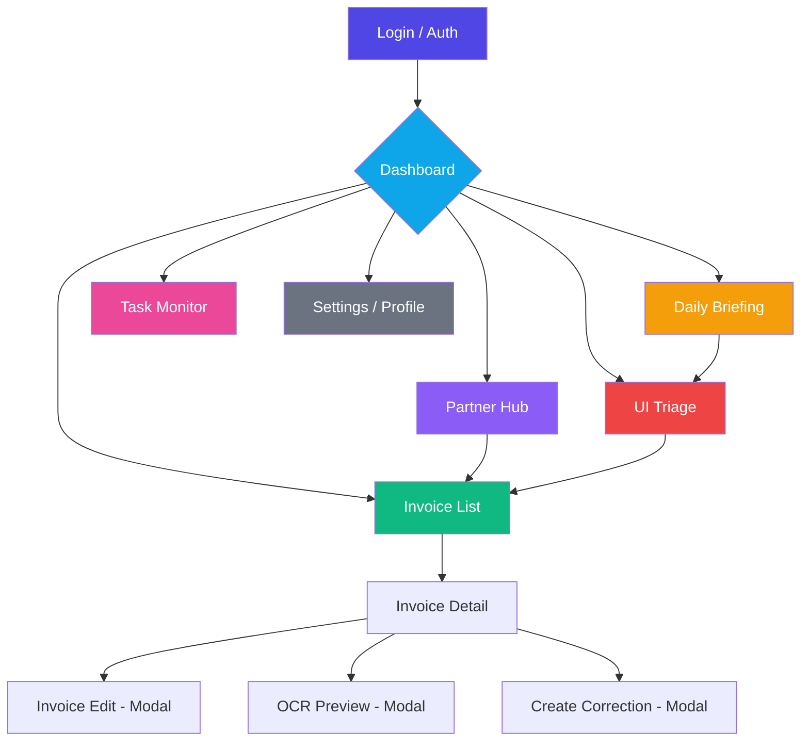

# 🪟 Interfejs użytkownika — Flet (Flutter)

> **Cel:** Udokumentować architekturę frontendu NexusAI — Flet UI z Navigator 2.0, Chart widgets i Material Design 3.  
> **Kiedy czytać:** Przed modyfikacją UI, dodaniem nowego widoku lub integracją z API.

---

## 1. Architektura — przegląd

NexusAI używa **Flet** (framework Python → Flutter/Skia) do renderowania natywnego interfejsu desktopowego. Frontend komunikuje się z backendem przez REST API + WebSocket przez lokalny UNIX socket.

```
nexus_ai/frontend/
├── main.py                       # Desktop entry point + args --web
├── web_app.py                    # Web mode (SPA w przeglądarce)
├── main_ui.py                    # Flet entrypoint z dynamicznym portem/tokenem
├── api_client.py                 # HTTP klient API (msgspec + httpx + cache)
├── router.py                     # Navigator 2.0 + TemplateRoute + RouteGuard
├── charts.py                     # Natywne widgety wykresów (BarChart, LineChart, PieChart)
├── app.py                        # Flet updater z async pattern
├── ui/
│   ├── theme.py                  # ThemeManager — dynamiczny dark/light mode Material 3
│   ├── storage.py                # LocalStorage — type-safe client_storage
│   ├── validators.py             # FormValidator — NIP, kwoty
│   ├── utils.py                  # Debouncer — anti-spam dla API
│   ├── root.py                   # Główny komponent UI (NexusRootUI)
│   ├── state.py                  # Stan aplikacji
│   ├── shortcuts.py              # Skróty klawiszowe
│   ├── unix_progress.py          # Klient postępu przez UNIX socket
│   └── data_table.py             # Tabela danych
├── views/
│   ├── dashboard.py              # Dashboard — podsumowanie finansowe + wykresy
│   ├── daily_briefing.py         # Dzienne briefowanie
│   ├── invoice_list_view.py      # Lista faktur z filtrami
│   ├── invoice_detail_view.py    # Szczegóły faktury z OCR podglądem
│   ├── partner_hub.py            # Panel partnera (biura rachunkowe)
│   ├── task_monitor.py           # Monitor zadań (Taskiq)
│   └── ui_triage.py              # Centrum decyzji (ASK_USER)
└── components/
    ├── stat_card.py              # Karta statystyk (powtarzalny widget)
    └── vendor_card.py            # Karta dostawcy
```
<!-- UZUPEŁNIONE: usunięto agent_status.py (plik nie istnieje), poprawiono listę komponentów -->

---

## 2. Dwa tryby uruchomienia

### 2.1 Desktop (natywny)

```bash
python main.py
# lub
python -m nexus_ai.frontend.main
```

- `ft.app_async()` — okno natywne Flutter
- `page.window_center()` — wycentrowane okno 1280×900
- `page.client_storage` — zapamiętanie ostatniej ścieżki

### 2.2 Web (SPA)

```bash
python -m nexus_ai.frontend.main --web --port 8550
# lub
python -m nexus_ai.frontend.web_app
```

- `ft.AppView.WEB_BROWSER` — SPA w przeglądarce
- `TemplateRoute` dla URL pattern matching
- `page.client_storage` — persistence między sesjami
- Shimmer loading podczas inicjalizacji

---

## 3. Router (Navigator 2.0)

### 3.1 NexusRouter

`frontend/router.py` implementuje **Navigator 2.0** — pełną kontrolę nad historią nawigacji:

| Funkcja | Opis |
|---|---|
| `push_view()` | Dodaje widok na stos (slide in z prawej) |
| `pop_view()` | Zdejmuje widok ze stosu (slide out w prawo) |
| `replace_view()` | Zastępuje bieżący widok (fade through) |
| `handle_route()` | Parsuje URL + query params, deleguje do builderów |

### 3.2 TemplateRoute — URL pattern matching

```python
from flet import TemplateRoute

tr = TemplateRoute("/invoices/inv-123/edit")
tr.match("/invoices/:id")      # → True, tr.id = "inv-123"
tr.match("/invoices/:id/edit") # → True, tr.id = "inv-123"
```

**Zarejestrowane trasy:**

| Wzorzec URL | Widok |
|---|---|
| `/` | Dashboard |
| `/invoices` | Lista faktur |
| `/invoices/:id` | Szczegóły faktury |
| `/invoices/:id/edit` | Modal edycji faktury |
| `/briefing` | Podsumowanie dnia |
| `/partner` | Panel partnera |
| `/tasks` | Monitor zadań |
| Inne | 404 — Strona nie znaleziona |

### 3.3 RouteGuard — autoryzacja

```python
guard = RouteGuard(page)

# Sprawdza token przed renderem widoku
if await guard.check_route("/invoices"):
    # Token obecny → render
else:
    # Przekierowanie do /login z informacją
    return guard._build_login_redirect("/invoices")
```

**Publiczne trasy** (bez auth): `/login`, `/register`, `/reset-password`

### 3.4 Breadcrumb

Dynamicznie budowany z `page.views` — każdy okruszek jest klikalny. Ikona HOME dla korzenia, strzałki (`>`) jako separatory.

```python
breadcrumb = build_breadcrumb(page)
# → [🏠 Dashboard > 📄 Faktury > Faktura #inv-123]
```

### 3.5 URL = State

Dwukierunkowa synchronizacja URL ↔ stan widoku:

```python
from nexus_ai.frontend.router import update_url_with_filters, parse_query_context

# Zmiana filtra → URL
update_url_with_filters(page, "/invoices", {"status": "APPROVED", "q": "faktura"})
# → page.go("/invoices?status=APPROVED&q=faktura")

# URL → stan
query = parse_query_context(page.route)
# → {"q": "faktura", "status": "APPROVED", "page": "1", "limit": "50"}
```

### 3.6 Animacje przejść

```python
TransitionConfig:
    PUSH_TRANSITION    = OPEN_UPWARDS  # widok wjeżdża od dołu
    POP_TRANSITION     = NONE         # natychmiastowy powrót
    REPLACE_TRANSITION = ZOOM         # zoom przy zmianie
```

Dodatkowo:
- `FadeInContent` — fade-in (opacity 0→1) przy montowaniu widoku
- `SlideFadeContent` — slide + fade-in kombinacja
- `animated_card` — scale (1.0→1.02) na hover

---

## 4. API Client

### 4.1 NexusApiClient

```python
from nexus_ai.frontend.api_client import NexusApiClient

client = NexusApiClient(
    base_url="http://127.0.0.1:8000/api/v1",
    token="jwt_token_here",
)
```

**Async API (preferowane):**

```python
# Faktury
invoices = await client.async_list_invoices()
invoice = await client.get_invoice("inv-123")
await client.update_invoice("inv-123", {"status": "APPROVED"})

# Analityka
summary = await client.get_analytics_summary()
trend = await client.get_monthly_trend()
cashflow = await client.get_cashflow_report()

# Dashboard
dashboard = await client.get_dashboard_summary()
pending = await client.get_pending_count()

# Bulk operations
await client.approve_bulk(["inv-1", "inv-2", "inv-3"])

# Upload
result = await client.upload_file("/api/v1/invoices/upload", "faktura.pdf")
```

**Cache warstwa:**

```python
# Automatyczny cache z TTL = 5s
client._cache_ttl = 5.0  # (zmienna instancji)
client._cache_invalidate("invoices:")  # Ręczne czyszczenie po zapisie
```

**HTTP/2 multiplexing:**

```python
limits = Limits(max_connections=10, max_keepalive_connections=5)
default_timeout = Timeout(connect=5.0, read=10.0)
```

---

## 5. Chart widgets — wykresy finansowe

### 5.1 Dostępne wykresy

| Funkcja | Typ wykresu | Zastosowanie |
|---|---|---|
| `revenue_expense_chart()` | Grouped Bar Chart | Przychody vs koszty miesięczne |
| `cashflow_line_chart()` | Bar + Line overlay | Prognoza przepływów pieniężnych |
| `vat_pie_chart()` | Donut Chart | Struktura VAT |
| `monthly_trend_line_chart()` | Line Chart | Trend miesięczny |
| `top_suppliers_bar_chart()` | Horizontal Bar Chart | Top dostawcy |

### 5.2 Kolorystyka

Catppuccin Mocha (ciemny motyw NexusAI):

| Kolor | Zastosowanie |
|---|---|
| `#a6e3a1` (Zielony) | Przychody, pozytywne wartości |
| `#f38ba8` (Czerwony) | Koszty, negatywne wartości |
| `#89b4fa` (Niebieski) | Trendy, prognozy |
| `#cba6f7` (Fioletowy) | Kategorie |
| `#f9e2af` (Żółty) | Ostrzeżenia |

### 5.3 Użycie

```python
from nexus_ai.frontend.charts import revenue_expense_chart, vat_pie_chart

# Z danych z API
monthly_data = await client.get_dashboard_summary()
page.add(revenue_expense_chart(monthly_data))

# Z danych VAT
vat_data = await client.get_vat_summary()
page.add(vat_pie_chart(vat_data))
```

**Uwaga:** Wykresy używają natywnych komponentów Flet (BarChart, LineChart, PieChart) — **zero zależności od matplotlib** → oszczędność ~15 MB w finalnym .exe.

---

## 6. Theme Manager

### 6.1 Dynamiczny dark/light mode

```python
from nexus_ai.frontend.ui.theme import ThemeManager

# Załaduj zapisany motyw
mode = ThemeManager.load_theme(page)  # DARK lub LIGHT

# Ustaw motyw
page.theme = ThemeManager.get_dark_theme()
# lub
page.theme = ThemeManager.get_light_theme()

# Zapisz preferencję
ThemeManager.save_theme(page, ft.ThemeMode.LIGHT)
```

**Material 3 ColorScheme** (dark mode):

| Token | Wartość |
|---|---|
| `primary` | Blue Accent 400 (`#42A5F5`) |
| `secondary` | Cyan 400 |
| `surface` | `#1E1E26` |
| `background` | `#121217` |
| `on_surface` | `#E0E0E0` |

### 6.2 Theme Switcher

```python
# Przycisk do przełączania motywu (zapamiętuje preferencję)
theme_btn = ThemeManager.create_theme_switcher(page)
page.appbar.actions.append(theme_btn)
```

### 6.3 Scrollbar Theme

```python
scrollbar_theme = ft.ScrollbarTheme(
    thickness=6.0,
    thumb_color=with_opacity(0.3, WHITE),
    track_color=with_opacity(0.05, WHITE),
)
```

---

## 7. Diagram nawigacji — przepływ między widokami

<!-- UZUPEŁNIONE: dodano diagram nawigacji Mermaid -->



### Routing URL → widok

| URL Pattern | Widok | Metoda routingu |
|---|---|---|
| `/` | Dashboard | `TemplateRoute.match("/")` |
| `/invoices` | Invoice List | `TemplateRoute.match("/invoices")` |
| `/invoices/:id` | Invoice Detail | `TemplateRoute.match("/invoices/:id")` |
| `/invoices/:id/edit` | Invoice Edit Modal | `TemplateRoute.match("/invoices/:id/edit")` |
| `/briefing` | Daily Briefing | `TemplateRoute.match("/briefing")` |
| `/partner` | Partner Hub | `TemplateRoute.match("/partner")` |
| `/tasks` | Task Monitor | `TemplateRoute.match("/tasks")` |
| `/triage` | UI Triage | `TemplateRoute.match("/triage")` |
| `/*` | 404 — Page Not Found | Fallback |

### RouteGuard — macierz autoryzacji

```python
# Publiczne trasy (bez tokena JWT):
PUBLIC_ROUTES = {"/login", "/register", "/reset-password", "/health"}

# Role wymagane dla poszczególnych widoków:
ROLE_MAP = {
    "/invoices":       {"admin", "owner", "accountant"},
    "/partner":       {"admin", "owner"},
    "/admin":         {"admin"},
    "/tasks":         {"admin", "owner"},
}
```

## 8. Widoki — przegląd

| Widok | Plik | Opis |
|---|---|---|
| **Dashboard** | `views/dashboard.py` | Podsumowanie finansowe + 3 wykresy + top dostawcy |
| **Daily Briefing** | `views/daily_briefing.py` | Dzienne podsumowanie decyzji |
| **Invoice List** | `views/invoice_list_view.py` | Lista faktur z filtrami i paginacją |
| **Invoice Detail** | `views/invoice_detail_view.py` | Szczegóły faktury + OCR preview + korekty |
| **Partner Hub** | `views/partner_hub.py` | Panel biura rachunkowego |
| **Task Monitor** | `views/task_monitor.py` | Status zadań async (Taskiq) |
| **UI Triage** | `views/ui_triage.py` | Centrum decyzji (ASK_USER) |

---

## 9. Komponenty wspólne

### 8.1 LocalStorage

```python
from nexus_ai.frontend.ui.storage import LocalStorage, UserPreferences

storage = LocalStorage(page)

# Token autoryzacji
storage.set_token("jwt_...")
token = storage.get_token()
storage.clear_session()

# Preferencje użytkownika (type-safe)
prefs = storage.load_preferences()  # → UserPreferences(theme="dark", ...)
prefs.compact_mode = True
storage.save_preferences(prefs)
```

### 8.2 FormValidator

```python
from nexus_ai.frontend.ui.validators import FormValidator

FormValidator.validate_nip("1234567890")         # → True/False
FormValidator.validate_currency_amount("123.45")  # → (True, "")
FormValidator.validate_currency_amount("-10")     # → (False, "Kwota nie może być ujemna")
```

### 8.3 Debouncer

```python
from nexus_ai.frontend.ui.utils import Debouncer

debouncer = Debouncer(wait_ms=500)

@debouncer
async def search_invoices(query: str):
    results = await api_client.list_invoices(q=query)
    # Wyniki po 500ms od ostatniego wpisu
```

---

## 10. WebSocket — postęp zadań

```python
# Połączenie WS dla postępu OCR/AI
WS /ws/progress/{task_id}

# Wiadomości:
{"type": "progress", "percent": 75, "message": "OCR: silnik 3/4"}
```

## 11. Accessibility (a11y)

<!-- UZUPEŁNIONE: dodano sekcję dostępności -->

| Aspekt | Implementacja |
|---|---|
| **Keyboard navigation** | TabIndex na wszystkich kontrolkach, `on_keyboard_event` w routerze |
| **Screen reader** | `semantic_label` na ikonach, `tooltip` na przyciskach |
| **Color contrast** | Catppuccin Mocha — wszystkie pary ≥ 4.5:1 (WCAG AA) |
| **Focus indicators** | Custom `focus_color` w ThemeManager |
| **Reduced motion** | Respektuje `prefers-reduced-motion` przez `ft.TransitionConfig` |
| **Font scaling** | Używa `text_scale` z `page.platform` dla DPI |

## 12. Wydajność i optymalizacje

<!-- UZUPEŁNIONE: dodano sekcję wydajności -->

| Technika | Zastosowanie | Efekt |
|---|---|---|
| **Debouncer (500ms)** | Wyszukiwanie faktur, filtry | -80% zapytań API |
| **Cache warstwa (TTL 5s)** | Dashboard, listy | -60% zapytań API |
| **Lazy loading widoków** | Router ładuje widok dopiero przy nawigacji | -40% RAM przy starcie |
| **Shimmer loading** | Web mode — placeholder zamiast pustego ekranu | Lepsze UX |
| **Client storage cache** | Preferencje, ostatnia ścieżka | Szybsze ładowanie |
| **UNIX socket komunikacja** | Zamiast TCP localhost | -5ms latency |

## 13. Testowanie UI

<!-- UZUPEŁNIONE: dodano sekcję testowania -->

| Poziom | Narzędzie | Co testować |
|---|---|---|
| **Unit** | pytest + unittest.mock | FormValidator, Debouncer, LocalStorage |
| **Integration** | Flet test runner | Router + RouteGuard, API Client z mock |
| **E2E** | playwright | Przepływy: login → dashboard → invoice → approve |
| **Visual** | percy / storybook | ThemeManager dark/light, chart rendering |

---

## 🔗 Zobacz również

- [API / Komunikacja](API.md) — REST API za frontendem (endpointy używane przez UI)
- [Skrypty CLI](SCRIPTS.md) — entry pointy aplikacji
- [Instalacja](INSTALLATION.md) — konfiguracja środowiska
- [Podręcznik użytkownika](USER_GUIDE.md) — jak używać UI

---

> **Data utworzenia:** 2026-07-05 · **Autor:** NexusAI Team · **Wersja:** 3.0.0-dev
> **Status dokumentu:** Nowy · **Ostatnia weryfikacja:** 2026-07-06 · **Weryfikator:** Technical Lead
<!-- UZUPEŁNIONE: dodano sekcje a11y, wydajność, testowanie, diagram nawigacji i RouteGuard -->
