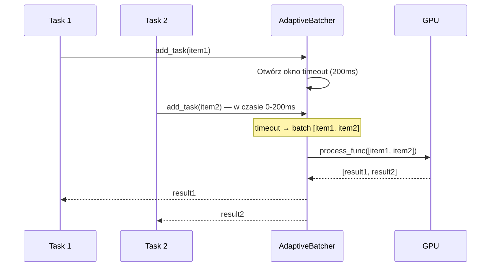

# 🧠 AI Inference — System inferencji modeli GGUF

> **Plik:** `nexus_ai/core/inference.py`, `nexus_ai/core/adaptive_batcher.py`
> **Status:** Stabilny · **Wersja:** 3.0.0-dev
> **Ostatnia aktualizacja:** 2026-07-05

---

## 1. Przegląd

NexusAI używa **llama-cpp-python** jako jedynego silnika AI/ML do inferencji lokalnych modeli GGUF. System składa się z trzech warstw:

```
┌─────────────────────────────────────────────────────────┐
│                   ModelManager                           │
│  - Cache modeli (dict[str, InferenceService])            │
│  - TTL auto-unload (domyślnie 5 min)                    │
│  - cleanup_expired() — okresowe zwalnianie pamięci      │
├─────────────────────────────────────────────────────────┤
│                   InferenceService                       │
│  - Lazy loading modelu przy pierwszym generate()/chat() │
│  - Auto-unload po TTL (0.8-3.0 GB oszczędności RAM)    │
│  - Context manager: with InferenceService() as svc       │
├─────────────────────────────────────────────────────────┤
│                   AdaptiveBatcher                        │
│  - Grupowanie zadań AI dla GPU throughput               │
│  - Memory object stream + timeout (200ms)               │
│  - Batch_size konfigurowalny (default 8)                │
└─────────────────────────────────────────────────────────┘
```

### Kluczowe cechy

- **Brak zharkodowanych modeli** — `InferenceService` ładuje dowolny GGUF podany jako parametr
- **TTL auto-unload** — model zwalniany po 5 minutach bezczynności (oszczędność 0.8-3.0 GB RAM)
- **Lazy loading** — model ładowany dopiero przy pierwszym `generate()` lub `chat()`
- **Thread-safe** — `ModelManager` może być używany z wielu wątków (free-threaded Python 3.13t)
- **Graceful degradation** — brak pliku modelu → warning log + pusty string

---

## 2. InferenceService

### 2.1 API

```python
from nexus_ai.core.inference import InferenceService

# Tworzenie serwisu
svc = InferenceService(
    model_path="models/granite-3.2-3b-q4.gguf",
    n_ctx=4096,              # Rozmiar kontekstu
    n_threads=4,             # Liczba wątków CPU
    n_gpu_layers=0,          # -1 = wszystkie na GPU, 0 = CPU only
    verbose=False,
    ttl=300,                 # TTL w sekundach (0 = bez auto-unload)
)

# Generowanie tekstu
result = svc.generate(
    prompt="Zaksięguj fakturę nr FV/2026/07/001",
    max_tokens=512,
    temperature=0.1,
    stop=["\n\n", "---"],
)
# → "Konto WN: 301, Konto MA: 201"

# Chat completion
response = svc.chat(
    messages=[
        {"role": "system", "content": "Jesteś księgowym."},
        {"role": "user", "content": "Zaksięguj fakturę..."},
    ],
    max_tokens=512,
    temperature=0.1,
)
# → "Zaksięgowano na konto 301..."

# Context manager (auto-unload po wyjściu)
with InferenceService(model_path="models/model.gguf") as svc:
    result = svc.generate("Hello")

# Sprawdzenie stanu
svc.is_loaded      # → True/False
svc.ttl_remaining  # → 245.3 (sekund do auto-unload)
```

### 2.2 Lazy Loading

Model jest ładowany do pamięci **dopiero przy pierwszym wywołaniu** `generate()` lub `chat()`:

```python
svc = InferenceService(model_path="models/model.gguf", ttl=300)
# W tym momencie model NIE jest załadowany — 0 MB RAM

svc.generate("Hello")  # → Load model (~2s), then generate
# Teraz model zajmuje ~2 GB RAM

# Po 5 minutach bezczynności:
svc.ttl_remaining  # → 0.0 → auto-unload → 0 MB RAM
```

### 2.3 TTL Auto-Unload

```python
def check_ttl(self) -> None:
    """Sprawdza czy minąl czas TTL od ostatniego użycia modelu.
    Jeśli tak — zwalnia pamięć. Oszczędność: 0.8-3.0 GB RAM."""
    if self._loaded and self._ttl > 0:
        elapsed = time.time() - self._loaded_at
        if elapsed > self._ttl:
            logger.info("TTL expired — unloading")
            self.unload()
```

**Zalecane TTL:**
| Scenariusz | TTL | Uzasadnienie |
|---|---|---|
| Desktop (interactive) | 300s (5 min) | Użytkownik wraca do aplikacji |
| Worker (batch OCR) | 600s (10 min) | Dłuższe przerwy między zadaniami |
| Server (API) | 60s (1 min) | Szybsze zwalnianie dla innych requestów |
| Testowanie | 0 | Bez auto-unload |

---

## 3. ModelManager

### 3.1 API

```python
from nexus_ai.core.inference import ModelManager

manager = ModelManager(default_ttl=300)

# Pobierz lub utwórz model
svc = manager.get_or_create(
    model_path="models/granite-3.2-3b-q4.gguf",
    n_ctx=4096,
    n_threads=4,
    n_gpu_layers=0,
)

# Generowanie (async wrapper)
result = await manager.infer(
    model_path="models/granite-3.2-3b-q4.gguf",
    prompt="Zaksięguj fakturę...",
    max_tokens=512,
    temperature=0.1,
)

# Chat (async wrapper)
response = await manager.chat(
    model_path="models/model.gguf",
    messages=[{"role": "user", "content": "Hello"}],
)

# Zarządzanie pamięcią
manager.unload_all()                  # Zwolnij wszystkie modele
manager.unload("models/model.gguf")   # Zwolnij konkretny model
manager.cleanup_expired()             # Zwolnij modele z wygasłym TTL
manager.loaded_models                 # Lista załadowanych modeli
```

### 3.2 Cache modeli

```python
# Pierwsze wywołanie: tworzy nowy InferenceService
svc1 = manager.get_or_create("models/model.gguf")

# Drugie wywołanie: zwraca ten sam obiekt (jeśli TTL nie wygasł)
svc2 = manager.get_or_create("models/model.gguf")
assert svc1 is svc2  # True
```

### 3.3 Okresowe czyszczenie

```python
# Uruchamiaj co minutę z background taska:
from nexus_ai.core.inference import cleanup_models

async def periodic_cleanup():
    while True:
        count = cleanup_models()  # Zwraca liczbę zwolnionych modeli
        if count > 0:
            logger.info(f"Cleaned up {count} expired models")
        await anyio.sleep(60)
```

### 3.4 DEPRECATED: Global singleton

```python
# STARY SPOSÓB (deprecated):
from nexus_ai.core.inference import get_model_manager
manager = get_model_manager(default_ttl=300)

# NOWY SPOSÓB (preferowany): przez Litestar DI
from nexus_ai.core.di import AppServices
services = AppServices()
manager = services.model_manager
```

---

## 4. AdaptiveBatcher

### 4.1 Koncepcja

`AdaptiveBatcher` grupuje zadania AI w batche dla optymalnego wykorzystania przepustowości GPU. Zamiast wysyłać każde zadanie osobno, zbiera je przez `timeout` (200ms) i wysyła jako batch.

```python
from nexus_ai.core.adaptive_batcher import AdaptiveBatcher

async def process_batch(items: list) -> list:
    """Funkcja przetwarzająca batch — np. inferencja batchowa."""
    return [await model.generate(item) for item in items]

batcher = AdaptiveBatcher(
    process_func=process_batch,
    batch_size=8,       # Maksymalny rozmiar batcha
    timeout=0.2,        # Czas oczekiwania na kolejne zadania (s)
)

await batcher.start()

# Dodawanie zadań — automatycznie grupowane
results = await anyio.gather(*[
    batcher.add_task(f"Task {i}")
    for i in range(20)
])
```

### 4.2 Jak działa



### 4.3 Parametry

| Parametr | Domyślnie | Opis |
|---|---|---|
| `batch_size` | 8 | Maksymalna liczba zadań w batchu |
| `timeout` | 0.2s | Maksymalny czas oczekiwania na kolejne zadanie |
| `process_func` | — | Funkcja async przyjmująca listę i zwracająca listę wyników |

---

## 5. Konfiguracja środowiskowa

| Zmienna | Domyślnie | Opis |
|---|---|---|
| `LLAMA_N_CTX` | `4096` | Rozmiar kontekstu dla modeli |
| `LLAMA_N_THREADS` | `4` | Liczba wątków CPU dla inferencji |
| `LLAMA_N_GPU_LAYERS` | `0` | Warstwy GPU (-1 = wszystkie) |
| `MODEL_TTL_SECONDS` | `300` | TTL auto-unload w sekundach |

---

> **Zobacz również:**
> - [`MODELS_MANIFEST.md`](MODELS_MANIFEST.md) — 13 modeli GGUF z parametrami
> - [`ARCHITECTURE.md`](ARCHITECTURE.md) — Rada Agentów, ADR-005 (Python 3.13t)
> - [`SCRIPTS.md`](SCRIPTS.md) — `download_models.py` — pobieranie modeli
> - [`MODULES.md`](MODULES.md) — agenci AI, DecisionEngine
