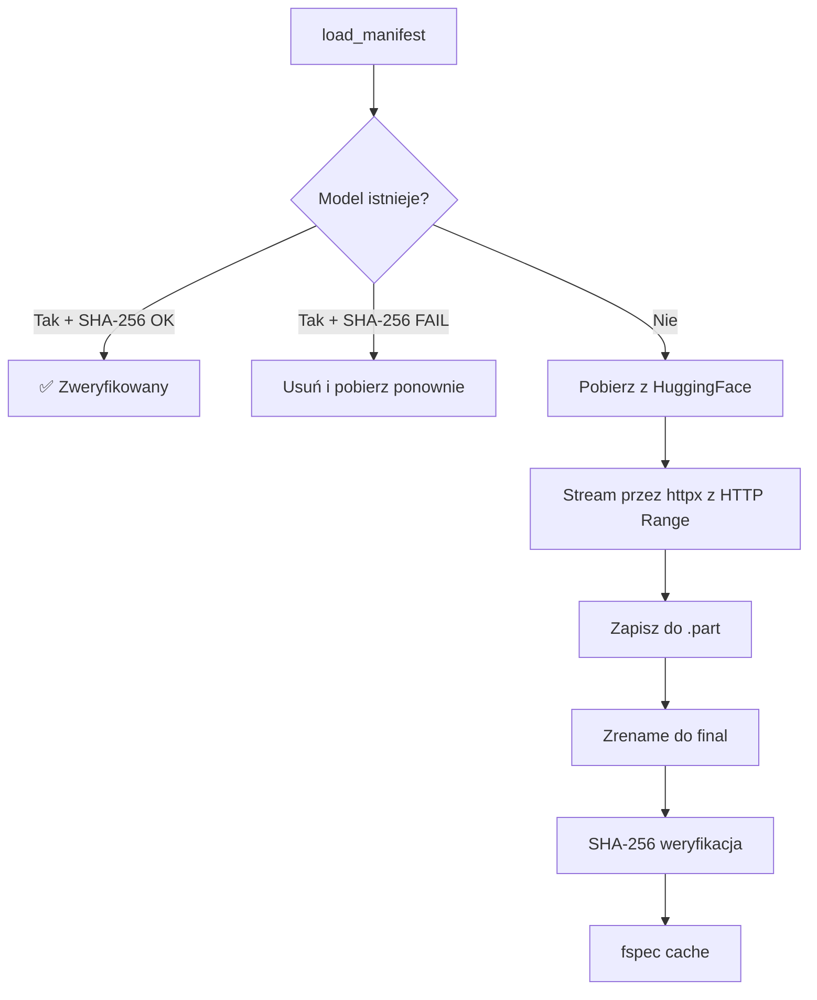
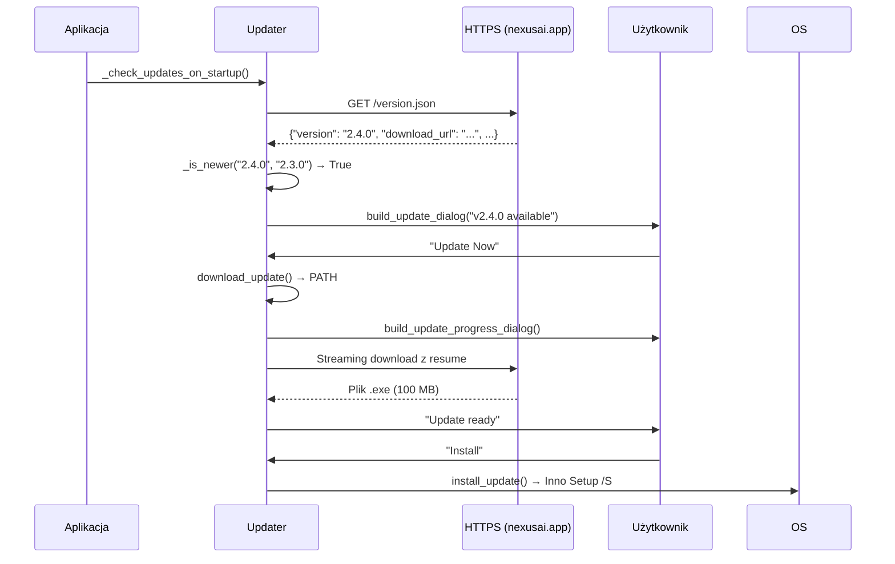
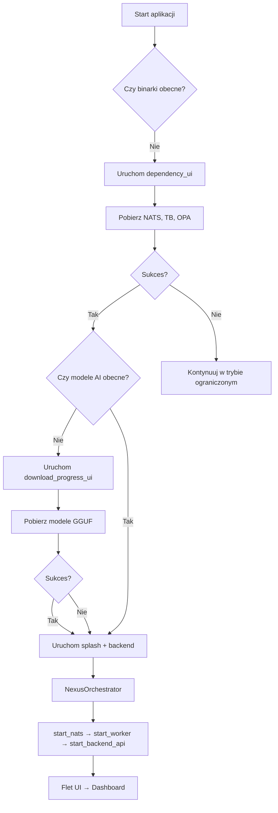

# 📦 Instalator i aktualizacje — system OTA

> **Cel:** Udokumentować system instalacji Windows, pobierania zależności i aktualizacji OTA.  
> **Kiedy czytać:** Przy budowaniu instalatora, debugowaniu pierwszego uruchomienia lub aktualizacji.

---

## 1. Architektura instalatora

Instalator NexusAI składa się z trzech warstw:

```
nexus_ai/installer/
├── dependency_downloader.py   # Pobieranie binarek systemowych (NATS, TigerBeetle, OPA)
├── dependency_ui.py           # Flet UI dla pobierania zależności
├── models_downloader.py       # Pobieranie modeli AI (GGUF + docTR)
├── download_progress_ui.py    # Flet UI dla pobierania modeli
├── notification_win.py        # Windows native toasty
├── updater.py                 # OTA updater — sprawdzanie/pobieranie/instalacja
└── notification_win.py        # Powiadomienia Windows
```

---

## 2. Dependency Downloader — pobieranie binarek systemowych

### 2.1 Binary Manifest

System automatycznie pobiera 3 binarki wymagane do działania:

| Binary | Wersja | Rozmiar | Rola |
|---|---|---|---|
| **NATS Server** | 2.10.22 | ~10 MB | Broker wiadomości z JetStream |
| **TigerBeetle** | 0.16.16 | ~50 MB | Silnik księgi głównej (double-entry) |
| **OPA** | 0.68.0 | ~15 MB | Silnik reguł podatkowych (CNCF) |

### 2.2 Auto-detekcja platformy

```python
# Automatycznie wykrywa system i architekturę
_get_platform() → "windows" | "linux" | "darwin"
_get_arch() → "amd64" | "arm64" | "386"
```

URL-e są budowane dynamicznie z szablonów:
- NATS: `nats-server-v{version}-{platform}-{arch}.zip`
- TigerBeetle: `tigerbeetle-{arch}-{platform}.zip` (macOS → `macos`)
- OPA: `opa_{platform}_{arch}.zip`

### 2.3 BinaryManager — cykl życia procesów

```python
from nexus_ai.installer.dependency_downloader import BinaryManager

manager = BinaryManager(bin_dir)

# Start wszystkich procesów
await manager.start_nats(port=4222)
await manager.start_tigerbeetle(data_dir, port=3000)
await manager.start_opa(port=8181)

# Graceful shutdown
await manager.stop_all_async()  # timeout 5s, potem force-kill
```

**TigerBeetle initialization:**
```python
# Automatycznie inicjalizuje plik danych jeśli nie istnieje
await anyio.run_process([
    str(tb_path), "init", "--cluster=0", str(data_file)
])
```

### 2.4 API

```python
from nexus_ai.installer.dependency_downloader import (
    check_dependencies, download_all_dependencies
)

# Sprawdź co jest zainstalowane
status = check_dependencies(bin_dir)
# → {"all_installed": bool, "missing": [...], "bin_dir": Path}

# Pobierz wszystkie brakujące
results = await download_all_dependencies(bin_dir)
# → [("nats-server", True), ("tigerbeetle", True), ("opa", True)]
```

---

## 3. Model Downloader — pobieranie modeli AI

### 3.1 Architektura



### 3.2 Manifest modeli

Modele są definiowane w `config/models_manifest.json` (lub generowane z `MODELS_MANIFEST.md`):

```json
{
  "models": {
    "granite-3.2-3b-q4": {
      "url": "https://huggingface.co/...",
      "sha256": "abc123...",
      "description": "Orkiestrator AI",
      "size_mb": 2048,
      "required": true
    }
  }
}
```

### 3.3 Resume i SHA-256

- **HTTP Range headers:** Wznawia przerwane pobieranie bez utraty postępu
- **Streaming SHA-256:** Weryfikacja w trakcie pobierania przez `Sha256Hasher` z `nexus-crypto`
- **fsspec cache:** Pliki cache'owane przez `CachingFileSystem` (5 GB cache)

```python
from nexus_ai.installer.models_downloader import (
    check_models_present, download_all_models, verify_file
)

# Sprawdź stan
status = check_models_present(models_dir)
# → {"all_present": bool, "missing": [...], "mismatched": [...]}

# Pobierz wszystko
results = await download_all_models(models_dir)
# → [DownloadResult(key, success, sha256_match, bytes_downloaded)]

# Weryfikacja pojedynczego pliku
ok = verify_file(filepath, expected_hash)
```

### 3.4 Flet UI dla pobierania

`DownloadProgressApp` w `download_progress_ui.py`:

- **Overall progress bar** — globalny postęp wszystkich modeli
- **Per-file progress** — aktualny plik + prędkość
- **Status messages** — "starting", "downloading", "completed", "hash_mismatch"
- **Cancel button** — graceful shutdown przez `anyio.Event()`
- **Background mode** — "Download in background"
- **Windows native notification** — toast po zakończeniu

---

## 4. OTA Updater — aktualizacje

### 4.1 Przepływ



### 4.2 Sprawdzanie wersji

```python
from nexus_ai.installer.updater import check_for_updates

result = await check_for_updates()
# → UpdateCheckResult(
#       update_available=True,
#       latest_version="2.4.0",
#       info=UpdateInfo(
#           version="2.4.0",
#           release_notes="...",
#           download_url="https://...",
#           download_size_mb=100,
#           critical=True,
#       )
#   )
```

**Endpointy sprawdzane w kolejności:**
1. `https://nexusai.app/version.json`
2. `https://github.com/user/repo/version.json` (GitHub Pages)
3. `http://127.0.0.1:8000/version.json` (lokalny development)

### 4.3 Pobieranie z resume

```bash
# Automatyczne resume przy przerwaniu
# HTTP Range: bytes=X- gdzie X = poprzednio pobrane bajty
```

```python
temp_path = dest_path.with_suffix(".part")
resume_bytes = temp_path.stat().st_size if temp_path.exists() else 0
headers = {"Range": f"bytes={resume_bytes}-"} if resume_bytes > 0 else {}
```

### 4.4 Instalacja

```python
from nexus_ai.installer.updater import install_update

await install_update(installer_path)
# Uruchamia /S /CLOSEAPPLICATIONS → Inno Setup silent install
# Automatyczne czyszczenie plików tymczasowych po 30s
```

**Uwaga:** Auto-update wspiera tylko Windows (Inno Setup). Na innych platformach loguje warning i nie wykonuje instalacji.

### 4.5 Flet UI dialogs

Update dialog z `build_update_dialog()` zawiera:

- Ikona (🟠 zwykła / 🔴 krytyczna)
- Wersja bieżąca vs nowa
- Data wydania
- Notatki wydania (pierwsze 200 znaków)
- 3 przyciski: "Skip", "Remind Me Later", "Update Now"
- Progress bar z prędkością podczas pobierania

---

## 5. Windows Native Notifications

```python
from nexus_ai.installer.notification_win import (
    show_notification, show_download_complete, show_update_available
)

# Windows 10/11 native toast (przez winrt)
show_notification("Download Complete", "All models verified")

# Fallback: Win32 MessageBox (ctypes)
# Automatyczny wybór implementacji
```

---

## 6. Przepływ pierwszego uruchomienia



---

## 🔗 Zobacz również

- [Skrypty CLI](SCRIPTS.md) — narzędzia administracyjne
- [Architektura](ARCHITECTURE.md) — stos technologiczny, NATS, TigerBeetle
- [Wdrożenie](DEPLOYMENT.md) — build Nuitka, Inno Setup, CI/CD
- [Manifest modeli](MODELS_MANIFEST.md) — lista modeli AI z SHA-256

---

> **Data utworzenia:** 2026-07-05 · **Autor:** NexusAI Team · **Wersja:** 2.3.1-dev
> **Status dokumentu:** Nowy · **Ostatnia weryfikacja:** 2026-07-05 · **Weryfikator:** Technical Lead
