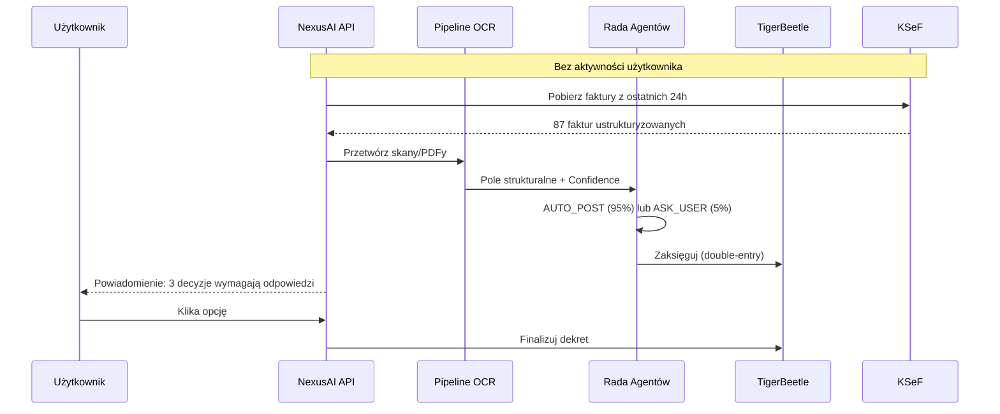
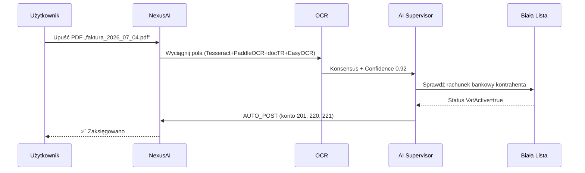

# 📖 Wprowadzenie do NexusAI

> *NexusAI to nie aplikacja — to wirtualny księgowy.*

Ten dokument odpowiada na pytanie **dlaczego** NexusAI istnieje i **komu** ma służyć. Jeśli wolisz od razu uruchomić system, przejdź do [`QUICKSTART.md`](QUICKSTART.md).

---

## 1. Misja

**NexusAI** to ultralekka, autonomiczna platforma księgowa dla MŚP w Polsce, zaprojektowana w paradygmacie **offline-first**:

1. **Przejmuje 90% pracy księgowej** — pobiera faktury (KSeF, e-mail, folder), wyciąga dane (4 silniki OCR + AI), podejmuje decyzję (Rada Agentów), księguje (TigerBeetle double-entry).
2. **Zostawia 10% Tobie** — gdy model nie jest pewien, pyta Cię o decyzję (centrum decyzji w UI: 3 minuty dziennie, 2–5 opcji do kliknięcia).
3. **Nie wysyła Twoich danych do chmury** — wszystkie modele AI (GGUF, llama.cpp) działają lokalnie. Zewnętrzne API (KSeF, GUS, NBP, Biała Lista) są odpytywane tylko w trybie weryfikacji.

---

## 2. Status projektu

| Parametr | Wartość |
|---|---|
| Wersja | **2.3.0** „Free-Threaded Phoenix" |
| Data wydania | 2026-06-10 |
| Python | 3.13.2 (free-threaded, bez GIL) |
| Status deweloperski | **Beta (klasa 4)** — patrz `pyproject.toml` classifiers |
| Licencja | Proprietary |
| Platformy | Linux x86_64, Linux aarch64, Windows x64 |

> **Co oznacza "Beta"?** Rdzeń działa produkcyjnie dla małych i średnich firm (do ~3 000 faktur/miesiąc). Niektóre integracje (KSeF v3+) mogą być niestabilne; przed produkcją zalecamy przeczytanie [`SECURITY.md`](SECURITY.md).

---

## 3. Propozycja wartości (PWE)

### 🔴 Problem (P)

| Wyzwanie | Konsekwencja |
|---|---|
| **Ręczne księgowanie jest czasochłonne** | Przedsiębiorca poświęca **8 h tygodniowo** na wprowadzanie faktur, sprawdzanie kontrahentów, księgowanie. |
| **Błędy kosztują pieniędzy** | Korekty JPK, odsetki od zaległości, kary z US — średnio **5 000 PLN/rok** na firmę. |
| **Dane finansowe wyciekają do chmury** | SaaS-y księgowe używają cudzej infrastruktury; dane klienta są udostępniane dostawcy usługi. Brak zgodności z RODO. |
| **KSeF wymaga ustrukturyzowanej faktury** | Wdrożenie KSeF (obowiązkowe od 2026 w Polsce) wymaga zdigitalizowanego obiegu faktur — ręczne wpisywanie jest już niemożliwe w skali. |
| **Brak orkiestracji AI dla księgowości** | Istniejące narzędzia to „rejestry" — nie myślą, nie decydują, nie uczą się. |

### 🟢 Wartość (W)

| Cecha | Korzyść |
|---|---|
| **Autonomia (AUTO_POST)** | Rada 5 Agentów podejmuje decyzję księgową w 95% przypadków. |
| **Pełna prywatność (offline-first)** | Wszystkie modele AI i baza lokalna; dane nigdy nie opuszczają komputera. |
| **Zgodność polska z pudełka** | KSeF, NIP, Biała Lista MF, NBP, GUS/BIR — gotowe integracje. |
| **Zgodność księgowa** | UoR (Ustawa o rachunkowości), IFRS, GAAP — pełna dekretacja i ścieżka audytu. |
| **Niska bariera wejścia** | 6 GB RAM, brak GPU, działające offline — można odpalić na 5-letnim laptopie. |
| **Open-source'owy stack** | Litestar, Granian, llama.cpp, TigerBeetle, NATS — wszystko audytowalne. |

### 🟦 Efekt (E)

| Metryka | Wartość docelowa |
|---|---|
| **Czas tygodniowy poświęcany na księgowość** | 8 h → **1 h** (głównie pytania z centrum decyzji) |
| **Oszczędność roczna** | do **20 000 PLN/rok** (mniej pracy biurowej, mniej błędów) |
| **Czas od wystawienia faktury do zaksięgowania** | dni → **sekundy** |
| **Zgodność z KSeF** | **100%** generowanych faktur w strukturze FA_VAT(2) |
| **Decyzje poprawne bez ingerencji** | **>95%** (mierzone `FactsAggregator`) |

---

## 4. Główni użytkownicy

### 4.1 Persona A: „Anna z JDG" (przedsiębiorca)

- **Kim jest:** Właścicielka jednoosobowej działalności gospodarczej (JDG). Wystawia ~100 faktur/miesiąc + ~100 faktur kosztowych.
- **Cel:** Mieć porządek w księgowości, ale nie poświęcać na nią więcej niż 30 min/dzień.
- **Scenariusz użycia:** Rano Anna loguje się do aplikacji. NexusAI w nocy pobrał 87 faktur z KSeF, zweryfikował kontrahentów w Białej Liście, wyciągnął dane (OCR), podjął 84 decyzje AUTO_POST i zadał 3 pytania. Anna odpowiada na 3 pytania klikając 2–5 opcji. Koniec.

### 4.2 Persona B: „Marek z biura rachunkowego" (księgowy)

- **Kim jest:** Księgowy prowadzący 30 klientów. Do tej pory używał Subiekt GT + Insert.
- **Cel:** Obsłużyć więcej klientów bez zatrudniania nowych ludzi.
- **Scenariusz użycia:** Marek loguje się do NexusAI w wersji multi-tenant. Dla każdego klienta widzi dashboard: ile decyzji automatycznych, ile czeka na niego. Jego praca to: odpowiadanie na pytania, eksport JPK, analiza wyników.

### 4.3 Persona C: „Cyber-księgowa u doradcy podatkowego" (doradca)

- **Kim jest:** Doradca podatkowy, który obsługuje spółki z o.o. (CIT).
- **Cel:** Kontrolować optymalizacje podatkowe, pełną ścieżkę decyzji i KSeF.
- **Scenariusz użycia:** Doradca używa modułu „Tax Simulator" (patrz [`MODULES.md`](MODULES.md#tax-simulator)) aby testować scenariusze (lump sum vs. linear vs. CIT estoński). Pełna ścieżka decyzji dostępna z poziomu [`COMPLIANCE.md`](COMPLIANCE.md#ścieżka-audytu).

### 4.4 Persona D: „Bartek — developer w zespole" (inżynier)

- **Kim jest:** Pythonista dołączający do zespołu.
- **Cel:** Zrozumieć architekturę w 15 minut i zacząć commitować.
- **Scenariusz użycia:** Bartkowi pomaga [`QUICKSTART.md`](QUICKSTART.md) i [`ARCHITECTURE.md`](ARCHITECTURE.md).

---

## 5. Scenariusze użycia (przepływy)

### 5.1 Codzienny przepływ automatyczny

### 5.2 Jednorazowe wprowadzenie faktury

Więcej sekwencji: [`ARCHITECTURE.md`](ARCHITECTURE.md#4-diagramy-sekwencji).

---

## 6. Słownik kluczowych pojęć (krótki)

Pełny glosariusz: [`GLOSSARY.md`](GLOSSARY.md).

| Termin | Znaczenie |
|---|---|
| **AUTO_POST** | Decyzja automatyczna — system sam zaksięguje dekret. |
| **ASK_USER** | Decyzja wymagająca użytkownika — system wyświetla 2–5 opcji. |
| **KSeF** | Krajowy System e-Faktur (Ministerstwo Finansów PL). |
| **JPK** | Jednolity Plik Kontrolny — cyfrowe deklaracje podatkowe. |
| **NIP** | Numer Identyfikacji Podatkowej (10 cyfr). |
| **Biała Lista MF** | Rejestr podatników VAT czynnych — weryfikacja rachunków bankowych. |
| **UoR** | Ustawa o rachunkowości (Dz.U. 1994 nr 121 poz. 591 z późn. zm.). |
| **IFRS** | Międzynarodowe Standardy Sprawozdawczości Finansowej. |
| **CIT** | Podatek dochodowy od osób prawnych (19% standardowy, 9% maly podatnik). |
| **PIT** | Podatek dochodowy od osób fizycznych (skala podatkowa, ryczałt, liniówka). |
| **VAT** | Podatek od towarów i usług (23%, 8%, 5%, 0%, zw.). |
| **CQRS** | Command Query Responsibility Segregation (rozdzielenie zapisu i odczytu). |
| **Event Sourcing** | Wzorzec: zamiast mutacji, zapisujemy zdarzenia jako źródło prawdy. |
| **GGUF** | Format kwantyzowanych modeli LLM (Q4_K_M, Q5_0 — mniejsze, ale wciąż dokładne). |
| **NATS JetStream** | Lekki broker wiadomości z wbudowanym KV Store i Object Store. |
| **TigerBeetle** | Silnik double-entry accounting (open-source, napisany w Zig). |
| **SQLCipher** | Szyfrowanie AES-256 każdej strony SQLite. |
| **AEAD** | Authenticated Encryption with Associated Data (ChaCha20-Poly1305). |
| **Argon2id** | Algorytm KDF (Key Derivation Function) — odporny na GPU/ASIC. |
| **Rego** | Język polityk OPA (Open Policy Agent). |

---

## 7. Co dalej?

| Chcesz… | Przejdź do… |
|---|---|
| Zobaczyć pełną architekturę | [`ARCHITECTURE.md`](ARCHITECTURE.md) |
| Uruchomić lokalnie w 15 minut | [`QUICKSTART.md`](QUICKSTART.md) |
| Zrozumieć poszczególne serwisy | [`MODULES.md`](MODULES.md) |
| Zobaczyć API REST | [`API.md`](API.md) |
| Zrozumieć model danych | [`DATABASE.md`](DATABASE.md) |

---

## 🔗 Zobacz również

- [Szybki start](QUICKSTART.md) — uruchom NexusAI w 15 minut
- [Architektura](ARCHITECTURE.md) — diagramy C4, ADR, wzorce projektowe
- [Moduły i logika](MODULES.md) — agenci AI, pipeline OCR, serwisy
- [Słownik pojęć](GLOSSARY.md) — terminy księgowe i techniczne

---

> **Data aktualizacji:** 2026-07-04 · **Autor:** NexusAI Team · **Wersja:** 2.3.0
> **Status dokumentu:** Stabilny · **Ostatnia weryfikacja:** 2026-07-04 · **Weryfikator:** NexusAI Team
