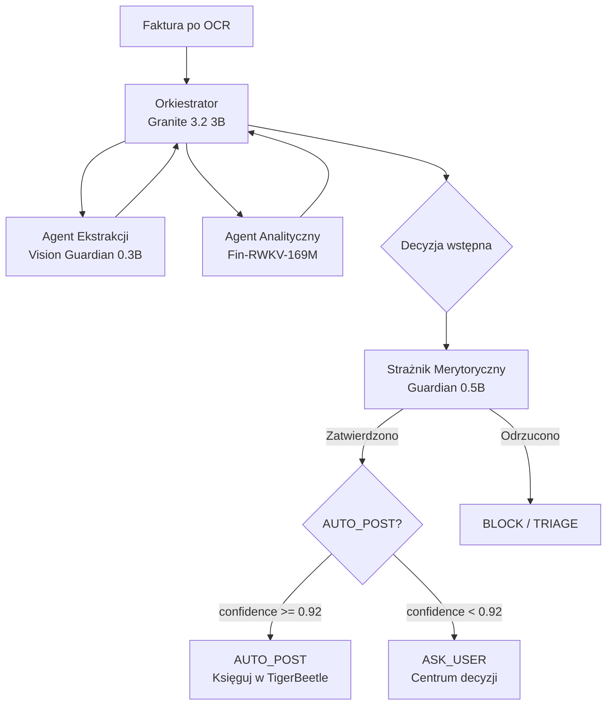
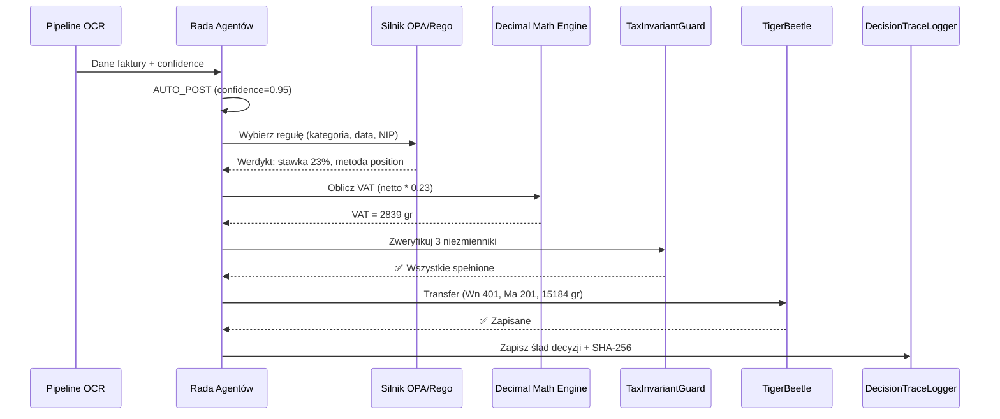
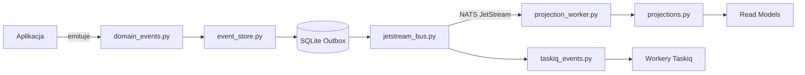

# 📐 Moduły i logika biznesowa

> **Cel:** Opisać wszystkie kluczowe serwisy, agentów AI i pipeline'y przetwarzania.  
> **Kiedy czytać:** Gdy pracujesz na konkretnym serwisie lub planujesz nowy.

---

## 1. Przegląd agentów AI (5 agentów — Enterprise v4.0)

NexusAI używa 5 wyspecjalizowanych agentów AI — każdy ładowany jako model GGUF z konfiguracji. Poniższe nazwy to **rekomendowane modele referencyjne** (system nie ma zharkodowanych modeli — `InferenceService` ładuje dowolny plik GGUF podany w konfiguracji):

> ⚠️ **Uwaga:** Nazwy modeli poniżej NIE są zharkodowane w kodzie. `nexus_ai/core/inference.py` to generyczny silnik GGUF — ładuje dowolny model wskazany w konfiguracji.
>
> **📘 Pełna specyfikacja:** [`docs/AGENTS.md`](AGENTS.md) — 5 agentów, 13 modeli, Decision Engine, Cognitive Audit Trail, protokół NATS, bezpieczeństwo AI, monitoring agentów.

### 1.1 Pięciu agentów (Architektura Cognitive Audit Trail)

| Agent | Modele GGUF (rekomendacja) | RAM | Rola | Plik |
|---|---|---|---|---|
| **Orkiestrator** | Granite-3.2-3B-Q4_K_M + Guardian 0.5B + Qwen3-Nano 0.5B | ~2.98 GB | Centralny mózg i wirtualny CFO — przyjmuje zadania, deleguje, podejmuje decyzje, Cognitive Audit Trail | `nexus_ai/agents/orchestrator.py` |
| **Ekstrakcji Danych** | Vision Guardian 0.3B + ModernBERT-NER-Finance 0.3B + ParagonDetect 0.1B | ~500 MB | Forteca precyzji — nadzoruje 4 silniki OCR, walidacja krzyżowa, KSeF, weryfikacja semantyczna | `nexus_ai/agents/extraction.py` |
| **Analityczny** | Hrida-T2SQL-128k + Granite 3.2 3B + Fin-RWKV-169M + Lag-Llama 0.3B | ~3.7 GB | Sztab analityczny — cashflow forecast, vendor intelligence, anomalie, daily brief NL | `nexus_ai/agents/analytics.py` |
| **Walidator Jakości** | Granite Guardian 0.5B + GraphSAGE 0.1B + FinBERT-ESG 0.1B + Lag-Llama 0.3B | ~670 MB | Trójwarstwowa tarcza — tax compliance, fraud detection, ESG risk, 4-Eyes Principle | `nexus_ai/agents/quality_validator.py` |
| **Środków Trwałych** | Amortyzator-KŚT 0.2B | ~200 MB | Zarządca majątku — klasyfikacja, amortyzacja liniowa/degresywna, ewidencja | `nexus_ai/services/fixed_assets.py` |

> **GENIALNY POMYSŁ ENTERPRISE — Cognitive Audit Trail:** Każda korekta użytkownika tworzy blok poznawczy (embedding 768d w sqlite-vec). Przy podobnej fakturze → k-NN → automatyczna korekta. Po 10 korektach → auto-naprawa reguł OPA/Rego. Łańcuch SHA-256 staje się AKTYWNYM systemem uczącym się.

### 1.2 Funkcjonalności wchłonięte przez 5 agentów

Dawne 5 agentów domenowych (TaxEngine, CashManager, Compliance, KSeF, VendorIntelligence) zostało wchłoniętych — ich serwisy nadal istnieją i są wywoływane przez odpowiednich agentów:

| Dawny agent | Wchłonięty przez | Serwisy (zachowane) |
|---|---|---|
| AgentTaxEngine | **AgentQualityValidator** | `tax_simulator.py`, `tax_strategies.py`, `tax/rules.rego` |
| AgentCashManager | **AgentAnalytics** | `liquidity_oracle.py`, `priority_engine.py` |
| AgentCompliance | **AgentQualityValidator** | `compliance_analytics.py` |
| AgentKSeF | **AgentDataExtraction** | `ksef_service.py`, `ksef_generator.py` |
| AgentVendorIntelligence | **AgentAnalytics** | `vendor_intelligence.py`, `white_list_service.py`, `gus_bir_client.py` |

**Dodatkowe modele specjalistyczne:** Pełna lista i parametry w [`docs/MODELS_MANIFEST.md`](MODELS_MANIFEST.md).

---

## 2. Proces decyzyjny Rady Agentów

### 2.1 Architektura "zero zaufania do pojedynczego modelu"



### 2.2 Tryby decyzyjne (DecisionMode) — JEDEN poziom automatyzacji

| Tryb | Próg | Akcja |
|---|---|---|
| **AUTO_POST** | Trust Score >= 0.92 | Agent samodzielnie księguje, użytkownik informowany |
| **SUGGEST** | Trust Score >= 0.75 | Agent proponuje decyzję z ostrzeżeniem, użytkownik zatwierdza |
| **ASK_USER** | Trust Score < 0.75 | Agent pyta użytkownika o decyzję |

> **Uwaga:** BLOCK (blokada) jest werdyktem w ramach trybu ASK_USER, a nie osobnym poziomem automatyzacji. Zgodnie z `aa3fvcx.txt` — JEDEN poziom automatyzacji. Człowiek ZAWSZE jest decydentem.

---

## 3. Pipeline OCR — architektura warstwowa

### 3.1 Warstwy przetwarzania (z kodami)

```
┌─────────────────────────────────────────────────────────────────┐
│ WARSTWA 0: Preprocessing                                        │
│   Pillow + OpenCV → binaryzacja, kontrast, korekta perspektywy  │
├─────────────────────────────────────────────────────────────────┤
│ WARSTWA 1: Detekcja typu dokumentu                              │
│   ParagonDetect 0.1B → czy to faktura? (paragon = odrzuć)      │
├─────────────────────────────────────────────────────────────────┤
│ WARSTWA 2: 4 silniki OCR                                        │
│   Tesseract (deterministyczny, druk klasyczny)                  │
│   + PaddleOCR (DL, różne czcionki)                              │
│   + python-docTR (układ strony, DBNet + PARSeq)                 │
│   + EasyOCR (różnorodność językowa i czcionkowa)                │
├─────────────────────────────────────────────────────────────────┤
│ WARSTWA 3: Walidacja krzyżowa  (Levenshtein)                    │
│   field-level consensus: 3/4 silników must agree                │
├─────────────────────────────────────────────────────────────────┤
│ WARSTWA 4: Nadzorca AI                                          │
│   Vision Guardian 0.3B → porównuje JSON z obrazem               │
├─────────────────────────────────────────────────────────────────┤
│ WARSTWA 5: Walidator Semantyczny                                │
│   ModernBERT-NER-Finance 0.3B → NIP checksum, kwoty, daty       │
└─────────────────────────────────────────────────────────────────┘
```

### 3.2 Mechanizm Walidacji Krzyżowej — kod produkcyjny

Poniższy kod implementuje kluczowy algorytm konsensusu. Każde pole faktury (NIP, kwota, data) jest porównywane między 4 silnikami. Wynik jest akceptowany tylko jeśli 3/4 (lub więcej) silników zgadza się na tę samą wartość.

```python
# nexus_ai/pipeline/ocr_consensus.py
"""Konsensus 4 silników OCR z walidacją Levenshtein."""

import statistics
from dataclasses import dataclass, field
from typing import Optional

from difflib import SequenceMatcher  # stdlib — brak zewnętrznych zależności


@dataclass
class OcrFieldResult:
    """Wynik jednego silnika OCR dla jednego pola."""
    value: str
    confidence: float  # 0.0–1.0
    engine_name: str


@dataclass
class ConsensusField:
    """Skonsolidowany wynik dla jednego pola."""
    value: str
    avg_confidence: float
    consensus_ratio: float  # 0.25 (4/4), 0.75 (3/4), 0.50 (2/4)
    engine_votes: dict[str, str]  # nazwa silnika → wartość


# Próg Levenshtein: pola różniące się o mniej niż X znaków są "takie same"
# Np. "1234567890" i "1234567891" → różnica 1 → próg 2 = OK
LEVENSHTEIN_THRESHOLD = {
    "nip": 2,           # 2 znaki różnicy (na wszelki wypadek)
    "amount_net": 3,    # 3 cyfry różnicy
    "amount_gross": 3,  # 3 cyfry różnicy
    "vat_rate": 1,      # 1 znak np. "23" vs "8"
    "date": 1,          # 1 znak np. "2026-07-04" vs "2026-07-05"
    "invoice_number": 3,  # Numer faktury — zwykle dł. 10-15 znaków
    "default": 2,       # Domyślny próg dla innych pól
}


def calculate_levenshtein_consensus(
    results: list[OcrFieldResult],
    field_name: str = "default",
) -> Optional[ConsensusField]:
    """Znajdź konsensus dla pojedynczego pola faktury.

    Algorytm:
        1. Dla każdej pary wyników oblicz odległość Levenshteina
        2. Jeśli odległość < threshold → uznaj za "zgodne"
        3. Znajdź klaster o największej liczbie zgodnych -> to konsensus
        4. Jeśli klaster ma >= 3 elementy → zaakceptuj
        5. Jeśli < 3 → brak konsensusu (eskalacja do AI Supervisor)

    4 różne algorytmy (Tesseract, PaddleOCR, docTR, EasyOCR)
    o fundamentalnie różnych architekturach — statystycznie
    niemożliwe by popełniły identyczny błąd w tym samym polu.
    """
    if not results:
        return None

    threshold = LEVENSHTEIN_THRESHOLD.get(field_name, LEVENSHTEIN_THRESHOLD["default"])

    # Budujemy graf zgodności: results[i] i results[j] są zgodne
    # jeśli lev_distance(results[i].value, results[j].value) <= threshold
    from collections import defaultdict

    clusters: dict[int, set] = defaultdict(set)  # indeks rzutowiska -> set indeksów zgodnych
    for i, ri in enumerate(results):
        clusters[i].add(i)
        for j, rj in enumerate(results):
            if i == j:
                continue
            # Używamy SequenceMatcher z stdlib (brak zewnętrznych zależności).
    # Dla krótkich pól (NIP 10 cyfr) ratio 0.8+ = praktycznie identyczne.
    matcher = SequenceMatcher(None, ri.value, rj.value)
    match_ratio = matcher.ratio()
    normalized_distance = int((1.0 - match_ratio) * max(len(ri.value), len(rj.value)))
    dist = normalized_distance
            if dist <= threshold:
                clusters[i].add(j)

    # Znajdź największy klaster consensusu
    max_cluster = max(clusters.values(), key=len)

    if len(max_cluster) < 3:
        # Za mało zgodnych silników — eskalacja
        return None

    # Średnia confidence z członków klastra
    cluster_results = [results[i] for i in max_cluster]
    avg_conf = statistics.mean(r.confidence for r in cluster_results)

    # Głosy: który silnik zwrócił którą wartość
    engine_votes: dict[str, str] = {}
    for i in max_cluster:
        r = results[i]
        engine_votes[r.engine_name] = r.value

    # Wartość konsensusu: najczęściej występująca w klastrze
    values = [r.value for r in cluster_results]
    consensus_value = max(set(values), key=values.count)

    return ConsensusField(
        value=consensus_value,
        avg_confidence=avg_conf,
        consensus_ratio=len(max_cluster) / 4.0,  # 1.0 = 4/4, 0.75 = 3/4
        engine_votes=engine_votes,
    )


def cross_validate_invoice(
    tesseract: dict, paddle: dict, doctr: dict, easyocr: dict
) -> dict:
    """Przetwarzaj całą fakturę: uruchom konsensus na każdym polu.

    Zwraca słownik z:
        - fields: dict[str, ConsensusField] — skonsolidowane pola
        - missing_fields: list[str] — pola bez konsensusu (eskalowane)
        - overall_confidence: float — średnia wszystkich confidence

    Args:
        tesseract: dict z polami z Tesseract OCR
        paddle: dict z polami z PaddleOCR
        doctr: dict z polami z python-docTR
        easyocr: dict z polami z EasyOCR
    """
    all_engine_results = [tesseract, paddle, doctr, easyocr]
    engine_names = ["tesseract", "paddle", "doctr", "easyocr"]

    fields_to_check = ["nip", "amount_net", "amount_gross",
                        "vat_rate", "date", "invoice_number"]

    result: dict[str, ConsensusField] = {}
    missing: list[str] = []

    for field in fields_to_check:
        single_results = []
        for engine_idx, engine_data in enumerate(all_engine_results):
            if field in engine_data:
                single_results.append(OcrFieldResult(
                    value=engine_data[field]["value"],
                    confidence=engine_data[field].get("confidence", 0.9),
                    engine_name=engine_names[engine_idx],
                ))

        consensus = calculate_levenshtein_consensus(single_results, field)
        if consensus:
            result[field] = consensus
        else:
            missing.append(field)

    # Oblicz overall_confidence (średnia z consensusów)
    if result:
        overall_conf = statistics.mean(
            f.avg_confidence * f.consensus_ratio for f in result.values()
        )
    else:
        overall_conf = 0.0

    return {
        "fields": result,
        "missing_fields": missing,
        "overall_confidence": overall_conf,
    }
```

### 3.3 Tabela porównawcza 4 silników OCR

| Silnik | Wersja | RAM | Czas/strona | Dokładność (recall) | Język polski | Silne strony | Słabe strony |
|---|---|---|---|---|---|---|---|
| **Tesseract** | 5.3.x | ~0 MB (system) | 1-3 s | 99.9% (druk) | ✅ pol+eng | Idealny dla czystego druku, deterministyczny, szybki | Nie radzi sobie z nietypowymi czcionkami, krzywymi skanami |
| **PaddleOCR** | 2.8.x | ~250 MB | 2-5 s | 97.5% (czcionki) | ✅ wbudowany | Świetna detekcja tekstu, radzi sobie z różnymi czcionkami | Większy (~250 MB RAM), wolniejszy od Tesseract |
| **python-docTR** | 0.9.x | ~350 MB | 3-7 s | 98.2% (układ) | ✅ testowany | Rozumienie układu strony (DBNet + PARSeq), kolumny, tabele | Większy (~350 MB RAM), wymaga PyTorch |
| **EasyOCR** | 1.7.x | ~300 MB | 4-8 s | 96.8% (ogólny) | ✅ wspierany | 80+ języków, radzi sobie z nietypowymi czcionkami, pismem odręcznym | Wolniejszy, niższa dokładność dla polskiego |
| **Konsensus (3/4)** | — | ~900 MB (razem) | 5-10 s | **99.7%** | ✅ | Statystycznie niemożliwe, by 4 różne algorytmy popełniły ten sam błąd | Wyższe zużycie CPU i RAM |

### 3.4 Processing flow z metrykami

```
[PDF → pypdfium2] → Obraz 300 DPI → . . . 200-500 ms
       │
       ▼
[Preprocessing] (Pillow + OpenCV) → binaryzacja, kontrast, korekta perspektywy . . . 100-300 ms
       │
       ▼
[ParagonDetect 0.1B] → "Faktura" (ok) / "Paragon" (odrzuć) . . . 50-100 ms
       │
       ▼
[4 silniki równolegle] (threading / concurrent.futures)
       ├── Tesseract . . . 1-3 s
       ├── PaddleOCR . . . 2-5 s
       ├── docTR . . . . . . 3-7 s
       └── EasyOCR . . . . . 4-8 s
       │
       ▼
[Walidacja krzyżowa] . . . Levenshtein consensus, < 5 ms
       │
       ├── success (≥3/4 zgadza się) → AI Supervisor . . . 200-400 ms
       │                                            │
       │                                            ▼
       │                                   [Walidator semantyczny] . . . 50-150 ms
       │                                            │
       │                                            ▼
       │                                   [JSON z danymi faktury + metadane]
       │
       └── failure (<3/4) → Flag: "Partial OCR"
                                  ↓
                      [Próba re-scanu 3x z różnymi parametrami preprocessing]
                                  ↓
                      [Jeśli wciąż <3/4 → HUMAN_VERIFICATION]
```

---

## 4. Serwisy biznesowe — katalog

### 4.1 Księgowość (Accounting)

| Plik | Klasa | Odpowiedzialność |
|---|---|---|
| `accountant_logic.py` | `ZPKEngine` | Plan kont, dekretacja księgowa |
| `auto_decree.py` | `AutoDecreeEngine` | Automatyczna dekretacja faktur przez vec0 (wektorowe podobieństwo do wzorców) |
| `audit_service.py` | `AuditService` | Ślad audytowy (5 rodzajów eventów) |
| `audit_storno.py` | — | Korekty księgowe (storno czerwone/czarne) |
| `fixed_assets.py` | `FixedAssetsService` | Środki trwałe + amortyzacja liniowa/degresywna |
| `inventory_fifo.py` | `FifoInventory` | Wycena zapasów metodą FIFO |
| `bank_import.py` | `IdempotentBankImporter` | Import wyciągów bankowych (MT940, CSV) z idempotentnością SHA-256 i ciągłością sald |
| `fx_revaluation.py` | `FxRevaluationService` | Rewaluacja walutowa (NBP) |
| `vat_reconciliation.py` | `VatReconciliationService` | Uzgadnianie JPK_V7 |

### 4.2 Decyzje i Triage

| Plik | Klasa | Odpowiedzialność |
|---|---|---|
| `triage_service.py` | `TriageService` | Centrum decyzji (ASK_USER) |
| `decision_structs.py` | — | Typy decyzyjne (msgspec.Struct) |
| `decision_queue.py` | `DecisionQueue` | Kolejka decyzji oczekujących |
| `decision_logger.py` | `DecisionLogger` | Logowanie decyzji do audytu + trust score trend + statystyki |
| `proof_chain.py` | `ProofChain` | Łańcuch SHA-256 dla decyzji |
| `integrity_verifier.py` | `IntegrityVerifier` | Weryfikacja integralności łańcucha |
| `replay_engine.py` | `ReplayEngine` | Odtwarzanie decyzji z przeszłości |
| `daily_briefing.py` | `DailyBriefingService` | Dzienne briefowanie dla dashboardu |
| `cfo_offline.py` | `LocalRAGService` | Lokalny RAG (Retrieval-Augmented Generation) offline |
| `cfo_offline.py` | `KSEFDefenderService` | Detekcja zagrożeń w API KSeF |
| `cfo_offline.py` | `CashflowForecastService` | Prognoza przepływów pieniężnych |
| `cfo_offline.py` | `PaymentPriorityService` | Priorytetyzacja płatności |
| `cfo_offline.py` | `AutoDecreeService` | Automatyczna dekretacja (offline) |

### 4.3 Podatki (Tax) i Płynność Finansowa

| Plik | Klasa | Odpowiedzialność |
|---|---|---|
| `tax_simulator.py` | `TaxSimulator` | Symulacje podatkowe (ryczałt vs liniowy vs CIT estoński) |
| `tax_strategies.py` | — | Strategie optymalizacji podatkowej |
| `billing_estimator.py` | `BillingEstimator` | Szacowanie kosztów usług księgowych |
| `budget_control.py` | `BudgetaryControlEngine` | Kontrola wykonania budżetu — limity kont TB, alerty przy 85% wykorzystania |
| `liquidity_oracle.py` | `calculate_liquidity_timeline()` + `LiquidityPoint` | Prognoza płynności 90 dni (optymistyczna/likely/pesymistyczna) — DuckDB GENERATE_SERIES + Polars + Parquet sink |

### 4.4 Bezpieczeństwo i Compliance

| Plik | Klasa | Odpowiedzialność |
|---|---|---|
| `anomaly_detector.py` | `SmartAnomalyDetector` | Detekcja anomalii kwotowych (Z-score > 3σ) |
| `fraud_graph_scanner.py` | `FraudGraphScanner` | GraphSAGE — detekcja VAT karuzeli (graf powiązań NIP→rachunek→kwota) |
| `vendor_intelligence.py` | `VendorIntelligence` | Risk scoring kontrahentów (Biała Lista + ESG) |
| `risk_guard.py` | `RiskGuard` | Dynamiczne progi ryzyka |
| `semantic_guard.py` | `SemanticGuard` | Wykrywanie "kreatywnej księgowości" |
| `security_service.py` | `SecurityService` | Retencja + bezpieczne usuwanie |
| `compliance_analytics.py` | `ComplianceAnalytics` | Raportowanie zgodności — analiza aktywności względem ram regulacyjnych |
| `dunning_engine.py` | `DunningEngine` + `DunningGuardrails` | Automatyczne generowanie wezwań do zapłaty + konfigurowalne progi |

### 4.5 Integracje zewnętrzne

| Plik | Klasa | Odpowiedzialność |
|---|---|---|
| `ksef_service.py` | `KsefService` | Komunikacja z API KSeF (pobieranie/wysyłka) |
| `ksef_generator.py` | `KsefGenerator` | Generowanie XML FA_VAT(2) |
| `gus_bir_client.py` | `GusBirClient` | Weryfikacja danych w CEIDG |
| `white_list_service.py` | `WhiteListService` | Sprawdzanie Białej Listy MF |
| `context_enricher.py` | `ContextEnricher` | Wzbogacanie kontekstu faktury o dane z GUS BIR + Białej Listy + cache 30 dni — określa poziom zaufania kontrahenta (high/medium/low) |

### 4.6 Administracja systemowa

| Plik | Klasa | Odpowiedzialność |
|---|---|---|
| `admin_services.py` | `RiskThresholdService` | CRUD progów ryzyka (append-only, z hot-reload przez NATS) |
| `admin_services.py` | `BillingRuleService` | CRUD reguł cennika (append-only) |
| `admin_services.py` | `LedgerRuleService` | CRUD reguł walidacji księgowej |
| `admin_services.py` | `TaxRuleService` | CRUD reguł podatkowych + changelog |
| `admin_services.py` | `FallbackEventService` | Zarządzanie zdarzeniami fallback (no-matching-rule) |
| `admin_services.py` | `ReplayService` | Odtwarzanie decyzji podatkowych (batch i pojedyncze) |
| `admin_services.py` | `IntegrityService` | Weryfikacja integralności łańcucha decyzji |
| `admin_services.py` | `FailedTaskService` | Zarządzanie DLQ (lista, retry, delete, retry-all) |
| `core_services.py` | `ValidationService` | Walidacja danych wejściowych |
| `core_services.py` | `AnalyticsService` | Agregacje analityczne |
| `storage.py` | `StorageService` | Przechowywanie i zarządzanie plikami |
| `notification_service.py` | `AsyncNotificationService(AsyncBaseService)` | Powiadomienia asynchroniczne (app, email, push) z base service |
| `temporal_manager.py` | — | Zarządzanie workflow Temporal (sagi, kompensacje) |
| `scheduler.py` | — | Harmonogram zadań cron (backup, sync KSeF, NBP rates) |

Pełna lista serwisów (70+): `nexus_ai/services/` (katalog).

### 4.7 Zarządzanie okresami, RMK i operacje finansowe

| Plik | Klasa | Odpowiedzialność |
|---|---|---|
| `period_closer.py` | `PeriodCloser` | Zamykanie okresów finansowych — atomowe zerowanie kont kosztowych i przychodowych przez TigerBeetle CLOSING_DEBIT/CREDIT z linked transfers |
| `rmk_engine.py` | `RMKEngine` | Rozliczenia Międzyokresowe Kosztów (RMK) — generowanie harmonogramów memoriałowych z dzienną precyzją pro-rata, zapis w DuckDB |
| `accountant_logic.py` | `AccountantLogic` | Logika księgowa — sugestie kont, dopasowanie wzorców księgowań |
| `tax_strategies.py` | `StrategyRegistry` | Rejestr strategii podatkowych — JDG ryczałt/liniowy, CIT pełna księgowość, CIT estoński |
| `finops_meter.py` | `FinOpsRates`, `FinOpsSnapshot` | Monitoring kosztów operacyjnych (FinOps) — koszt CPU/RAM/GPU na fakturę, detekcja anomalii kosztowych (Z-score, Polars) |
| `tigerbeetle_secure.py` | `SecureTigerBeetleClient` | RBAC-aware wrapper TigerBeetle — OWNER może postować, WORKER tylko pending; naruszenia → SecurityAlert |
| `document_fingerprint.py` | `DocumentFingerprint` | Trójwarstwowy odcisk dokumentu: SHA-256 (binary) + multi-hash wizualny (phash/dhash/whash + ORB) + semantyczny (MD5 z danych) + Merkle root miesięczny |

### 4.8 Orkiestracja CFO, Eventy i Analityka

| Plik | Klasa | Odpowiedzialność |
|---|---|---|
| `cfo_offline.py` | `CFOOrchestrator` | Główny orkiestrator CFO — koordynuje LocalRAG, KSEFDefender, CashflowForecast, PaymentPriority, AutoDecree w trybie offline-first |
| `facts_aggregator.py` | `FactsAggregator` | Agregator faktów księgowych — zbiera miary finansowe, generuje FactSheet dla Rady Agentów |
| `event_log.py` | `EventLog` | Historia wszystkich zdarzeń i decyzji — dual storage (SQLite + DuckDB), przeszukiwalna dla systemu analitycznego, statystyki przez Polars |
| `trace_generator.py` | `TraceGenerator` | Generator ścieżki decyzyjnej — tworzy czytelny dla człowieka opis decyzji podatkowej z szablonów lub automatycznie z werdyktu |
| `daily_briefing.py` | `DailyBriefingService` | Codzienne podsumowanie — top decyzje wymagające akcji, statystyki dnia |

### 4.9 Infrastruktura i powiadomienia

| Plik | Klasa | Odpowiedzialność |
|---|---|---|
| `notification_manager.py` | `AsyncNotificationManager` | Centralny async system powiadomień — 6 kategorii, 4 priorytety, integracja z DecisionQueue, auto-czyszczenie wygasłych |
| `notification_service.py` | `AsyncNotificationService(AsyncBaseService)` | Wielokanałowe powiadomienia (app, email, push) — integracja z DailyBriefingGenerator + MultiChannelConfig |
| `hot_reload.py` | `HotReloadListener` | NATS JetStream subscriber — nasłuchuje zmian reguł (billing, risk, tax, ledger), czyści cache API przez JetStream durable consumer z checkpointami |
| `opa_policy_generator.py` | `OpaPolicyGenerator` | Generator polityk Rego — konwertuje reguły podatkowe z DuckDB na poprawny kod Rego (else-chain, first-match-wins), generuje OPA data documents |
| `otel_fallback.py` | `BufferedSpan`, `FileSpanBuffer` | Fallback OpenTelemetry — buforuje spany na dysku gdy collector niedostępny, replay przy ponownym połączeniu |

---

## 5. Silnik reguł podatkowych (OPA / Rego)

### 5.1 Filozofia działania

Silnik reguł NIE jest modelem AI. To **deterministyczna maszyna stanowa**:

```
Jeśli (warunek A i warunek B i warunek C) → zastosuj regułę R
ze stawką S i metodą zaokrąglenia M
```

### 5.2 Trzy filary

| Filar | Komponent | Opis |
|---|---|---|
| **Filar 1** | Magazyn Reguł (Rule Store) | Tabela reguł w SQLite z warunkami SQL i akcjami JSON |
| **Filar 2** | Menedżer Temporalny | Filtruje reguły po `valid_from <= transaction_date <= valid_to` |
| **Filar 3** | Maszyna Ewaluacyjna | Sortuje reguły po priorytecie, first-match-wins |

### 5.3 Temporalność

```sql
-- Dla faktury z 2021 użyje stawek z 2021, nawet jeśli dziś obowiązują nowe
SELECT * FROM tax_rules
WHERE valid_from <= :transaction_date
  AND (valid_to IS NULL OR valid_to >= :transaction_date)
ORDER BY priority ASC
LIMIT 1;
```

### 5.4 Reguły Rego (OPA)

```rego
# nexus_ai/tax/rules.rego
package tax

default allow = false

allow {
    input.category_code == "FUEL"
    input.transaction_date >= "2022-01-01"
    input.transaction_date <= "2023-12-31"
}

vat_rate = 0.23 {
    input.category_code == "FUEL"
}
```

---

## 6. Matematyka finansowa — trzy filary nieomylności

### Filar 1: Całkowity zakaz float

Wszystkie kwoty są w **groszach (int)**, nigdy `float`:

```python
# NIE: amount = 123.45  (float!)
# TAK: amount_cents = 12345  (int)
```

### Filar 2: Jawne zaokrąglanie HALF_UP

```python
from decimal import Decimal, ROUND_HALF_UP
vat_cents = round(net_cents * Decimal("0.23"))  # HALF_UP
```

### Filar 3: Potrójna weryfikacja (TaxInvariantGuard)

```
∑ Netto_pozycji  ==  Netto_faktury
∑ VAT_pozycji    ==  VAT_faktury
Netto + VAT      ==  Brutto
```

Jeśli którekolwiek równanie NIE jest spełnione → transakcja BLOKOWANA.

---

## 7. Diagram sekwencji — księgowanie faktury



---

## 8. Komunikacja wewnętrzna (NATS JetStream)

### 8.1 Tematy NATS

| Temat | Kierunek | Opis |
|---|---|---|
| `invoice.received` | System → Worker | Nowa faktura do przetworzenia |
| `invoice.extracted` | OCR → Orkiestrator | Dane wyciągnięte z OCR |
| `council.task.request` | System → Orkiestrator | Zadanie dla Rady Agentów |
| `council.decision.final` | Orkiestrator → System | Ostateczna decyzja |
| `quality.check.request` | Orkiestrator → Walidator | Żądanie walidacji jakości |
| `billing.rules.updated` | Admin → BillingEstimator | Hot-reload reguł cennika |
| `risk.thresholds.updated` | Admin → RiskGuard | Hot-reload progów ryzyka |
| `tax.rule.updated` | Admin → Silnik OPA | Nowa reguła podatkowa |
| `outbox.relay` | Outbox → Worker | Zdarzenia do publikacji |

### 8.2 JetStream — gwarancje

- **At-least-once delivery:** Każda wiadomość trwale zapisana na dysku
- **Dead Letter Queue:** Po N nieudanych próbach → DLQ
- **Retry z backoffem:** Wykładnicze opóźnienia (1s, 2s, 4s, 8s...)
- **KV Store:** Wbudowany — nie potrzebuje Redis
- **Object Store:** Pliki binarne (modele GGUF)

---

## 9. System Eventów Domenowych (Event Sourcing)

### 9.1 Architektura Eventów



### 9.2 Komponenty

| Plik | Odpowiedzialność |
|---|---|
| `events/domain_events.py` | Definicje 10 typów eventów domenowych (msgspec.Struct z tagowaną unią): `InvoiceCreated`, `InvoiceSubmitted`, `InvoiceApproved`, `InvoiceRejected`, `InvoiceBlocked`, `InvoicePaid`, `DecisionMade`, `DecisionOverridden`, `OutboxEmitted`, `NotificationSent` |
| `events/event_store.py` | Trwały magazyn zdarzeń — zapis do outbox (SQLite), odczyt, replay |
| `events/jetstream_bus.py` | Bridge między SQLite outbox a NATS JetStream — publikacja, retry, DLQ |
| `events/projection_worker.py` | Proces tła: odczytuje eventy z JetStream, aktualizuje projekcje (read models) |
| `events/projections.py` | Logika projekcji: materializacja read modeli z strumienia eventów (CQRS) |
| `events/taskiq_events.py` | Definicje zadań Taskiq dla event-driven workers (OCR, decyzje, powiadomienia) |

### 9.3 10 DomainEvents (tabela)

| Event | Źródło | Konsument | Opis |
|---|---|---|---|
| `invoice.created` | API / OCR | Agent Ekstrakcji | Nowa faktura w systemie |
| `invoice.submitted` | Agent Ekstrakcji | Orkiestrator | Dane gotowe do analizy |
| `invoice.approved` | Orkiestrator | Ledger + Notification | Faktura zatwierdzona |
| `invoice.rejected` | Orkiestrator | Notification | Faktura odrzucona |
| `invoice.blocked` | RiskGuard | Notification + Admin | Faktura zablokowana |
| `invoice.paid` | Ledger / User | Notification | Płatność zaksięgowana |
| `decision.made` | Autopilot / Rada Agentów | Audit Trail | Decyzja podjęta |
| `decision.overridden` | User (Triage) | Audit Trail | Decyzja nadpisana przez użytkownika |
| `outbox.emitted` | Outbox System | NATS JetStream | Event wysłany do kolejki |
| `notification.sent` | Notification Service | User | Powiadomienie wysłane |

---

## 10. Pipeline / Potoki Przetwarzania

### 10.1 Pipeline OCR

| Plik | Odpowiedzialność |
|---|---|
| `pipeline/ocr_base.py` | Bazowa klasa abstrakcyjna dla silników OCR (interfejs `extract(image) -> dict`) |
| `pipeline/ocr_consensus.py` | Algorytm konsensusu Levenshtein (3/4 silników musi się zgodzić) + `cross_validate_invoice()` |
| `pipeline/parser.py` | Parser PDF (pypdfium2) — konwersja PDF → obraz 300 DPI, ekstrakcja warstw |

### 10.2 Przepływ danych przez pipeline

```
PDF/JPEG → parser.py (pypdfium2) → obraz 300 DPI
  → ocr_base.py (4 instancje równolegle)
    → TesseractOCR, PaddleOCR, DocTROCR, EasyOCR
  → ocr_consensus.py (Levenshtein 3/4)
    → AI Supervisor (Vision Guardian 0.3B)
  → JSON z danymi faktury
```

---

## 11. Core / Fundament Systemu (28 komponentów)

### 11a. DI — Wstrzykiwanie zależności

**Plik:** `nexus_ai/core/di.py`

System zawiera dwa mechanizmy DI:

#### TaskiqDepends (dla zadań Taskiq)

```python
from taskiq import TaskiqDepends
from nexus_ai.core.di import get_db_session, get_config

@broker.task(task_name="my_task")
async def my_task(
    config: AppConfig = TaskiqDepends(get_config),
    db: Session = TaskiqDepends(get_db_session),
):
    # db.query(...) — gotowe!
```

**Dostępne zależności:**
| Funkcja | Zwraca | Opis |
|---|---|---|
| `get_config()` | `AppConfig` | Konfiguracja aplikacji (singleton) |
| `get_engine()` | `Engine` | Silnik SQLAlchemy (cache'owany) |
| `get_db_session()` | `Session` | Sesja DB (auto-commit/rollback) |
| `get_duckdb_manager()` | `DuckDBManager` | Manager DuckDB (scoped per task) |

**Cache engine:**
```python
_ENGINE_CACHE: dict[str, Engine] = {}  # Thread-safe dla 3.13t

# Przy shutdown:
await dispose_all_engines()  # Zamyka wszystkie cache'owane engine
```

#### AppServices (dla Litestar)

```python
from nexus_ai.core.di import AppServices, create_app_services

services = create_app_services(config)

services.decision_engine   # DecisionEngine
services.duckdb_manager    # DuckDBManager
services.event_store       # EventStore
services.jetstream_bus     # JetStreamEventBus
services.model_manager     # ModelManager
services.broker            # Broker (Taskiq)
```

#### LazyImport

```python
from nexus_ai.core.di import LazyImport

# Opóźniony import — rozwiązuje circular dependency
llm = LazyImport("nexus_ai.core.inference", "InferenceService")
svc = llm(model_path="models/model.gguf")  # Import dopiero tutaj
```

---

### 11b. NATS Utilities — komunikacja przez NATS

**Plik:** `nexus_ai/core/nats_utils.py`

Kompletny zestaw narzędzi do komunikacji przez NATS:

#### Connection helpers

```python
from nexus_ai.core.nats_utils import get_connection, safe_close

# Połączenie z callbackami
nc = await get_connection(
    nats_url="nats://127.0.0.1:4222",
    name="nexus-nats",
    connect_timeout=10.0,
    enable_callbacks=True,  # disconnect/reconnect/close/error callbacki
)

# Bezpieczne zamknięcie
await safe_close(nc, flush=True)
```

#### NatsRpcClient — Request-Reply (RPC)

```python
from nexus_ai.core.nats_utils import NatsRpcClient

client = NatsRpcClient(request_timeout=5.0)

try:
    response = await client.request(
        subject="model.inference",
        data={"prompt": "Zaksięguj fakturę..."},
    )
except NoRespondersError:
    logger.warning("No worker available")

await client.close()
```

#### NatsSubscription — Async Iterator

```python
from nexus_ai.core.nats_utils import NatsSubscription

async with NatsSubscription(subject="invoice.>") as sub:
    async for msg in sub:
        metadata = await sub.get_metadata(msg)
        print(f"Seq: {metadata['stream_seq']}")
```

#### NatsConfigStore — Key-Value Store

```python
from nexus_ai.core.nats_utils import NatsConfigStore

config_store = NatsConfigStore(local_fallback=True)
await config_store.start()

await config_store.put("key", {"value": 123})
value = await config_store.get("key", default=None)
await config_store.delete("key")

# Watch dla zmian
async for update in config_store.watch():
    print(f"Key changed: {update.key}")

await config_store.stop()
```

**Domyślne buckety KV:**
| Bucket | Opis |
|---|---|
| `nexus-config` | Globalna konfiguracja |
| `nexus-rules` | Reguły podatkowe i ryzyka |
| `nexus-features` | Feature flagi |
| `nexus-workers` | Status i heartbeat workerów |
| `nexus-cache` | Cache odpowiedzi API |

#### NatsFileStore — Object Store

```python
from nexus_ai.core.nats_utils import NatsFileStore

file_store = NatsFileStore(local_cache_dir="app_data/nats_cache")
await file_store.start()

await file_store.put("invoice.pdf", pdf_bytes, bucket="nexus-files")
data, meta = await file_store.get("invoice.pdf", bucket="nexus-files")
await file_store.delete("invoice.pdf", bucket="nexus-files")

async for entry in file_store.list(prefix="2026-"):
    print(entry)

await file_store.stop()
```

**Domyślne buckety Object Store:**
| Bucket | Opis |
|---|---|
| `nexus-files` | Faktury PDF i załączniki |
| `nexus-backups` | Backupy baz danych |
| `nexus-ocr` | Obrazy i wyniki OCR |
| `nexus-reports` | Wygenerowane raporty |

#### NatsSupervisor — Health Check

```python
from nexus_ai.core.nats_utils import NatsSupervisor

supervisor = NatsSupervisor()
await supervisor.start()

# Szybki health check
health = await supervisor.quick_health()
# → {"nats": "OK", "streams": 5}

# Pełny status
status = await supervisor.get_full_status()
# → {"connection": {...}, "streams": [...], "stream_count": 5}

await supervisor.stop()
```

---

### 11c. SecretsManager — Zarządzanie sekretami

**Plik:** `nexus_ai/core/secrets.py`

Trzy warstwy zarządzania sekretami:

#### SecretsManager — system keyring

```python
from nexus_ai.core.secrets import SecretsManager

# Zapis do systemowego keyring
SecretsManager.save_secret("ksef_token", "abc123")

# Odczyt
token = SecretsManager.get_secret("ksef_token")

# Usunięcie
SecretsManager.delete_secret("ksef_token")
```

#### LocalSecretsCache — szyfrowany cache z TTL

```python
from nexus_ai.core.secrets import LocalSecretsCache

cache = LocalSecretsCache(
    cache_path="app_data/secrets_cache.json",
    ttl_hours=24,
)

cache.save("ksef_token", "abc123")
value = cache.get("ksef_token")  # → "abc123" lub None (TTL wygasł)
```

#### OfflineFirstSecretResolver

```python
from nexus_ai.core.secrets import OfflineFirstSecretResolver

resolver = OfflineFirstSecretResolver(cache)

# Najpierw live provider, potem fallback do cache
value = resolver.resolve(
    key="ksef_token",
    provider=lambda: fetch_from_vault("ksef_token"),
)
```

---

### 11d. PluginManager v2 — System wtyczek

**Plik:** `nexus_ai/core/plugins.py`

Lifecycle-aware system wtyczek z typowanymi hookami:

```python
from nexus_ai.core.plugins import PluginManager, PluginProtocol
from nexus_ai.core.bus import EventBus

class MyPlugin:
    name = "my_plugin"
    version = "1.0.0"
    description = "Does something useful"

    async def on_startup(self, bus: EventBus) -> None:
        await bus.subscribe(SomeEvent, self.handle_event)

    async def on_shutdown(self) -> None:
        await self.cleanup()

# Rejestracja
manager = PluginManager()
manager.register(MyPlugin())

# Lifecycle
await manager.run_startup(event_bus)
# ... aplikacja działa ...
await manager.run_shutdown()

# Auto-discovery z pakietu
manager.discover_plugins("core.exporters")

# Lista pluginów
for name, info in manager.list_plugins().items():
    print(f"{info.name} v{info.version}: {info.description}")
```

---

### 11e. Taskiq — Middleware i Result Backendy

**Plik:** `nexus_ai/core/taskiq.py`

#### Middleware

| Middleware | Opis |
|---|---|
| **TaskMetricsMiddleware** | Metryki OTel dla zadań (czas, status) |
| **PiiScanMiddleware** | Skanowanie PII w payloadach zadań (NIP, PESEL, REGON, e-mail) |
| **TaskTracingMiddleware** | OTel tracing z baggage context |
| **SentryTaskMiddleware** | Sentry scope dla zadań + breadcrumbs |

```python
# Rejestracja w brokerze:
from nexus_ai.core.taskiq import (
    TaskMetricsMiddleware,
    PiiScanMiddleware,
    TaskTracingMiddleware,
)

broker = Broker().with_middlewares(
    TaskMetricsMiddleware(),
    PiiScanMiddleware(block_on_pii=False),
    TaskTracingMiddleware(),
)
```

#### SqliteResultBackend

```python
from nexus_ai.core.taskiq import SqliteResultBackend

backend = SqliteResultBackend(db_path="app_data/taskiq_results.db")

await backend.set_result(task_id, result)
result = await backend.get_result(task_id)
await backend.close()
```

#### HybridResultBackend

```python
from nexus_ai.core.taskiq import HybridResultBackend

backend = HybridResultBackend(
    sqlite_path="app_data/taskiq_results.db",
    nats_servers=["nats://localhost:4222"],
    bucket_name="nexus-task-results",
)
# NATS Object Store → SQLite fallback
```

---

### 11.1 Komunikacja i broker

### 11.1 Komunikacja i broker

| Plik | Odpowiedzialność |
|---|---|
| `core/nats_utils.py` | Klient RPC (`NatsRpcClient`), subskrypcja (`NatsSubscription`), magazyn KV (`NatsConfigStore`), magazyn plików (`NatsFileStore`), supervisor (`NatsSupervisor`). 4 typy callbacków: disconnect/reconnect/close/error. Auto-reconnect z wykładniczym backoffem |
| `core/broker.py` | Zarządzanie połączeniem NATS (broker management — session lifecycle, graceful drain) |
| `core/bus.py` | In-process event bus (`EventBus`, `EventEnvelope`, `Subscription`). Typowany pub/sub z msgspec.Struct — używany lokalnie, między wątkami |
| `core/events.py` | Podstawowe typy eventów systemowych (`NexusEvent` Enum) |

### 11.2 Infrastruktura AI

| Plik | Odpowiedzialność |
|---|---|
| `core/inference.py` | Silnik wnioskowania LLM (`InferenceService`) — wrapper na llama-cpp-python + `ModelManager` (ładowanie/wyładowanie modeli GGUF, kontrolowanie RAM) |
| `core/ai_context.py` | Zarządzanie kontekstem AI (`AIContextManager`) — window sliding, historia, system prompt |
| `core/adaptive_batcher.py` | Dynamiczne batchowanie OCR/AI (`AdaptiveBatcher`) — optymalizacja throughput GPU przez grupowanie podobnych zadań |
| `core/field_confidence.py` | Value Object `FieldConfidence` (frozen Struct) — confidence score dla każdego pola faktury z OCR |

### 11.3 Bezpieczeństwo i kryptografia

| Plik | Odpowiedzialność |
|---|---|
| `core/crypto.py` | `Vault` — AEAD ChaCha20-Poly1305 (przez nexus-crypto Rust), Argon2id, mlock, key rotation. Szyfrowanie danych w spoczynku |
| `core/opa_client.py` | `OpaClient` — async HTTP klient dla Open Policy Agent REST API (sidecar localhost:8181). Evaluate, load_data, load_policy, batch evaluation. 4 typy błędów: `OpaError`, `OpaConnectionError`, `OpaEvaluationError`, `OpaPolicyNotFound` |
| `core/secrets.py` | `SecretsManager` (system keyring), `LocalSecretsCache` (plikowy cache z szyfrowaniem AEAD przez nexus-crypto, TTL 24h), `OfflineFirstSecretResolver` (prefer live → fallback do cache) |

### 11.4 Zarządzanie pamięcią i procesami

| Plik | Odpowiedzialność |
|---|---|
| `core/mimalloc_bridge.py` | ctypes bridge do Microsoft mimalloc — izolowane heaps (`InvoiceOCRHeap` dla faktur, `SecureHeap` dla danych wrażliwych), `MemoryLeakDetector` (wykrywanie wycieków przez RSS sliding window), statystyki alokatora |
| `core/shm_manager.py` | `SharedImageBuffer` — współdzielona pamięć dla obrazów OCR (unika kopiowania między procesami) |
| `core/ipc_vision.py` | `ImageMemoryManager` — zarządzanie pamięcią obrazów w pipeline wizyjnym |
| `core/monitor.py` | `ProcessMonitor` (CPU, RAM, FD na proces) + `SystemMonitor` (ogólnosystemowe: load, disk, network). Metryki przez psutil, eksport do OTel |

### 11.5 Pliki i storage

| Plik | Odpowiedzialność |
|---|---|
| `core/fsspec_compat.py` | `FSSpecFactory` (singleton z async wrapperem), `AsyncFsWrapper`, `TransactionalFileSystem` (fallback). Auto-detekcja 11+ implementacji fsspec (Zip, Tar, HTTP, Caching, Memory, Reference przez metaprogramowanie) |
| `core/backup.py` | `BackupManager` — backup i przywracanie baz SQLite z szyfrowaniem i weryfikacją SHA-256 |

### 11.6 Typy i walidacja

| Plik | Odpowiedzialność |
|---|---|
| `core/types.py` | `Result[T, E]` — monada Either z dyskryminowanymi podklasami `Ok[T, E]` i `Err[T, E]` (zero `type: ignore`). `PaginatedResponse[T]` — generyczna stronicowana odpowiedź API (Struct) |
| `core/exceptions.py` | Hierarchia wyjątków: `NexusBaseException` → `AIProcessingError`, `LLMGuardrailError`, `BrokerConnectionError`, `VectorDBError` |
| `core/msgspec_utils.py` | `EncodeError`, `DecodeError` — ustandaryzowane błędy serializacji msgspec (JSON + MessagePack) |
| `core/protocol_loader.py` | `ProtocolLoader` — dynamiczne ładowanie i weryfikacja protokołów (schematów kontraktów) z plików YAML/JSON |
| `core/protocol_executor.py` | `ProtocolExecutor` — egzekucja zweryfikowanych protokołów, `ProtocolViolationError` |

### 11.7 Telemetria, monitoring, alerting

| Plik | Odpowiedzialność |
|---|---|
| `core/otel.py` | OpenTelemetry setup — metryki, tracing, export do DuckDB/Sentry. `_NoopTracer`, `_NoopSpan` dla offline-first |
| `core/logger.py` | `_LoguruFactory` — konfiguracja structlog + loguru. `_InterceptHandler` — przechwytywanie stdlib logging do strukturalnego |
| `core/sentry.py` | Integracja Sentry — `_NoopTransaction` dla trybu offline |
| `core/alerting.py` | System alertów — `PrometheusAlertRule` (Struct), progi, eskalacja, powiadomienia |
| `core/analytics.py` | Analityka core'owa — `PolarsSQLContext` (integracja SQL + Polars expression API) |

### 11.8 DI, konfiguracja, wspólne

| Plik | Odpowiedzialność |
|---|---|
| `core/di.py` | `LazyImport` — leniwe importy dla circular dependency. `AppServices` — kontener DI z rejestracją 20+ serwisów |
| `core/config.py` | `ConfigLoader` — ładowanie konfiguracji TOML z profile stack (base → dev → prod). `AppConfig` — cała konfiguracja aplikacji jako msgspec.Struct |
| `core/tenant.py` | `TenantManager` — zarządzanie tenantami, izolacja danych między firmami |
| `core/taskiq.py` | Middleware: `TaskMetricsMiddleware` (OTel metryki zadań), `PiiScanMiddleware` (skanowanie PII w payloadach), `TaskTracingMiddleware` (OTel tracing z baggage), `SentryTaskMiddleware`. Backendy: `SqliteResultBackend`, `HybridResultBackend` (NATS Object Store + SQLite fallback) |
| `core/plugins.py` | `PluginManager` v2 — lifecycle-aware (on_startup/on_shutdown/on_event), PluginProtocol (structural subtyping), auto-discovery z package'ów |
| `core/prompts.py` | `PromptTemplate` (StrEnum) — szablony promptów dla agentów AI |
| `core/parsers.py` | `DataParser` — generyczne parsery danych wejściowych |
| `core/time_utils.py` | `PendulumPeriod` (frozen Struct) — zarządzanie okresami czasowymi, konwersje stref czasowych |

---

## 12. Dodawanie nowego agenta AI

1. Pobierz model GGUF do `models/`
2. Dodaj konfigurację modelu w `config/base.toml` (sekcja `[models]`)
3. Utwórz klasę Agenta w `nexus_ai/services/`
4. Zarejestruj w `nexus_ai/core/ai_context.py`
5. Dodaj handler w `nexus_ai/events/taskiq_events.py`

```python
# Przykład szkieletu nowego agenta
from nexus_ai.core.inference import InferenceService

class NewAgent:
    def __init__(self, model_path: str):
        self.llm = InferenceService(model_path)
    
    async def process(self, context: dict) -> dict:
        prompt = self._build_prompt(context)
        result = await self.llm.generate(prompt)
        return self._parse_result(result)
```

---

## 🔗 Zobacz również

- [Architektura](ARCHITECTURE.md) — wzorce, ADR, sekwencje NATS
- [Models Manifest](MODELS_MANIFEST.md) — 13 modeli GGUF z parametrami
- [Rust Module](RUST_MODULE.md) — implementacja nexus-crypto, SHA-256 proof chain
- [Bezpieczeństwo](SECURITY.md) — architektura "zero zaufania" AI, weryfikacja modeli
- [Testowanie](TESTING.md) — testy property-based dla logiki podatkowej i OCR
- [Baza danych](DATABASE.md) — schematy tabel: dq_decisions, ledger_transfers
- [Zgodność z przepisami](COMPLIANCE.md) — reguły podatkowe OPA/Rego, KSeF

---

> **Data aktualizacji:** 2026-07-05 · **Autor:** NexusAI Team · **Wersja:** 3.0.0-dev
> **Status dokumentu:** Stabilny · **Ostatnia weryfikacja:** 2026-07-05 · **Weryfikator:** Technical Lead
