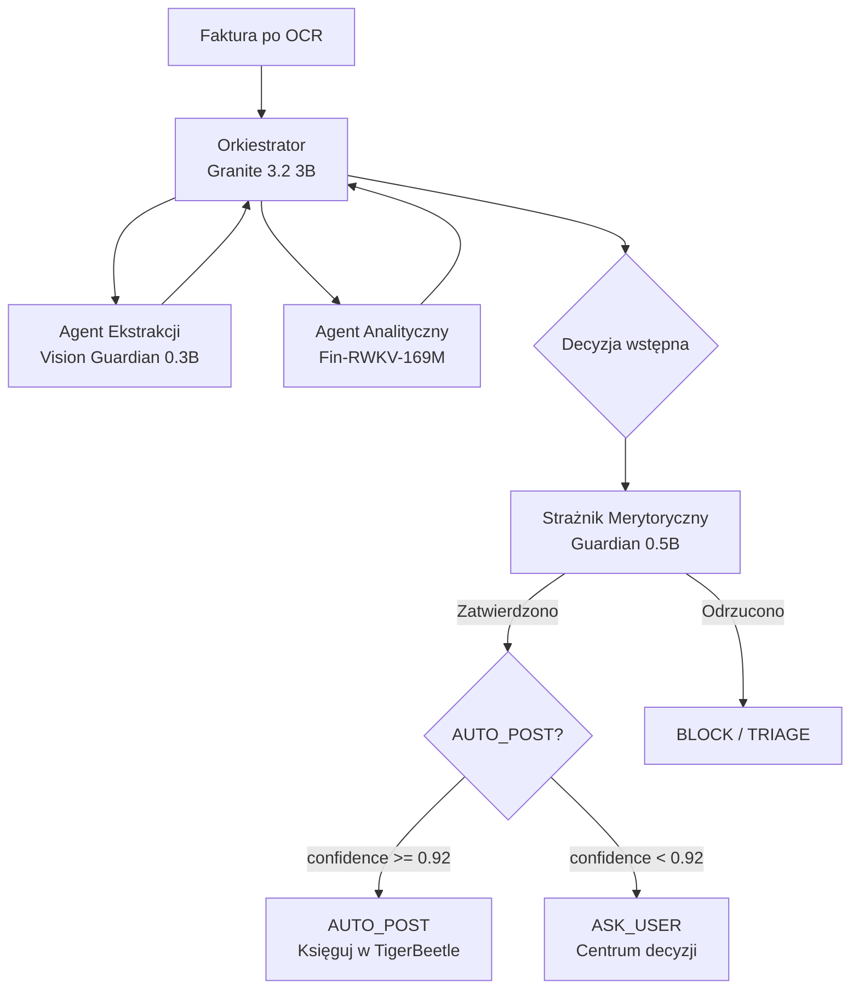
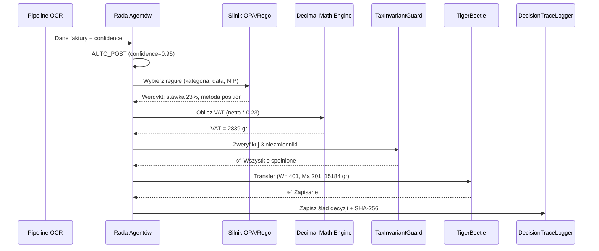

# 📐 Moduły i logika biznesowa

> **Cel:** Opisać wszystkie kluczowe serwisy, agentów AI i pipeline'y przetwarzania.  
> **Kiedy czytać:** Gdy pracujesz na konkretnym serwisie lub planujesz nowy.

---

## 1. Przegląd agentów AI (konfigurowalne modele GGUF)

NexusAI używa wyspecjalizowanych agentów AI — każdy ładowany jako model GGUF z konfiguracji. Poniższe nazwy to **rekomendowane modele referencyjne** (system nie ma zharkodowanych modeli — `InferenceService` ładuje dowolny plik GGUF podany w konfiguracji):

> ⚠️ **Uwaga:** Nazwy modeli poniżej NIE są zharkodowane w kodzie. `nexus_ai/core/inference.py` to generyczny silnik GGUF — ładuje dowolny model wskazany w konfiguracji. To są **sugestie**.

| Agent | Model GGUF | RAM | Rola |
|---|---|---|---|
| **Orkiestrator** | Granite-3.2-3B-Q4_K_M | ~2 GB | Centralny mózg — przyjmuje zadania, deleguje, podejmuje decyzje |
| **Ekstrakcji Danych** | Vision Guardian 0.3B + ParagonDetect 0.1B | ~400 MB | Nadzoruje OCR, weryfikuje JSON vs obraz, odrzuca paragony |
| **Analityczny** | Fin-RWKV-169M-Q4_K_M | ~100 MB | Analizuje kondycję finansową, wykrywa trendy, anomalie |
| **Walidator Jakości** | Granite-Guardian-0.5B-Q4_0 | ~300 MB | Strażnik merytoryczny — weryfikuje KAŻDĄ decyzję Orkiestratora |
| **Środków Trwałych** | Hrida-T2SQL-128k | ~500 MB | Amortyzacja, ewidencja, plany amortyzacyjne |

**Dodatkowe modele specjalistyczne:**
- **ModernBERT-NER-Finance 0.3B** (~200 MB) — Walidator semantyczny (spójność danych)
- **GraphSAGE-Encoder 0.1B** (~50 MB) — Detekcja fraudów (VAT karuzele)
- **Lag-Llama 0.3B** (~150 MB) — Predykcja płynności finansowej
- **FinBERT-ESG 0.1B** (~50 MB) — ESG scoring kontrahentów
- **Qwen3-Nano 0.5B-Q2_K** (~250 MB) — Komunikator — formułuje pytania do użytkownika

---

## 2. Proces decyzyjny Rady Agentów

### 2.1 Architektura "zero zaufania do pojedynczego modelu"



> **📝 Wersja tekstowa (ASCII fallback):**
> ```
> RADA AGENTÓW — przepływ decyzyjny:
> 
>         [Faktura po OCR]
>                │
>                ▼
>         ┌─────────────┐
>         │ ORKIESTRATOR│◄──────────────────────────────┐
>         │ Granite 3.2 │                               │
>         └──┬───────┬──┘                               │
>            │       │                                   │
>      ┌─────┘       └─────┐                             │
>      ▼                   ▼                             │
> ┌──────────┐      ┌──────────────┐                     │
> │Agent     │      │Agent         │                     │
> │Ekstrakcji│      │Analityczny   │                     │
> │Vision 0.3B│     │Fin-RWKV 169M │                     │
> └──────────┘      └──────────────┘                     │
>      │                   │                             │
>      └─────────┬─────────┘                             │
>                ▼                                       │
>         ┌─────────────┐                                │
>         │Decyzja      │                                │
>         │wstępna      │                                │
>         └──────┬──────┘                                │
>                ▼                                       │
>         ┌─────────────┐     NIE    ┌──────────┐       │
>         │Strażnik     │───────────▶│ BLOCK /  │       │
>         │Guardian 0.5B│            │ TRIAGE   │       │
>         └──────┬──────┘            └──────────┘       │
>                │ TAK                                   │
>                ▼                                       │
>         ┌─────────────┐                                │
>         │AUTO_POST?   │─── TAK (>0.92) ──▶ [KSIĘGOWANIE]
>         └──────┬──────┘                                │
>                │ NIE (<0.92)                           │
>                ▼                                       │
>         ┌─────────────┐                                │
>         │ASK_USER     │──▶ Użytkownik wybiera opcję ───┘
>         │Centrum dec. │
>         └─────────────┘
> ```

### 2.2 Poziomy decyzji (Trust Score)

| Poziom | Próg | Akcja |
|---|---|---|
| **AUTO_POST** | confidence >= 0.92 | Automatyczne księgowanie |
| **SUGGEST** | 0.75 <= confidence < 0.92 | Sugestia dla użytkownika (1 klik) |
| **ASK_USER** | 0.50 <= confidence < 0.75 | Pytanie z 2-5 opcjami |
| **BLOCK** | confidence < 0.50 | Blokada — wymagana weryfikacja ręczna |

---

## 3. Pipeline OCR — architektura warstwowa

### 3.1 Warstwy przetwarzania

```
┌─────────────────────────────────────────────────────────────────┐
│ WARSTWA 0: Preprocessing                                        │
│   Pillow + OpenCV → binaryzacja, kontrast, korekta perspektywy  │
├─────────────────────────────────────────────────────────────────┤
│ WARSTWA 1: Detekcja typu dokumentu                              │
│   ParagonDetect 0.1B → czy to faktura? (paragon = odrzuć)      │
├─────────────────────────────────────────────────────────────────┤
│ WARSTWA 2: 4 silniki OCR                                        │
│   Tesseract (druk klasyczny) + PaddleOCR (DL)                   │
│   + python-docTR (układ strony) + EasyOCR (różnorodność)        │
├─────────────────────────────────────────────────────────────────┤
│ WARSTWA 3: Walidacja krzyżowa                                   │
│   Consensus (Levenshtein distance) → najlepszy wynik            │
├─────────────────────────────────────────────────────────────────┤
│ WARSTWA 4: Nadzorca AI                                          │
│   Vision Guardian 0.3B → porównuje JSON z obrazem               │
├─────────────────────────────────────────────────────────────────┤
│ WARSTWA 5: Walidator Semantyczny                                │
│   ModernBERT-NER-Finance 0.3B → NIP checksum, kwoty, daty       │
└─────────────────────────────────────────────────────────────────┘
```

### 3.2 Mechanizm Walidacji Krzyżowej

```python
# nexus_ai/pipeline/ocr_consensus.py (uproszczone)
def cross_validate(results: list[OcrResult]) -> OcrResult:
    # Porównaj kluczowe pola (NIP, kwota, data) między silnikami
    for field in ["nip", "amount_gross", "date"]:
        values = [r.fields[field] for r in results]
        # Jeśli 3/4 silników się zgadza → akceptuj
        most_common = max(set(values), key=values.count)
        if values.count(most_common) >= 3:
            consensus[field] = most_common
        else:
            # Brak konsensusu → eskalacja do AI Supervisor
            return escalate_to_supervisor(results)
    return build_consensus_result(consensus)
```

---

## 4. Serwisy biznesowe — katalog

### 4.1 Księgowość (Accounting)

| Plik | Klasa | Odpowiedzialność |
|---|---|---|
| `accountant_logic.py` | `ZPKEngine` | Plan kont, dekretacja księgowa |
| `auto_decree.py` | `AutoDecreeService` | Automatyczna dekretacja faktur |
| `audit_service.py` | `AuditService` | Ślad audytowy (5 rodzajów eventów) |
| `audit_storno.py` | — | Korekty księgowe (storno czerwone/czarne) |
| `fixed_assets.py` | `FixedAssetsService` | Środki trwałe + amortyzacja liniowa/degresywna |
| `inventory_fifo.py` | `FifoInventory` | Wycena zapasów metodą FIFO |
| `bank_import.py` | `BankImportService` | Import wyciągów bankowych (MT940, CSV) |
| `budget_control.py` | `BudgetControlService` | Kontrola wykonania budżetu |
| `fx_revaluation.py` | `FxRevaluationService` | Rewaluacja walutowa (NBP) |
| `vat_reconciliation.py` | `VatReconciliationService` | Uzgadnianie JPK_V7 |

### 4.2 Decyzje i Triage

| Plik | Klasa | Odpowiedzialność |
|---|---|---|
| `triage_service.py` | `TriageService` | Centrum decyzji (ASK_USER) |
| `decision_structs.py` | — | Typy decyzyjne (msgspec.Struct) |
| `decision_queue.py` | `DecisionQueue` | Kolejka decyzji oczekujących |
| `decision_logger.py` | `DecisionLogger` | Logowanie decyzji do audytu |
| `proof_chain.py` | `ProofChain` | Łańcuch SHA-256 dla decyzji |
| `integrity_verifier.py` | `IntegrityVerifier` | Weryfikacja integralności łańcucha |
| `replay_engine.py` | `ReplayEngine` | Odtwarzanie decyzji z przeszłości |

### 4.3 Podatki (Tax)

| Plik | Klasa | Odpowiedzialność |
|---|---|---|
| `tax_simulator.py` | `TaxSimulator` | Symulacje podatkowe (ryczałt vs liniowy vs CIT estoński) |
| `tax_strategies.py` | — | Strategie optymalizacji podatkowej |
| `cfo_offline.py` | — | Pakiet offline CFO (RAG, prognozy, priorytetyzacja) |
| `billing_estimator.py` | `BillingEstimator` | Szacowanie kosztów usług księgowych |

### 4.4 Bezpieczeństwo i Compliance

| Plik | Klasa | Odpowiedzialność |
|---|---|---|
| `fraud_graph_scanner.py` | `FraudGraphScanner` | GraphSAGE — detekcja VAT karuzeli |
| `vendor_intelligence.py` | `VendorIntelligence` | Risk scoring kontrahentów (Biała Lista + ESG) |
| `risk_guard.py` | `RiskGuard` | Dynamiczne progi ryzyka |
| `semantic_guard.py` | `SemanticGuard` | Wykrywanie "kreatywnej księgowości" |
| `security_service.py` | `SecurityService` | Retencja + bezpieczne usuwanie |
| `compliance_analytics.py` | `ComplianceAnalytics` | Raportowanie zgodności |
| `document_fingerprint.py` | `DocumentFingerprint` | Cyfrowe odciski dokumentów |
| `log_pii_monitor.py` | `LogPiiMonitor` | Monitorowanie PII w logach |

### 4.5 Integracje zewnętrzne

| Plik | Klasa | Odpowiedzialność |
|---|---|---|
| `ksef_service.py` | `KsefService` | Komunikacja z API KSeF (pobieranie/wysyłka) |
| `ksef_generator.py` | `KsefGenerator` | Generowanie XML FA_VAT(2) |
| `gus_bir_client.py` | `GusBirClient` | Weryfikacja danych w CEIDG |
| `white_list_service.py` | `WhiteListService` | Sprawdzanie Białej Listy MF |
| `context_enricher.py` | `ContextEnricher` | Wzbogacanie danych o GUS/Białą Listę |

### 4.6 Operacje i monitoring

| Plik | Klasa | Odpowiedzialność |
|---|---|---|
| `notification_service.py` | `NotificationService` | Powiadomienia (app, email, push) |
| `notification_manager.py` | `NotificationManager` | Orkiestracja powiadomień |
| `scheduler.py` | `Scheduler` | Zadania cykliczne (cron-like) |
| `dunning_engine.py` | `DunningEngine` | Wezwania do zapłaty |
| `daily_briefing.py` | `DailyBriefing` | Raport dzienny |
| `facts_aggregator.py` | `FactsAggregator` | Metryki księgowe + jakość decyzji |
| `liquidity_oracle.py` | `LiquidityOracle` | Predykcja płynności (Lag-Llama) |
| `finops_meter.py` | `FinOpsMeter` | Pomiar kosztów operacyjnych |
| `shadow_resource_correlation.py` | — | Korelacja zasobów w tle |
| `otel_fallback.py` | `OtelFallback` | Fallback OTel → Parquet/DuckDB |
| `hot_reload.py` | `HotReloadService` | Hot-reload reguł i konfiguracji |
| `migration_sanity.py` | `MigrationSanity` | Walidacja integralności migracji |

---

## 5. Silnik reguł podatkowych (OPA / Rego)

### 5.1 Filozofia działania

Silnik reguł NIE jest modelem AI. To **deterministyczna maszyna stanowa**:

```
Jeśli (warunek A i warunek B i warunek C) → zastosuj regułę R
ze stawką S i metodą zaokrąglenia M
```

### 5.2 Trzy filary

| Filar | Komponent | Opis |
|---|---|---|
| **Filar 1** | Magazyn Reguł (Rule Store) | Tabela reguł w SQLite z warunkami SQL i akcjami JSON |
| **Filar 2** | Menedżer Temporalny | Filtruje reguły po `valid_from <= transaction_date <= valid_to` |
| **Filar 3** | Maszyna Ewaluacyjna | Sortuje reguły po priorytecie, first-match-wins |

### 5.3 Temporalność — wehikuł czasu prawniczego

```sql
-- Dla faktury z 2021 użyje stawek z 2021, nawet jeśli dziś obowiązują nowe
SELECT * FROM tax_rules
WHERE valid_from <= :transaction_date
  AND (valid_to IS NULL OR valid_to >= :transaction_date)
ORDER BY priority ASC
LIMIT 1;
```

### 5.4 Reguły Rego (OPA)

```rego
# nexus_ai/tax/rules.rego
package tax

default allow = false

allow {
    input.category_code == "FUEL"
    input.transaction_date >= "2022-01-01"
    input.transaction_date <= "2023-12-31"
}

vat_rate = 0.23 {
    input.category_code == "FUEL"
}
```

---

## 6. Matematyka finansowa — trzy filary nieomylności

### Filar 1: Całkowity zakaz float

Wszystkie kwoty są w **groszach (int)**, nigdy `float`:

```python
# NIE: amount = 123.45  (float!)
# TAK: amount_cents = 12345  (int)
```

### Filar 2: Jawne zaokrąglanie HALF_UP

```python
from decimal import Decimal, ROUND_HALF_UP

vat_cents = round(net_cents * Decimal("0.23"))  # HALF_UP
```

### Filar 3: Potrójna weryfikacja (TaxInvariantGuard)

```
∑ Netto_pozycji  ==  Netto_faktury
∑ VAT_pozycji    ==  VAT_faktury
Netto + VAT      ==  Brutto
```

Jeśli którekolwiek równanie NIE jest spełnione → transakcja BLOKOWANA.

---

## 7. Diagram sekwencji — księgowanie faktury



> **📝 Wersja tekstowa (ASCII fallback):**
> ```
> KSIĘGOWANIE FAKTURY — przepływ danych:
> 
> [Pipeline OCR]            [Rada Agentów]
>      │                          │
>      │─Dane + confidence───────▶│
>      │                          │─AUTO_POST (conf=0.95)
>      │                          │
>      │                    [Silnik OPA/Rego]
>      │                          │
>      │              ◀─Werdykt: stawka 23%, metoda position
>      │                          │
>      │                    [Decimal Math Engine]
>      │                          │
>      │              ◀─VAT = 2839 gr (netto 12345 * 0.23)
>      │                          │
>      │                    [TaxInvariantGuard]
>      │                          │
>      │    Sprawdza 3 równania:  │
>      │    ∑netto_position == netto_faktury? ✅
>      │    ∑vat_position == vat_faktury?     ✅
>      │    netto + vat == brutto?            ✅
>      │                          │
>      │                    [TigerBeetle]
>      │                          │
>      │    Transfer:             │
>      │    Wn 401 (Koszty)  ← 12345 gr
>      │    Wn 220 (VAT nal.) ←  2839 gr
>      │    Ma 201 (Rozrach.) ← 15184 gr
>      │    ΣWn == ΣMa? ✅ (15184 == 15184)
>      │                          │
>      │                    [DecisionTraceLogger]
>      │                          │
>      │    Zapis: rule_id + context + verdict + SHA-256
> ```

---

## 8. Komunikacja wewnętrzna (NATS JetStream)

### 8.1 Tematy NATS

| Temat | Kierunek | Opis |
|---|---|---|
| `invoice.received` | System → Worker | Nowa faktura do przetworzenia |
| `invoice.extracted` | OCR → Orkiestrator | Dane wyciągnięte z OCR |
| `council.task.request` | System → Orkiestrator | Zadanie dla Rady Agentów |
| `council.decision.final` | Orkiestrator → System | Ostateczna decyzja |
| `quality.check.request` | Orkiestrator → Walidator | Żądanie walidacji jakości |
| `billing.rules.updated` | Admin → BillingEstimator | Hot-reload reguł cennika |
| `risk.thresholds.updated` | Admin → RiskGuard | Hot-reload progów ryzyka |
| `tax.rule.updated` | Admin → Silnik OPA | Nowa reguła podatkowa |
| `outbox.relay` | Outbox → Worker | Zdarzenia do publikacji |

### 8.2 JetStream — gwarancje

- **At-least-once delivery:** Każda wiadomość trwale zapisana na dysku
- **Dead Letter Queue:** Po N nieudanych próbach → DLQ
- **Retry z backoffem:** Wykładnicze opóźnienia (1s, 2s, 4s, 8s...)
- **KV Store:** Wbudowany — nie potrzebuje Redis
- **Object Store:** Pliki binarne (modele GGUF?)

---

## 9. Dodawanie nowego agenta AI

1. Pobierz model GGUF do `models/`
2. Dodaj konfigurację modelu w `config/base.toml` (sekcja `[models]`)
3. Utwórz klasę Agenta w `nexus_ai/services/`
4. Zarejestruj w `nexus_ai/core/ai_context.py`
5. Dodaj handler w `nexus_ai/events/taskiq_events.py`

```python
# Przykład szkieletu nowego agenta
from nexus_ai.core.inference import InferenceService

class NewAgent:
    def __init__(self, model_path: str):
        self.llm = InferenceService(model_path)
    
    async def process(self, context: dict) -> dict:
        prompt = self._build_prompt(context)
        result = await self.llm.generate(prompt)
        return self._parse_result(result)
```

---

## 🔗 Zobacz również

- [Architektura](ARCHITECTURE.md) — wzorce projektowe, ADR-004 (4 silniki OCR), ADR-002 (TigerBeetle)
- [Bezpieczeństwo](SECURITY.md) — architektura "zero zaufania" AI, weryfikacja modeli
- [Testowanie](TESTING.md) — testy property-based dla logiki podatkowej
- [Baza danych](DATABASE.md) — schematy tabel: dq_decisions, ledger_transfers
- [Zgodność z przepisami](COMPLIANCE.md) — reguły podatkowe OPA/Rego, KSeF

---

> **Data aktualizacji:** 2026-07-04 · **Autor:** NexusAI Team · **Wersja:** 2.3.0
> **Status dokumentu:** Stabilny · **Ostatnia weryfikacja:** 2026-07-04 · **Weryfikator:** NexusAI Team
