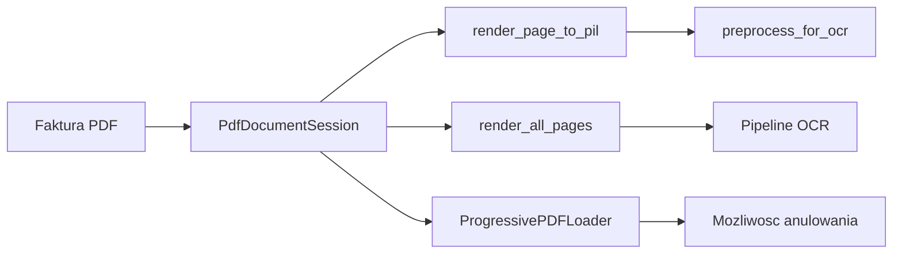

# 📄 PDFium Engine — Przetwarzanie dokumentów PDF

> **Plik:** `nexus_ai/services/pdfium/`
> **Status:** Stabilny · **Wersja:** 2.3.1-dev
> **Ostatnia aktualizacja:** 2026-07-05

---

## 1. Przegląd

NexusAI używa **pypdfium2** (binding do PDFium — silnika PDF Google Chrome) do konwersji, analizy i przetwarzania dokumentów PDF w pipeline OCR.

```
nexus_ai/services/pdfium/
├── session.py        # PdfDocumentSession — session context manager
├── render.py         # RenderFlags, render_page_*, render_all_pages
├── structs.py        # 14 DTO: PDFTextRange, PDFSignature, PDFAnnotation, PDFACompliance...
├── progressive.py    # ProgressivePDFLoader — progresywny ładowacz z anulowaniem
└── cache.py          # CachingFileSystem dla fsspec
```

### Diagram przepływu



---

## 2. PdfDocumentSession

**Plik:** `services/pdfium/session.py`

Context manager do wielu operacji na jednym otwartym dokumencie PDF. Unika wielokrotnego otwierania tego samego pliku.

```python
from nexus_ai.services.pdfium.session import PdfDocumentSession

# Z pliku
with PdfDocumentSession("invoice.pdf") as pdf:
    page_count = len(pdf)          # Liczba stron
    metadata = pdf.get_metadata()  # Metadane PDF
    sigs = pdf.get_signatures()    # Podpisy cyfrowe

# Z bajtów (np. z bazy danych)
with PdfDocumentSession(pdf_bytes) as pdf:
    page = pdf[0]  # Pierwsza strona
```

**Parametry:**

| Parametr | Typ | Domyślnie | Opis |
|---|---|---|---|
| `source` | `str \| Path \| bytes` | — | Ścieżka pliku lub zawartość PDF |
| `init_forms` | `bool` | `True` | Zainicjuj AcroForm przy otwarciu |

**Właściwości:**

| Właściwość | Typ | Opis |
|---|---|---|
| `pdf` | `PdfDocument` | Bazowy dokument pypdfium2 |
| `forms_initialized` | `bool` | Czy AcroForm został zainicjowany |

---

## 3. Renderowanie stron

**Plik:** `services/pdfium/render.py`

### RenderFlags

```python
from nexus_ai.services.pdfium.render import RenderFlags

flags = RenderFlags.LCD_TEXT | RenderFlags.ANNOTATIONS
```

| Flaga | Wartość | Opis |
|---|---|---|
| `NONE` | `0` | Domyślne renderowanie |
| `LCD_TEXT` | `1 << 0` | Subpikselowy antyaliasing tekstu (LCD) |
| `NO_SMOOTHTEXT` | `1 << 1` | Wyłącz wygładzanie tekstu |
| `NO_SMOOTHIMAGE` | `1 << 2` | Wyłącz wygładzanie obrazów |
| `NO_SMOOTHPATH` | `1 << 3` | Wyłącz wygładzanie ścieżek |
| `GRAYSCALE` | `1 << 4` | Renderuj w skali szarości |
| `FORCE_HALFTONE` | `1 << 5` | Wymuś halftoning |
| `RENDER_TO_BITMAP` | `1 << 6` | Renderuj do bitmapy |
| `ANNOTATIONS` | `1 << 7` | Uwzględnij adnotacje |

### Główne funkcje

```python
from nexus_ai.services.pdfium.render import (
    render_page_to_pil,           # → PIL Image
    render_page_to_jpeg_bytes,    # → JPEG bytes
    render_page_to_png_bytes,     # → PNG bytes
    render_all_pages,             # → list[PIL Image]
    render_all_pages_to_memory,   # → list[bytes]
    pdf_page_count,               # → int
    render_page_to_pil_enhanced,  # → PIL Image (z preprocessingiem OCR)
)
```

**Renderowanie pojedynczej strony:**

```python
# Do PIL Image (300 DPI)
img = render_page_to_pil("invoice.pdf", page_num=0, dpi=300)

# Z preprocessingiem OCR
img = render_page_to_pil_enhanced("invoice.pdf", page_num=0, preprocess_for_ocr=True)

# Do JPEG bytes
jpeg_bytes = render_page_to_jpeg_bytes("invoice.pdf", page_num=0, quality=85)

# Do PNG w skali szarości
png_bytes = render_page_to_png_grayscale("invoice.pdf", page_num=0)
```

**Renderowanie wszystkich stron:**

```python
# Wszystkie strony
pages = render_all_pages("invoice.pdf", dpi=200)

# Z callbackiem postępu
def progress(info):
    print(f"Strona {info.current_page}/{info.total_pages} ({info.percent}%)")

pages = render_all_pages("invoice.pdf", progress_callback=progress)

# Zakres stron z limitem
pages = render_all_pages("invoice.pdf", page_range=(0, 3), max_pages=3)
```

### Domyślne stałe

| Stała | Wartość | Opis |
|---|---|---|
| `PDFIUM_BASE_DPI` | `72.0` | Bazowe DPI PDFium |
| `DEFAULT_DPI` | `300` | Domyślne DPI renderowania |
| `DEFAULT_SCALE` | `≈ 4.167` | `300 / 72` |

---

## 4. ProgressivePDFLoader

**Plik:** `services/pdfium/progressive.py`

Progresywny ładowacz PDF z możliwością anulowania renderowania w trakcie. Przydatny dla dużych dokumentów (>100 stron).

```python
from nexus_ai.services.pdfium.progressive import ProgressivePDFLoader

# Z pliku (lazy loading)
with ProgressivePDFLoader("large_invoice.pdf") as loader:
    first_page = loader.render_first_page(dpi=150)
    
    for page_bytes in loader.render_all(dpi=150):
        process(page_bytes)

# Z bajtów
loader = ProgressivePDFLoader.from_bytes(pdf_bytes)
first_page = loader.render_first_page(dpi=200)
loader.close()
```

**Anulowanie renderowania:**

```python
loader = ProgressivePDFLoader("huge_document.pdf")
for page_bytes in loader.render_all(dpi=150):
    process(page_bytes)
    if should_stop():
        loader.cancel()  # Przerywa dalsze renderowanie
        break
```

**Właściwości i metody:**

| Metoda / Własność | Opis |
|---|---|
| `page_count` | Liczba stron w dokumencie |
| `render_first_page(dpi)` | Renderuj pierwszą stronę |
| `render_page(page_num, dpi)` | Renderuj konkretną stronę |
| `render_all(dpi, ...)` | Generator stron jako bytes |
| `get_page_size(page_num)` | Wymiary strony (width, height) |
| `cancel()` | Anuluj dalsze renderowanie |
| `is_cancelled` | Czy anulowano |

---

## 5. DTO (Structs)

**Plik:** `services/pdfium/structs.py`

14 msgspec Structów dla operacji PDF:

| Struct | Pola | Użycie |
|---|---|---|
| `PDFTextRange` | `text, left, top, right, bottom, font_size` | Zakres tekstu z pozycją |
| `PDFPageInfo` | `page_num, width, height, text_ranges` | Informacja o stronie |
| `PDFSignature` | `author, reason, location, is_verified, signed_at, field_name, page_num` | Podpis cyfrowy |
| `PDFFormField` | `name, type, value, is_readonly, options, page_num, rect` | Pole AcroForm |
| `PDFRenderCacheEntry` | `png_bytes, cached_at` | Cache renderowanych stron |
| `PDFProgressInfo` | `current_page, total_pages, percent, page_dpi` | Postęp renderowania |
| `PDFAnnotation` | `type, rect, content, color, author, modified_at, flags, page_num` | Adnotacja PDF |
| `PDFAttachment` | `name, data, size, index` | Załącznik PDF |
| `PDFBookmark` | `title, page_index, level, children` | Zakładka (outline) |
| `PDFSearchResult` | `text, left, top, right, bottom, char_index, count` | Wynik wyszukiwania |
| `PDFACompliance` | `is_pdfa, pdfa_version, pdfa_version_str` | Zgodność z PDF/A |

**Przykład użycia:**

```python
from nexus_ai.services.pdfium.structs import PDFSignature, PDFAnnotation

sig = PDFSignature(
    author="Jan Kowalski",
    reason="Zatwierdzenie faktury",
    is_verified=True,
    field_name="Signature1",
    page_num=2,
)

annotation = PDFAnnotation(
    type="Highlight",
    rect=(100.0, 200.0, 300.0, 250.0),
    content="Sprawdź kwotę VAT",
    page_num=1,
)
```

---

## 6. Integracja z pipeline OCR

PDFium jest pierwszym krokiem w pipeline OCR:

```
PDF → PDFium (render) → PIL Image → Preprocessing → Silniki OCR → Consensus
```

```python
# Typowy przepływ
from nexus_ai.services.pdfium.render import render_all_pages
from nexus_ai.pipeline.ocr_consensus import TesseractEngine

images = render_all_pages("invoice.pdf", dpi=300)
for page_img in images:
    result = TesseractEngine().process_image(page_img)
```

---

## 7. Wydajność i ograniczenia

| Operacja | Czas (1 strona, 300 DPI) | Czas (10 stron, 200 DPI) |
|---|---|---|
| `render_page_to_pil` | ~150ms | ~1.2s |
| `render_all_pages` | ~200ms | ~1.5s |
| `render_page_to_jpeg_bytes` | ~180ms | ~1.4s |
| `render_all_pages_to_memory` | ~250ms | ~1.8s |
| `ProgressivePDFLoader.render_all` | ~200ms | ~1.6s |

**Ograniczenia:**
- Maksymalny rozmiar PDF: 500 MB (limit pamięci)
- Maksymalna liczba stron: 1000 (limit czasowy)
- PDF/A-1b, PDF/A-2b, PDF/A-3b — pełna zgodność
- Zaszyfrowane PDF — wymagają hasła (nie wspierane)

---

> **Zobacz również:**
> - [`PIPELINE.md`](PIPELINE.md) — Pipeline OCR używający PDFium
> - [`MODULES.md`](MODULES.md) — Serwisy używające PDFium
> - [`HTTP_CLIENT.md`](HTTP_CLIENT.md) — Pobieranie PDF przez HTTP
> - [`INSTALLER.md`](INSTALLER.md) — Instalacja pypdfium2
