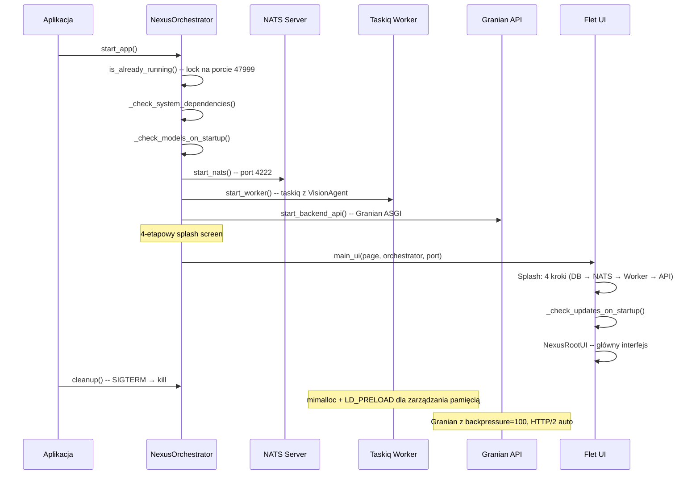

# 🛠️ Skrypty CLI — narzędzia wiersza poleceń

> **Cel:** Udokumentować wszystkie skrypty CLI, entry pointy i narzędzia administracyjne.  
> **Kiedy czytać:** Przed uruchomieniem skryptów, konfiguracją CI/CD lub debugowaniem środowiska.

---

## 1. Przegląd

NexusAI dostarcza zestaw skryptów CLI do zarządzania środowiskiem, uruchamiania komponentów i administracji.

| Kategoria | Skrypt | Opis |
|---|---|---|
| **Środowisko** | `scripts/init.py` | Bootstrap całego systemu |
| **Modele AI** | `scripts/download_models.py` | Pobieranie/weryfikacja modeli GGUF |
| **Dane** | `scripts/seed_data.py` | Ładowanie danych demo |
| **Backup** | `scripts/backup.py` | Tworzenie kopii zapasowych przez fsspec |
| **Reset** | `scripts/reset_db.py` | Reset bazy do stanu fabrycznego |
| **Build** | `luz/build_nexus.py` | Kompilacja Nuitka (Python → .exe) |
| **Worker** | `luz/worker.py` | Taskiq worker z Watchdogiem |
| **Desktop** | `luz/main.py` | Główny entry point aplikacji desktopowej |

---

## 2. Skrypty środowiskowe

### 2.1 `scripts/init.py` — Bootstrap systemu

```bash
python -m nexus_ai.scripts.init
```

Automatycznie uruchamiany przy pierwszym starcie przez `NexusOrchestrator`. Wykonuje:

1. Sprawdzenie zależności systemowych (NATS, TigerBeetle, OPA)
2. Pobranie brakujących binarek
3. Pobranie i weryfikacja modeli AI
4. Inicjalizacja baz danych (SQLite, DuckDB)
5. Seed danych demo (jeśli baza pusta)

**API:**

```python
from nexus_ai.scripts.init import bootstrap_system

await bootstrap_system()  # async — pełny bootstrap
```

### 2.2 `scripts/download_models.py` — Pobieranie modeli AI

```bash
python -m nexus_ai.scripts.download_models --doctr            # Modele docTR OCR
python -m nexus_ai.scripts.download_models --easyocr          # Modele EasyOCR
python -m nexus_ai.scripts.download_models --verify-only      # Tylko weryfikacja
```

**Obsługiwane modele:**

| Flaga | Modele | Rozmiar | Źródło |
|---|---|---|---|
| `--doctr` | `db_resnet50` (detekcja) + `parseq` (rozpoznawanie) | ~500 MB | HuggingFace (`mindee/`) |
| `--easyocr` | `craft_mlt_25k` (detekcja) | ~490 MB | HuggingFace (`JaidedAI/`) |
| Brak flagi | Pomoc + lista użycia | — | — |

**Weryfikacja integralności:**

```bash
python download_models.py --verify-only
# Sprawdza SHA-256 wszystkich modeli bez pobierania
```

### 2.3 `scripts/backup.py` — Kopia zapasowa

```bash
python -m nexus_ai.scripts.backup
```

Tworzy szyfrowaną kopię zapasową z użyciem **fsspec** — działa z dowolnym backendem (file://, s3://, sftp://).

```python
from nexus_ai.scripts.backup import create_backup, list_backups, verify_backup

# Utwórz backup
url = create_backup()  # -> "backups/nexus_backup_20260705_120000.zip"

# Lista backupów
backups = list_backups()  # -> [{"name": "...", "size_mb": 12.5, ...}]

# Weryfikacja
ok = verify_backup(url)  # -> True/False
```

**Obsługiwane backendy storage:**
- `file` (lokalny, domyślny)
- `s3` (Amazon S3)
- `sftp` (SFTP)
- `memory` (RAM — tymczasowo)

**Metadane backupu** są przechowywane w `fsspec.get_mapper()` dla szybkiego przeglądania bez rozpakowywania.

---

## 3. Skrypty danych

### 3.1 `scripts/seed_data.py` — Dane demo

```bash
python -m nexus_ai.scripts.seed_data
# lub
python main.py --load-fixtures
```

Ładuje dane testowe z `scripts/seed_data.toml`:

| Encja | Ilość | Opis |
|---|---|---|
| Użytkownicy | 2 | admin (owner) + ksiegowa (accountant) |
| Kontrahenci | 5+ | Różne NIP-y, adresy, rachunki bankowe |
| Faktury | 10+ | Różne statusy (NEW, APPROVED, PAID) |
| Firmy | 2+ | JDG + spółka z o.o. |
| Polityki podatkowe | 3+ | CIT standard, estoński, ryczałt |
| Okresy finansowe | 2+ | Bieżący + poprzedni |
| Kursy walut | 5+ | EUR, USD, GBP, CHF, CZK |
| Task status | 5 | Różne statusy (COMPLETED, RUNNING, FAILED) |

**Tabela seed danych tworzy także:**
- Role i uprawnienia RBAC (admin, owner, accountant, auditor, viewer)
- Mapowania role↔permissions z pliku TOML
- Użytkownika admin z hasłem z `NEXUS_ADMIN_PASSWORD` (lub losowym 16-znakowym)

**Uwaga:** Przy pierwszym uruchomieniu seed wypisuje hasło admina na konsolę — zapisz je!

### 3.2 `scripts/reset_db.py` — Reset bazy

```bash
python -m nexus_ai.scripts.reset_db
```

**OSTRZEŻENIE:** Usuwa wszystkie dane! Czyści:

- SQLite (OLTP) — wszystkie faktury, kontrahenci, decyzje
- DuckDB (OLAP) — dane analityczne
- `app_data/` — skany, exporty, pliki tymczasowe

---

## 4. Entry pointy aplikacji

### 4.1 `luz/main.py` — Główny uruchamianie desktopowe

```bash
python main.py
```

`NexusOrchestrator` zarządza pełnym cyklem życia aplikacji:



**Funkcje pomocnicze:**

| Funkcja | Opis |
|---|---|
| `get_free_port()` | Dynamicznie znajduje wolny port na localhost |
| `is_already_running(port=47999)` | Single Instance Lock przez TCP socket |
| `_check_system_dependencies()` | Uruchamia `dependency_ui` jeśli brakuje binarek |
| `_check_models_on_startup()` | Uruchamia `model_downloader` UI jeśli brakuje modeli |
| `_check_updates_on_startup()` | Async sprawdza `version.json`, pokazuje dialog Flet |

**4-etapowy splash screen:**

```python
# Krok 1/4: Sprawdzanie bazy danych...
await bootstrap_system()
# Krok 2/4: Uruchamianie magistrali danych...
await orchestrator.start_nats()
# Krok 3/4: Budzenie silników AI...
await orchestrator.start_worker()
await orchestrator.start_backend_api(port)
# Krok 4/4: Synchronizacja interfejsu...
await anyio.sleep(1.5)
```

### 4.2 `luz/worker.py` — Taskiq Worker

```bash
python -m taskiq worker worker:broker --workers 2
```

Worker z **WorkerGuard** — dynamiczne limitowanie współbieżności:

```python
# CPU > 80% lub RAM > 80% -> zmniejsz współbieżność
if avg_cpu > 80 or ram_usage_pct > 80:
    self.max_concurrent = max(1, self.max_concurrent - 1)
```

**Metryki zbierane przez WorkerGuard:**
- RSS/ USS/PSS (rzeczywista alokacja pamięci, nie RSS)
- CPU user/system/iowait
- Liczba wątków i deskryptorów plików
- SystemMonitor: RAM, swap, dysk, sieć, temperatura CPU
- Użycie `psutil.Process.oneshot()` — ~5x szybciej dla pełnego zestawu metryk

**Lifecycle hooks (TaskiqEvents):**

| Hook | Akcja |
|---|---|
| `WORKER_STARTUP` | Ładuje config, VisionAgent, `gc.freeze()`, `warm_http_cache()` |
| `WORKER_SHUTDOWN` | Anuluje heartbeat, `gc.collect()` |
| `TASK_POST_EXECUTION` | `guard.check_resources()` — GC przy wysokim RAM |

### 4.3 `luz/build_nexus.py` — Build Nuitka

```bash
python -m nexus_ai.luz.build_nexus                     # Standard build
python -m nexus_ai.luz.build_nexus --report            # Build z raportem XML
python -m nexus_ai.luz.build_nexus --no-lto            # Build bez LTO (szybszy)
```

Kompiluje aplikację do standalone `.exe` przez Nuitka:

| Opcja | Opis |
|---|---|
| `--standalone --onefile` | Pojedynczy plik `.exe` |
| `--lto=yes` | Link Time Optimization (domyślnie włączone) |
| `--report` | Raport XML do debugowania |
| `--enable-plugin=mimalloc` | Alokator mimalloc wkompilowany |

**Pakiety includowane:**
`nexus_ai`, `nexus_crypto`, `granian`, `litestar`, `msgspec`, `anyio`, `stamina`, `loguru`, `pendulum`, `duckdb`, `polars`, `httpx`, `nats`, `taskiq`, `llama_cpp`

---

## 5. Praktyczne przykłady

### Backup automatyczny (cron)

```bash
# Codzienny backup o 2:00
0 2 * * * cd /opt/NexusAI && python -m nexus_ai.scripts.backup >> /var/log/nexus_backup.log 2>&1
```

### Reset i seed danych (development)

```bash
python -m nexus_ai.scripts.reset_db   # Czyści wszystko
python -m nexus_ai.scripts.seed_data  # Ładuje demo
```

### Weryfikacja modeli AI

```bash
python -m nexus_ai.scripts.download_models --doctr --verify-only
python -m nexus_ai.scripts.download_models --easyocr --verify-only
```

---

## 🔗 Zobacz również

- [Instalacja i konfiguracja](INSTALLATION.md) — setup środowiska
- [Installer](INSTALLER.md) — instalator Windows, OTA updater
- [Testowanie](TESTING.md) — uruchamianie testów
- [Frontend](FRONTEND.md) — Flet UI, router, widoki
- [Rozwiązywanie problemów](TROUBLESHOOTING.md) — błędy skryptów i diagnoza

---

> **Data utworzenia:** 2026-07-05 · **Autor:** NexusAI Team · **Wersja:** 3.0.0-dev
> **Status dokumentu:** Nowy · **Ostatnia weryfikacja:** 2026-07-05 · **Weryfikator:** Technical Lead
