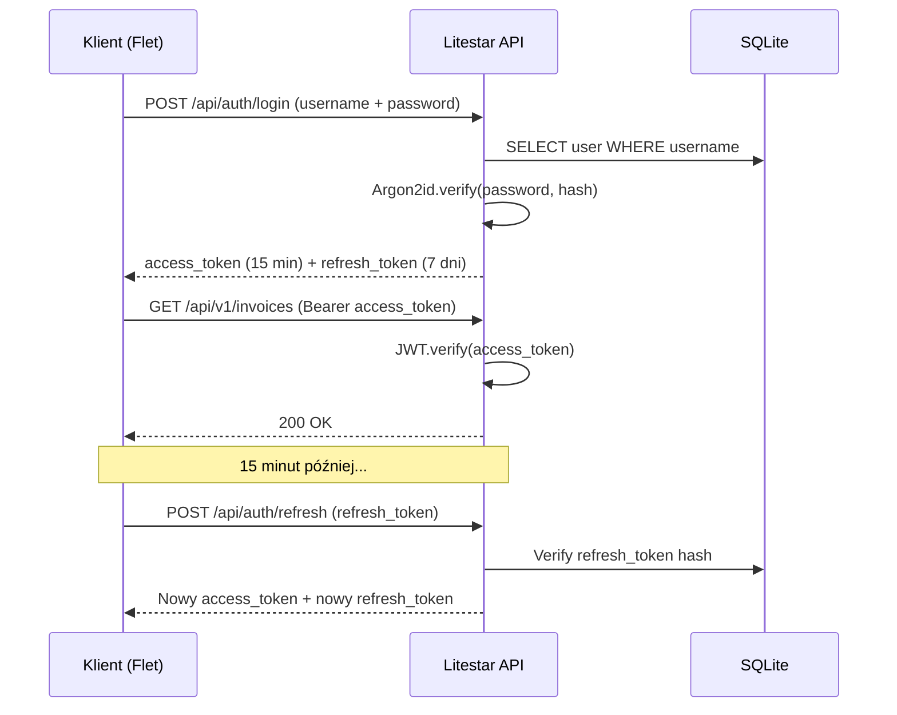

# 🔐 Bezpieczeństwo (Security)

> **Cel:** Udokumentowanie wszystkich mechanizmów bezpieczeństwa dla audytu i zgodności.  
> **Kiedy czytać:** Przed audytem bezpieczeństwa, przed zgłoszeniem podatności.

---

## 1. Model zagrożeń (Threat Model)

### 1.1 Założenia bezpieczeństwa

| Założenie | Opis |
|---|---|
| **Offline-first** | Wszystkie dane i modele AI są lokalne — nie ma chmurowego wektora ataku |
| **Single-tenant** | Jedna instancja = jeden użytkownik/firma |
| **Desktop** | Aplikacja działa na komputerze użytkownika, nie na serwerze |
| **Zaufany hardware** | Komputer użytkownika jest zaufany (ochrona antywirusowa) |

### 1.2 Wektory ataku

| Zagrożenie | Prawdop. | Wpływ | Mitigacja |
|---|---|---|---|
| Kradzież laptopa z danymi | Średnie | Wysoki | SQLCipher AES-256, szyfrowane backupy |
| Złośliwe oprogramowanie na hoście | Średnie | Wysoki | Podpisywanie kodu, AEAD dla backupów |
| Atak na API REST (lokalne) | Niskie | Średni | UNIX socket, JWT, CSRF, rate limiting |
| SQL injection | Niskie | Wysoki | SQLModel ORM (parametryzowane zapytania) |
| Timestamp attack na JWT | Niskie | Średni | Krótki TTL (15 min) + refresh tokeny |
| Model poisoning (AI) | Niskie | Wysoki | SHA-256 weryfikacja modeli GGUF |
| MITM na integracjach KSeF/GUS/NBP | Niskie | Średni | HTTPS + cert pinning |
| Atak brute-force na hasło | Niskie | Średni | Argon2id (odporny na GPU/ASIC) + rate limiting |

---

## 2. Szyfrowanie

### 2.1 Dane w spoczynku (Data at Rest)

| Warstwa | Algorytm | Klucz |
|---|---|---|
| **SQLite (SQLCipher)** | AES-256-CBC (każda strona osobno) | Klucz z Argon2id z hasła użytkownika |
| **Backupy** | AEAD ChaCha20-Poly1305 | Klucz z nexus-crypto Vault |
| **Sekrety (klucze API, tokeny)** | AEAD + mlock (brak swappowania) | Klucz w keyring systemowym |
| **Modele AI** | SHA-256 (weryfikacja integralności) | Weryfikacja przy pobieraniu przez `download_models.py` |

### 2.2 Dane w transmisji (Data in Transit)

| Połączenie | Protokół | Szyfrowanie |
|---|---|---|
| **Flet ↔ API** | UNIX socket / HTTP localhost | Brak (lokalna maszyna) |
| **API ↔ Worker** | NATS UNIX socket | NATS internal TLS |
| **Worker ↔ TigerBeetle** | gRPC UNIX socket | Brak (lokalna maszyna) |
| **API → KSeF/GUS/NBP** | HTTPS | TLS 1.3 |

### 2.3 Własny moduł kryptograficzny (nexus-crypto) — szczegóły

```
nexus_ai/rust/src/
├── aead.rs        # ChaCha20-Poly1305 (szyfrowanie + uwierzytelnianie)
├── argon2.rs      # Argon2id (hashowanie haseł, KDF)
├── sha256.rs      # SHA-256 (łańcuch audytowy)
└── vault.rs       # Bezpieczny magazyn kluczy z mlock
```

**Parametry Argon2id (stałe, wymuszone na poziomie API Rust):**

| Parametr | Wartość | Uzasadnienie |
|---|---|---|
| **Memory cost** | 64 MB (65 536 KiB) | Minimum rekomendowane przez RFC 9106 dla aplikacji produkcyjnych. |
| **Time cost (iterations)** | 3 | Wystarczające dla ataku na GPU — 3 iteracje × 64 MB = 192 MB throughput. |
| **Parallelism (lanes)** | 4 | Liczba rdzeni dostępnych w typowym CPU użytkownika. |
| **Salt length** | 16 bytes | Losowa sól per użytkownik (generowana przy pierwszym logowaniu). |
| **Output length** | 32 bytes (256 bit) | Standard dla klucza AES-256 / HMAC. |

```python
# Weryfikacja w praktyce — nexus_ai/api/security.py
from nexus_crypto._core import argon2_hash, argon2_verify
from secrets import token_bytes

def hash_password(password: str, existing_salt: bytes | None = None) -> tuple[bytes, bytes]:
    """Hashowanie hasła użytkownika z Argon2id.
    
    Args:
        password: hasło w plaintext
        existing_salt: jeśli reset hasła → użyj starej soli (inaczej nowa)
    
    Returns:
        (salt, hash_bytes) — sól do zapisu w `users.salt`, hash do `users.password_hash`
    """
    salt = existing_salt or token_bytes(16)
    hash_result = argon2_hash(password.encode("utf-8"), salt)
    return salt, hash_result

def verify_password(password: str, salt: bytes, expected_hash: bytes) -> bool:
    """Weryfikacja hasła. Stały czas — brak timing leak."""
    return argon2_verify(password.encode("utf-8"), salt, expected_hash)

def rehash_needed(password: str, salt: bytes) -> bool:
    """Sprawdź, czy hash wymaga ponownego obliczenia (zmiana parametrów Argon2id)."""
    return argon2_rehash_needed(password.encode("utf-8"), salt)
```

---

## 3. Autentykacja

### 3.1 JWT (JSON Web Tokens)

| Parametr | Wartość |
|---|---|
| **Algorytm** | HS256 (HMAC-SHA256) |
| **TTL access token** | 15 minut |
| **TTL refresh token** | 7 dni |
| **Przechowywanie refresh** | SQLite, hash SHA-256 |
| **Unieważnianie** | `jwt_version` w tabeli `users` — inkrementacja unieważnia wszystkie tokeny |

### 3.2 Flow autentykacji



### 3.3 Token refresh i unieważnianie

```python
# Login
access_token = jwt.encode({"sub": user_id, "exp": now + 15min}, secret)
refresh_token = secrets.token_urlsafe(32)
db.insert(RefreshToken(user_id=user_id, token_hash=sha256(refresh_token), expires=now+7d))

# Refresh
if refresh_token.hash in db and not expired:
    new_access = jwt.encode({"sub": user_id, "exp": now + 15min}, secret)
    new_refresh = rotate(refresh_token)  # token rotation (stary unieważniony)
    return new_access, new_refresh

# Revoke all sessions
db.execute("UPDATE users SET jwt_version = jwt_version + 1 WHERE id = ?", user_id)
```

---

## 4. RBAC (Role-Based Access Control)

### 4.1 Role systemowe

| Rola | Uprawnienia |
|---|---|
| **admin** | Pełny dostęp — zarządzanie użytkownikami, konfiguracja systemu |
| **owner** | Pełny dostęp do własnych danych firmy |
| **accountant** | Zarządzanie fakturami, raportami, eksport JPK/KSeF |
| **worker** | Podstawowe przetwarzanie dokumentów |
| **viewer** | Tylko odczyt |

### 4.2 Permission guard functions

```python
@get("/invoices/{invoice_id:str}", guards=[has_permission("invoice.read")])
async def get_invoice(invoice_id: str) -> InvoiceDTO: ...

@post("/invoices", guards=[has_permission("invoice.write")])
async def create_invoice(data: InvoiceCreateDTO) -> InvoiceDTO: ...
```

### 4.3 Separacja obowiązków (SoD)

- **Owner** nie może być jednocześnie **accountant** (wymagane 2 osoby dla spółek)
- **Worker** nie może modyfikować stawek podatkowych
- Krytyczne operacje (zmiana planu kont, konfiguracja KSeF) wymagają roli **admin** lub **owner**

---

## 5. Audyt i niezmienność

### 5.1 Proof Chain SHA-256

Każda decyzja (księgowanie, wybór stawki VAT, dekretacja) jest hashowana:

```python
# nexus_ai/services/proof_chain.py
current_hash = SHA256(previous_hash + trace_id + transaction_id +
                       context_json + verdict_json + timestamp)
```

Efekt: Nieprzerwany łańcuch skrótów — modyfikacja jednego wpisu psuje wszystkie kolejne. Wykrywane przez `IntegrityVerifier`.

### 5.2 Decision Traces (ścieżka decyzji)

```sql
SELECT * FROM audit_logs WHERE invoice_id = 'inv-12345';
SELECT * FROM dq_decisions WHERE reference_id = 'inv-12345';
SELECT * FROM ledger_transfers WHERE source_document_id = 'inv-12345';
```

---

## 6. Rotacja kluczy — skrypt

```bash
pixi run rotate-keys
# → uruchamia nexus_ai/scripts/rotate_keys.py
```

```python
# nexus_ai/scripts/rotate_keys.py
"""Rotacja kluczy kryptograficznych w NexusAI.

Proces:
    1. Generuj nowy klucz dla każdego z typów
    2. Szyfruj nowe dane nowym kluczem (nowe zapisy)
    3. Oznacz stary klucz jako "pending_retire"
    4. Przy okazji zapisu do starego klucza → re-encrypt nowym
    5. Po 7 dniach usuń starsze klucze

Typy kluczy i cykl rotacji:
    - JWT signing key: co 90 dni (automatycznie przez inkrementację jwt_version)
    - SQLCipher key: przy zmianie hasła użytkownika
    - Backup encryption key: co 180 dni (ręcznie przez Vault)
    - KSeF client token: co 365 dni (wg polityki KSeF MF)
"""

import hashlib
from datetime import datetime, timedelta
from nexus_crypto._core import VaultKey


KEY_ROTATION_POLICY = {
    "jwt_signing": {"interval_days": 90, "auto_generate": True},
    "sqlcipher": {"interval_days": 180, "trigger": "password_change"},
    "backup_encryption": {"interval_days": 180, "trigger": "manual"},
    "ksef_token": {"interval_days": 365, "trigger": "manual"},
}


def rotate_jwt_key():
    """Rotacja klucza JWT — inkrementacja jwt_version unieważnia stare tokeny."""
    from nexus_ai.db.database import get_session
    session = next(get_session(tenant_id="system"))
    session.execute("UPDATE users SET jwt_version = jwt_version + 1")
    session.commit()
    print("[OK] JWT key rotated — all sessions invalidated")


def rotate_backup_key():
    """Generuj nowy klucz backupu, zapisz w Vault, oznacz stary do usunięcia za 7 dni."""
    new_key = VaultKey.from_random()
    new_key.lock()  # mlock w pamięci
    
    from nexus_ai.core.secrets import VaultManager
    vault = VaultManager()
    vault.rotate("backup_encryption", new_key.unlock())
    print("[OK] Backup encryption key rotated — old key pending retire in 7 days")


def check_key_health() -> list[dict]:
    """Sprawdź, które klucze wymagają rotacji."""
    report = []
    for key_name, policy in KEY_ROTATION_POLICY.items():
        last_rotation = get_last_rotation(key_name)
        days_since = (datetime.now() - last_rotation).days
        status = "OK" if days_since < policy["interval_days"] else "EXPIRED"
        report.append({
            "key": key_name,
            "last_rotation": last_rotation.isoformat(),
            "days_since": days_since,
            "max_interval": policy["interval_days"],
            "status": status,
            "auto": policy["auto_generate"],
        })
    return report
```

---

## 7. Bezpieczeństwo AI

### 7.1 Modele lokalne (offline-first)

- Wszystkie modele GGUF działają LOKALNIE — dane NIE są wysyłane do chmury
- Brak telemetrii AI — żadne dane nie opuszczają komputera

### 7.2 Weryfikacja integralności modeli

```bash
# Modele są weryfikowane przez SHA-256 przed załadowaniem
pixi run download-models   # Pobiera + weryfikuje checksum
pixi run check-models      # Sprawdza obecność i integralność
```

### 7.3 Architektura "zero zaufania do pojedynczego modelu"

- **Orkiestrator** (Granite 3.2 3B) podejmuje decyzję
- **Strażnik Merytoryczny** (Granite Guardian 0.5B) weryfikuje KAŻDĄ decyzję
- Decyzja podatkowa NIGDY nie jest podejmowana przez AI — tylko przez deterministyczny silnik reguł (OPA/Rego)

---

## 8. OWASP Top 10 (2021)

| # | Zagrożenie | Jak NexusAI chroni |
|---|---|---|
| **A01** | Broken Access Control | JWT + RBAC + Guard functions na każdym endpointzie |
| **A02** | Cryptographic Failures | nexus-crypto (Rust): AEAD + Argon2id + SHA-256. SQLCipher AES-256 |
| **A03** | Injection | SQLModel ORM (parametryzowane zapytania). Brak dynamicznego SQL. |
| **A04** | Insecure Design | Threat model, ADRs, DDD z niezmiennikami, property-based testing |
| **A05** | Security Misconfiguration | `base.toml` → `prod.toml` override. |
| **A06** | Vulnerable Components | Dependabot, OpenSSF Scorecard, CodeQL, SBOM, SLSA, OIDC |
| **A07** | Auth Failures | JWT z krótkim TTL (15 min), refresh token rotation, rate limiting na login |
| **A08** | Software/Data Integrity | SHA-256 dla modeli, Proof Chain dla decyzji, AEAD dla backupów |
| **A09** | Logging & Monitoring | structlog + loguru → Parquet. OpenTelemetry traces. Sentry |
| **A10** | SSRF | API tylko localhost/UNIX socket. Tylko znane zewnętrzne API (wl_safelist) |

---

## 9. Zależności i łańcuch dostaw

| Narzędzie | Konfiguracja |
|---|---|
| **Dependabot** | `.github/dependabot.yml` |
| **OpenSSF Scorecard** | `.github/workflows/scorecard.yml` |
| **CodeQL** | `.github/workflows/ci.yml` (CodeQL step) |
| **SBOM** | Generowany przy buildzie (CycloneDX) |
| **SLSA** | Poziom 3 |
| **OIDC** | GitHub Actions → cloud (bez secrets) |

---

## 10. RODO / GDPR

### 10.1 Środki techniczne

- **Szyfrowanie w spoczynku:** SQLCipher AES-256
- **Pseudonimizacja:** Logi nie zawierają pełnych NIP-ów (tylko 3 pierwsze cyfry w logach)
- **Minimalizacja:** API zewnętrzne (GUS, Biała Lista) odpytywane tylko dla niezbędnych pól
- **Retencja:** `invoices.retention_period_years = 5` (zgodnie z UoR)
- **Prawo do usunięcia:** `is_deleted` + `deletion_date` + fizyczne usunięcie z backupów

### 10.2 Automatyczne czyszczenie

```sql
UPDATE invoices 
SET is_deleted = 1, deleted_at = datetime('now')
WHERE issue_date < datetime('now', '-5 years') AND is_deleted = 0;
```

---

## 11. Zgłaszanie podatności

1. **NIE zgłaszaj publicznie** (GitHub Issues)
2. Wyślij zaszyfrowany e-mail na: `security@nexus-ai.pl` (klucz PGP dostępny na stronie)
3. Czas odpowiedzi: **48 godzin**
4. Polityka odpowiedzialnego ujawnienia: 90 dni na naprawę przed publikacją

---

## 12. Konfiguracja produkcyjna — security checklist

- [ ] Hasło użytkownika: minimum 12 znaków, 1 cyfra, 1 znak specjalny
- [ ] SQLCipher: Argon2id (memory=64MB, iterations=3, parallelism=4) — **NIE zmieniaj tych parametrów**
- [ ] JWT TTL: 15 minut (nie dłużej)
- [ ] Rate limiting: włączony na login (max 5 prób/min)
- [ ] CSRF: włączony
- [ ] Backupy: szyfrowane AEAD, weryfikowane SHA-256
- [ ] Logi: strukturalne (structlog), bez danych wrażliwych
- [ ] Modele AI: SHA-256 zweryfikowane przed załadowaniem
- [ ] API: tylko UNIX socket lub localhost (nie `0.0.0.0`)
- [ ] Zależności: Dependabot + CodeQL + Scorecard aktywne

---

## 🔗 Zobacz również

- [Rust Module](RUST_MODULE.md) — implementacja nexus-crypto (AEAD, Argon2id, SHA-256)
- [Zgodność z przepisami](COMPLIANCE.md) — RODO, retencja, KSeF
- [Architektura](ARCHITECTURE.md) — ADR-007 (nexus-crypto)
- [Models Manifest](MODELS_MANIFEST.md) — weryfikacja SHA-256 modeli
- [Wdrożenie](DEPLOYMENT.md) — security checklist produkcyjna

---

> **Data aktualizacji:** 2026-07-05 · **Autor:** NexusAI Team · **Wersja:** 2.3.0
> **Status dokumentu:** Stabilny · **Ostatnia weryfikacja:** 2026-07-05 · **Weryfikator:** Security Officer
