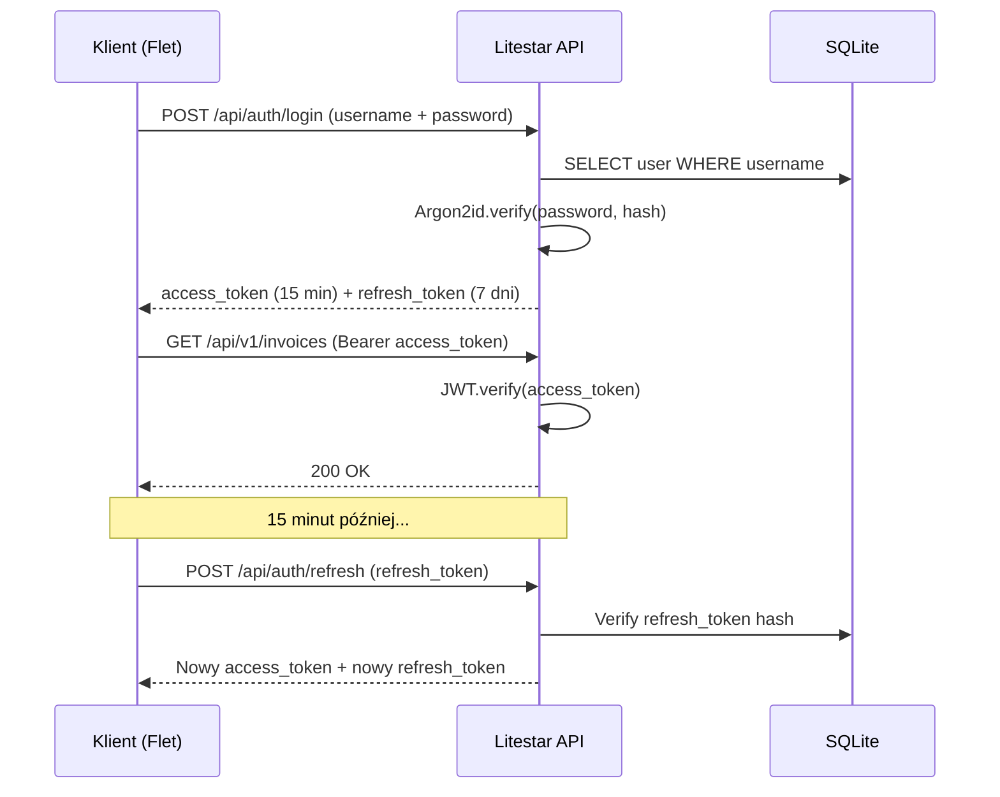

# 🔐 Bezpieczeństwo (Security)

> **Cel:** Udokumentowanie wszystkich mechanizmów bezpieczeństwa dla audytu i zgodności.  
> **Kiedy czytać:** Przed audytem bezpieczeństwa, przed zgłoszeniem podatności.

---

## 1. Model zagrożeń (Threat Model)

### 1.1 Założenia bezpieczeństwa

| Założenie | Opis |
|---|---|
| **Offline-first** | Wszystkie dane i modele AI są lokalne — nie ma chmurowego wektora ataku |
| **Single-tenant** | Jedna instancja = jeden użytkownik/firma |
| **Desktop** | Aplikacja działa na komputerze użytkownika, nie na serwerze |
| **Zaufany hardware** | Komputer użytkownika jest zaufany (ochrona antywirusowa) |

### 1.2 Wektory ataku

| Zagrożenie | Prawdop. | Wpływ | Mitigacja |
|---|---|---|---|
| Kradzież laptopa z danymi | Średnie | Wysoki | SQLCipher AES-256, szyfrowane backupy |
| Złośliwe oprogramowanie na hoście | Średnie | Wysoki | Podpisywanie kodu, AEAD dla backupów |
| Atak na API REST (lokalne) | Niskie | Średni | UNIX socket, JWT, CSRF, rate limiting |
| SQL injection | Niskie | Wysoki | SQLModel ORM (parametryzowane zapytania) |
| Timestamp attack na JWT | Niskie | Średni | Krótki TTL (15 min) + refresh tokeny |
| Model poisoning (AI) | Niskie | Wysoki | SHA-256 weryfikacja modeli GGUF |
| MITM na integracjach KSeF/GUS/NBP | Niskie | Średni | HTTPS + cert pinning |
| Atak brute-force na hasło | Niskie | Średni | Argon2id (odporny na GPU/ASIC) + rate limiting |

---

## 2. Szyfrowanie

### 2.1 Dane w spoczynku (Data at Rest)

| Warstwa | Algorytm | Klucz |
|---|---|---|
| **SQLite (SQLCipher)** | AES-256-CBC (każda strona osobno) | Klucz z Argon2id z hasła użytkownika |
| **Backupy** | AEAD ChaCha20-Poly1305 | Klucz z nexus-crypto Vault |
| **Sekrety (klucze API, tokeny)** | AEAD + mlock (brak swappowania) | Klucz w keyring systemowym |
| **Modele AI** | SHA-256 (weryfikacja integralności) | Weryfikacja przy pobieraniu przez `download_models.py` |

### 2.2 Dane w transmisji (Data in Transit)

| Połączenie | Protokół | Szyfrowanie |
|---|---|---|
| **Flet ↔ API** | UNIX socket / HTTP localhost | Brak (lokalna maszyna) |
| **API ↔ Worker** | NATS UNIX socket | NATS internal TLS |
| **Worker ↔ TigerBeetle** | gRPC UNIX socket | Brak (lokalna maszyna) |
| **API → KSeF/GUS/NBP** | HTTPS | TLS 1.3 |

### 2.3 Własny moduł kryptograficzny (nexus-crypto)

```
nexus_ai/rust/src/
├── aead.rs        # ChaCha20-Poly1305 (szyfrowanie + uwierzytelnianie)
├── argon2.rs      # Argon2id (hashowanie haseł, KDF)
├── sha256.rs      # SHA-256 (łańcuch audytowy)
└── vault.rs       # Bezpieczny magazyn kluczy z mlock
```

**Dlaczego własny moduł (nie PyNaCl/cryptography):**
- Minimalna powierzchnia ataku — tylko 3 algorytmy zamiast dziesiątek
- Natywna prędkość Rusta (nanosekundy)
- Pełna kontrola nad łańcuchem dostaw
- Statyczna kompilacja w binarkę Nuitki

---

## 3. Autentykacja

### 3.1 JWT (JSON Web Tokens)

| Parametr | Wartość |
|---|---|
| **Algorytm** | HS256 (HMAC-SHA256) |
| **TTL access token** | 15 minut |
| **TTL refresh token** | 7 dni |
| **Przechowywanie refresh** | SQLite, hash SHA-256 |
| **Unieważnianie** | `jwt_version` w tabeli `users` — inkrementacja unieważnia wszystkie tokeny |

### 3.2 Flow autentykacji



### 3.3 Token refresh i unieważnianie

```python
# Login
access_token = jwt.encode({"sub": user_id, "exp": now + 15min}, secret)
refresh_token = secrets.token_urlsafe(32)
db.insert(RefreshToken(user_id=user_id, token_hash=sha256(refresh_token), expires=now+7d))

# Refresh
if refresh_token.hash in db and not expired:
    new_access = jwt.encode({"sub": user_id, "exp": now + 15min}, secret)
    new_refresh = rotate(refresh_token)  # token rotation
    return new_access, new_refresh

# Revoke all sessions
db.execute("UPDATE users SET jwt_version = jwt_version + 1 WHERE id = ?", user_id)
```

---

## 4. RBAC (Role-Based Access Control)

### 4.1 Role systemowe

| Rola | Uprawnienia |
|---|---|
| **admin** | Pełny dostęp — zarządzanie użytkownikami, konfiguracja systemu |
| **owner** | Pełny dostęp do własnych danych firmy |
| **accountant** | Zarządzanie fakturami, raportami, eksport JPK/KSeF |
| **worker** | Podstawowe przetwarzanie dokumentów |
| **viewer** | Tylko odczyt |

### 4.2 Permissions (kontrola dostępu)

```python
# nexus_ai/api/rbac.py — Guard functions w Litestar
@get("/invoices/{invoice_id:str}", guards=[has_permission("invoice.read")])
async def get_invoice(invoice_id: str) -> InvoiceDTO: ...

@post("/invoices", guards=[has_permission("invoice.write")])
async def create_invoice(data: InvoiceCreateDTO) -> InvoiceDTO: ...

@post("/admin/users", guards=[has_permission("admin.users")])
async def create_user(data: UserCreateDTO) -> UserDTO: ...
```

### 4.3 Separacja obowiązków (SoD)

- **Owner** nie może być jednocześnie **accountant** (wymagane 2 osoby dla spółek)
- **Worker** nie może modyfikować stawek podatkowych
- Krytyczne operacje (zmiana planu kont, konfiguracja KSeF) wymagają roli **admin** lub **owner**

---

## 5. Audyt i niezmienność

### 5.1 Proof Chain SHA-256

Każda decyzja (księgowanie, wybór stawki VAT, dekretacja) jest hashowana:

```python
# nexus_ai/services/proof_chain.py
current_hash = SHA256(previous_hash + trace_id + transaction_id +
                       context_json + verdict_json + timestamp)
```

Efekt: Nieprzerwany łańcuch skrótów — modyfikacja jednego wpisu psuje wszystkie kolejne. Wykrywane przez `IntegrityVerifier`.

### 5.2 Audit Logs

```sql
-- Tabela audit_logs (append-only)
SELECT * FROM audit_logs WHERE invoice_id = 'inv-12345';
```

Każda zmiana jest logowana z: `user_id`, `action`, `field_changed`, `old_value`, `new_value`, `timestamp`.

### 5.3 Decision Traces (ścieżka decyzji)

Każda decyzja podatkowa zostawia pełny ślad:
- Która reguła została zastosowana (`rule_id`)
- Jaki był kontekst (`context_json`)
- Jaki był werdykt (`verdict_json`)
- Znacznik czasu (`timestamp`)

---

## 6. Bezpieczeństwo AI

### 6.1 Modele lokalne (offline-first)

- Wszystkie modele GGUF działają LOKALNIE — dane NIE są wysyłane do chmury
- Modele kwantyzowane: Q4_K_M (4-bit) i Q2_K (2-bit) dla minimalnego RAM
- Brak telemetrii AI — żadne dane nie opuszczają komputera

### 6.2 Weryfikacja integralności modeli

```bash
# Modele są weryfikowane przez SHA-256 przed załadowaniem
pixi run download-models   # Pobiera + weryfikuje checksum
pixi run check-models      # Sprawdza obecność i integralność
```

Plik konfiguracyjny (TOML) zawiera oczekiwane ścieżki i parametry dla każdego modelu.

### 6.3 Architektura "zero zaufania do pojedynczego modelu"

- **Orkiestrator** (Granite 3.2 3B) podejmuje decyzję
- **Strażnik Merytoryczny** (Granite Guardian 0.5B) weryfikuje KAŻDĄ decyzję
- **Walidator Jakości** sprawdza krytyczne decyzje
- Decyzja podatkowa NIGDY nie jest podejmowana przez AI — tylko przez deterministyczny silnik reguł (OPA/Rego)

---

## 7. OWASP Top 10

| # | Zagrożenie | Jak NexusAI chroni |
|---|---|---|
| **A01** | Broken Access Control | JWT + RBAC + Guard functions na każdym endpointzie |
| **A02** | Cryptographic Failures | nexus-crypto (Rust): AEAD + Argon2id + SHA-256. SQLCipher AES-256 |
| **A03** | Injection | SQLModel ORM (parametryzowane zapytania). Brak dynamicznego SQL. Walidacja msgspec |
| **A04** | Insecure Design | Threat model, ADRs, DDD z niezmiennikami, property-based testing |
| **A05** | Security Misconfiguration | `base.toml` → `prod.toml` override. `.env.example` z wszystkimi zmiennymi |
| **A06** | Vulnerable Components | Dependabot (auto-update), OpenSSF Scorecard, CodeQL SAST, SBOM |
| **A07** | Auth Failures | JWT z krótkim TTL (15 min), refresh token rotation, rate limiting na login |
| **A08** | Software/Data Integrity | SHA-256 dla modeli AI, Proof Chain dla decyzji, AEAD dla backupów |
| **A09** | Logging & Monitoring | structlog + loguru → Parquet/DuckDB. OpenTelemetry traces. Sentry crash reporting |
| **A10** | SSRF | API nasłuchuje tylko na localhost/UNIX socket. Tylko znane zewnętrzne API (wl_safelist) |

---

## 8. Zależności i łańcuch dostaw

| Narzędzie | Rola | Konfiguracja |
|---|---|---|
| **Dependabot** | Automatyczne aktualizacje zależności | `.github/dependabot.yml` |
| **OpenSSF Scorecard** | Audyt bezpieczeństwa repozytorium | `.github/workflows/scorecard.yml` |
| **CodeQL** | SAST — Static Application Security Testing | `.github/workflows/ci.yml` (CodeQL step) |
| **SBOM** | Software Bill of Materials | Generowany przy buildzie |
| **SLSA** | Supply-chain Levels for Software Artifacts | Poziom 3 |
| **OIDC** | OpenID Connect — uwierzytelnianie bez sekretów | GitHub Actions → cloud |

---

## 9. RODO / GDPR

### 9.1 Dane osobowe przetwarzane

| Dane | Kategoria | Podstawa |
|---|---|---|
| NIP kontrahenta | Dane identyfikacyjne | Obowiązek prawny (faktura VAT) |
| Imię i nazwisko kontrahenta | Dane osobowe | Obowiązek prawny |
| Adres kontrahenta | Dane osobowe | Obowiązek prawny |
| Numer rachunku bankowego | Dane finansowe | Obowiązek prawny (Biała Lista MF) |
| Adres e-mail | Dane kontaktowe | Zgoda użytkownika |

### 9.2 Środki techniczne

- **Szyfrowanie w spoczynku:** SQLCipher AES-256 — dane bezużyteczne bez klucza
- **Pseudonimizacja:** Logi nie zawierają pełnych NIP-ów (tylko 3 pierwsze cyfry w logach)
- **Minimalizacja:** API zewnętrzne (GUS, Biała Lista) odpytywane tylko dla niezbędnych pól
- **Retencja:** `invoices.retention_period_years = 5` (zgodnie z UoR)
- **Prawo do usunięcia:** `is_deleted` + `deletion_date` + fizyczne usunięcie z backupów

### 9.3 Anonimizacja i retencja

- **Automatyczne czyszczenie:** `RetentionService` usuwa faktury starsze niż `retention_period_years`
- **Bezpieczne usuwanie:** `SecurityService.secure_delete()` — nadpisywanie zerami przed usunięciem
- **Backup:** Szyfrowany AEAD, bez danych poza retention

---

## 10. Zarządzanie sekretami

### 10.1 Gdzie przechowywane są sekrety

| Sekret | Lokalizacja | Szyfrowanie |
|---|---|---|
| **JWT signing key** | Generowany przy pierwszym starcie, w keyring | System keyring (Windows/macOS/Linux) |
| **SQLCipher key** | Pochodna hasła użytkownika (Argon2id) | Nie przechowywany bezpośrednio |
| **KSeF token** | `company_profiles.ksef_token` | SQLCipher (w szyfrowanej DB) |
| **NBP API key** | Niepotrzebny (public API) | — |
| **Klucz backupu** | W Vault (nexus-crypto, mlock) | AEAD + mlock |

### 10.2 Rotacja kluczy

- **JWT key:** `jwt_version` w tabeli `users` — inkrementacja unieważnia wszystkie sesje
- **SQLCipher key:** Zmiana hasła użytkownika → rekey bazy danych
- **Klucz backupu:** Ręczna rotacja przez `scripts/rotate_keys.py`

---

## 11. Zgłaszanie podatności

1. **NIE zgłaszaj publicznie** (GitHub Issues)
2. Wyślij zaszyfrowany e-mail na: `security@nexus-ai.pl` (klucz PGP dostępny na stronie)
3. Czas odpowiedzi: **48 godzin**
4. Polityka odpowiedzialnego ujawnienia: 90 dni na naprawę przed publikacją

---

## 12. Konfiguracja produkcyjna — security checklist

- [ ] Hasło użytkownika: minimum 12 znaków, min. 1 cyfra, min. 1 znak specjalny
- [ ] SQLCipher: klucz pochodny z silnego hasła (Argon2id, memory=64MB, iterations=3, parallelism=4)
- [ ] JWT TTL: 15 minut (nie dłużej)
- [ ] Rate limiting: włączony na login (max 5 prób/min)
- [ ] CSRF: włączony
- [ ] Backupy: szyfrowane AEAD, weryfikowane SHA-256
- [ ] Logi: strukturalne (structlog), bez danych wrażliwych
- [ ] Modele AI: SHA-256 zweryfikowane przed załadowaniem
- [ ] API: tylko UNIX socket lub localhost (nie `0.0.0.0`)
- [ ] Zależności: Dependabot + CodeQL + Scorecard aktywne

---

## 🔗 Zobacz również

- [Zgodność z przepisami](COMPLIANCE.md) — RODO, retencja, KSeF
- [Architektura](ARCHITECTURE.md) — ADR-007 (nexus-crypto), ADR-005 (free-threaded)
- [Baza danych](DATABASE.md) — SQLCipher AES-256, backup szyfrowany
- [Wdrożenie](DEPLOYMENT.md) — security checklist produkcyjna

---

> **Data aktualizacji:** 2026-07-04 · **Autor:** NexusAI Team · **Wersja:** 2.3.0
> **Status dokumentu:** Stabilny · **Ostatnia weryfikacja:** 2026-07-04 · **Weryfikator:** NexusAI Team
