# NexusAI — Pełna lista technologii

> **Data:** 2026-06-04
> **Opis:** Kompletny spis wszystkich technologii, bibliotek, narzędzi i serwisów zewnętrznych używanych w projekcie NexusAI wraz z lokalizacją w strukturze projektu i opisem funkcji.

---

## ▶️ Szybki start z uv

```bash
# Instalacja uv (jeśli nie jest zainstalowane)
curl -LsSf https://astral.sh/uv/install.sh | sh

# Instalacja wszystkich zależności
uv sync

# Uruchomienie API
uv run nexus-api

# Uruchomienie workera
uv run nexus-worker

# Uruchomienie desktop UI
uv run nexus-desktop

# Dodanie nowej zależności
uv add requests

# Uruchomienie testów
uv run pytest tests/
```

---

---

## Spis treści

1. [Diagram zależności (Mermaid)](#-diagram-zależności-mermaid)
2. [Język i Środowisko](#1-język-i-środowisko)
3. [API / Serwer ASGI](#2-api--serwer-asgi)
4. [Bazy Danych i Przechowywanie](#3-bazy-danych-i-przechowywanie)
5. [Walidacja Danych i Serializacja](#4-walidacja-danych-i-serializacja)
6. [Kolejki Zadań i Komunikacja](#5-kolejki-zadań-i-komunikacja)
7. [HTTP / Sieć](#6-http--sieć)
8. [Odporność na Błędy (Resilience)](#7-odporność-na-błędy-resilience)
9. [Kryptografia i Bezpieczeństwo](#8-kryptografia-i-bezpieczeństwo)
10. [Finanse / Waluty](#9-finanse--waluty)
11. [Przetwarzanie Dokumentów (XML/OCR)](#10-przetwarzanie-dokumentów-xmlocr)
12. [Logowanie](#11-logowanie)
13. [Metryki i Monitoring](#12-metryki-i-monitoring)
14. [Cache](#13-cache)
15. [Narzędzia (Utilities)](#14-narzędzia-utilities)
16. [Testowanie](#15-testowanie)
17. [Interfejs Desktopowy](#16-interfejs-desktopowy)
18. [AI / Machine Learning](#17-ai--machine-learning)
19. [Infrastruktura / DevOps](#18-infrastruktura--devops)
20. [Główne Serwisy Zewnętrzne (API)](#19-główne-serwisy-zewnętrzne-api)
21. [Agenty AI (Council of LLMs)](#20-agenty-ai-council-of-llms)
22. [Silnik Reguł Podatkowych (Tax Engine)](#21-silnik-reguł-podatkowych-tax-engine)
23. [System Księgowy (Roboton_Reflekton)](#22-system-księgowy-roboton_reflekton)
24. [Inne Narzędzia i Skrypty](#23-inne-narzędzia-i-skrypty)
25. [Formatowanie i Jakość Kodu](#24-formatowanie-i-jakość-kodu)
26. [Pliki Konfiguracyjne i Build](#25-pliki-konfiguracyjne-i-build)

---

## 🗺 Diagram zależności (Mermaid)

```mermaid
flowchart TB
    %% =========================================================================
    %% STYLING
    %% =========================================================================
    classDef infra fill:#1a1a2e,stroke:#e94560,stroke-width:2px,color:#fff
    classDef runtime fill:#16213e,stroke:#0f3460,stroke-width:2px,color:#fff
    classDef api fill:#0f3460,stroke:#533483,stroke-width:2px,color:#fff
    classDef db fill:#1b4332,stroke:#2d6a4f,stroke-width:2px,color:#fff
    classDef msg fill:#3d1e6d,stroke:#7b2d8e,stroke-width:2px,color:#fff
    classDef ml fill:#4a1942,stroke:#893168,stroke-width:2px,color:#fff
    classDef pipeline fill:#1a3c34,stroke:#2d7a6e,stroke-width:2px,color:#fff
    classDef biz fill:#2c1810,stroke:#8b4513,stroke-width:2px,color:#fff
    classDef ui fill:#2d1b2e,stroke:#9b59b6,stroke-width:2px,color:#fff
    classDef ext fill:#1a1a2e,stroke:#4a90d9,stroke-width:2px,color:#fff
    classDef mon fill:#2d1b00,stroke:#cc7a00,stroke-width:2px,color:#fff
    classDef test fill:#1a2e1a,stroke:#2ecc71,stroke-width:2px,color:#fff
    classDef build fill:#2e1a1a,stroke:#e74c3c,stroke-width:2px,color:#fff
    classDef dev fill:#1e2a3e,stroke:#5b7db5,stroke-width:2px,color:#fff

    %% =========================================================================
    %% WARSTWA 0: INFRASTRUKTURA / DEVOPS
    %% =========================================================================
    subgraph infra_layer ["☁️ INFRASTRUKTURA / DEVOPS"]
        Docker["Docker<br/>(Python 3.11-slim + Tesseract)"]
        DC["Docker Compose"]
        NATS_Server["NATS Server<br/>(nats:2.10-alpine)"]
        TB_Server["TigerBeetle Server"]
        Prometheus["Prometheus<br/>+ Alert Rules"]
    end

    %% =========================================================================
    %% WARSTWA 1: RUNTIME
    %% =========================================================================
    subgraph runtime_layer ["🐍 RUNTIME"]
        Python["Python ≥3.11"]
        setuptools["setuptools ≥68.0"]
        msgspec["msgspec<br/>(Binary Serialization)"]
        anyio["anyio<br/>(Async I/O)"]
    end

    %% =========================================================================
    %% WARSTWA 2: API
    %% =========================================================================
    subgraph api_layer ["🌐 API / ASGI"]
        Litestar["Litestar ≥2.8.0<br/>Routing · Middleware · DI · OpenAPI"]
        Uvicorn["Uvicorn ≥0.30.0<br/>ASGI Server"]
        JWT["JWT Auth<br/>(Litestar JWT)"]
        CORS["CORS Middleware"]
        RateLimit["Rate Limiting"]
        CSRF["CSRF Protection"]
    end

    %% =========================================================================
    %% WARSTWA 3: DANE / PRZECHOWYWANIE
    %% =========================================================================
    subgraph data_layer ["💾 BAZY DANYCH"]
        SQLAlchemy["SQLAlchemy ≥2.0<br/>ORM · Modele"]
        aiosqlite["aiosqlite<br/>Async SQLite Driver"]
        SQLite["SQLite (OLTP)<br/>Faktury · Użytkownicy · Outbox"]
        DuckDB["DuckDB ≥1.0<br/>(OLAP)"]
        PyArrow["PyArrow ≥15.0<br/>Columnar Format"]
        LanceDB["LanceDB ≥0.8<br/>Vector DB"]
        TigerBeetle["TigerBeetle<br/>Double-Entry Ledger"]
        SQLCipher["SQLCipher<br/>(via cryptography)<br/>Szyfrowanie DB"]
        Alembic["Alembic ≥1.13<br/>Migracje schematu"]
    end

    %% =========================================================================
    %% WARSTWA 4: KOLEJKI / WIADOMOŚCI
    %% =========================================================================
    subgraph messaging_layer ["✉️ KOLEJKI ZADAŃ"]
        NATS["nats-py ≥2.6<br/>Message Broker"]
        JetStream["NATS JetStream<br/>Durable Streaming"]
        Taskiq["Taskiq ≥0.11<br/>Async Task Queue"]
        taskiq_nats["taskiq-nats ≥0.5<br/>Taskiq Broker for NATS"]
    end

    %% =========================================================================
    %% WARSTWA 5: AI / ML
    %% =========================================================================
    subgraph ai_layer ["🧠 AI / AGENT COUNCIL"]
        llama_cpp["llama-cpp-python<br/>GGUF Inference"]
        Transformers["Transformers<br/>(HuggingFace)"]
        sentence_tf["sentence-transformers<br/>Embeddings"]
        HF_Hub["huggingface-hub<br/>Model Download"]

        subgraph models ["Modele GGUF"]
            Alpha["Alpha Agent<br/>LFM 1.2B"]
            Beta["Beta Agent<br/>Qwen3 0.6B"]
            Gamma["Gamma Agent<br/>LittleLamb 0.3B"]
            Rules["Rules Agent<br/>Granite 1B"]
            Analytics["Analytics Agent<br/>Qwen2.5 1.5B"]
            Decision["Decision Agent<br/>Jamba 3B"]
            Orchestrator["Orchestrator<br/>LittleLamb 0.3B"]
        end
    end

    %% =========================================================================
    %% WARSTWA 6: PIPELINE OCR
    %% =========================================================================
    subgraph ocr_layer ["📄 PIPELINE OCR"]
        Tesseract["Tesseract OCR<br/>(system)"]
        Pillow["Pillow ≥10.0<br/>Image Processing"]
        PyMuPDF["PyMuPDF<br/>PDF Processing"]
        OpenCV["OpenCV<br/>Computer Vision"]
        Surya["Surya OCR<br/>Layout Detection"]
        Paddle["PaddleOCR<br/>Deep Learning OCR"]
        ONNX["ONNX Runtime<br/>ML Inference"]
    end

    %% =========================================================================
    %% WARSTWA 7: BIZNES / KSIĘGOWOŚĆ
    %% =========================================================================
    subgraph business_layer ["📊 SYSTEM KSIĘGOWY"]
        subgraph tax ["Tax Engine"]
            RuleEngine["RuleEngine<br/>(Zen-Engine / DuckDB)"]
            TaxMath["TaxMathEngine<br/>(int · grosze)"]
            TaxPipeline["TaxPipeline<br/>Orkiestracja"]
            TraceGen["TraceGenerator<br/>Ścieżka decyzyjna"]
            ProofChain["Proof Chain<br/>(SHA-256 Audit)"]
            IntegrityVerifier["Integrity Verifier<br/>Weryfikacja łańcucha"]
        end

        subgraph roboton ["Roboton_Reflekton"]
            LedgerClient["LedgerClient<br/>TigerBeetle"]
            ShadowLedger["ShadowLedger<br/>Symulacje"]
            Reconciliation["ReconciliationEngine"]
            Forex["ForexEngine"]
            Dunning["DunningEngine"]
            Budget["BudgetaryControl"]
            VATRec["VATReconciliation"]
        end

        subgraph services ["Serwisy Biznesowe"]
            GUS["GUS BIR Client<br/>(SOAP)"]
            WhiteList["Biała Lista MF<br/>(API)"]
            NBP["NBP API<br/>Kursy walut"]
            KSeF["KSeF Client<br/>(XML + Podpis)"]
            Currency["CurrencyConverter<br/>(py-moneyed)"]
            RiskGuard["RiskGuard<br/>Wykrywanie anomalii"]
            Autopilot["Autopilot<br/>Automatyczne księgowanie"]
        end

        subgraph core_services ["Serwisy Core"]
            Tenacity["Tenacity ≥9.0<br/>Retry Logic"]
            PyBreaker["PyBreaker ≥1.4<br/>Circuit Breaker"]
            cryptography["cryptography ≥42.0<br/>Fernet · PBKDF2"]
            cachetools["cachetools ≥7.0<br/>In-Memory Cache"]
            Loguru["Loguru ≥0.7<br/>Logging"]
            OTel["OpenTelemetry<br/>Distributed Tracing"]
            psutil["psutil ≥5.9<br/>System Monitor"]
            dateparser["dateparser ≥1.2<br/>Parsowanie dat"]
            fsspec["fsspec ≥2024.3<br/>Filesystem Abstraction"]
        end
    end

    %% =========================================================================
    %% WARSTWA 8: UI
    %% =========================================================================
    subgraph ui_layer ["🖥️ INTERFEJS"]
        Flet["Flet ≥0.28<br/>Desktop UI (Python → Flutter)"]
        FletRouter["Flet Router<br/>Nawigacja"]
    end

    %% =========================================================================
    %% WARSTWA 9: TESTY
    %% =========================================================================
    subgraph test_layer ["🧪 TESTY"]
        pytest["pytest ≥8.0"]
        pytest_async["pytest-asyncio"]
        Hypothesis["Hypothesis<br/>Property-Based"]
        k6["k6<br/>Performance Tests"]
    end

    %% =========================================================================
    %% WARSTWA 10: MONITORING
    %% =========================================================================
    subgraph monitoring_layer ["📈 MONITORING"]
        PromClient["Prometheus Client<br/>Metryki API"]
        Sentry["Sentry<br/>Error Tracking"]
        Healtchecks["Health Checks<br/>(/api/v2/health)"]
    end

    %% =========================================================================
    %% WARSTWA 11: BUILD / DEPLOY
    %% =========================================================================
    subgraph build_layer ["🔧 BUILD"]
        NexusCLI["Nexus CLI<br/>nexus-api · nexus-worker<br/>nexus-desktop · nexus"]
        main_py["main.py<br/>Central Entrypoint"]
        InnoSetup["Inno Setup<br/>Windows Installer"]
        NSIS["NSIS<br/>Windows Installer"]
        Ruff["Ruff<br/>Linter + Formatter"]
        Mypy["Mypy<br/>Type Checker"]
        precommit["pre-commit<br/>Git Hooks"]
    end

    %% =========================================================================
    %% WARSTWA 12: ZEWNĘTRZNE
    %% =========================================================================
    subgraph external_layer ["🔌 ZEWNĘTRZNE API / SERWISY"]
        GUS_BIR["GUS BIR<br/>(REGON · NIP)"]
        Biala_Lista["Biała Lista MF<br/>(Rachunki VAT)"]
        NBP_API["NBP API<br/>(Kursy walut)"]
        KSeF_API["KSeF<br/>(System e-Faktur)"]
        HF_API["HuggingFace Hub<br/>(Modele AI)"]
    end

    %% ======================================================================
    %% POŁĄCZENIA
    %% ======================================================================

    %% INFRA → RUNTIME
    Docker --> Python
    Docker --> Tesseract
    DC --> Docker
    DC --> NATS_Server
    DC --> TB_Server

    %% RUNTIME → API
    Python --> Litestar
    Python --> Uvicorn
    anyio --> Litestar
    msgspec --> Taskiq

    %% API → COMPONENTS
    Litestar --> JWT
    Litestar --> CORS
    Litestar --> RateLimit
    Litestar --> CSRF
    Uvicorn --> Litestar

    %% API → DATA
    Litestar --> SQLAlchemy
    Litestar --> DuckDB
    SQLAlchemy --> aiosqlite
    aiosqlite --> SQLite
    SQLAlchemy --> Alembic
    SQLite --> SQLCipher
    DuckDB --> PyArrow
    DuckDB --> LanceDB

    %% API → MESSAGING
    Litestar --> NATS
    NATS --> JetStream
    Taskiq --> taskiq_nats
    taskiq_nats --> NATS

    %% BUSINESS → DATA
    RuleEngine --> DuckDB
    RuleEngine --> TaxPipeline
    TaxPipeline --> TaxMath
    TaxPipeline --> TraceGen
    TaxPipeline --> ProofChain
    ProofChain --> IntegrityVerifier
    LedgerClient --> TigerBeetle
    ShadowLedger --> TigerBeetle

    %% BUSINESS → EXTERNAL
    GUS --> GUS_BIR
    WhiteList --> Biala_Lista
    NBP --> NBP_API
    KSeF --> KSeF_API
    Currency --> NBP_API
    Currency --> py_moneyed["py-moneyed ≥3.0<br/>(Fowler's Money)"]

    %% RESILIENCE
    Tenacity --> GUS
    Tenacity --> NBP
    PyBreaker --> NATS
    PyBreaker --> TigerBeetle

    %% MESSAGING → AI/PIPELINE
    Taskiq --> llama_cpp
    Taskiq --> Tesseract
    NATS --> JetStream

    %% AI LAYER
    llama_cpp --> Alpha
    llama_cpp --> Beta
    llama_cpp --> Gamma
    llama_cpp --> Rules
    llama_cpp --> Analytics
    llama_cpp --> Decision
    llama_cpp --> Orchestrator
    HF_Hub --> Alpha
    HF_Hub --> Beta
    HF_Hub --> Gamma
    HF_Hub --> Rules
    HF_Hub --> Analytics
    HF_Hub --> Decision
    HF_API --> HF_Hub
    Transformers --> sentence_tf

    %% OCR PIPELINE
    Pillow --> Tesseract
    PyMuPDF --> Tesseract
    OpenCV --> Tesseract
    Surya --> Tesseract
    Paddle --> Tesseract
    ONNX --> Paddle
    ONNX --> Surya

    %% AI → BUSINESS
    Alpha --> Autopilot
    Beta --> Autopilot
    Gamma --> Autopilot
    Rules --> RuleEngine
    Analytics --> RiskGuard
    Orchestrator --> Autopilot
    Autopilot --> LedgerClient

    %% UI → API
    Flet --> Litestar
    FletRouter --> Flet

    %% MONITORING
    PromClient --> Prometheus
    Litestar --> PromClient
    Litestar --> Sentry
    Litestar --> Healtchecks
    OTel --> Litestar

    %% CORE SERVICES
    cryptography --> SQLCipher
    cachetools --> Litestar
    Loguru --> Litestar
    psutil --> PromClient
    dateparser --> GUS
    fsspec --> Tesseract

    %% TESTING
    pytest --> Hypothesis
    pytest --> pytest_async
    k6 --> Litestar

    %% BUILD
    main_py --> Litestar
    main_py --> Taskiq
    main_py --> Flet
    NexusCLI --> main_py
    Ruff --> Python
    Mypy --> Python
    precommit --> Ruff
    precommit --> Mypy
    InnoSetup --> NexusCLI
    NSIS --> NexusCLI

    %% EXTERNAL
    GUS_BIR -.->|"SOAP XML"| GUS
    Biala_Lista -.->|"REST API"| WhiteList
    NBP_API -.->|"REST API"| NBP
    KSeF_API -.->|"XML + Podpis"| KSeF
    HF_API -.->|"HTTPS"| HF_Hub
```



---

## 1. Język i Środowisko

| Technologia | Wersja | Lokalizacja | Opis |
|---|---|---|---|
| **Python** | ≥3.11 | `pyproject.toml` — `requires-python` | Język programowania całego projektu |
| **uv (Astral)** | ≥0.5 | `pyproject.toml` — `[tool.uv]`, `Dockerfile` | **Ultra-szybki menedżer pakietów** (Rust) — zastępuje pip/venv/pipx. ~10-100x szybszy od pip, jeden statyczny binary (~20MB), inteligentny cache. |
| **setuptools** | ≥68.0 | `pyproject.toml` — `build-system.requires` | System budowania pakietu (współpracuje z uv) |

---

## 2. API / Serwer ASGI

| Technologia | Plik wymagań | Lokalizacja w projekcie | Funkcja |
|---|---|---|---|
| **Litestar** | `requirements.txt`, `pyproject.toml` | `Code/API/app.py`, `Code/API/routes/*.py` | Framework ASGI — główny serwer API. Obsługuje routing, middleware, DI, OpenAPI/Swagger |
| **Uvicorn** | `requirements.txt`, `pyproject.toml` | `Code/API/server.py` | Serwer ASGI — uruchamia Litestar na HTTP |

---

## 3. Bazy Danych i Przechowywanie

| Technologia | Plik wymagań | Lokalizacja w projekcie | Funkcja |
|---|---|---|---|
| **SQLAlchemy** | `requirements.txt`, `pyproject.toml` | `Code/DB/database.py`, `Code/DB/models.py` | ORM — warstwa dostępu do bazy SQLite (OLTP). Modele dla faktur, użytkowników, outboxa |
| **aiosqlite** | `requirements.txt`, `pyproject.toml` | `Code/DB/database.py` | Async driver SQLite — asynchroniczne połączenia z SQLite dla SQLAlchemy |
| **DuckDB** | `requirements.txt`, `pyproject.toml` | `Code/DB/analytics.py`, `Code/tax/rules.py`, `Code/services/rule_store.py` | OLAP database — analityka, reguły podatkowe (Zen-Engine), widoki materializowane |
| **Polars** | `requirements.txt`, `pyproject.toml` | `Code/DB/vector_store.py`, `Code/core/analytics.py`, `Code/DB/replication.py` | **Ultra-szybka biblioteka DataFrame (Rust)** — zastępuje pandas i bezpośrednie użycie PyArrow. 3-15x szybsza, Lazy API, kolumnowa, mniej RAMu. |
| **PyArrow** | `requirements.txt`, `pyproject.toml` | (zależność DuckDB/LanceDB) | Kolumnowy format danych — używany przez DuckDB i LanceDB wewnętrznie (nie bezpośrednio w kodzie) |
| **LanceDB** | `requirements.txt`, `pyproject.toml` | `Code/DB/vector_store.py` | Vector database — przechowywanie embeddingów i wektorowe wyszukiwanie podobieństw |
| **SQLCipher** | (via `cryptography`) | `Code/CORE/crypto.py`, env `NEXUS_SQLCIPHER_KEY` | Szyfrowanie bazy SQLite — transparentne szyfrowanie pliku `.db` na dysku |
| **Alembic** | `requirements.txt`, `pyproject.toml` | `migrations/versions/0001_initial_schema.py`, `alembic.ini` | Migracje schematu bazy danych — zarządzanie wersjami schematu SQLAlchemy |

---

## 4. Walidacja Danych i Serializacja

| Technologia | Plik wymagań | Lokalizacja w projekcie | Funkcja |
|---|---|---|---|
| **Pydantic** | `requirements.txt`, `pyproject.toml` | `Code/API/schemas.py`, `Code/CORE/config.py` | Walidacja danych — modele request/response API, konfiguracja z env vars |
| **pydantic-settings** | `requirements.txt`, `pyproject.toml` | `Code/CORE/config.py` | Ładowanie konfiguracji z `.env` do klas Pydantic |
| **msgspec** | `requirements.txt`, `pyproject.toml` | `Code/CORE/tasks.py`, testy `test_msgspec_task_response_flow.py` | Szybka serializacja binarna — wydajniejsza alternatywa dla JSON w task queue |

---

## 5. Kolejki Zadań i Komunikacja

| Technologia | Plik wymagań | Lokalizacja w projekcie | Funkcja |
|---|---|---|---|
| **NATS (nats-py)** | `requirements.txt`, `pyproject.toml` | `Code/CORE/broker.py`, `docker-compose.yml` | Message broker — komunikacja między serwisami, event-driven architecture |
| **NATS JetStream** | (wbudowane w NATS) | `docker-compose.yml` — `nats -js` | Durable message streaming — trwałe przechowywanie wiadomości, outbox pattern |
| **Taskiq** | `requirements.txt`, `pyproject.toml` | `Code/CORE/tasks.py`, `Code/luz/worker.py` | Async task queue — kolejka zadań w tle (OCR, AI) z schedulerem |
| **taskiq-nats** | `requirements.txt`, `pyproject.toml` | `Code/CORE/broker.py` | Broker Taskiq dla NATS — łączy Taskiq z NATS JetStream |

---

## 6. HTTP / Sieć

| Technologia | Plik wymagań | Lokalizacja w projekcie | Funkcja |
|---|---|---|---|
| **httpx** | `requirements.txt`, `pyproject.toml` | `Code/SERVICES/gus_bir_client.py`, `Code/SERVICES/currency_converter.py` | Async HTTP client — zapytania do zewnętrznych API (GUS BIR, NBP, Biała Lista MF) |
| **anyio** | `requirements.txt`, `pyproject.toml` | (zależność pośrednia) | Async I/O backend — używany przez Litestar i httpx |

---

## 7. Odporność na Błędy (Resilience)

| Technologia | Plik wymagań | Lokalizacja w projekcie | Funkcja |
|---|---|---|---|
| **Tenacity** | `requirements.txt`, `pyproject.toml` | `Code/CORE/resilience.py` | Retry logic — automatyczne ponawianie operacji przy błędach sieciowych/bazodanowych |
| **PyBreaker** | `requirements.txt`, `pyproject.toml` | `Code/CORE/circuit_breaker.py` | Circuit Breaker — wyłącznik awaryjny dla NATS i zewnętrznych API |

---

## 8. Kryptografia i Bezpieczeństwo

| Technologia | Plik wymagań | Lokalizacja w projekcie | Funkcja |
|---|---|---|---|
| **cryptography** | `requirements.txt`, `pyproject.toml` | `Code/CORE/crypto.py`, `Code/CORE/secrets.py` | Szyfrowanie — Fernet (AES-128-CBC + HMAC), PBKDF2, haszowanie haseł |
| **JWT (Litestar JWT)** | (via `litestar[jwt]`) | `Code/API/auth.py`, `Code/API/security.py` | Tokeny JWT — autoryzacja API, refresh tokeny |
| **CSRF** | (wbudowane w Litestar) | `Code/API/middleware.py`, env `NEXUS_CSRF_ENABLED` | Ochrona CSRF — zapobiega atakom cross-site request forgery |
| **Rate Limiting** | (wbudowane w Litestar) | `Code/API/rate_limit.py` | Limitowanie żądań — ochrona przed DoS i nadużyciami API |
| **CORS** | (wbudowane w Litestar) | `Code/API/middleware.py`, env `NEXUS_CORS_ORIGINS` | Cross-Origin Resource Sharing — kontrola dostępu z różnych domen |

---

## 9. Finanse / Waluty

| Technologia | Plik wymagań | Lokalizacja w projekcie | Funkcja |
|---|---|---|---|
| **py-moneyed** | `requirements.txt`, `pyproject.toml` | `Code/SERVICES/currency_converter.py` | Fowler's Money pattern — reprezentacja kwot z walutą, zaokrąglanie HALF_UP |
| **TigerBeetle** | (osobny serwer) | `Code/Roboton_Reflekton/ledger_client.py`, `docker-compose.yml`, `docker/tigerbeetle.Dockerfile` | Ledger double-entry — dwustronne księgowanie z two-phase commit |

---

## 10. Przetwarzanie Dokumentów (XML/OCR)

| Technologia | Plik wymagań | Lokalizacja w projekcie | Funkcja |
|---|---|---|---|
| **lxml** | `requirements.txt`, `pyproject.toml` | `Code/CORE/integrations/ksef/*.py` | XML parser — przetwarzanie dokumentów KSeF (Krajowy System e-Faktur) |
| **xsdata** | `requirements.txt`, `pyproject.toml` | `Code/CORE/integrations/ksef/crypto.py` | XML data binding — generowanie klas Python z schematów XSD dla KSeF |
| **Pillow (PIL)** | `requirements.txt`, `pyproject.toml` | `Code/PIPELINE/preprocessor.py` | Image processing — przetwarzanie obrazów dokumentów (deskew, binaryzacja) |
| **Tesseract OCR** | (systemowy pakiet) | `Code/PIPELINE/ocr_engine.py`, `Dockerfile` | OCR engine — ekstrakcja tekstu ze skanów faktur (z polskim językiem) |
| **PyMuPDF (fitz)** | (opcjonalne AI) `pyproject.toml` | (w `[ai]` extras) | PDF processing — ekstrakcja tekstu i obrazów z plików PDF |
| **OpenCV** | (opcjonalne AI) `pyproject.toml` | (w `[ai]` extras) | Computer vision — zaawansowane przetwarzanie obrazów dokumentów |
| **PaddleOCR** | (opcjonalne AI) `pyproject.toml` | (w `[ai]` extras) | OCR deep learning — alternatywny silnik OCR oparty na deep learning |
| **Surya OCR** | (opcjonalne AI) `pyproject.toml` | (w `[ai]` extras) | OCR deep learning — detekcja layoutu i OCR dokumentów |
| **ONNX Runtime** | (opcjonalne AI) `pyproject.toml` | (w `[ai]` extras) | ML inference engine — uruchamianie modeli ONNX dla OCR i analizy |

---

## 11. Logowanie

| Technologia | Plik wymagań | Lokalizacja w projekcie | Funkcja |
|---|---|---|---|
| **Loguru** | `requirements.txt`, `pyproject.toml` | `Code/CORE/logger.py` | Logging — zaawansowane logowanie z formatowaniem, rotacją plików, kolorami |
| **OpenTelemetry** | (wbudowane w kod) | `Code/CORE/tracing.py`, testy `test_otel_*.py` | Distributed tracing — śledzenie żądań przez system, buffer/replay |

---

## 12. Metryki i Monitoring

| Technologia | Plik wymagań | Lokalizacja w projekcie | Funkcja |
|---|---|---|---|
| **Prometheus Client** | `requirements.txt`, `pyproject.toml` | `Code/API/telemetry_metrics.py`, `deploy/prometheus/alert_rules.yml` | Metryki — eksport metryk do Prometheus (czas odpowiedzi, liczba żądań, błędy) |
| **Sentry** | (opcjonalne) env `NEXUS_SENTRY_DSN` | `config/prod.env` | Error tracking — zbieranie wyjątków i błędów w produkcji |

---

## 13. Cache

| Technologia | Plik wymagań | Lokalizacja w projekcie | Funkcja |
|---|---|---|---|
| **cachetools** | `requirements.txt`, `pyproject.toml` | `Code/CORE/memory_manager.py`, `Code/API/cache.py` | In-memory caching — cache dla modeli AI, kursów walut, wyników API |

---

## 14. Narzędzia (Utilities)

| Technologia | Plik wymagań | Lokalizacja w projekcie | Funkcja |
|---|---|---|---|
| **psutil** | `requirements.txt`, `pyproject.toml` | `Code/CORE/hardware.py`, `Code/CORE/monitor.py` | System resources — monitorowanie CPU, RAM, dysku |
| **PyYAML** | `requirements.txt`, `pyproject.toml` | `Code/CORE/config.py` | YAML parser — konfiguracja w formatach YAML |
| **dateparser** | `requirements.txt`, `pyproject.toml` | `Code/SERVICES/gus_bir_client.py` | Parsowanie dat — obsługa różnych formatów dat z faktur |
| **fsspec** | `requirements.txt`, `pyproject.toml` | (system plików) | Filesystem abstraction — jednolity interfejs dla lokalnych i zdalnych systemów plików |

---

## 15. Testowanie

| Technologia | Plik wymagań | Lokalizacja w projekcie | Funkcja |
|---|---|---|---|
| **pytest** | `requirements.txt`, `pyproject.toml` | `tests/*.py`, `pyproject.toml` `[tool.pytest.ini_options]` | Framework testowy — uruchamianie i organizacja testów |
| **pytest-asyncio** | `requirements.txt`, `pyproject.toml` | `pyproject.toml` — `asyncio_mode = "auto"` | Async test support — testowanie funkcji asynchronicznych |
| **pytest-cov** | (opcjonalne dev) `pyproject.toml` | (w `[dev]` extras) | Code coverage — pomiar pokrycia kodu testami |
| **Hypothesis** | (opcjonalne dev) `pyproject.toml` | `tests/test_property_based.py`, `tests/test_simulation_property_based.py` | Property-based testing — generowanie przypadków testowych z właściwości |
| **k6** | (osobne narzędzie) | `tests/performance/k6_invoice_upload.js` | Performance testing — testy wydajnościowe API (Load Impact) |

---

## 16. Interfejs Desktopowy

| Technologia | Plik wymagań | Lokalizacja w projekcie | Funkcja |
|---|---|---|---|
| **Flet** | `requirements.txt` (opcjonalne `[ui]`) | `Code/FRONTEND/main.py`, `Code/luz/main.py`, `Code/FRONTEND/ui/*.py` | Desktop UI framework — aplikacja desktopowa (Python → Flutter) |
| **Flet Router** | (wbudowane w Flet) | `Code/FRONTEND/router.py` | Routing UI — nawigacja między widokami aplikacji desktopowej |

---

## 17. AI / Machine Learning

| Technologia | Plik wymagań | Lokalizacja w projekcie | Funkcja |
|---|---|---|---|
| **llama-cpp-python** | (opcjonalne AI) `pyproject.toml` | `Code/CORE/llm_guard.py`, `Code/CORE/llm_extractor.py` | LLM inference CPU/GPU — uruchamianie modeli GGUF lokalnie |
| **Transformers (HuggingFace)** | (opcjonalne AI) `pyproject.toml` | (w `[ai]` extras) | NLP pipeline — tokenizacja, embedding, inference modeli HuggingFace |
| **sentence-transformers** | (opcjonalne AI) `pyproject.toml` | (w `[ai]` extras) | Embedding — generowanie embeddingów zdań do wyszukiwania semantycznego |
| **huggingface-hub** | (opcjonalne AI) `pyproject.toml` | `Code/SKRIPTS/download_models.py`, `config/models_manifest.json` | Model hub — pobieranie modeli GGUF z weryfikacją SHA-256 |
| **Torch (PyTorch)** | (opcjonalne AI) `pyproject.toml` | (w `[ai]` extras) | Deep learning framework — używany przez Transformers i inne modele |

### Modele GGUF

| Model | Rozmiar | Agent | Funkcja |
|---|---|---|---|
| LFM 1.2B | ~800 MB | Alpha Agent | Klasyfikacja faktur |
| Qwen3 0.6B | ~450 MB | Beta Agent | Walidacja wtórna |
| LittleLamb 0.3B | ~200 MB | Gamma / Orchestrator | Tiebreaker + koordynacja |
| Granite 1B | ~680 MB | Rules Agent | Reguły biznesowe |
| Qwen2.5 1.5B | ~1 GB | Analytics Agent | Detekcja anomalii |
| Jamba 3B | ~1.8 GB | Decision Agent | Złożone decyzje |

---

## 18. Infrastruktura / DevOps

| Technologia | Lokalizacja | Funkcja |
|---|---|---|
| **Docker** | `Dockerfile` | Konteneryzacja — build obrazu z Python 3.11-slim + Tesseract OCR |
| **Docker Compose** | `docker-compose.yml` | Orkiestracja — uruchamianie api + worker + nats + tigerbeetle |
| **NATS Server** | `docker-compose.yml` (image: `nats:2.10-alpine`) | Message broker — osobny serwer NATS w kontenerze |
| **TigerBeetle Server** | `docker/tigerbeetle.Dockerfile`, `docker-compose.yml` | Ledger server — osobny serwer TigerBeetle w kontenerze |
| **Inno Setup** | `build_scripts/setup.iss` | Windows installer — tworzenie instalatora .exe dla Windows |
| **NSIS** | `build_scripts/setup.nsi` | Windows installer — alternatywny instalator NSIS |
| **Prometheus + Alert Rules** | `deploy/prometheus/alert_rules.yml` | Monitoring — reguły alertów dla Prometheus |

---

## 19. Główne Serwisy Zewnętrzne (API)

| Technologia | Lokalizacja | Funkcja |
|---|---|---|
| **GUS BIR** (SOAP API) | `Code/SERVICES/gus_bir_client.py` | Pobieranie danych firm z GUS (REGON, NIP, status VAT) |
| **Biała Lista MF** (API) | `Code/SERVICES/white_list_service.py` | Weryfikacja rachunków VAT na Białej Liście Podatników VAT |
| **NBP API** | `Code/SERVICES/currency_converter.py` | Kursy walut z Narodowego Banku Polskiego |
| **KSeF** (Krajowy System e-Faktur) | `Code/CORE/integrations/ksef/*.py` | Wysyłka faktur do KSeF (API + podpis kwalifikowany) |

---

## 20. Agenty AI (Council of LLMs)

| Agent | Model | Lokalizacja | Funkcja |
|---|---|---|---|
| **Alpha Agent** | LFM 1.2B | `Code/SERVICES/council_agents.py` | Klasyfikacja faktur — główna decyzja |
| **Beta Agent** | Qwen3 0.6B | `Code/SERVICES/council_agents.py` | Walidacja wtórna — potwierdza decyzję Alpha |
| **Gamma Agent** | LittleLamb 0.3B | `Code/SERVICES/council_agents.py` | Tiebreaker — rozstrzyga spory między Alpha i Beta |
| **Rules Agent** | Granite 1B | `Code/SERVICES/rules_agent.py` | Reguły biznesowe — weryfikacja zgodności z przepisami |
| **Analytics Agent** | Qwen2.5 1.5B | `Code/SERVICES/analytics_agent.py` | Detekcja anomalii — wykrywanie nietypowych faktur |
| **Decision Agent** | Jamba 3B / Granite | `Code/SERVICES/decision_agent.py` | Złożone decyzje — obsługa wyjątków |
| **Orchestrator Agent** | LittleLamb 0.3B | `Code/SERVICES/orchestrator_agent.py` | Koordynator — zarządza sesją Rady Agentów |
| **Autopilot** | (logika decyzyjna) | `Code/SERVICES/autopilot.py` | Automatyczne księgowanie na podstawie progów ufności |

---

## 21. Silnik Reguł Podatkowych (Tax Engine)

| Komponent | Lokalizacja | Technologia / Funkcja |
|---|---|---|
| **RuleEngine (Zen-Engine)** | `Code/tax/rules.py` | DuckDB + first-match-wins SQL — ewaluacja reguł podatkowych |
| **TaxMathEngine** | `Code/tax/math_engine.py` | Python int (grosze) — arytmetyka podatkowa bez float |
| **TaxPipeline** | `Code/tax/pipeline.py` | Python — orkiestracja: context → rules → math → audit |
| **TraceGenerator** | `Code/services/trace_generator.py` | Python — czytelna ścieżka decyzyjna dla człowieka |
| **Proof Chain (Audit)** | `Code/tax/audit.py` | SHA-256 — kryptograficzny łańcuch audytowy |
| **Integrity Verifier** | `Code/services/integrity_verifier.py` | Weryfikacja integralności łańcucha SHA-256 |
| **ContextInterpreter** | `Code/CORE/context_interpreter.py` | Mapowanie danych faktury na płaski kontekst |
| **PriorityEngine** | `Code/services/priority_engine.py` | First-match-wins z sortowaniem priorytetów |
| **TemporalManager** | `Code/services/temporal_manager.py` | Filtrowanie reguł według daty transakcji |
| **RuleStore** | `Code/services/rule_store.py` | Magazyn reguł w DuckDB (append-only, temporalne) |

---

## 22. System Księgowy (Roboton_Reflekton)

| Komponent | Lokalizacja | Funkcja |
|---|---|---|
| **LedgerClient** | `Code/Roboton_Reflekton/ledger_client.py` | Klient TigerBeetle — dwustronne księgowanie (double-entry) |
| **ShadowLedger** | `Code/Roboton_Reflekton/shadow_ledger.py` | Symulacje podatkowe "co by było, gdyby" |
| **ReconciliationEngine** | `Code/Roboton_Reflekton/reconciliation_engine.py` | Uzgadnianie kont |
| **VATReconciliation** | `Code/Roboton_Reflekton/vat_reconciliation.py` | Uzgadnianie VAT |
| **ForexEngine** | `Code/Roboton_Reflekton/forex_engine.py` | Przewalutowanie |
| **DunningEngine** | `Code/Roboton_Reflekton/dunning_engine.py` | Windykacja należności |
| **BudgetaryControl** | `Code/Roboton_Reflekton/budgetary_control.py` | Kontrola budżetowa |

---

## 23. Inne Narzędzia i Skrypty

| Technologia | Lokalizacja | Funkcja |
|---|---|---|
| **Build EXE (Windows)** | `build_scripts/build_exe.bat` | Batch script — budowanie .exe na Windows |
| **Generate Assets** | `tools/generate_assets.py` | Python — generowanie assetów (ikony, zasoby) |
| **Model Downloader** | `Code/SKRIPTS/download_models.py` | Python + HuggingFace Hub — pobieranie modeli GGUF z SHA-256 |
| **System Doctor** | `Code/SKRIPTS/doctor.py` | Python — diagnostyka systemu (Python, CUDA, modele, NATS) |
| **Dependency Downloader** | `Code/installer/dependency_downloader.py` | Python — pobieranie zależności dla instalatora |
| **Nexus CLI** | `pyproject.toml` — `[project.scripts]` | 4 komendy CLI: `nexus-api`, `nexus-worker`, `nexus-desktop`, `nexus` |
| **main.py** | `main.py` (root) | Centralny entrypoint — uruchamianie API/worker/doctor/all |
| **uv (Astral)** | `pyproject.toml` — `[tool.uv]` | Ultra-szybki menedżer pakietów (Rust) — ~10-100x szybszy od pip, używany w Dockerfile i CI/CD |

---

## 24. Formatowanie i Jakość Kodu

| Technologia | Lokalizacja | Funkcja |
|---|---|---|
| **Ruff** | `pyproject.toml` — `[tool.ruff]` (opcjonalne dev) | Linter + formatter — sprawdzanie stylu kodu (E, F, I, W, N, UP) |
| **Mypy** | `pyproject.toml` — `[tool.mypy]` (opcjonalne dev) | Type checker — statyczna weryfikacja typów |
| **pre-commit** | `pyproject.toml` (opcjonalne dev) | Git hooks — automatyczne formatowanie przed commitem |

---

## 25. Pliki Konfiguracyjne i Build

| Technologia | Lokalizacja | Funkcja |
|---|---|---|
| **pyproject.toml** | root projektu | Konfiguracja pakietu, zależności, narzędzi (pytest, ruff, mypy) |
| **requirements.txt** | root projektu | Lista zależności (legacy, dla CI/manual install) |
| **Dockerfile** | root projektu | Budowa obrazu Docker z wieloma targetami (api, worker, default) |
| **docker-compose.yml** | root projektu | Orkiestracja 4 serwisów: api + worker + nats + tigerbeetle |
| **alembic.ini** | root projektu | Konfiguracja migracji bazy danych |
| **.env.example** | root projektu | Szablon zmiennych środowiskowych |
| **config/prod.env** | `config/prod.env` | Profil produkcyjny (hardened security) |
| **config/dev.env** | `config/dev.env` | Profil deweloperski |
| **config/models_manifest.json** | `config/models_manifest.json` | Manifest modeli AI z SHA-256 |
| **.dockerignore** | root projektu | Ignorowanie plików przy buildzie Docker |
| **.gitignore** | root projektu | Ignorowanie plików w Git |

---

## 📊 Statystyki

| Kategoria | Liczba technologii |
|---|---|
| Język i Środowisko | 3 |
| API / Serwer ASGI | 2 |
| Bazy Danych | 8 |
| Walidacja / Serializacja | 3 |
| Kolejki / Komunikacja | 4 |
| HTTP / Sieć | 2 |
| Resilience | 2 |
| Kryptografia / Bezpieczeństwo | 5 |
| Finanse / Waluty | 2 |
| Przetwarzanie Dokumentów | 9 |
| Logowanie | 2 |
| Metryki / Monitoring | 2 |
| Cache | 1 |
| Narzędzia | 4 |
| Testowanie | 5 |
| Interfejs Desktopowy | 2 |
| AI / ML | 5 + 6 modeli GGUF |
| Infrastruktura / DevOps | 7 |
| Serwisy zewnętrzne | 4 |
| Agenty AI | 8 |
| Silnik reguł podatkowych | 10 |
| System księgowy | 7 |
| Inne narzędzia | 8 |
| Jakość kodu | 3 |
| Pliki konfiguracyjne | 11 |
| **Razem** | **~121+** |

---

> Dokument wygenerowany automatycznie — 2026-06-04
