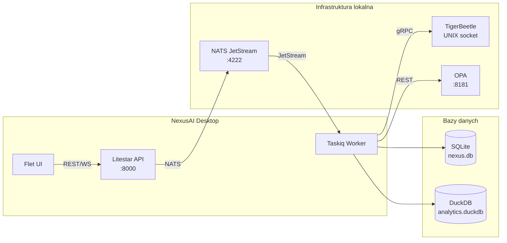

# 🔧 Rozwiązywanie problemów (Troubleshooting)

> **Cel:** Szybka diagnostyka i naprawa najczęstszych błędów.  
> **Kiedy czytać:** Gdy coś nie działa — przed otwarciem GitHub Issue.

---

## 1. Szybka diagnostyka

### 1.0 Drzewo decyzyjne diagnostyki

```mermaid
flowchart TD
    START[Problem z NexusAI] --> P1{Czy aplikacja<br/>się uruchamia?}
    P1 -->|NIE| P1A[Sprawdź sekcję 2:<br/>Problemy z instalacją]
    P1 -->|TAK| P2{Czy API odpowiada?<br/>curl /health}
    P2 -->|NIE| P2A[Sprawdź sekcję 3:<br/>Problemy z uruchomieniem]
    P2 -->|TAK| P3{Czy dane się<br/>zapisują?}
    P3 -->|NIE| P3A[Sprawdź sekcję 4:<br/>Problemy z bazą danych]
    P3 -->|TAK| P4{Czy OCR/AI<br/>działa?}
    P4 -->|NIE| P4A[Sprawdź sekcję 6:<br/>Problemy z AI/OCR]
    P4 -->|TAK| P5{Czy jest wolno?}
    P5 -->|TAK| P5A[Sprawdź sekcję 7:<br/>Problemy z wydajnością]
    P5 -->|NIE| OK[✅ Wszystko działa!<br/>Sprawdź logi (sekcja 8)]
```

> **📝 Wersja tekstowa (ASCII fallback):**
> ```
> DRZEWO DECYZYJNE DIAGNOSTYKI:
>
> Problem z NexusAI?
>  ├─ NIE uruchamia się → Sekcja 2 (Instalacja)
>  ├─ TAK, ale API nie odpowiada → Sekcja 3 (Uruchomienie)
>  ├─ TAK, ale dane nie zapisują → Sekcja 4 (Baza danych)
>  ├─ TAK, ale OCR/AI nie działa → Sekcja 6 (AI/OCR)
>  ├─ TAK, ale jest wolno → Sekcja 7 (Wydajność)
>  └─ TAK, wszystko OK → Sekcja 8 (Logi i debugowanie)
> ```

### 1.1 Mapa zależności komponentów



> **📝 Wersja tekstowa (ASCII fallback):**
> ```
> MAPA ZALEŻNOŚCI KOMPONENTÓW:
>
> [Flet UI]──REST/WS──▶[Litestar API :8000]──NATS──▶[NATS :4222]
>                                                     │
>                                           JetStream │
>                                                     ▼
>                                              [Taskiq Worker]
>                                               │    │    │
>                                    ┌──────────┘    │    └──────────┐
>                                    ▼               ▼               ▼
>                              [SQLite]        [DuckDB]      [TigerBeetle]
>                              nexus.db       analytics.      UNIX socket
>                                             duckdb
>
> Jeśli Worker nie działa → sprawdź NATS + TigerBeetle.
> Jeśli API nie działa → sprawdź Worker + SQLite.
> ```

```bash
# Kompleksowe sprawdzenie systemu
pixi run doctor

# Informacje o środowisku
pixi run env-info

# Zaawansowana diagnostyka
pixi run doctor-advanced
```

---

## 2. Problemy z instalacją

### 2.1 `pixi: command not found`

**Przyczyna:** pixi nie jest w PATH.

**Rozwiązanie:**
```bash
# Przeładuj shell lub dodaj do PATH
source ~/.bashrc
# lub
export PATH="$HOME/.local/bin:$PATH"

# Sprawdź
which pixi
```

### 2.2 `Failed to compile nexus-crypto` (Rust/PyO3)

**Przyczyna:** Brak `gcc`/`clang` lub `maturin`.

**Rozwiązanie:**
```bash
# Ubuntu/Debian
sudo apt install build-essential gcc cmake

# Fedora/RHEL
sudo dnf install gcc make cmake

# Następnie
pixi run build-rust
```

### 2.3 `Tesseract not found`

**Przyczyna:** Uruchamiasz Pythona spoza środowiska pixi.

**Rozwiązanie:**
```bash
# Upewnij się, że używasz Pythona z pixi
pixi run python --version  # powinno: Python 3.13.x

# Jeśli uruchamiasz bez pixi:
pixi shell  # aktywuj środowisko
```

### 2.4 `error: externally-managed-environment`

**Przyczyna:** Próba `pip install` poza pixi na nowszych Linuxach.

**Rozwiązanie:**
```bash
# NIE używaj pip install! Użyj pixi:
pixi install
```

---

## 3. Problemy z uruchomieniem

### 3.1 `Port 8000 already in use`

**Przyczyna:** Inny proces zajmuje port 8000.

**Rozwiązanie:**
```bash
# Linux: znajdź i zabij proces
lsof -i :8000
kill -9 <PID>

# Windows: znajdź i zabij
netstat -ano | findstr :8000
taskkill /PID <PID> /F

# Lub zmień port
NEXUS_PORT=8080 pixi run api
```

### 3.2 `Address already in use` (NATS)

**Przyczyna:** NATS Server już działa z poprzedniej sesji.

**Rozwiązanie:**
```bash
# Zabij pozostały proces NATS
pkill nats-server

# Lub użyj innego portu
nats-server -p 4223 -js
```

### 3.3 `TigerBeetle: failed to open data file`

**Przyczyna:** Plik danych TigerBeetle nie istnieje lub jest uszkodzony.

**Rozwiązanie:**
```bash
# Sformatuj nowy plik danych
pixi run format-tigerbeetle

# Jeśli plik jest uszkodzony, usuń go i sformatuj ponownie
rm data/tigerbeetle.bin
pixi run format-tigerbeetle
```

### 3.4 `Application failed to start: missing models`

**Przyczyna:** Modele AI nie zostały pobrane.

**Rozwiązanie:**
```bash
pixi run download-models
pixi run check-models
```

---

## 4. Problemy z bazą danych

### 4.1 `Database is locked`

**Przyczyna:** Inny proces blokuje SQLite (np. drugie API, worker, albo otwarty SQLite Browser).

**Rozwiązanie:**
```bash
# Zabij wszystkie procesy NexusAI
pkill -f "python main.py"
pkill -f granian

# Sprawdź, czy nikt nie otworzył bazy
lsof app_data/nexus.db

# Uruchom ponownie
pixi run api
```

### 4.2 `Migration failed`

**Przyczyna:** Baza danych jest w złym stanie lub migracja już była wykonana.

**Rozwiązanie:**
```bash
# Sprawdź historię migracji
pixi run migrate-history

# Suchy przebieg (co zostanie wykonane)
pixi run migrate-dry

# Jeśli baza jest uszkodzona — reset (TYLKO DEVELOPMENT!)
rm app_data/nexus.db
pixi run migrate
pixi run seed
```

### 4.3 `disk I/O error` na SQLite

**Przyczyna:** Brak miejsca na dysku lub uszkodzony plik.

**Rozwiązanie:**
```bash
# Sprawdź miejsce na dysku
df -h .

# Sprawdź integralność bazy
sqlite3 app_data/nexus.db "PRAGMA integrity_check;"

# Jeśli "ok" — problem z miejscem. Jeśli błędy — przywróć z backupu
pixi run restore --latest
```

---

## 5. Problemy z API

### 5.1 `401 Unauthorized` mimo poprawnego logowania

**Przyczyna:** Token JWT wygasł (TTL = 15 minut).

**Rozwiązanie:**
```bash
# Odśwież token
curl -X POST http://127.0.0.1:8000/api/auth/refresh \
  -H "Content-Type: application/json" \
  -d '{"refresh_token":"twoj_refresh_token"}'

# Lub zaloguj się ponownie
curl -X POST http://127.0.0.1:8000/api/auth/login \
  -H "Content-Type: application/json" \
  -d '{"username":"admin","password":"admin"}'
```

### 5.2 `403 Forbidden` mimo roli admin

**Przyczyna:** Brak odpowiedniego uprawnienia RBAC.

**Rozwiązanie:**
- Sprawdź rolę użytkownika: `SELECT role FROM users WHERE username='admin'`
- Sprawdź uprawnienia roli: `SELECT p.codename FROM permissions p JOIN role_permissions rp ON p.id=rp.permission_id WHERE rp.role_id='role-system-admin'`

### 5.3 `422 Unprocessable Entity`

**Przyczyna:** Nieprawidłowe dane wejściowe (walidacja msgspec).

**Rozwiązanie:**
- Sprawdź body requestu — prawdopodobnie brak wymaganego pola lub zły typ
- Sprawdź `detail` w odpowiedzi — zawiera informację które pole jest nieprawidłowe

### 5.4 `503 Service Unavailable`

**Przyczyna:** Worker nie odpowiada (NATS/TigerBeetle down).

**Rozwiązanie:**
```bash
# Sprawdź status komponentów
curl http://127.0.0.1:8000/api/v1/health
# Sprawdź pole "components" — który komponent jest "error"

# Restartuj pełne środowisko
pixi run dev
```

---

## 6. Problemy z AI/OCR

### 6.1 `Model not found: models/Granite-3.2-3B-Q4_K_M.gguf`

**Przyczyna:** Modele GGUF nie zostały pobrane.

**Rozwiązanie:**
```bash
pixi run download-models
```

> Pełna lista modeli: [MODELS_MANIFEST.md](MODELS_MANIFEST.md). Specyfikacja 5 agentów: [AGENTS.md](AGENTS.md).

### 6.2 OCR zwraca bardzo niską pewność (< 0.3)

**Przyczyna:** Słaba jakość obrazu faktury.

**Rozwiązanie:**
- Sprawdź, czy faktura jest czytelna (300 DPI minimum)
- Spróbuj lepszego skanu (nie zdjęcia telefonem)
- Uruchom przetwarzanie ponownie
- Jeśli problem się powtarza — wprowadź fakturę ręcznie

### 6.3 `CUDA error` / `Failed to load CUDA`

**Przyczyna:** Próba użycia GPU, którego nie ma.

**Rozwiązanie:**
```bash
# Ustaw liczbę warstw GPU na 0 (CPU only)
export NEXUS_LLM_GPU_LAYERS=0
```

---

## 7. Problemy z wydajnością

### 7.1 Aplikacja zużywa za dużo RAM (> 8 GB)

**Przyczyna:** Zbyt dużo modeli AI załadowanych jednocześnie.

**Rozwiązanie:**
- NexusAI ładuje modele leniwie (na żądanie)
- Sprawdź, które modele są załadowane: `pixi run doctor`
- Ogranicz liczbę wątków: `NEXUS_LLM_THREADS=2`
- Użyj kwantyzacji Q2_K zamiast Q4_K_M dla mniejszych modeli

### 7.2 OCR działa wolno (> 30s na fakturę)

**Przyczyna:** Przetwarzanie sekwencyjne zamiast równoległego.

**Rozwiązanie:**
```bash
# Zwiększ liczbę wątków
export NEXUS_LLM_THREADS=4

# Sprawdź, czy Python działa jako free-threaded (bez GIL)
pixi run python -c "import sys; print(sys._is_gil_enabled())"
# Powinno zwrócić False
```

---

## 8. Logi i debugowanie

### 8.1 Gdzie są logi

| Typ | Ścieżka |
|---|---|
| Logi aplikacji | `app_data/logs/` |
| Logi strukturalne | DuckDB (zapytanie SQL) |
| Logi Granian | stdout/stderr |
| Logi NATS | stdout (od `pixi run dev`) |

### 8.2 Zwiększenie poziomu logowania

```bash
# DEBUG — maksymalna szczegółowość
NEXUS_LOG_LEVEL=debug pixi run api

# Tylko ostrzeżenia i błędy
NEXUS_LOG_LEVEL=warn pixi run api
```

### 8.3 Debugowanie konkretnego problemu

```bash
# 1. Włącz verbose logi
NEXUS_LOG_LEVEL=debug pixi run api 2>&1 | tee debug.log

# 2. Odtwórz problem

# 3. Analizuj logi
grep "ERROR\|WARN\|invoice_id=abc123" debug.log

# 4. Sprawdź ślad audytu
sqlite3 app_data/nexus.db "SELECT * FROM audit_logs WHERE invoice_id='abc123'"
```

---

## 9. Przywracanie do stanu fabrycznego

```bash
# UWAGA: usuwa wszystkie dane! Tylko development.

# 1. Zatrzymaj wszystkie serwisy
pkill -f "python main.py"
pkill nats-server

# 2. Usuń dane
rm -rf app_data/
rm -f data/tigerbeetle.bin

# 3. Inicjalizuj od nowa
pixi run migrate
pixi run seed

# 4. Uruchom
pixi run dev
```

---

## 🔗 Zobacz również

- [Instalacja i konfiguracja](INSTALLATION.md) — poprawny setup środowiska
- [Wdrożenie](DEPLOYMENT.md) — backup i przywracanie
- [Baza danych](DATABASE.md) — integralność bazy, migracje
- [Agenci AI](AGENTS.md) — modele, problemy z OCR/AI

---

> **Data aktualizacji:** 2026-07-05 · **Autor:** NexusAI Team · **Wersja:** 3.0.0-dev
> **Status dokumentu:** Stabilny · **Ostatnia weryfikacja:** 2026-07-05 · **Weryfikator:** NexusAI Team
