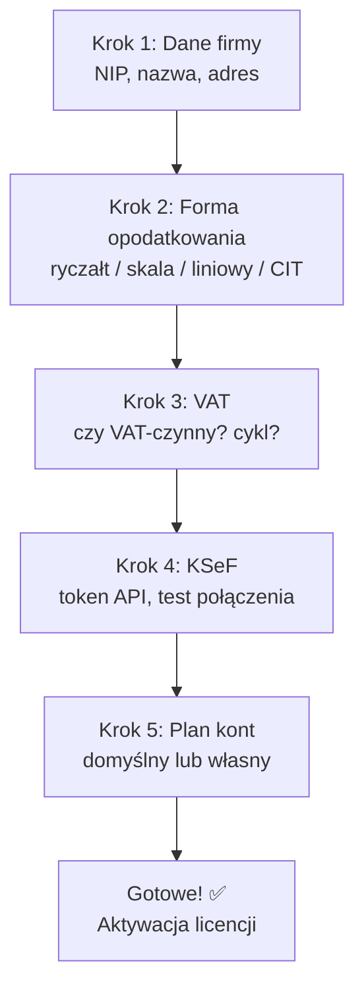
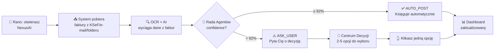

# 📘 Podręcznik użytkownika (User Guide)

> **Dla kogo:** Przedsiębiorca, księgowa, doradca podatkowy — użytkownik końcowy NexusAI.  
> **Cel:** Nauczyć codziennej pracy z wirtualnym księgowym.

---

## 1. Pierwsze uruchomienie

### 1.1 Kreator konfiguracji

Po pierwszym uruchomieniu aplikacji, kreator przeprowadzi Cię przez 5 kroków:



> **📝 Wersja tekstowa (ASCII fallback):**
> ```
> KREATOR KONFIGURACJI — 5 kroków do startu:
>
> [Krok 1] Dane firmy (NIP, nazwa, adres)
>     │
>     ▼
> [Krok 2] Forma opodatkowania (ryczałt/skala/liniowy/CIT)
>     │
>     ▼
> [Krok 3] VAT (czynny? miesięczny/kwartalny?)
>     │
>     ▼
> [Krok 4] KSeF (token API, test połączenia)
>     │
>     ▼
> [Krok 5] Plan kont (domyślny JDG lub własny)
>     │
>     ▼
> [Gotowe! ✅] Aktywacja licencji → możesz pracować
> ```

1. **Dane firmy:** NIP, nazwa, adres
2. **Forma opodatkowania:** ryczałt / skala podatkowa / podatek liniowy / CIT
3. **VAT:** czy jesteś VAT-czynny, cykl rozliczeniowy (miesięczny/kwartalny)
4. **KSeF:** token API do Krajowego Systemu e-Faktur
5. **Plan kont:** domyślny (dla JDG) lub własny

### 1.2 Aktywacja licencji

Po zakończeniu kreatora, aplikacja poprosi o klucz licencyjny. Klucz otrzymasz po zakupie na stronie producenta.

---

## 2. Role użytkowników (RBAC)

| Rola | Co może robić |
|---|---|
| **Właściciel (owner)** | Wszystko — pełny dostęp do danych firmy |
| **Księgowa (accountant)** | Zarządza fakturami, raportami, eksportem JPK/KSeF |
| **Doradca (viewer +)** | Przegląda, analizuje, testuje scenariusze podatkowe |
| **Pracownik (worker)** | Podstawowe przetwarzanie dokumentów (upload) |

---

## 3. Codzienny workflow

### 3.1 Jak to działa (automatycznie)



> **📝 Wersja tekstowa (ASCII fallback):**
> ```
> CODZIENNY WORKFLOW — od faktury do decyzji:
>
>   🌅 Rano: otwierasz NexusAI
>        │
>        ▼
>   📥 System pobiera faktury
>        │  (KSeF, e-mail, folder)
>        ▼
>   🔍 OCR + AI wyciąga dane
>        │  (4 silniki OCR + AI)
>        ▼
>   🤖 Rada Agentów: confidence?
>        │
>   ┌────┴────┐
>   │≥92%     │<92%
>   ▼         ▼
> ✅AUTO_POST ⚠️ASK_USER
> (automat)   (pyta Ciebie)
>   │         │
>   │    🔔 Centrum Decyzji
>   │    2-5 opcji do wyboru
>   │         │
>   │    👆 Klikasz jedną
>   │         │
>   └────┬────┘
>        ▼
>   📊 Dashboard zaktualizowany
>   Czas: ~3 minuty dziennie
> ```

```
Rano otwierasz NexusAI → widzisz dashboard:
┌────────────────────────────────────────────┐
│ 📊 Dziś: 12 faktur przetworzonych          │
│ ✅ 10 AUTO_POST (automatycznie)            │
│ ⚠️ 2 ASK_USER (wymagają Twojej decyzji)   │
│                                            │
│ 💰 Bilans: +15 230 PLN                     │
│ 📅 VAT do zapłaty: 2 850 PLN              │
└────────────────────────────────────────────┘
```

### 3.2 Krok po kroku

#### Krok 1: Aplikacja pobiera faktury

NexusAI automatycznie pobiera faktury z:
- **KSeF** (Krajowy System e-Faktur) — faktury przychodzące
- **E-mail** (IMAP/POP3) — załączniki PDF
- **Folder na dysku** — `/Faktury/` (monitorowany)

#### Krok 2: Aplikacja księguje (AUTO_POST)

Dla 90-95% faktur system podejmuje decyzję samodzielnie:
- Wyciąga dane z faktury (OCR + AI)
- Sprawdza kontrahenta (Biała Lista MF, GUS)
- Wybiera stawkę VAT (silnik reguł)
- Księguje w księdze głównej

**Nie musisz nic robić.** Dostajesz tylko powiadomienie: "✅ 10 faktur zaksięgowanych".

#### Krok 3: Jeśli ma wątpliwość — pyta (ASK_USER)

Dla 5-10% faktur system prosi o Twoją decyzję. W Centrum Decyzji widzisz:

```
┌────────────────────────────────────────────┐
│ ⚠️ Stawka VAT dla faktury FV/2026/06/042 │
│                                            │
│ Kontrahent: XYZ Sp. z o.o.                │
│ NIP: 1234567890                            │
│ Kwota: 5 000 PLN netto                     │
│ Kategoria: IT Equipment                    │
│                                            │
│ System nie jest pewien, czy zastosować     │
│ 23% czy 8% VAT.                            │
│                                            │
│ [ ] 23% VAT (standardowa)                  │
│ [ ] 8% VAT (obniżona)                      │
│ [ ] Anuluj fakturę                         │
│                                            │
│ [Zatwierdź]                                │
└────────────────────────────────────────────┘
```

**Klikasz jedną opcję.** Koniec. ~3 minuty dziennie.

---

## 4. Centrum Decyzji

### 4.1 Gdzie znaleźć

Kliknij ikonę 🔔 (dzwonek) w lewym górnym rogu. Liczba na ikonie = liczba oczekujących decyzji.

### 4.2 Priorytety decyzji

| Priorytet | Kolor | Znaczenie |
|---|---|---|
| 🔴 1-2 | Czerwony | **Krytyczne** — termin mija dziś, blokuje księgowanie |
| 🟡 3-4 | Żółty | **Ważne** — wymaga decyzji w tym tygodniu |
| 🟢 5 | Zielony | **Niski** — sugestia optymalizacji, nieblokująca |

### 4.3 Historia decyzji

Wszystkie Twoje decyzje są zapisywane. Możesz je przeglądać w:
- **Centrum Decyzji → Historia** — filtruj po dacie, typie, statusie

---

## 5. Raporty

### 5.1 Dostępne raporty

| Raport | Opis |
|---|---|
| **Dashboard** | Przegląd finansów (przychody, koszty, VAT, zysk) |
| **VAT** | Ewidencja VAT — sprzedaż i zakupy per miesiąc |
| **PIT/CIT** | Podatek dochodowy — dochód, koszty, zaliczki |
| **Cashflow** | Przepływy pieniężne — wpływy i wydatki |
| **Kontrahenci** | Top kontrahenci, ryzyko, historia |
| **Środki trwałe** | Amortyzacja, wartość netto |

### 5.2 Eksport

Każdy raport można wyeksportować do:
- **PDF** — do druku / dla księgowej
- **CSV** — do Excela
- **JPK** — do Ministerstwa Finansów

### 5.3 Drukowanie

Kliknij ikonę 🖨️ w prawym górnym rogu każdego raportu.

---

## 6. Konfiguracja

### 6.1 Stawki VAT

**Ustawienia → Podatki → Stawki VAT**

Domyślnie: 23%, 8%, 5%, 0%, zw.  
Możesz dodać własne stawki dla specyficznych kategorii.

### 6.2 Plan kont

**Ustawienia → Księgowość → Plan kont**

Domyślny plan kont dla JDG jest gotowy. Możesz go modyfikować.

### 6.3 Polityka rachunkowości

**Ustawienia → Księgowość → Polityka rachunkowości**

- Metoda amortyzacji: liniowa / degresywna
- Wycena zapasów: FIFO
- Zaokrąglanie VAT: per pozycja / od sumy

---

## 7. Integracje

### 7.1 KSeF (Krajowy System e-Faktur)

**Ustawienia → Integracje → KSeF**

1. Zaloguj się do swojego konta na https://ksef.mf.gov.pl
2. Wygeneruj token API
3. Wklej token w NexusAI
4. Kliknij "Testuj połączenie"

Od teraz faktury są automatycznie pobierane z KSeF i wysyłane do KSeF.

### 7.2 Biała Lista MF

**Automatyczne** — nie wymaga konfiguracji.  
Przy każdej fakturze > 15 000 PLN system sprawdza rachunek kontrahenta.

### 7.3 NBP (kursy walut)

**Automatyczne** — nie wymaga konfiguracji.  
Kursy pobierane codziennie z API NBP.

---

## 8. Backup

### 8.1 Automatyczny backup

NexusAI codziennie (o 3:00 w nocy) tworzy zaszyfrowany backup wszystkich danych.

**Ustawienia → Backup → Harmonogram**

### 8.2 Ręczny backup

**Ustawienia → Backup → Utwórz backup teraz**

Plik backupu jest szyfrowany (AEAD ChaCha20-Poly1305) i weryfikowany (SHA-256).

### 8.3 Przywracanie z backupu

**Ustawienia → Backup → Przywróć z backupu**

1. Wybierz plik backupu (`.enc`)
2. Podaj hasło
3. Kliknij "Przywróć"

---

## 9. Aktualizacje

### 9.1 Automatyczne (OTA)

NexusAI sprawdza dostępność aktualizacji przy każdym uruchomieniu.

Jeśli jest nowsza wersja:
1. Kliknij "Aktualizuj"
2. Aplikacja pobierze i zweryfikuje nową wersję
3. Automatyczny restart z nową wersją

### 9.2 Ręczne

Pobierz najnowszy instalator ze strony producenta i uruchom go.

---

## 10. Bezpieczeństwo na co dzień

### 10.1 Hasło

- Używaj silnego hasła (min. 12 znaków, cyfry + znaki specjalne)
- Zmieniaj hasło co 90 dni
- NIE udostępniaj hasła nikomu

### 10.2 Szyfrowanie

Wszystkie dane są automatycznie szyfrowane (AES-256).  
Nie musisz nic robić. Nawet jeśli ktoś ukradnie Ci laptopa, dane są bezpieczne.

### 10.3 Backup

- Zawsze sprawdzaj, czy backup zakończył się sukcesem
- Przechowuj przynajmniej 1 kopię backupu poza komputerem (np. na zewnętrznym dysku)

---

## 🔗 Zobacz również

- [Słownik pojęć](GLOSSARY.md) — terminy księgowe i techniczne
- [FAQ](FAQ.md) — najczęściej zadawane pytania
- [Zgodność z przepisami](COMPLIANCE.md) — KSeF, JPK, deklaracje podatkowe

---

> **Data aktualizacji:** 2026-07-04 · **Autor:** NexusAI Team · **Wersja:** 2.3.0
> **Status dokumentu:** Stabilny · **Ostatnia weryfikacja:** 2026-07-04 · **Weryfikator:** NexusAI Team
