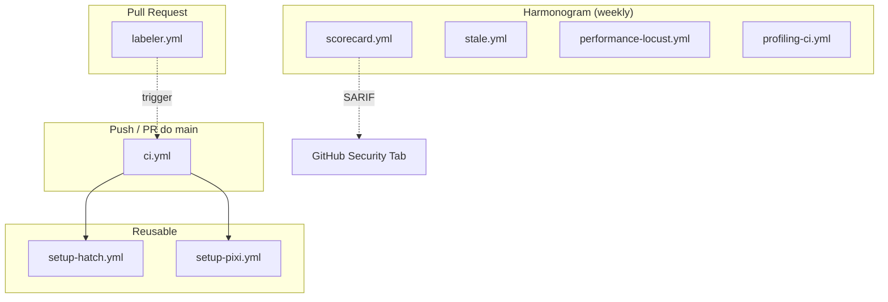

# 🔄 CI/CD — Pipeline'y GitHub Actions

> **Plik:** `.github/workflows/`
> **Status:** Stabilny · **Wersja:** 3.0.0-dev
> **Ostatnia aktualizacja:** 2026-07-05

---

## 1. Przegląd

NexusAI używa **7 zautomatyzowanych workflow'ów GitHub Actions** zapewniających ciągłą integrację, bezpieczeństwo i dostawę:

```
.github/workflows/
├── ci.yml                    # 🔄 Główny CI/CD — lint, test, build, release
├── scorecard.yml             # 🔒 OpenSSF Scorecard — cotygodniowa ocena bezpieczeństwa
├── stale.yml                 # 🧹 Stale Issue & PR Manager — automatyczne czyszczenie
├── labeler.yml               # 🏷️ Auto-Labeler — etykietowanie PR po zmienionych plikach
├── performance-locust.yml    # ⚡ Performance/Locust — testy wydajnościowe
├── profiling-ci.yml          # 📊 Profiling CI — profilowanie CPU
└── setup-hatch.yml           # 🛠️ Reusable — setup Hatch (wywoływany z innych workflowów)
```

### Diagram zależności



---

## 2. Główny Pipeline: `ci.yml`

**Plik:** `.github/workflows/ci.yml`

Kompleksowy pipeline CI/CD z 16 jobami, łańcuchem dostaw SLSA Level 3 i podpisywaniem Sigstore.

### 2.1 Wyzwalacze

| Zdarzenie | Kiedy |
|---|---|
| `push` | Do `main` lub tag `v*` |
| `pull_request` | Do `main` |
| `merge_group` | GitHub Merge Queue |
| `workflow_dispatch` | Ręczne uruchomienie |
| `workflow_call` | Jako reusable workflow |

### 2.2 Konfiguracja

```yaml
concurrency:
  group: ${{ github.workflow }}-${{ github.event_name }}-${{ github.sha }}
  cancel-in-progress: true

permissions:
  contents: read          # Minimalne uprawnienia (read-only)
  pull-requests: read
```

### 2.3 Joby (kolejność wykonania)

```
hatch-ci ───────────────► test-hatch-matrix ──► build-rust ──► mypyc-compile ──► build-nuitka ──► release
    │                           │                                  │
    │                           ▼                                  ▼
    │                     benchmark-mimalloc                  pgo-benchmark
    │                                                                │
    │                                                                ▼
    │                                                          build-nuitka-clang
    │
    ├── lint-fast ───────► lint
    ├── typecheck-fast ──► typecheck
    ├── test-environments (dev/prod)
    ├── codeql-analyze
    ├── dependency-review (tylko PR)
    └── security-scan
```

### 2.4 Szczegółowy opis jobów

| Job | Zależności | Czas | Opis |
|---|---|---|---|
| **hatch-ci** | — | 20 min | Unified pipeline: lint + typecheck + test przez hatch |
| **test-hatch-matrix** | — | 20 min | Matrix test: Python 3.13 + 3.13t (free-threaded) |
| **test-environments** | — | 15 min | Matrix: dev + prod (pixi install --locked) |
| **lint-fast** | — | 3 min | Ruff linter + formatter (pixi exec, szybki) |
| **typecheck-fast** | — | 3 min | mypy strict (pixi exec, szybki) |
| **lint** | — | 10 min | Pełny Ruff lint + format-check |
| **typecheck** | — | 10 min | Pełny mypy --strict |
| **codeql-analyze** | — | 15 min | CodeQL SAST (Python, queries: security-extended) |
| **dependency-review** | — | 10 min | Review zależności (fail-on-severity: high) — tylko PR |
| **security-scan** | — | 15 min | ZAP DAST scan + raport |
| **test** | — | 30 min | crosshair SMT + pytest + coverage |
| **build-rust** | — | 20 min | Budowa nexus-crypto (Rust+PyO3) — matrix: Linux + Windows |
| **mypyc-compile** | build-rust | 10 min | Kompilacja mypyc (Python→C) |
| **benchmark-mimalloc** | — | 15 min | Benchmark: mimalloc vs system allocator |
| **pgo-benchmark** | test, build-rust | 90 min | PGO (Profile-Guided Optimization) — tylko przy tagu v* |
| **build-nuitka-clang** | test, build-rust, mypyc | 60 min | Build z Clang + LLD — tylko przy tagu v* |
| **build-nuitka** | test, build-rust, mypyc | 60 min | Build Nuitka — matrix: Linux + Windows — tylko przy tagu v* |
| **generate-sbom** | build-nuitka | 10 min | SBOM (CycloneDX) — tylko przy tagu v* |
| **release** | build-nuitka, sbom, codeql, security | 10 min | Release + Attestation + Sigstore + SLSA — tylko przy tagu v* |

### 2.5 Supply-Chain Security (Release)

| Mechanizm | Opis |
|---|---|
| **SBOM** | Software Bill of Materials (SPDX JSON) przez `sbom-generator-action` |
| **Attestation** | Build provenance przez `actions/attest-build-provenance@v1` |
| **Sigstore** | Podpisywanie kół Python przez `sigstore sign` |
| **SLSA Level 3** | Provenance generation przez `slsa-github-generator@v2` |
| **GitHub Release** | Automatyczne tworzenie release z artifactami przez `ncipollo/release-action` |

### 2.6 Caching

```yaml
# Cache dla cargo (Rust)
~/cargo/registry, ~/cargo/git, nexus_ai/rust/target

# Cache dla mypyc
**/*.cpython-313*.so, **/*.so, .mypy_cache/

# Cache dla ccache (Nuitka)
~/.cache/ccache

# Cache dla nuitka
~/.cache/nuitka
```

---

## 3. OpenSSF Scorecard: `scorecard.yml`

**Plik:** `.github/workflows/scorecard.yml`

Automatyczna cotygodniowa ocena bezpieczeństwa repozytorium.

```yaml
on:
  schedule:
    - cron: "0 7 * * 1"   # Każdy poniedziałek 7:00 UTC
  push:
    branches: [main]
  workflow_dispatch:
```

**Czego ocenia:**
- Branch Protection
- CI Tests
- Code Review
- Contributors
- Dependency Update Tool
- Fuzzing
- License
- Maintained
- Packaging
- Pinned Dependencies
- SAST (CodeQL)
- Security Policy
- Signed Releases
- Token Permissions
- Vulnerabilities

**Wyniki:**
- SARIF → GitHub Security Tab
- Badge → README.md (`[]`)
- Dashboard: `https://securityscorecards.dev/viewer/?uri=github.com/Gorski-Maciej/NexusAI`

---

## 4. Stale Manager: `stale.yml`

**Plik:** `.github/workflows/stale.yml`

Automatyczne zarządzanie nieaktywnymi issue i PR.

| Parametr | Issue | PR |
|---|---|---|
| Dni do stale | 90 | 30 |
| Dni do zamknięcia | 14 | 7 |
| Exempt labels | `pinned,security,bug,enhancement,priority:high` | `pinned,security,work-in-progress,dependencies` |
| Usuń gałąź | — | Tak |
| Sync labels | Tak | Tak |

---

## 5. Auto-Labeler: `labeler.yml`

**Plik:** `.github/workflows/labeler.yml`

Automatyczne etykietowanie PR na podstawie zmienionych plików.

```yaml
on:
  pull_request_target:
    types: [opened, synchronize, reopened, ready_for_review]
```

**Konfiguracja:** `.github/labeler.yml` mapuje ścieżki plików na etykiety.

---

## 6. Workflow Reusable: `setup-hatch.yml` i `setup-pixi.yml`

### setup-hatch.yml

```yaml
# Instaluje Hatch + Python + cache
# Używany przez: ci.yml (build-rust, build-nuitka, test-hatch-matrix, itp.)
```

**Parametry:**
| Parametr | Domyślnie | Opis |
|---|---|---|
| `cache-key-prefix` | `hatch` | Prefix dla cache key |
| `python-version` | `3.13t` | Wersja Pythona |

### setup-pixi.yml

```yaml
# Instaluje pixi + środowisko
# Używany przez: ci.yml (lint, typecheck, test-environments, itp.)
```

**Parametry:**
| Parametr | Domyślnie | Opis |
|---|---|---|
| `pixi-env` | `dev` | Środowisko pixi |
| `cache` | `true` | Włącz cache pixi |
| `cache-key-prefix` | `pixi` | Prefix dla cache key |

---

## 7. Performance i Profiling

> **UWAGA:** Workflow'y wydajnościowe (`performance-locust.yml`, `profiling-ci.yml`) są zdefiniowane jako osobne pliki w `.github/workflows/`.

### performance-locust.yml

```yaml
# Testy wydajnościowe z Locust
# Uruchamiane: na żądanie (workflow_dispatch) lub harmonogram
# Metryki: p50, p95, p99 latency, RPS, error rate
```

### profiling-ci.yml

```yaml
# Profilowanie CPU z py-spy
# Uruchamiane: na żądanie (workflow_dispatch)
# Wynik: flamegraph.svg
```

---

## 8. Security Checklist dla CI/CD

- [ ] **Minimal permissions** — każde job ma tylko potrzebne uprawnienia
- [ ] **OIDC** — zero secrets dla deploy (GitHub → cloud)
- [ ] **Dependabot** — automatyczne PR dla aktualizacji (weekly)
- [ ] **CodeQL** — SAST w Pythonie (security-extended + security-and-quality)
- [ ] **Scorecard** — cotygodniowa ocena OpenSSF
- [ ] **Dependency Review** — blokada PR z wysokimi podatnościami
- [ ] **SBOM** — generowany przy każdym release
- [ ] **SLSA Level 3** — provenance generation
- [ ] **Sigstore** — podpisywanie artifactów
- [ ] **Attestation** — build provenance
- [ ] **Concurrency** — anulowanie nadmiarowych runów
- [ ] **Merge Queue** — GitHub Merge Queue dla main
- [ ] **Environment protection** — release wymaga zatwierdzenia

---

> **Zobacz również:**
> - [`DEPLOYMENT.md`](DEPLOYMENT.md) — build Nuitka, Inno Setup, OTA updates
> - [`TESTING.md`](TESTING.md) — testy uruchamiane w CI
> - [`SECURITY.md`](SECURITY.md) — Dependabot, CodeQL, Scorecard
> - [`CONTRIBUTING.md`](CONTRIBUTING.md) — standardy PR, pre-commit
