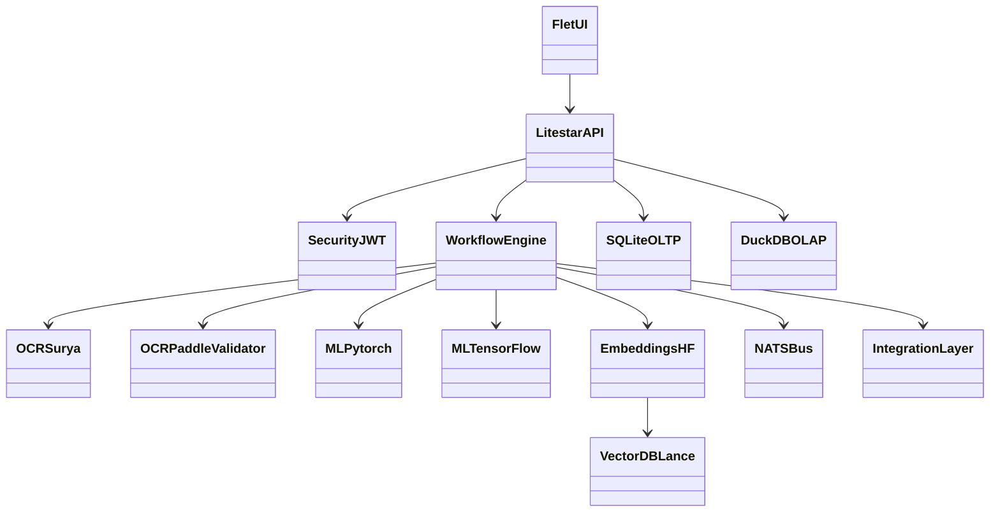

# NexusAI — Rozbudowana architektura aplikacji księgowej (MVP → skala)

## 1. Analiza aktualnego repozytorium

Repozytorium już zawiera fundament modułowej architektury:
- **API oparte o Litestar** (`Code/API/*`) z kontrolerami faktur, zadań, analityki i health-check. 
- **Warstwa usług** (`Code/SERVICES/*`) dla OCR, walidacji, KSeF, audytu, backupu, detekcji anomalii i eksportów.
- **Pipeline dokumentowy** (`Code/PIPELINE/*`) z preprocessingu, OCR, parserów, normalizacji i QA.
- **Warstwa core** (`Code/CORE/*`) z wzorcami resilience, eventami, outboxem, breakerem i pluginami.
- **DB** (`Code/DB/*`) z SQLite/DuckDB, modelami i warstwą analityczną.
- **Frontend Flet** (`Code/FRONTEND/*`) z widokami listy faktur, dashboardu i walidacji.

## 2. Docelowa architektura referencyjna (zgodna z wymaganiami technologii)

### 2.1 UML komponentów (Mermaid)

### 2.2 Struktura warstw

1. **Experience Layer**: Flet (desktop/web) + workflow UX.
2. **API Layer**: Litestar (REST/websocket), kontrola dostępu, contract-first schema.
3. **Security Layer**: Litestar Security + JWT (internal), secrets, audyt.
4. **Workflow/BPM**: python-statemachine + Taskiq + FastStream (NATS).
5. **Document Intelligence**: Surya OCR + PaddleOCR V4 jako walidator + algorytm konsensusu.
6. **ML Layer**: PyTorch 2.x (domyślny), TensorFlow 3.x (redundancja), scikit-learn, AutoGluon-Light, HF (LiLT/HerBERT/LayoutLMv1), INT8.
7. **Storage Layer**: SQLite (OLTP), DuckDB (OLAP), LanceDB (semantyka), fsspec/FS dla dokumentów.
8. **Integration Layer**: KSeF, e-Deklaracje, ZUS, PSD2, ERP/POS, GUS, NBP, VIES, Biała Lista VAT.
9. **Ops Layer**: Podman/Nuitka/Pulumi/CI + DevSecOps + monitoring + backup/DR.

## 3. Mechanizmy i funkcjonalności

### 3.1 Rdzeń księgowy
- Rejestr faktur zakup/sprzedaż.
- Auto-dekretacja kont księgowych i centrów kosztowych.
- Księga główna + raporty podatkowe + cashflow.

### 3.2 OCR i walidacja krzyżowa
- Preprocessing dokumentu.
- OCR Primary: Surya.
- OCR Validator: PaddleOCR V4.
- Konsensus przez: checksum, porównanie warstw, weryfikację kontrahenta, podwójne sprawdzenie.

### 3.3 CQRS/Event Sourcing
- Komendy: `invoice.submit`, `invoice.book`, `tax.close-period`.
- Eventy: `invoice.received`, `ocr.completed`, `invoice.posted`, `invoice.rejected`.
- Event Store: SQLite + NATS JetStream (replay, idempotencja).

### 3.4 Integracje techniczne
- KSeF (HTTPX + Pydantic v2).
- e-Deklaracje (xsdata + HTTPX).
- ZUS / brak API (Playwright headless).
- PSD2 (Authlib + HTTPX).
- ERP/POS (OData-query + fsspec).
- GUS BIR, NBP, VIES, Biała Lista VAT.

### 3.5 Monitoring i bezpieczeństwo
- Metryki: VictoriaMetrics.
- Log pipeline: Vector + DuckDB.
- Runtime sec: Falco, alerty Sentry Lite.
- Logowanie aplikacji: loguru.
- SCA/SAST/Container/IaC security: pip-audit, Trivy, Ruff, Bandit, Checkov.

### 3.6 Backup i DR
- Litestream replikujący SQLite.
- Artefakty w MinIO + Cloudflare R2.
- Snapshoty i retencja Kopia.

## 4. Macierz technologii (wymagane 1:1)

Wszystkie wymagane technologie zostały ujęte w kodzie blueprintu (`Code/API/architecture_blueprint.py`) i udostępnione przez endpoint API `/api/v2/architecture/blueprint`.

## 5. Plan wdrożeniowy

1. **MVP stabilne**: Litestar + Flet + SQLite + DuckDB + NATS.
2. **Inteligencja dokumentowa**: Surya/Paddle + HF + LanceDB.
3. **Integracje urzędowe i bankowe**: KSeF/e-Deklaracje/ZUS/PSD2.
4. **Skalowanie i niezawodność**: Podman + Pulumi + self-hosted runners.
5. **Operacje i DR**: monitoring + backup + polityki bezpieczeństwa.
