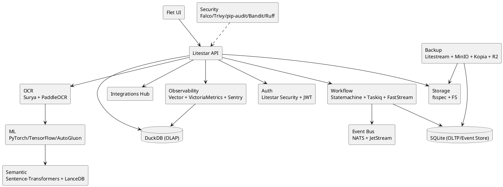
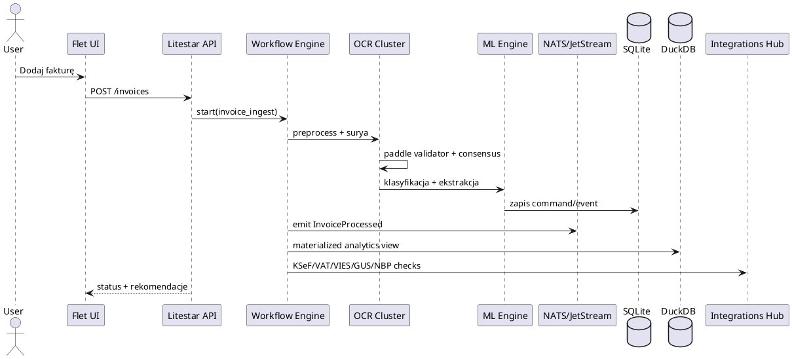

# NexusAI — architektura aplikacji księgowej (rozszerzona)

## 1) Analiza obecnego repozytorium

W repozytorium istnieją już fundamenty platformy księgowej:
- warstwa API oparta o Litestar (`Code/API/*`),
- warstwa frontendowa Flet (`Code/FRONTEND/*`),
- pipeline OCR/AI (`Code/PIPELINE/*`, `Code/CORE/*`),
- warstwa danych OLTP/OLAP i modele (`Code/DB/*`, `Code/MODELS/*`),
- usługi domenowe i integracyjne (`Code/SERVICES/*`).

Rozszerzenie poniżej domyka architekturę jako spójny blueprint „Perfekcyjnej Integracji” z pełnym pokryciem wskazanego stacku technologicznego.

## 2) Architektura docelowa (MVP -> skala)

### 2.1 Warstwy logiczne

1. **Presentation Layer**
   - Flet (Flutter for Python), dashboardy księgowe, obsługa procesu OCR i wyjątków.
2. **API + Security Layer**
   - Litestar + Litestar Security + JWT (internal).
3. **Domain + Workflow Layer**
   - CQRS/Event Sourcing, Python-Statemachine, Taskiq, FastStream (NATS).
4. **Document Intelligence Layer**
   - Surya OCR (primary), PaddleOCR V4 Server (validator), walidacja krzyżowa.
   - ML: PyTorch 2.x (domyślny), TensorFlow 3.x (redundant validator), AutoGluon-Light, scikit-learn.
   - Semantic Search: Sentence-Transformers + LanceDB.
5. **Data Layer**
   - SQLite (OLTP, outbox, event store), DuckDB (OLAP), fsspec + native FS.
6. **Integration Layer**
   - KSeF, e-Deklaracje, ZUS/portale (Playwright), PSD2, ERP/POS, GUS, NBP, VAT/VIES.
   - Wzorce: Unified Storage, Circuit Breaker, Signer-as-a-Service.
7. **Ops/Security Layer**
   - Nuitka, Podman, Pulumi, GitHub Actions/GitLab CI/Woodpecker/GitLab Runner.
   - Monitoring/SIEM: VictoriaMetrics, Vector + DuckDB, Falco + Sentry lite, loguru.
   - Backup/DR: Litestream, MinIO, Kopia, Cloudflare R2.

### 2.2 UML — komponenty (PlantUML)

### 2.3 UML — sekwencja księgowania faktury

## 3) Mechanizmy niezawodności i skalowalności

- **Podwójny OCR + algorytm konsensusu**: redukcja błędów ekstrakcji.
- **Dual ML runtime (PyTorch + TensorFlow)**: walidacja modelu głównego.
- **CQRS + Event Sourcing (NATS JetStream + SQLite)**: pełny audit trail.
- **Outbox + retries + circuit breaker**: odporność integracji zewnętrznych.
- **Multi-CI i self-hosted runners**: niezależność operacyjna pipeline’ów.
- **Backup warstwowy (Litestream + Kopia + R2)**: szybki restore + offsite.

## 4) Funkcjonalności biznesowe

- Księgowanie faktur kosztowych/sprzedażowych.
- Dekretacja półautomatyczna z aktywnym uczeniem (active learning).
- Walidacja kontrahentów (MF/VIES/GUS), kursy NBP, kontrole compliance.
- Integracje KSeF/e-Deklaracje/ZUS/PSD2/ERP/POS.
- Analityka CFO offline oraz predykcja cashflow.

## 5) Artefakt implementacyjny

Szczegółowy, egzekwowalny blueprint znajduje się w pliku:
- `Code/ARCHITECTURE/perfect_accounting_architecture.py`

Plik zawiera:
- model warstw i komponentów,
- mapowanie technologii do odpowiedzialności,
- definicję pipeline OCR i ML,
- automatyczną walidację pokrycia wszystkich wymaganych technologii.
